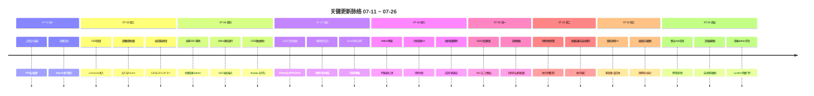

# 周报 2026-07-11至07-26 (W29~W30 跨周)

> **项目**：MeterSphere V3 自研  
> **统计区间**：2026-07-11 ~ 2026-07-26  
> **对比基线**：上一份周报 `doc/report.20260706-20260710-周报.md`（W28，2026-07-06 ~ 2026-07-12）  
> **远程仓库**：`github.com:chenqifen-miduo/metersphere.git`

> **总计 96 次提交 | 838 个文件变更 | +66360 行 / -1893 行 | 18 个 PR 合并 (#2 ~ #19)**
>
> **贡献者**：chenqifen-miduo（含 Chenqifen 变体，约 82 commits）, zhangsj (8 commits), miduo-admin (6 commits)

**本周趋势**：工作重心从 W28 的「组织架构/Agent 一次性合入 + 尚无 PR」转为**双线推进**：前半段建立 PR 合入通道并落地**米多 SSO**、CDS 灰度与社区版兼容修复；后半段集中交付**体验优化**（用例详情/执行、缺陷详情、计划文档与 XMind）、**默认项目 Hub 跨导入**与文档编辑锁。相对 W28，本区间完成 **PR 机制从 0→18**，并形成「登录集成 → 日常使用体验 → 跨项目协作」的连续交付链。

> **区间说明**：07-11 共 8 次提交与 W28 周报重叠（前端可部署/MySQL 等），下文完成项以 07-13 起的新增主线为主，避免重复展开。

---

## 关键更新脉络

---

## 一、本周完成

### 1. 米多 SSO 全链路落地 — 星球桥接登录可上线联调

> **价值**：员工可用米多星球统一身份进入 MeterSphere，减少二次账号与会话中断，支撑工作台跳转与生产登录稳定性。

- **核心能力**：自动桥接登录、admin 路径、APP00016 落地页、可选 state 支持工作台跳转
- **协议与安全**：对齐 Planet OpenAPI；Shiro 匿名放行 SSO 鉴权端点；Secret 忽略加固
- **会话与策略**：
  - 回调后持久化 `loginExpires`，缓解 Chrome 401 循环
  - 登录后避免米多二次鉴权立即踢出
  - 企微同步用户禁止本地密码登录
  - `/login/admin` 由 `system_parameter` 开关控制
- 关键 PR / 提交：`#2` `#12` `#13` `#14` `#16`；`41ea64a793`、`2d45adccf1`、`03578719d7`、`1b4d3ea108` 等

### 2. 体验优化主线（用例 / 计划文档 / 报告 / XMind）— 日常测试操作连贯性提升

> **价值**：测试同学在用例、计划文档与脑图预览间切换更顺畅，减少「能开但不能用」的体验断层。

- 合入体验优化决策与交付：详情、计划文档、报告、XMind 标签
- XMind：禁用浏览器手势误触、左键工具模式、工具栏上移、平移/缩放默认行为
- 测试计划：始终展示用例页签并更名为测试用例；计划文档与用例关联体验改进
- 相关提交：`1b54ab31fc`、`18a4f18cb2`、`483457ec30`、`dbe4e23ec1`、`a6922592d8`

### 3. 用例详情与执行体验 — 页签内完成执行回写与导航

> **价值**：执行用例时不必反复进出列表，结果回写、下一条导航与粘贴截图更贴近真实测试节奏。

- 列表打开用例详情页签：执行步骤、批量结果、自动保存
- 嵌入详情加载与空 `caseId` 防护；列表/页签切换修复
- 粘贴区、截图粘贴、自动下一条门禁、导入入口拆分
- 执行人筛选、报告统计 UX、默认 Hub 导入入口与用例树选择
- 相关提交：`f83bb0cf55`、`7a3964cfca`、`9186cd2d17`、`2805d9aa7b`、`c587dbce0f`、`0b47deb411`

### 4. 缺陷详情 UX — 多处理人与富文本附件可用

> **价值**：缺陷信息集中展示，处理人协作与截图/附件在生产环境可正常查看。

- 详情信息合并、多处理人、富文本附件
- 生产环境富文本媒体 URL 补齐 `/api` 前缀；状态与附件体验修复
- DB：拓宽 `bug.handle_user` 时规避 MySQL 1071
- 相关提交：`08b9f58bae`、`67de324d47`、`3d8e62f5d9`、`72647311a6`

### 5. 默认项目 Hub 跨导入与同步 — 跨项目用例/计划互通

> **价值**：团队可在默认项目与业务项目间导入同步，降低重复建库与计划配置成本。

- 默认项目跨导入与 Hub 同步
- 打破 `TestPlanService` 与 Hub 同步循环依赖（含 lazy-inject）
- Hub 角色权限对齐系统用户组表；看板 `module_setting` / 计划配置写入加固
- 默认 Hub 种子迁移规避 MySQL 1093
- 相关提交：`decb7c9320`、`655892adaa`、`99dde4228f`、`3807c1b638`、`00bc58aebc`、`95db9e8177`

### 6. 文档编辑能力 — 用例/缺陷/计划文档自动保存与编辑锁

> **价值**：多人编辑冲突更可控，长文档编辑不易因误关页面丢失内容。

- 自动保存、撤销、编辑锁（覆盖 case / bug / plan doc）
- 相关提交：`c08137798d`

### 7. CDS 灰度部署接入 — 可对灰度环境一键编排

> **价值**：研发可按 compose 合约部署到灰度，缩短「本地可跑、灰度难上」的间隙。

- 新增 MeterSphere CDS compose
- `/display` 路由与强制 clean `mvn package`
- 相关 PR：`#10` `#11`

### 8. 部署配置拉锯与回滚 — 文件配置切换与社区修复的合入纠偏

> **价值**：暴露并纠正部署策略试错，避免错误配置长期停留在主线。

- `#5` 切换为文件配置并归档 local-dev → `#8` Revert
- `#6` 恢复社区 QR/鉴权 API 与 DISTINCT ORDER BY → `#7` Revert 后再以后续提交稳固恢复
- 相关 PR：`#5` `#6` `#7` `#8`

### 9. MySQL 兼容性修复集群 — 严格 SQL 模式下列表/下拉可用

> **价值**：在 MySQL `ONLY_FULL_GROUP_BY` / DISTINCT 排序约束下，组织成员、项目成员与下拉查询不再报错。

- 组织用户下拉 DISTINCT ORDER BY 3065
- 项目成员列表 GROUP BY；社区 display stubs
- Flyway `execute_user` 迁移重命名，规避 3.7.2.4 冲突
- 相关 PR / 提交：`#11` `#14` `#15`；`658a53e377`、`63fd7dad8d` 等

### 10. 社区展示桩与企微同步可见性 — 社区能力与同步入口可用

> **价值**：社区版关键入口不再因缺失实现而空白；管理员可看到并触发企微同步。

- 恢复 QR stubs；展示企微同步按钮
- 企微手机号同步；项目进入权限修复
- 相关 PR / 提交：`#15`；`32dd4dbe2e`、`e18d1f096f`

### 11. Agent 对话闭环 — 会话式协作 API 收口

> **价值**：Agent 可按对话闭环完成用例协作，Token 管理页路由可用。

- 关闭 conversation loop APIs；修复 Token UI 路由
- 相关提交：`1e672adcfe`

### 12. 组织与项目权限修补 — 批量移除与进项权限对齐

> **价值**：组织管理员可批量清理成员；项目进入与管理员角色校验回到正确边界。

- 组织批量移除；项目成员列表兼容；`ProjectService` 管理员角色校验与 UTF-8 注释恢复
- multipart 展示配置保存避免 RequestBody 冲突
- 相关提交：`2b23e24cb4`、`56675ea6ad`、`250920e3e6`

### 13. Excel 用例导入模板对齐 — 可选列与模板一致

> **价值**：导入功能用例时模板与可选列一致，减少导入失败与手工改表。

- 功能用例 Excel 导入模板可选列对齐
- 相关 PR：`#14`（`3217f6a095`）

### 14. 上游 / 分支同步通道建立 — 首次形成可持续 PR 合入节奏

> **价值**：自研改动可经 PR 审查进入主线，减少「大包直接推」的协作风险。

- `#3` 合入上游与历史自研交付栈；后续 `#9`~`#19` 形成连续合入
- 上游 `v3.x` / `main` 同步与冲突保留策略
- 相关 PR：`#3` `#9` `#11` 等

---

## 二、本周数据

### 每日提交分布

| 日期 | 提交数 | 重点方向 |
|------|--------|----------|
| 07-11 (周六) | 8 | （与 W28 重叠）前端可部署、MySQL、构建元数据 |
| 07-12 (周日) | 0 | — |
| 07-13 (周一) | 4 | 上游合入、Nacos 部署文档、PR 通道起步 |
| 07-14 (周二) | 2 | 部署改文件配置 |
| 07-15 (周三) | 10 | CDS compose；部署/社区修复 Revert 拉锯 |
| 07-16 (周四) | 10 | 米多 SSO 落地；Shiro 匿名；CDS 路由 |
| 07-17 (周五) | 26 | SSO 加固与同步；体验优化合入；Excel/SQL/配置 PR |
| 07-18 (周六) | 7 | XMind/计划文档 UX；组织批量移除 |
| 07-19 (周日) | 0 | — |
| 07-20 (周一) | 5 | SSO 会话修复；企微手机号；项目权限 |
| 07-21 (周二) | 6 | 用例详情页签与执行体验 |
| 07-22 (周三) | 7 | 缺陷详情 UX；粘贴区/截图 |
| 07-23 (周四) | 2 | Agent 对话闭环；执行人筛选/报告统计 |
| 07-24 (周五) | 9 | Hub 跨导入；文档编辑锁；admin 登录开关 |
| 07-25 ~ 07-26 | 0 | — |

### 提交类型分布

| 类型 | 数量 | 占比 |
|------|------|------|
| feat (新功能) | 18 | 19% |
| fix (Bug 修复) | 32 | 33% |
| chore | 11 | 11% |
| docs | 2 | 2% |
| 中文 commit / 无前缀（含 Merge/Revert/Update 等） | 33 | 34% |

---

## 三、与上周 (W28) 对比

> 对照 W28（2026-07-06 ~ 2026-07-12）。本报告为跨周区间（16 天），提交量与文件变更不可简单按「单周」同比解读。

| 指标 | W28 | 本区间 (07-11~07-26) | 变化 |
|------|-----|----------------------|------|
| 提交数 | 15 | 96 | +540% |
| 合并 PR 数 | 0 | 18 (#2 ~ #19) | +18 |
| 文件变更 | 357 | 838 | +135% |
| 净增行数 | +30251 / -374 | +66360 / -1893 | 交付量继续放大 |

### 上周方向落地情况

| W28 建议方向 | 本区间实际进展 |
|--------------|----------------|
| P0 Agent 端到端验收 | ⚠️ 补充对话闭环 API 与 Token UI 路由（`1e672adcfe`）；完整验收勾选未见单独收口提交 |
| P0 企微同步联调 | ⚠️ 同步按钮可见、手机号同步、企微用户禁本地密登等增强已合入；真实 Corp 联调证据仍不足 |
| P1 双线历史合并收口 | ✅ PR 通道建立（#2~#19），上游/自研线经多次 sync 进入主线 |
| P1 task011 Excel 组织架构导入 | ⚠️ 完成功能用例 Excel 模板对齐（非组织架构导入）；组织 Excel 导入未见对应提交 |
| P2 生产构建冒烟 | ⚠️ CDS compose 与多项生产/SQL 修复推进；系统化冒烟清单未见单独交付 |
| P2 安全与权限复查 | ⚠️ SSO 门禁、admin 开关、Hub 角色对齐、项目进入权限有实质修补；系统级安全复查仍待人工收口 |

**超预期完成**：米多 SSO 全链路、体验优化（用例/缺陷/计划/XMind）、默认 Hub 跨导入、文档编辑锁——均超出 W28「验收/联调」清单范围。

---

## 四、下周优先级建议

| 优先级 | 方向 | 建议动作 |
|--------|------|----------|
| P0 | SSO 生产验收 | 覆盖星球跳转、回调会话、企微用户禁密登、`/login/admin` 开关；回归 Chrome 401 |
| P0 | Hub 跨导入验收 | 默认项目 ↔ 业务项目导入/同步；权限与循环依赖场景冒烟 |
| P1 | 用例/缺陷体验回归 | 页签详情、批量回写、粘贴截图、富文本图片生产路径走查 |
| P1 | Agent 验收收口 | Token → search/submit → 对话闭环 → Cursor MCP；关闭遗留验收项 |
| P2 | 企微真实联调 | 配置真实 Secret，验证部门树/成员/同步日志 |
| P2 | 安全与权限复查 | SSO 匿名边界、Hub 角色、组织批量移除、admin 开关做一次人工检查 |

---

## 附录：已合并 Pull Requests (#2 ~ #19)

| PR | 标题 | 分类 |
|----|------|------|
| #2 | 新增米多 SSO（自动桥接登录与 admin 路径） | ✨ 新功能 / 🔐 权限 |
| #3 | 合入上游 v3.x 与历史自研交付栈 | 🏗️ 架构 |
| #4 | 补充 Nacos 生产部署文档与平台配置 | 📝 文档 |
| #5 | 切换部署为文件配置并归档 local-dev | 🔧 DevOps |
| #6 | 恢复社区 QR/鉴权 API 并修复 DISTINCT ORDER BY | 🐛 Bug 修复 |
| #7 | Revert #6（社区 QR/SQL 修复回滚） | 🔧 DevOps |
| #8 | Revert #5（文件配置切换回滚） | 🔧 DevOps |
| #9 | 新增 W28 周报 | 📝 文档 |
| #10 | 新增 MeterSphere CDS compose（灰度部署） | 🔧 DevOps |
| #11 | 同步上游 v3.x；修复 display 与 MySQL DISTINCT | 🔧 DevOps / 🐛 修复 |
| #12 | 新增米多 SSO（与 #2 同源合入） | ✨ 新功能 / 🔐 权限 |
| #13 | 同步 SSO Shiro 匿名放行修复 | 🔐 权限 |
| #14 | 同步 Excel 模板、组织 SQL 与 SSO Planet 对齐 | 🔄 更新 / 🐛 修复 |
| #15 | 同步 QR stubs、GROUP BY 与企微同步按钮 | 🐛 Bug 修复 |
| #16 | 启用 APP00016 落地页与可选 state | 🔐 权限 |
| #17 | 更新 cnb-build.yml | 🔧 DevOps |
| #18 | 更新 frontend.json | 🔧 DevOps |
| #19 | 更新 services.json | 🔧 DevOps |

---

## 附录 B：相关文档

| 文档 | 路径 |
|------|------|
| 上一份周报 (W28) | `doc/report.20260706-20260710-周报.md` |
| 米多 SSO 正式环境运维配置清单 | `docs/task/miduo_sso/MeterSphere-米多SSO-正式环境运维配置清单-2026-07-20.md` |

---

*生成方式：基于 git 历史（2026-07-11 ~ 2026-07-26）与已确认重大脉络汇总。【AI生成】*
