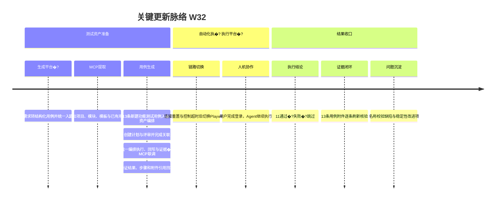

# 周报 2026-W32 (2026-08-03 ~ 2026-08-09)
> **项目**：MeterSphere V3 自研 / 测试项目-测试一体化
> **专项主题**：通过 MCP 接口实现 Agent 提取测试用例、执行测试用例与回写测试结果
> **统计区间**�?026-08-03 ~ 2026-08-08（基于本窗口对话、平台操作与执行记录�?8-09 尚无新增记录�?
> **目标环境**：`https://msp.ebcone.cn`
> **MCP 端点**：`https://msp.ebcone.cn/api/mcp`

> **完成 13 条测试用例入�?| 1 个测试计�?| 1 个用例评�?| 13 条执行结�?| 13 份截图证�?*
>
> **最终结�?*�?1 条通过 / 1 条失�?/ 1 条跳过，通过�?**84.62%**；发�?1 个名称校验问题�?
**本周趋势**：工作主线由单点 Agent 工具联调进一步转�?**用例生成平台�?+ 自动化执行平台化**。在用例侧，初步形成“需求输入—测试设计—结构化生成—平台入库—计�?评审关联”的标准链路；在执行侧，形成“资产提取—任务编排—自动执行—人工接管—结果回写—证据核验”的平台化闭环。基于真实环境完�?13 条用例联调，并采用“MCP 主链 + 独立 Playwright 兜底”处理连接重置和控制超时，为后续统一执行入口、状态管理与无人值守回归提供验证基础�?
> 过程细节可对�?`output/documents/测试资产云平�?测试用例新建功能全过程记�?md`�?
---

## 关键更新脉络

---

## 一、本周完�?
### 1. 测试用例生成平台化——从需求到平台资产的标准链�?
> **价�?*：将依赖个人经验的测试设计过程沉淀为平台能力，使需求内容能够被 Agent 解析、结构化生成并直接转�?MeterSphere 中可管理的测试资产�?
- 以“测试资产云平台测试用例新建功能”需求为输入，形成需求分析、场景拆解、边界补充和用例生成的统一流程�?- 按平台字段模型输出用例名称、前置条件、步骤、预期结果和优先级，减少生成内容与平台数据结构之间的二次转换�?- 将生成结果直接写入指定项目和模块，并继续关联测试计划与用例评审，使“生成”不止停留在离线文档�?- 覆盖基础流程、必填校验、长度边界、重复提交、步骤操作、安全输入、网络异常和权限边界，验证生成策略具备多维测试设计能力�?- 本周完成 13 条正式用例平台化入库，初步跑通“需�?�?用例 �?评审 �?计划”的资产生产链路�?
**当前成熟�?*：已完成真实项目验证，具备平台化雏形；后续仍需补充生成前预览确认、模板版本管理、重复用例识别、批次标识和失败回滚能力�?
### 2. 自动化执行平台化——统一编排执行、回写与证据�?
> **价�?*：把浏览器操作、状态流转、结果登记和截图留证从零散脚本提升为可编排、可接管、可追溯的执行能力�?
- �?MeterSphere 测试计划为执行入口，�?Agent 提取关联用例并按场景逐条执行�?- 使用 MCP 承载测试资产查询、执行状态和步骤结果回写，使用独�?Playwright 完成真实 UI 操作及异常链路兜底�?- 明确人机协作边界：登录、账号权限等敏感步骤由用户接管，登录后的功能测试继续�?Agent 自动执行�?- 统一收集通过、失败、跳过状态及实际结果，并将截图上传至“测试用例详情—附件区”�?- 引入执行后复核：重新进入详情确认状态与附件持久化，避免仅依据页面提示判断执行成功�?- 本周完成 13 条用例执行�?3 条结果收口和 13 份截图证据核验，验证自动执行平台化的核心数据闭环�?
**当前成熟�?*：已实现半自动闭环和故障切换验证；距离稳定的无人值守平台仍需完善任务队列、断点续跑、会话保活、重试策略、执行日志和统一监控�?
### 3. MCP 测试资产提取——Agent 可自主获得执行上下文

> **价�?*：Agent 不再依赖人工逐条复制用例，可直接�?MeterSphere 获取项目、模块、字段模板、用例集合和关联关系，为自动执行建立统一数据入口�?
- 定位线上项目“测试项�?测试一体化”及其功能用例模块�?- 读取用例模板、字段约束与现有测试资产，确认创建测试所需上下文�?- 提取并识别“测试资产云平台测试用例新建功能”对应的 13 条测试用例�?- 对测试计划、用例评审及用例之间的关联关系进行查询和校验�?
### 4. 测试用例生成与平台写入——测试设计转为可执行资产

> **价�?*：将自然语言测试需求直接转化为平台内可管理、可评审、可执行的结构化测试用例�?
- 生成并上�?13 条测试用例，编号�?`100001`～`100013`�?- 覆盖最小必填、完整字段、多步骤、名称校验、长度边界、重复名称、优先级、步骤增删排序、取消创建、重复提交、安全字符与网络异常等场景�?- 创建测试计划 `测试资产云平�?测试用例新建功能测试计划`，计划编�?`100001`�?- 创建用例评审 `测试资产云平�?测试用例新建功能用例评审`，评审编�?`100001`，并完成用例关联与评审通过�?
### 5. MCP 执行结果回写——验证测试闭环的数据能力

> **价�?*：Agent 执行后可将状态、步骤实际结果和证据引用写回 MeterSphere，减少人工登记并保留统一审计入口�?
- 验证执行接口能够提交用例状态及步骤实际结果�?- 验证附件引用可以随执行数据写入，并通过幂等标识降低重复提交风险�?- 对早期因链路问题写入�?`BLOCKED` 等非最终状态进行重新执行和结果覆盖�?- 最终结果与平台计划统计保持一致：11 条通过�? 条失败�? 条跳过�?
### 6. MCP �?Playwright 容错协作——链路异常下仍完成测�?
> **价�?*：在远程接口或浏览器控制链路不稳定时保留可执行兜底路径，避免整批测试因单点故障中断�?
- 联调期间出现远程 MCP 连接重置，Agent 浏览器控制也发生持续超时�?- 用户侧浏览器显示正常，说明超时主要发生在自动化控制通信链路，并非页面整体不可用�?- 切换至独�?Playwright 沙盒会话，由用户完成登录，Agent继续操作已登录浏览器执行测试�?- 明确登录与权限操作的人机边界：凭据及交互式登录交由用户处理，登录后的测试步骤�?Agent 执行�?
### 7. 测试执行收口——完成功能、安全与异常场景验证

> **价�?*：形成可量化测试结论，并将阻塞项、失败项与功能通过项清晰分离�?
| 结果 | 数量 | 说明 |
| --- | ---: | --- |
| 通过 | 11 | 创建流程、字段边界、步骤操作、取消、双击、安全与网络异常等场景符合实际预�?|
| 失败 | 1 | `100004`：仅输入空格的名称未触发名称非空校验 |
| 跳过 | 1 | `100011`：需要低权限账号，本轮不执行权限验证 |
| 合计 | 13 | 通过�?84.62% |

- 测试计划通过阈值为 100%，因此最终计划结论为“不通过”�?- `100004` 中仅输入空格后，页面未提示名称非法，而是继续校验“用例等级不能为空”，与预期不符�?- `100011` 为权限专项用例；其余 12 条均为功能场景，不再因缺少低权限账号被整体阻塞�?- 脚本字符以文本保存，未发生脚本执行；断网保存时正确提示网络异常�?
### 8. 截图证据闭环—�?3 条用例附件全部持久化

> **价�?*：执行证据沉淀在测试用例资产本身，便于后续复核、评审和问题追溯�?
- 将截图上传位置由测试计划执行详情纠正为“测试用�?�?用例详情 �?附件区”�?- 解决文件选择弹窗、隐�?DOM 与上传后未持久化造成的假成功问题�?- 使用 Playwright 原生文件上传，并对每条用例执行独立刷新、用例编号、详情标题和附件文件名核验�?- 最�?13/13 条用例均确认存在对应截图证据�?
### 9. 执行过程问题沉淀——为 MCP 自动化工程化提供输入

> **价�?*：将一次性联调中的不稳定因素转化为可复用的链路治理与自动化设计要求�?
- **通信稳定�?*：需要补�?MCP 重连、超时分层、心跳和可观测日志�?- **回写可靠�?*：执行提交需继续强化幂等键、读取后校验及错误状态覆盖策略�?- **附件可靠�?*：上传成功不能只依赖界面提示，必须重新进入详情确认持久化结果�?- **测试数据治理**：执行期间额外生成用�?`100014`～`100017`，未在无清理授权的情况下删除，后续需建立自动清理或测试数据标识机制�?- **授权体验**：命令审批规则过细会造成重复授权，应�?Playwright 会话、只读查询和指定 MCP 操作建立合理的分类规则�?
---

## 二、本周数�?
### Agent / MCP 闭环数据

| 指标 | 数量 | 说明 |
| --- | ---: | --- |
| 正式测试用例 | 13 | `100001`～`100013` |
| 测试计划 | 1 | 已关联全部正式用�?|
| 用例评审 | 1 | 已关联并评审通过 |
| 回写执行结果 | 13 | 含成功、失败和跳过状�?|
| 截图附件 | 13 | 用例详情附件区逐条核验 |
| 通过 | 11 | 功能结果符合预期 |
| 失败 | 1 | 空白名称校验问题 |
| 跳过 | 1 | 权限专项场景 |
| 额外测试数据 | 4 | `100014`～`100017`，待后续治理 |

### 用例覆盖分布

| 覆盖方向 | 对应用例 | 验证重点 |
| --- | --- | --- |
| 基础创建 | 100001�?00002 | 最小字段、完整字段与多步骤保�?|
| 名称校验 | 100003�?00006 | 空值、空格、长度边界与重复名称 |
| 字段与步�?| 100007�?00008 | P0～P3、步骤增删及排序 |
| 操作幂等 | 100009�?00010 | 取消创建、双击不重复提交 |
| 权限边界 | 100011 | 无创建权限账号，当前跳过 |
| 安全与异�?| 100012�?00013 | 脚本字符安全、断网提�?|

### 执行调用与审批折�?
| 指标 | 数�?| 口径 |
| --- | ---: | --- |
| 命令/工具调用 | 331 �?| 从提出创建用例需求至测试执行结束的会话记�?|
| 审批请求折算 | �?265 �?| 按约定公�?`331 × 4/5 = 264.8`，四舍五�?|

> 注：审批请求数为用户指定的估算口径，不等同于系统实际弹窗日志。调用量包含查询、浏览器控制、截图、上传、验证和重试等操作�?
---

## 三、闭环目标达成情�?
| 目标 | 本周状�?| 结论 |
| --- | --- | --- |
| Agent 提取测试用例 | �?已完�?| MCP 可读取项目、模块、模板、用例及关联关系 |
| Agent 生成并写入用�?| �?已完�?| 13 条正式用例已上传平台 |
| 创建计划与评�?| �?已完�?| �?1 个，均已关联正式用例 |
| Agent 执行测试用例 | �?已完�?| MCP 主链联调，Playwright 完成实际 UI 执行兜底 |
| 回写测试结果 | �?已完�?| 13 条最终状态与实际结果已收�?|
| 截图附件留证 | �?已完�?| 13/13 条均在用例详情附件区确认持久�?|
| 权限场景验证 | ⏭️ 本轮跳过 | 需准备低权限账号后单独执行 `100011` |
| 全链路稳定无人值守 | ⚠️ 尚未达成 | MCP 重连、浏览器控制与附件校验仍需工程化增�?|

### 本周核心判断

本周已经证明 MeterSphere 可以�?Agent 能力向两个平台化方向推进：一是将需求分析、用例生成、入库、评审和计划关联沉淀�?**测试资产生产平台**；二是将资产提取、自动操作、人工接管、结果回写和证据核验沉淀�?**自动化执行平�?*。当前已具备“资产可提取、用例可写入、执行可驱动、结果可回写、证据可留存”的半自动闭环，但仍依赖通信异常后的人工登录�?Playwright 兜底，距离稳定的无人值守执行还有链路治理、任务编排、幂等校验及测试数据清理等关键工程工作�?
---

## 四、下周优先级建议

| 优先�?| 方向 | 建议动作 |
| --- | --- | --- |
| P0 | 用例生成平台�?| 增加需求导入、模板选择、生成预览、人工确认、批量入库、重复检测及生成批次追踪 |
| P0 | 自动化执行平台化 | 建设统一任务队列、执行机管理、状态机、断点续跑、失败重试、人工接管和实时日志 |
| P0 | MCP 连接稳定�?| 增加自动重连、超时分层、心跳检测及错误日志；区分平台失败与控制通道超时 |
| P0 | 结果回写一致�?| 提交后重新读取状态、步骤结果和附件，形成“写入—查询—校验”的事务式闭�?|
| P0 | 附件上传可靠�?| MCP 原生支持用例详情附件上传，返回可核验附件 ID，减�?UI 文件弹窗依赖 |
| P1 | 权限用例补测 | 准备低权限账号，仅执�?`100011`，避免影响其余功能回�?|
| P1 | 空白名称缺陷跟踪 | 登记 `100004` 发现的问题，修复后补充空格、Tab、换行及混合空白回归 |
| P1 | 测试数据治理 | 为自动创建数据增加运行批次标识，支持查询、归档和授权后的安全清理 |
| P2 | 审批规则优化 | 将授权规则收敛为限定会话、限定工具和限定目标环境的分类规则，降低重复审批 |
| P2 | 无人值守回归 | 固化 MCP + Playwright 故障切换策略，验证断线恢复后可从上次用例继续执行 |

---

*口径：本报告�?W32 Agent / MCP 专项联调周报，数据来源为本窗口对话、MeterSphere 平台操作及自动化执行记录，不包含或推�?Git commit、文件变更和 PR merge 数据�?
