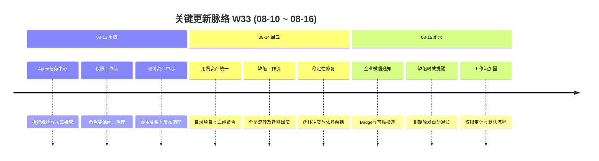

# 周报 2026-W33 (2026-08-10 ~ 2026-08-16)

> **总计 8 次提交 | 630 个文件变更 | +42,599 行 / -1,989 行 | 0 个 PR 合并**
>
> **贡献者**：chenqifen-miduo（8 commits）

**本周趋势**：本周研发主线从 W32 的 Agent/MCP 专项联调进一步转向平台能力建设：一方面完成 Agent 任务中心、测试资产中心、权限与工作流的系统化改造，另一方面新增企业微信机器人通知体系，将缺陷时效、测试报告和周期任务纳入自动提醒。与此同时，通过迁移修复、依赖解耦、权限审计和契约校验加强交付稳定性，为测试资产生产与自动化执行平台化补齐治理基础。

---

## 关键更新脉络

---

## 一、本周完成

### 1. 企业微信机器人通知体系 — 建立从业务事件到群通知的可靠链路

> **价值**：让缺陷到期、测试报告生成等关键事件主动触达团队，减少人工巡检和信息遗漏。

- 新增独立 `wecom-bot-bridge` 服务，承接平台与企业微信之间的消息转换和投递。
- 建立机器人配置、凭据加密、回调校验、授权状态、幂等控制与审计日志能力。
- 支持多类通知触发方式：
  - 缺陷预计解决时间到期提醒；
  - 测试报告生成通知；
  - 通用 Cron 周期通知；
  - 群会话发现与目标管理。
- 增加可靠投递与重试机制，补充健康检查、运行日志、Docker 部署样例及运维手册。
- 完成机器人配置前端、权限资源、国际化文案和接口契约校验。

### 2. Agent 任务执行平台化 — 补齐任务编排、执行与治理闭环

> **价值**：将零散的 Agent 调用沉淀为可分配、可追踪、可接管、可评价的统一任务执行能力。

- 建设 Agent 任务中心，支持任务创建、查询、认领、触发、历史记录和执行详情。
- 完善 Runner 注册、租约、心跳与任务回收，降低执行节点异常导致的任务悬挂风险。
- 统一执行状态机、结果分类、步骤证据、上下文快照与结果回写协议。
- 增加人工请求与响应机制，为登录、授权和异常确认等人机协作场景提供正式入口。
- 增加执行评价与汇总能力，并同步完善队列、评价、接入和能力管理页面。
- 改进 Agent Bridge 的 Windows 安装、构建及升级体验。

### 3. 权限控制与角色工作流重构 — 统一角色、资源和流程权限配置

> **价值**：让管理员能够在统一入口清晰配置“谁可以访问什么、可以推动哪些流程”，降低权限错配风险。

- 建立全局用户角色、角色成员、分配规则和启停管理能力。
- 将模块资源权限与状态流角色权限纳入统一权限矩阵。
- 重构权限控制页面，并新增独立角色编辑页面，改善复杂规则的配置体验。
- 增加工作流设计、发布校验、迁移预览、恢复与回滚能力。
- 补充权限变更日志、资源可见性校验和最小权限控制。

### 4. 测试资产中心建设 — 形成资产目录、版本、关系和发布体系

> **价值**：让用例、文档和执行证据成为可复用、可追踪、可供 Agent 消费的团队资产。

- 新增测试资产目录、用例、文档、关系、版本和证据等统一入口。
- 建立资产版本快照、发布事件和变更同步机制。
- 支持资产与上下文文档、项目及关联对象之间的关系查询。
- 增加测试资产详情、目录管理、关系聚合和版本展示页面。
- 为 Agent 提供测试资产读取接口和最小权限声明。

### 5. 用例资产与项目管理统一 — 打通用例目录、项目关联与资产导入

> **价值**：减少用例在不同入口之间重复维护，使团队可以按项目统一沉淀、选择和复用测试用例。

- 建立资产用例的查询、创建、编辑、详情和目录管理能力。
- 支持用例资产与项目、目录及血缘关系的聚合展示。
- 新增通用用例资产选择器，供缺陷、任务及其他业务场景复用。
- 改造默认 Hub 用例导入，增强导入任务的可靠性与结果反馈。
- 统一测试资产导航顺序、路由权限及项目入口。

### 6. 缺陷全局工作流 — 支持统一流转、批量执行和安全迁移

> **价值**：让不同项目能够遵循一致、可审计的缺陷处理流程，并在流程调整时安全迁移存量数据。

- 新增缺陷状态流转查询、单条执行和批量执行接口。
- 建立全局缺陷工作流运行时，统一校验来源状态、目标状态和操作权限。
- 增加工作流迁移预览、发布校验、续跑和回滚机制。
- 新增缺陷状态选择组件并改造列表、详情与编辑入口。
- 补充默认缺陷工作流和相关权限资源。

### 7. 缺陷时效与自动提醒 — 增加预计解决时间及到期触发能力

> **价值**：帮助团队提前识别即将逾期的缺陷，推动问题按承诺时间闭环。

- 为缺陷增加预计解决时间字段，并贯通创建、编辑、详情和列表展示。
- 建立预计解决时间变更事件与定时扫描服务。
- 将到期事件接入企业微信通知规则，可按配置向目标群发送提醒。
- 修复相关数据迁移脚本，确保升级环境字段和权限正确落地。

### 8. AI 用例生成与评审闭环 — 完善来源解析、草稿评审和资产发布

> **价值**：让 AI 生成的用例经过可控评审后进入正式资产库，提高生成效率的同时守住质量门槛。

- 完善 AI 来源文档、用例草稿、示例及解析结果的数据模型。
- 增加草稿生成、修改、评审和状态管理接口。
- 建立 AI 草稿与正式功能用例之间的转换与发布机制。
- 补充资产初始版本、评审权限和变更建议闭环。

### 9. 稳定性与迁移修复 — 消除升级冲突和服务依赖隐患

> **价值**：降低环境升级及服务启动失败概率，使大规模功能改造能够更安全地交付。

- 修复重复 Flyway 迁移版本，调整测试资产权限与导航迁移脚本。
- 修复 Agent 项目服务注入冲突。
- 通过服务调用适配层解除项目服务循环依赖。
- 加固异常处理、调度服务和权限校验行为。

### 10. 部署、测试与契约校验增强 — 提高跨模块变更的交付可验证性

> **价值**：让团队能在发布前更早发现接口、权限和部署配置不一致，减少联调与上线返工。

- 增加企业微信 Bridge 的 Dockerfile、Compose 配置、环境变量样例和部署脚本。
- 补充企业微信通知方案、运维手册及完整实施任务文档。
- 增加机器人服务、权限服务和异常处理测试。
- 增加前后端 API 契约及 UI/API 闭环校验脚本。

---

## 二、本周数据

### 每日提交分布

| 日期 | 提交数 | 重点方向 |
|------|--------:|----------|
| 08-13（周四） | 3 | Agent 任务中心、权限控制、测试资产中心；修复迁移与服务注入冲突 |
| 08-14（周五） | 4 | 权限工作流与用例资产统一、缺陷全局工作流、预计解决时间；修复循环依赖 |
| 08-15（周六） | 1 | 企业微信机器人通知、缺陷到期提醒、工作流加固 |
| **合计** | **8** | **平台能力建设与稳定性治理** |

### 提交类型分布

| 类型 | 数量 | 占比 |
|------|-----:|-----:|
| feat（新功能） | 4 | 50.00% |
| fix（Bug 修复） | 4 | 50.00% |
| refactor（重构） | 0 | 0.00% |
| docs/chore/perf/ui/style | 0 | 0.00% |
| 中文 commit / 无前缀 | 0 | 0.00% |
| **合计** | **8** | **100.00%** |

### 代码变更概览

| 指标 | 数量 |
|------|-----:|
| 去重文件变更 | 630 |
| 新增行数 | 42,599 |
| 删除行数 | 1,989 |
| 净增行数 | 40,610 |
| 合并 PR | 0 |
| 贡献者 | 1 |

> 文件与行数采用本周首个提交父节点至最后提交的一次性 `git diff --shortstat` 统计，未累加单次提交数据。

---

## 三、与上周 (W32) 对比

W32 为 Agent/MCP 专项联调周报，明确未纳入 Git commit、文件变更和 PR merge 数据；因此下表仅展示本周可核验数据，不计算不具备共同口径的涨跌比例。

| 指标 | W32 | W33 | 变化 |
|------|----:|----:|------|
| 提交数 | 未统计 | 8 | 口径不同，不比较 |
| 合并 PR 数 | 未统计 | 0 | 口径不同，不比较 |
| 文件变更 | 未统计 | 630 | 口径不同，不比较 |
| 净增行数 | 未统计 | 40,610 | 口径不同，不比较 |

### 上周方向落地情况

| W32 建议方向 | W33 实际进展 |
|--------------|--------------|
| P0 用例生成平台化 | ✅ 完善 AI 来源文档、草稿评审、正式用例转换和资产版本能力 |
| P0 自动化执行平台化 | ✅ 建设 Agent 任务中心、状态机、Runner 租约、人工接管和结果评价 |
| P0 MCP 连接稳定性 | ⚠️ 补强 Agent Bridge 安装和任务治理，但连接重试与全链路监控仍需继续验证 |
| P0 结果回写一致性 | ✅ 统一执行上下文、写回服务、证据及结果分类 |
| P0 附件上传可靠性 | ⚠️ 完善测试资产证据和附件相关接口，仍需进行真实环境持久化回归 |
| P1 权限用例补测 | ⚠️ 本周完成权限体系重构，未发现低权限账号专项补测记录 |
| P1 空白名称缺陷跟踪 | ⚠️ 本周提交记录中未发现该缺陷的明确修复记录 |
| P1 测试数据治理 | ✅ 增加资产版本、关系、发布与初始版本迁移能力 |
| P2 审批规则优化 | ✅ 统一角色、资源及工作流权限配置并增加审计能力 |
| P2 无人值守回归 | ⚠️ 任务队列和 Runner 治理取得进展，仍需端到端故障恢复验证 |

---

## 四、下周优先级建议

| 优先级 | 方向 | 建议动作 |
|--------|------|----------|
| P0 | 企业微信通知验收 | 在真实企业微信环境验证授权、回调、群发现、缺陷到期、测试报告、Cron、重试和幂等全链路 |
| P0 | 数据迁移验证 | 对 V3.7.2_40～V3.7.2_71 相关迁移执行全新安装、连续升级、失败续跑和回滚测试 |
| P0 | Agent 执行闭环 | 验证任务认领、租约过期、断点恢复、人工接管、结果回写和证据持久化 |
| P0 | 权限安全回归 | 建立管理员、普通成员、项目成员和最小权限 Agent 的权限矩阵测试 |
| P1 | 测试资产可用性 | 验证资产目录、用例 CRUD、导入、版本、关系、发布及项目隔离 |
| P1 | 缺陷工作流回归 | 覆盖单条/批量流转、非法跳转、迁移预览、发布、续跑和回滚场景 |
| P1 | 性能与容量评估 | 对 Agent 队列、资产分页、通知投递和缺陷定时扫描进行并发与大数据量测试 |
| P1 | W32 遗留缺陷 | 补测空白名称校验和低权限用例，完成问题登记与回归收口 |
| P2 | 可观测性建设 | 统一 Agent、通知、工作流和迁移任务的指标、日志、告警与追踪标识 |
| P2 | 提交治理 | 将超大直接提交拆分为可审查 PR，按功能、迁移、前端和测试分层交付 |

---

## 附录：Pull Requests

本周没有新增合并 PR。仓库可见的最新合并 PR 为 W32 的 **#89**；W33 的 8 次变更均为直接提交。

### 本周提交清单

| 日期 | Commit | 摘要 | 分类 |
|------|--------|------|------|
| 08-13 | `be04ef8439` | 新增权限控制与 Agent 任务管理 | ✨ 新功能 |
| 08-13 | `7ecad51da1` | 修复 Flyway 迁移版本重复 | 🐛 Bug 修复 |
| 08-13 | `fb20ea73e1` | 修复 Agent 项目服务注入冲突 | 🐛 Bug 修复 |
| 08-14 | `e278a126ca` | 更新平台权限与 Agent 工作流 | ✨ 新功能 |
| 08-14 | `ee1119e37d` | 统一权限工作流与用例资产 | ✨ 新功能 |
| 08-14 | `059a2bddfa` | 增加缺陷预计解决时间并修复迁移 | 🐛 Bug 修复 |
| 08-14 | `06a3269ddb` | 解除项目服务循环依赖 | 🐛 Bug 修复 |
| 08-15 | `acefc3f1fc` | 集成企业微信机器人并加固工作流 | ✨ 新功能 |
