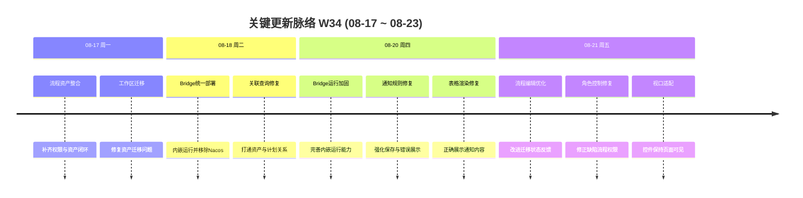

# 周报 2026-W34 (2026-08-17 ~ 2026-08-23)

> **总计 18 次提交 | 125 个文件变更 | +5,148 行 / -2,522 行 | 16 个 PR 合并 (#90 ~ #106，#102 不存在于当前 Git 历史)**
>
> **贡献者**：chenqifen-miduo（14 commits），Chenqifen（4 commits；同一贡献者的 Git 名称别名）

**本周趋势**：本周工作由 W33 的大规模平台能力建设转入集成收口与稳定性加固。主线集中在权限工作流和测试资产的完整整合、企业微信 Bridge 的部署架构收敛，以及通知规则持久化和展示问题修复。提交规模明显回落，但修复类提交占比提升，反映研发阶段已从功能扩张转向可部署、可操作和可持续升级的质量治理。

> **统计口径**：提交、文件和行数仅统计 2026-08-17 至 2026-08-23 的当前分支历史；PR 范围依据 W33 报告的最后编号 #89 连续取 #90～#106，共找到 16 个合并 PR，#102 在当前 Git 历史中缺失。#90～#98 虽于 08-13～08-15 合并，但按照连续 PR 口径纳入本期 PR 清单。

---

## 关键更新脉络

---

## 一、本周完成

### 1. Agent 任务执行与治理平台化 — 建立统一的任务编排和执行管理基础

> **价值**：让 Agent 任务从零散调用转为可分配、可跟踪、可人工接管的标准流程，提升自动化执行的可控性。

- 建设任务创建、查询、认领、触发、历史记录与执行详情能力。
- 完善 Runner 注册、租约、心跳、回收和执行状态管理。
- 统一执行上下文、结果回写、步骤证据与结果分类。
- 增加人工请求、响应和执行评价入口，支持复杂任务中的人机协作。
- 同步完善任务队列、评价、接入和能力管理页面。

### 2. 权限与工作流统一治理 — 完善角色资源控制和流程编辑体验

> **价值**：让管理员能够在统一入口管理访问权限和业务流转规则，降低越权及配置错误风险。

- 整合全局角色、角色成员、资源权限和状态流权限矩阵。
- 完善流程设计、发布校验、迁移预览、续跑与回滚能力。
- 修正缺陷工作流角色控件的启用、选择和状态同步逻辑。
- 优化流程编辑与迁移状态展示，让执行反馈更加明确。
- 调整页面布局，确保工作流操作控件始终保持在可视区域内。

### 3. 测试资产与用例工作区整合 — 打通资产、项目和测试计划关联

> **价值**：让团队能够在统一工作区管理和复用测试用例，减少跨模块查找与重复维护成本。

- 完成测试资产目录、版本、关系、项目空间和用例能力的整合。
- 补齐资产用例与测试计划的关联查询，修复跨工作区过滤异常。
- 修复用例资产工作区迁移，确保升级后数据落入正确空间。
- 完善用例资产与权限工作流之间的联动和资源可见性。
- 增强资产导入、详情、选择和项目关联链路。

### 4. 缺陷工作流与时效管理 — 加固状态流转和预计解决时间能力

> **价值**：帮助团队按统一规则推进缺陷处理，并通过时效信息及时识别逾期风险。

- 完善缺陷全局工作流、批量流转和流程迁移能力。
- 增加预计解决时间的创建、编辑、详情和列表展示。
- 修正默认缺陷工作流的数据库排序规则，避免不同环境下排序不一致。
- 修复缺陷工作流角色控制及编辑状态反馈。
- 将预计解决时间事件接入企业微信提醒链路。

### 5. 企业微信通知能力落地 — 完成业务事件、规则和消息投递闭环

> **价值**：让缺陷到期、测试报告等关键事件自动触达团队，减少遗漏和人工通知成本。

- 建立企业微信机器人配置、授权、回调验证与审计能力。
- 支持缺陷预计解决时间、测试报告及周期任务通知。
- 完善群会话发现、通知目标管理、可靠投递和失败重试。
- 修复通知规则持久化，确保新增和编辑后的配置正确保存。
- 修复通知数据、错误信息和 Markdown 表格的前端展示。

### 6. 企业微信 Bridge 部署架构收敛 — 移除 Nacos 并改为平台内嵌运行

> **价值**：减少外部组件依赖和部署步骤，降低企业微信通知能力的安装与运维门槛。

- 移除企业微信 Bridge 对 Nacos 的依赖。
- 将 Bridge 运行时嵌入平台部署体系，统一配置和生命周期管理。
- 合并部署脚本、环境变量和运行配置，减少多套启动方式。
- 加固内嵌运行时的进程管理、健康状态和异常恢复能力。
- 保留独立 Bridge 的协议边界，便于后续扩展和问题隔离。

### 7. 通知规则可靠性与展示修复 — 提升配置保存和消息可读性

> **价值**：确保管理员配置的通知规则能够稳定生效，并让接收者看到完整、清晰的业务信息。

- 修复通知规则保存、读取和更新过程中的数据一致性问题。
- 增强错误响应展示，避免配置失败时缺少有效反馈。
- 修复通知数据字段映射和页面回显。
- 支持通知内容中的 Markdown 表格正确渲染。
- 同步主分支修复，保证不同开发分支行为一致。

### 8. 升级迁移与服务依赖稳定性 — 修复迁移、注入和循环依赖问题

> **价值**：降低环境升级及服务启动失败概率，使权限、资产和通知能力可以稳定交付。

- 修复重复 Flyway 迁移版本及相关资源迁移脚本。
- 修复测试资产工作区迁移和默认缺陷流程排序规则。
- 修复 Agent 项目服务注入冲突。
- 解除项目服务循环依赖，减少模块启动顺序影响。
- 修复测试资产与测试计划的关联查询，避免迁移后数据不可见。

---

## 二、本周数据

### 每日提交分布

| 日期 | 提交数 | 重点方向 |
|------|--------:|----------|
| 08-17（周一） | 4 | 权限工作流与测试资产整合、工作区迁移修复，合并 PR #99～#100 |
| 08-18（周二） | 4 | Bridge 部署统一、移除 Nacos、资产与计划关联查询修复，合并 PR #101 |
| 08-20（周四） | 7 | Bridge 运行时加固、通知规则持久化、数据和表格展示修复，合并 PR #103～#106 |
| 08-21（周五） | 3 | 工作流编辑、迁移状态、角色控件和视口适配修复 |
| **合计** | **18** | **集成收口与稳定性加固** |

### 提交类型分布

| 类型 | 数量 | 占比 |
|------|-----:|-----:|
| feat（新功能） | 1 | 5.56% |
| fix（Bug 修复） | 11 | 61.11% |
| refactor（重构） | 1 | 5.56% |
| docs/chore/perf/ui/style | 0 | 0.00% |
| 中文 commit / 无前缀 | 5 | 27.78% |
| **合计** | **18** | **100.00%** |

> 5 个“无前缀”提交均为分支或 PR 合并提交；`chore` 同步提交不在当前分支的本周可达历史中，因此不计入本周提交类型分布。

### 代码变更概览

| 指标 | 数量 |
|------|-----:|
| 去重文件变更 | 125 |
| 新增行数 | 5,148 |
| 删除行数 | 2,522 |
| 净增行数 | 2,626 |
| PR 范围 | #90～#106 |
| 实际找到的合并 PR | 16 |
| 缺失 PR 编号 | #102 |
| Git 作者名称 | 2 个别名（同一贡献者） |

> 文件与行数采用本周首个提交父节点至最后提交的一次性 `git diff --shortstat` 统计，未累加逐提交数据。

---

## 三、与上周 (W33) 对比

| 指标 | W33 | W34 | 变化 |
|------|----:|----:|------|
| 提交数 | 8 | 18 | +125.00% |
| 合并 PR 数 | 0 | 16 | +16 个 |
| 文件变更 | 630 | 125 | -80.16% |
| 净增行数 | 40,610 | 2,626 | -93.53% |

> PR 对比受连续编号口径影响：W34 的 16 个 PR 包含合并日期位于 W33、但在 W33 报告截止 #89 后出现的 #90～#98；因此 PR 数变化不等同于本周自然日期内的合并增量。

### 上周方向落地情况

| W33 建议方向 | W34 实际进展 |
|--------------|--------------|
| P0 企业微信通知验收 | ⚠️ 完成规则、运行时、数据展示和表格渲染修复；尚未发现真实企业微信环境全链路验收记录 |
| P0 数据迁移验证 | ✅ 修复 Flyway 版本、资产工作区迁移和默认缺陷流程排序问题 |
| P0 Agent 执行闭环 | ✅ Agent 任务、Runner 租约、人工接管、结果回写和评价能力进入 PR 范围 |
| P0 权限安全回归 | ⚠️ 完成角色控件和流程权限修复，仍需系统化权限矩阵回归 |
| P1 测试资产可用性 | ✅ 完成资产工作区、项目和测试计划关联查询修复 |
| P1 缺陷工作流回归 | ✅ 修复流程编辑、迁移状态、角色控制及默认流程排序 |
| P1 性能与容量评估 | ❌ 本周提交记录中未发现并发或大数据量测试成果 |
| P1 W32 遗留缺陷 | ❌ 本周提交记录中未发现空白名称和低权限专项补测成果 |
| P2 可观测性建设 | ⚠️ Bridge 运行时和错误展示得到加强，尚未形成统一指标、日志和告警体系 |
| P2 提交治理 | ✅ 变更已通过连续 PR 拆分交付，但 #102 缺失及跨周补录仍需治理 |

---

## 四、下周优先级建议

| 优先级 | 方向 | 建议动作 |
|--------|------|----------|
| P0 | 企业微信真实环境验收 | 验证授权、回调、群发现、规则保存、缺陷到期、测试报告、表格消息、失败重试和幂等投递 |
| P0 | 权限与工作流回归 | 覆盖不同角色的资源可见性、状态流转、非法操作、流程发布、迁移续跑和回滚 |
| P0 | 升级迁移验证 | 执行全新安装、连续升级、重复执行和失败恢复，重点验证资产工作区与默认缺陷流程 |
| P0 | Agent 执行闭环验收 | 验证任务认领、租约过期、断点恢复、人工接管、结果回写和证据持久化 |
| P1 | Bridge 容灾验证 | 模拟进程退出、网络中断、平台重启和企业微信限流，验证自动恢复及消息不重不漏 |
| P1 | 测试资产关联回归 | 覆盖跨项目隔离、用例与计划关联、分页筛选、迁移数据及无权限访问 |
| P1 | 性能与容量评估 | 对通知投递、Agent 队列、资产分页和缺陷定时扫描执行并发及大数据量测试 |
| P1 | 遗留用例收口 | 补测空白名称校验和低权限场景，完成缺陷登记、修复与回归 |
| P2 | 统一可观测性 | 为 Agent、Bridge、通知、工作流和迁移任务建立统一指标、追踪标识、日志和告警 |
| P2 | PR 编号治理 | 核查 #102 缺失原因，并确保周报生成前所有合并引用已同步到本地仓库 |

---

## 附录：已合并 Pull Requests (#90 ~ #106)

| PR | 标题 | 分类 |
|----|------|------|
| #90 | 新增权限控制与 Agent 任务管理 | ✨ 新功能 |
| #91 | 修复 Flyway 迁移版本重复 | 🐛 Bug 修复 |
| #92 | 修复 Agent 项目服务注入冲突 | 🐛 Bug 修复 |
| #93 | 更新平台权限与 Agent 工作流 | ✨ 新功能 |
| #94 | 统一权限工作流与用例资产 | ✨ 新功能 |
| #95 | 增加缺陷预计解决时间并修复迁移 | 🐛 Bug 修复 |
| #96 | 解除项目服务循环依赖 | 🐛 Bug 修复 |
| #97 | 集成企业微信机器人并加固工作流 | ✨ 新功能 |
| #98 | 修正默认缺陷工作流排序规则 | 🐛 Bug 修复 |
| #99 | 完成工作流与用例资产整合 | 🔄 更新 |
| #100 | 修复用例资产工作区迁移 | 🐛 Bug 修复 |
| #101 | 统一企业微信 Bridge 部署与工作流控件 | 🔄 更新 |
| #102 | 当前 Git 历史中未找到对应合并提交 | ⚠️ 缺失 |
| #103 | 移除 Nacos、内嵌 Bridge 并修复资产关联查询 | 🏗️ 架构 |
| #104 | 加固内嵌企业微信 Bridge 运行时 | 🐛 Bug 修复 |
| #105 | 加固企业微信通知规则持久化 | 🐛 Bug 修复 |
| #106 | 修复企业微信通知数据与错误展示 | 🐛 Bug 修复 |
