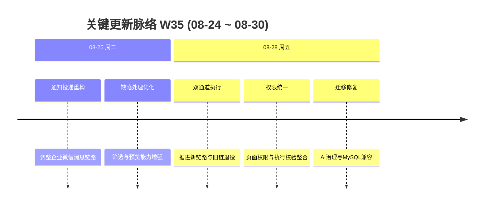

# 周报 2026-W35 (2026-08-24 ~ 2026-08-30)

> **总计 14 次提交 | 318 个文件变更 | +19,497 行 / -2,118 行 | 7 个 PR 合并 (#107 ~ #113)**
>
> **贡献者**：chenqifen-miduo（14 commits）
>
> **交付状态：部分完成** — 已发现实现、测试代码、迁移和容器配置变更，但缺少这些验证命令实际执行通过的日志，不能按“完成”口径验收。

**本周趋势**：本周工作从 W34 的集成收口转向 Agent 执行体系的深度改造。最大主线是双通道执行、AI 治理、凭据安全、检查点恢复、错误治理和旧链路退役；同时推进统一页面权限、企业微信通知投递重构、缺陷处理人筛选预览以及数据库迁移兼容性修复。代码规模显著增长，测试文件和迁移脚本同步增加，但当前 Git 证据只能证明实现已提交，尚不足以证明构建、容器和端到端路径已经验收通过。

> **统计口径**：提交、文件和行数仅统计 2026-08-24 至 2026-08-30 的当前分支历史；PR 范围依据 W34 的最后编号 #106 连续取 #107～#113。#107～#111 的合并日期位于 W34，但按连续 PR 编号纪律纳入本期清单。

---

## 关键更新脉络

---

## 一、本周完成（按证据分级）

> 本节“完成”仅表示代码实现进入当前 Git 历史。按照项目质量规则，所有条目因缺少完整运行验收证据，最终状态均为 **部分完成**。

### 1. Agent 双通道执行与旧链路退役 — 建立新旧执行通道的演进基础

> **价值**：让 Agent 在不同执行环境下具备稳定、可恢复的运行路径，并逐步减少旧链路带来的维护和冲突成本。

- 增加双通道执行契约、通道策略、执行前检查和 Web 执行协议校验。
- 完善任务认领、Runner 租约、步骤结果、执行产物和检查点恢复。
- 增加失败分类、安全错误映射、证据脱敏和敏感数据清理。
- 增强凭据引用、环境配置、测试数据租约和模型网关请求映射。
- 增加旧 Agent 功能退役控制及兼容边界测试。
- **证据**：PR #113；236 个文件变更；新增多项 Agent 单元与契约测试。
- **状态**：⚠️ 部分完成；尚无测试执行、真实 Runner、断点恢复及端到端验收日志。

### 2. 统一页面权限与 Agent 完整性加固 — 收敛前端入口与后端资源校验

> **价值**：确保用户看到的页面和能够执行的操作与其角色一致，降低仅隐藏入口但后端仍可访问的越权风险。

- 调整页面、路由、资源和角色权限映射。
- 强化 Agent 执行前的项目、环境、角色和资源校验。
- 统一权限配置页面与 Agent、缺陷、测试资产等业务入口。
- 增加权限 UI 服务和权限控制服务测试代码。
- **证据**：直接提交 `2131cacc6a`、`f40f4ff3a9`；89 个文件变更。
- **状态**：⚠️ 部分完成；尚无完整权限矩阵、越权接口和多角色 E2E 验收证据。

### 3. 企业微信通知投递重构 — 调整事件处理与可靠投递链路

> **价值**：提高缺陷、测试报告等通知的稳定性和可追踪性，减少消息遗漏或重复发送。

- 重构企业微信通知投递、规则处理和运行时服务。
- 调整前后端通知配置和接口模型。
- 延续通知表格渲染修复，改善复杂消息内容展示。
- **证据**：PR #107、#112；涉及系统设置后端、通知配置前端和领域迁移。
- **状态**：⚠️ 部分完成；尚无真实企业微信授权、回调、限流、重试和幂等投递记录。

### 4. 缺陷处理人筛选与预览增强 — 改善缺陷分派和批量操作体验

> **价值**：帮助用户更准确地选择缺陷处理人，并在提交前预览影响范围，降低误分派风险。

- 增加缺陷处理人关系模型和数据库迁移。
- 完善处理人过滤、候选查询、预览及前端交互。
- 联动测试计划与缺陷相关业务查询。
- 增加 `BugHandleUserRelationServiceTests` 测试代码。
- **证据**：PR #112；前端、后端、迁移和测试文件均有变更。
- **状态**：⚠️ 部分完成；尚无迁移执行、接口集成和核心用户路径冒烟记录。

### 5. 工作流编辑与角色控制修复 — 加强流程配置的准确性和可用性

> **价值**：减少流程配置错误，使管理员能够清晰编辑、迁移和发布缺陷工作流。

- 改进工作流编辑和迁移状态展示。
- 修正缺陷工作流角色控件及权限逻辑。
- 调整页面布局，避免操作控件超出视口。
- **证据**：PR #108、#109、#110；前端页面、API 与系统设置后端均有实现。
- **状态**：⚠️ 部分完成；尚无流程发布、失败续跑、回滚和角色权限自动化验收记录。

### 6. 功能用例项目隔离 — 修复跨项目数据可见性

> **价值**：避免不同项目之间的功能用例相互泄漏，保障项目数据边界。

- 在后端查询中增加项目隔离条件。
- 调整前端用例页面的项目上下文处理。
- 增加相关资源服务测试代码。
- **证据**：PR #111；3 个文件变更。
- **状态**：⚠️ 部分完成；尚无跨项目、无权限和管理员场景的集成及 E2E 验收证据。

### 7. AI 治理与数据库迁移修复 — 处理迁移冲突和失败恢复

> **价值**：降低新 AI 执行能力在升级环境中因数据库冲突而无法启动的风险。

- 新增 Agent 双通道、AI 治理、用例可执行性、可观测性、缺陷草稿、告警和完整性迁移。
- 修复 AI 治理迁移冲突，并提供 MySQL 失败迁移恢复脚本。
- 处理 MySQL 敏感列名引用问题。
- 让恢复脚本使用配置后的 Flyway 历史表名。
- **证据**：迁移版本 V3.7.2_79～V3.7.2_88；直接修复提交 `4887fa5ec1`、`355872b7cc`、`ec32eae32c`。
- **状态**：⚠️ 部分完成；尚无全新安装、连续升级、重复执行、失败恢复和回滚验证日志。

### 8. Agent 项目服务注入修复 — 消除服务依赖歧义

> **价值**：降低 Agent 服务因依赖注入冲突而无法启动或调用错误实现的风险。

- 区分 Agent 项目服务的注入目标和资源契约。
- 同步合并修复到当前主线。
- 增加项目服务资源契约测试代码。
- **证据**：直接提交 `cc1d97f7ee`、`7cf983ba40`。
- **状态**：⚠️ 部分完成；尚无后端启动、Spring 上下文和实际接口调用验证日志。

---

## 二、需求追踪与验收状态

| 需求主线 | 前端入口/实现 | 后端接口与业务 | 数据/配置 | 测试代码 | 运行验收 | 状态 |
|----------|---------------|----------------|-----------|----------|----------|------|
| Agent 双通道执行 | Agent 管理、执行、任务与设置页面有变更 | 执行策略、检查点、凭据、证据、错误和 MCP 边界实现 | V3.7.2_79～88 | 多项 Agent 单元/契约测试 | 未发现执行日志、容器及 E2E 证据 | 部分完成 |
| 统一页面权限 | 路由、页面、权限工具和错误展示有变更 | 权限控制、UI 权限、角色和执行前校验 | 统一角色权限迁移 | 权限服务测试 | 未发现权限矩阵与越权回归日志 | 部分完成 |
| 企业微信通知 | 通知配置与表格展示有变更 | 规则、事件和投递服务重构 | 通知领域变更 | 仓库中有相关测试文件，但本周未发现运行证据 | 未发现真实企业微信验收 | 部分完成 |
| 缺陷处理人 | 筛选、预览与业务组件有变更 | 处理人查询、关系维护与业务校验 | V3.7.2_78 | 处理人关系服务测试 | 未发现接口集成和 UI 冒烟日志 | 部分完成 |
| 工作流编辑 | 编辑页、角色控件和视口适配有变更 | 工作流编辑与迁移接口有变更 | 沿用现有流程数据 | 权限服务测试有变更 | 未发现发布、迁移、续跑和回滚日志 | 部分完成 |
| 用例项目隔离 | 功能用例页面项目上下文有变更 | 查询增加项目边界 | 无新增独立迁移 | 用例资源服务测试有变更 | 未发现跨项目 E2E 证据 | 部分完成 |
| 数据库迁移修复 | 不涉及直接用户入口 | 启动迁移与恢复逻辑 | 多个 DDL/DML 及恢复脚本 | 未发现迁移集成测试执行记录 | 未执行或无证据 | 部分完成 |
| Agent 服务注入 | 不涉及直接用户入口 | 服务注入与资源契约修复 | 无新增独立迁移 | 项目服务契约测试有变更 | 未发现应用启动日志 | 部分完成 |

### 前后端完整性判断

- **链路相对完整但待运行验证**：Agent 双通道、统一权限、企业微信通知、缺陷处理人、工作流编辑。
- **以后端数据边界为主**：功能用例项目隔离；前端已有上下文调整，但需跨项目 E2E 证明隔离有效。
- **基础设施修复**：数据库迁移和服务注入；必须通过真实升级及应用启动验证后才能标记完成。
- **错误处理证据**：本周新增安全错误映射、异常处理和前端错误展示相关实现，但尚未证明 loading、empty、validation-error、permission-denied、network-error 和 server-error 状态均已覆盖。

---

## 三、本周数据

### 每日提交分布

| 日期 | 提交数 | 重点方向 |
|------|--------:|----------|
| 08-25（周二） | 2 | 企业微信通知投递重构、缺陷处理人筛选与预览，合并 PR #112 |
| 08-28（周五） | 12 | Agent 双通道、统一权限、AI 治理迁移和服务注入修复，合并 PR #113 |
| **合计** | **14** | **Agent 执行体系改造与交付稳定性修复** |

### 提交类型分布

| 类型 | 数量 | 占比 |
|------|-----:|-----:|
| feat（新功能） | 3 | 21.43% |
| fix（Bug 修复） | 9 | 64.29% |
| refactor（重构） | 0 | 0.00% |
| docs/chore/perf/ui/style | 0 | 0.00% |
| 中文 commit / 无前缀 | 2 | 14.29% |
| **合计** | **14** | **100.01%** |

> 占比因保留两位小数产生 0.01% 的舍入差；2 个无前缀提交均为分支合并提交。

### 代码变更概览

| 指标 | 数量 |
|------|-----:|
| 去重文件变更 | 318 |
| 新增行数 | 19,497 |
| 删除行数 | 2,118 |
| 净增行数 | 17,379 |
| PR 范围 | #107～#113 |
| 合并 PR | 7 |
| 贡献者 | 1 |

> 文件与行数采用本周首个提交父节点至最后提交的一次性 `git diff --shortstat` 统计，未累加逐提交数据。

---

## 四、与上周 (W34) 对比

| 指标 | W34 | W35 | 变化 |
|------|----:|----:|------|
| 提交数 | 18 | 14 | -22.22% |
| 合并 PR 数 | 16 | 7 | -9 个 |
| 文件变更 | 125 | 318 | +154.40% |
| 净增行数 | 2,626 | 17,379 | +561.81% |

> PR 对比采用连续编号口径，均可能包含合并日期位于上一自然周、但在上一份周报截止编号之后出现的 PR。

### 上周方向落地情况

| W34 建议方向 | W35 实际进展 |
|--------------|--------------|
| P0 企业微信真实环境验收 | ⚠️ 完成通知投递重构和表格渲染修复；未发现真实环境验收日志 |
| P0 权限与工作流回归 | ⚠️ 完成权限整合、角色控件和流程编辑修复；未发现完整权限矩阵回归结果 |
| P0 升级迁移验证 | ⚠️ 新增并修复多项迁移及恢复脚本；未发现实际升级验证日志 |
| P0 Agent 执行闭环验收 | ⚠️ 双通道、检查点、凭据、证据和错误治理实现大幅推进；未发现端到端执行证据 |
| P1 Bridge 容灾验证 | ⚠️ 通知投递链路重构；未发现断网、重启、限流和消息幂等验证日志 |
| P1 测试资产关联回归 | ⚠️ 修复功能用例项目隔离；未发现跨项目完整回归结果 |
| P1 性能与容量评估 | ❌ 未发现并发或大数据量测试执行记录 |
| P1 遗留用例收口 | ❌ 未发现空白名称和低权限场景的补测记录 |
| P2 统一可观测性 | ⚠️ 新增 AI 执行可观测性和告警迁移；未发现指标、日志、告警联调记录 |
| P2 PR 编号治理 | ✅ 本期 #107～#113 连续可见，无缺失编号 |

---

## 五、验证情况与交付风险

### 已确认的静态证据

- 当前分支存在 14 次本周提交和 7 个连续编号 PR。
- 变更包含前端页面/API、后端服务/控制器、数据库迁移、测试代码和 Dockerfile。
- 新增或修改约 30 个 Agent、权限、缺陷和用例相关测试文件。
- 存在 `ai-browser-runner/test/contract.test.ts`、`frontend/scripts/verify-route-tabs.mjs` 等契约和路由检查资产。
- 新增 V3.7.2_78～V3.7.2_88 范围内的数据库迁移与 MySQL 恢复脚本。

### 未执行或缺少运行证据的验证

| 验证项 | 状态 | 原因与风险 | 建议命令/方式 |
|--------|------|------------|---------------|
| 相关单元测试 | 未执行 | 本次任务仅生成周报；测试代码存在不代表通过 | `./mvnw.cmd -pl backend/services/agent-integration,backend/services/system-setting,backend/services/bug-management,backend/services/case-management,backend/services/test-plan -am test` |
| 后端集成测试 | 未执行 | 无真实数据库和服务联调结果，接口与迁移可能失败 | 按项目集成测试配置运行相关服务测试套件 |
| 前端类型检查 | 未执行 | 大量页面和 API 类型变更可能存在不一致 | 在 `frontend` 目录运行项目定义的 type-check 脚本 |
| 前端 lint | 未执行 | 无静态规范校验结果 | 在 `frontend` 目录运行项目定义的 lint 脚本 |
| 前端生产构建 | 未执行 | 路由、权限和组件变更可能导致构建失败 | 在 `frontend` 目录运行项目定义的 build 脚本 |
| 后端编译/打包 | 未执行 | 服务注入和跨模块依赖仍存在启动风险 | `./mvnw.cmd -DskipTests package` |
| 数据库迁移验证 | 未执行 | V78～V88 及恢复脚本可能在不同历史表或旧数据上失败 | 分别执行全新安装、连续升级、重复迁移和失败恢复 |
| Docker 镜像构建 | 未执行 | Dockerfile 有变更，镜像可构建性未知 | 使用仓库实际镜像构建命令构建前后端镜像 |
| 容器启动与健康检查 | 未执行 | 依赖注入、迁移和服务配置问题可能只在启动时暴露 | 启动完整 Compose 环境并检查全部健康端点 |
| 核心流程 E2E | 未执行 | Agent 双通道、权限、通知和缺陷路径尚无用户级证据 | 覆盖登录、权限、Agent 执行、通知和缺陷处理人路径 |

### 已知风险和遗留问题

- Agent 双通道一次变更覆盖 236 个文件，回归面较大，需优先执行分层测试和 E2E。
- 多个迁移集中引入，且已出现冲突、敏感列名和历史表配置修复，升级风险较高。
- 企业微信通知只有实现和修复记录，没有真实租户、回调、限流及失败重试证据。
- 页面权限与后端资源校验虽同步改造，但尚未证明所有入口和接口形成完整权限闭环。
- 当前未发现生产构建、镜像启动、健康检查或真实核心路径通过的日志。
- 本周差异搜索未发现未说明的业务 TODO/FIXME；发现的 `Mock` 均位于测试代码或质量规则文本，未据此认定存在生产伪实现。

---

## 六、下周优先级建议

| 优先级 | 方向 | 建议动作 |
|--------|------|----------|
| P0 | Agent 双通道验收 | 运行单元、契约、集成和 E2E，覆盖通道选择、检查点恢复、人工接管、失败分类与结果回写 |
| P0 | 数据库迁移矩阵 | 验证 MySQL 全新安装、连续升级、失败恢复、非默认 Flyway 历史表和重复执行 |
| P0 | 权限闭环回归 | 按管理员、项目成员、普通成员和 Agent 身份验证入口、路由、接口及资源隔离 |
| P0 | 容器交付验证 | 构建前后端镜像，启动完整环境，验证数据库迁移、依赖注入和健康检查 |
| P1 | 企业微信真实联调 | 验证授权、回调、群发现、规则保存、表格消息、限流、重试、幂等和审计 |
| P1 | 缺陷处理人 E2E | 覆盖筛选、预览、保存、批量操作、无权限和异常响应 |
| P1 | 用例项目隔离 | 使用多项目、多角色数据验证列表、详情、关联和直接接口访问均不越界 |
| P1 | 错误状态覆盖 | 核验 loading、empty、success、validation、permission、network 和 server error 状态 |
| P2 | 性能与容量 | 对 Agent 任务、通知投递、缺陷筛选和迁移执行并发及大数据量测试 |
| P2 | 验收证据归档 | 将命令、日志、截图、报告和 traceId 与 PR/需求建立可追踪关联 |

---

## 附录：已合并 Pull Requests (#107 ~ #113)

| PR | 实际提交主题 | 分类 | 验收状态 |
|----|--------------|------|----------|
| #107 | 修复企业微信通知表格渲染 | 🎨 UI/UX | 部分完成：无真实消息验收证据 |
| #108 | 改进工作流编辑和迁移状态展示 | 🔄 更新 | 部分完成：无流程迁移运行证据 |
| #109 | 修正缺陷工作流角色控件 | 🔐 权限 | 部分完成：无多角色回归证据 |
| #110 | 保持工作流控件位于可视区域 | 🎨 UI/UX | 部分完成：无浏览器视觉验收证据 |
| #111 | 按项目隔离功能用例 | 🔐 权限 | 部分完成：无跨项目 E2E 证据 |
| #112 | 重构企业微信通知投递；增强缺陷处理人筛选与预览 | 🔄 更新 | 部分完成：无集成和真实环境证据 |
| #113 | 推进 Agent 双通道执行、AI 治理和旧链路退役 | 🧠 AI 能力 | 部分完成：无构建、容器和 E2E 证据 |

---

## 功能状态结论

**本周整体状态：部分完成。**

实现层面已覆盖前端、后端、数据库迁移、测试代码和容器配置；但未取得单元测试、集成测试、前端检查、生产构建、迁移验证、镜像构建、容器健康检查及核心 E2E 的实际通过证据。上述验证完成前，不应将本周主线标记为“完成”或“可正常运行”。
