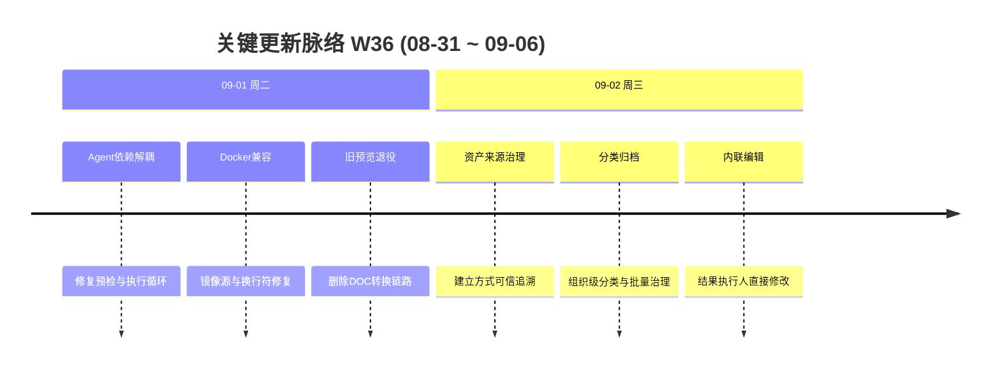

# 周报 2026-W36 (2026-08-31 ~ 2026-09-06)

> **总计 9 次提交 | 80 个文件变更 | +3,379 行 / -305 行 | 6 个 PR 合并 (#114 ~ #119)**
>
> **贡献者**：chenqifen-miduo（9 commits）
>
> **整体状态：部分完成** — 已取得部分单元测试、前端检查、后端编译和 CI 构建证据；数据库迁移、镜像构建、容器健康检查及核心 E2E 尚未完成。

**本周趋势**：本周由 W35 的 Agent 双通道大规模改造转向两条收口主线：一是修复 Agent 预检、执行服务和 Runner 租约的依赖问题，提升应用启动稳定性；二是建设测试资产来源标识、组织级分类、AI 追溯和列表内联编辑能力。提交量与变更规模显著回落，但交付证据质量有所提升，已经记录定向测试、后端编译、前端类型检查、Lint 和生产构建结果；环境级验证仍受 Docker 不可用及功能尚未部署影响。

> **统计口径**：提交、文件和行数仅统计 2026-08-31 至 2026-09-06 的当前分支历史；PR 范围依据 W35 最后编号 #113 连续取 #114～#119。#114～#116 的合并日期位于 W35，但按连续 PR 编号纪律纳入本期。

---

## 关键更新脉络

---

## 一、本周完成（按验收证据分级）

### 1. 测试资产来源与分类治理 — 建立可信来源、分类和审计体系

> **价值**：让团队能够分辨资产由人工、AI、导入还是同步产生，并按业务分类统一归档和追溯。

- 新增 `MANUAL`、`AI`、`IMPORT`、`SYNC`、`AUTOMATION` 和 `UNKNOWN` 建立方式。
- 建设组织级独立分类树，支持最多 5 层、新建、改名、移动、排序、删除迁移和重名/循环校验。
- 为测试资产列表增加来源和分类展示、服务端筛选、单个归类及批量归类。
- 覆盖用例、文档、版本、关系、目录和缺陷资产，并将缺陷纳入资产目录。
- 增加 AI 生成批次、来源版本、模型和审核信息追溯，并按项目权限裁剪敏感内容。
- 新增 V3.7.2_89 数据结构迁移和 V3.7.2_90 权限迁移。
- **验证证据**：资产相关定向测试 22/22 通过；`TestAssetCatalogServiceTests` 13/13 通过；后端编译、前端类型检查和生产构建通过。
- **状态**：⚠️ 部分完成；真实 MySQL 迁移、跨组织数据库集成、权限集成和浏览器 E2E 尚未执行。

### 2. 功能用例列表内联编辑 — 支持直接修改执行结果、执行人和分类

> **价值**：减少频繁打开详情页的操作成本，让测试人员在列表中快速维护执行信息和资产归属。

- 在用例列表增加执行结果、执行人和资产分类的内联选择。
- 支持清空执行人，并同步最后执行人、执行时间及关联测试计划。
- 增加 loading、失败提示、失败回滚和刷新行为。
- 统一采用缺陷详情“处理人”交互样式，补充悬浮提示和紫色选择器。
- **验证证据**：执行人清空同步单测 1/1 通过；后端编译、前端类型检查、生产构建和 ESLint 通过，ESLint 保留 13 个既有 warning。
- **状态**：⚠️ 部分完成；执行结果及测试计划同步仍缺少真实数据库集成和 E2E 证据。

### 3. 导入排序与缺陷筛选体验 — 改善模块顺序和筛选语义

> **价值**：让导入后的模块顺序符合用户直觉，并避免缺陷筛选出现语义重复或漏查。

- Excel、XMind 等导入模块采用数字感知自然排序，使 `F2` 排在 `F10` 前。
- 保留导入后的手动拖拽排序能力。
- 合并语义相同的缺陷状态筛选项，同时查询其全部底层状态 ID。
- **验证证据**：`FunctionalCaseModuleServiceTests` 1/1 通过；`BugStatusServiceTests` 1/1 通过。
- **状态**：⚠️ 部分完成；缺陷分页筛选和导入后浏览器交互仍待 E2E。

### 4. 企业微信通知规则修复 — 允许空 weekdays 的每日计划保存

> **价值**：避免用户配置每日通知时因非必需字段为空而遇到服务器错误。

- 调整 `WecomBotService#validateSchedules`，允许可空的星期列表。
- 通过测试环境 traceId 定位原始异常原因。
- **验证证据**：`WecomBotServiceTests` 9/9 通过。
- **状态**：✅ 已验证（定向范围）；完整企业微信真实环境链路仍未验收。

### 5. Agent Runner 租约依赖解耦 — 消除租约服务循环依赖

> **价值**：降低 Agent 服务因组件互相依赖而无法启动的风险。

- 拆分 Runner 租约授权和相关执行依赖。
- 增加租约授权与服务依赖环测试代码。
- **证据**：提交 `033f4a7676`；6 个 Agent 服务文件变更。
- **状态**：⚠️ 部分完成；缺少应用完整启动、Runner 注册、租约续期与回收验证日志。

### 6. Agent 预检与执行服务依赖解耦 — 修复注入歧义和执行循环

> **价值**：提高 Agent 服务启动和执行链路的稳定性，减少因依赖配置错误导致的运行中断。

- 消除 Agent 预检服务注入歧义，并同步合入主线。
- 拆分 Agent 执行服务循环依赖，并增加依赖环测试代码。
- 延续项目服务和 Web 契约校验器注入修复。
- **证据**：PR #115、#116、#118、#119；相关服务测试文件存在。
- **状态**：⚠️ 部分完成；缺少 Spring 完整上下文、后端启动和真实 Agent 执行日志。

### 7. 统一权限与 AI 治理迁移加固 — 整合权限链路并修复数据库兼容问题

> **价值**：减少页面权限和后端执行权限不一致，并降低 AI 治理功能升级失败风险。

- 整合路由、页面、资源权限和 Agent 执行前校验。
- 修复 AI 治理迁移冲突、MySQL 敏感列名以及自定义 Flyway 历史表问题。
- 增加路由校验、权限服务和 Agent 资源契约测试代码。
- **证据**：PR #114；92 个文件变更。
- **状态**：⚠️ 部分完成；尚无完整权限矩阵、全新安装、存量升级和失败恢复证据。

### 8. Docker 镜像与启动兼容性 — 切换公司镜像源并修复换行符

> **价值**：提高受限网络环境中的镜像构建成功率，避免 Windows 换行符导致容器脚本无法执行。

- 将平台后端、前端、浏览器 Runner 和企业微信 Bridge 等五个 Dockerfile 切换到公司镜像源。
- 规范 Docker 启动脚本换行符。
- **证据**：PR #117；提交 `431d4ae3fc`。
- **状态**：⚠️ 部分完成；本机 Docker daemon 不可用，镜像构建、启动和健康检查未执行。

### 9. 旧 DOC 预览转换链路退役 — 删除遗留转换接口和依赖

> **价值**：减少不再使用的文档转换能力带来的安全、构建和维护负担。

- 删除旧 DOC 预览转换后端实现和前端调用。
- 清理相关 API、组件、国际化文本及 Docker 依赖。
- **证据**：提交 `9b2c9e4300`；9 个文件变更，删除 129 行。
- **状态**：⚠️ 部分完成；尚无 DOC/DOCX/PDF 等文档预览回归记录，需确认替代链路可用。

### 10. 交付证据归档 — 建立需求到实现和验证的追踪记录

> **价值**：让团队能够区分“代码已提交”和“功能已验收”，并快速定位缺失的交付证据。

- 建立测试资产优化需求追踪表，记录前端、后端、数据、测试和状态。
- 记录自动化测试、编译、前端检查、CI、环境阻塞和 traceId。
- 明确已确认失败行为和未完成验证项。
- **证据**：提交 `0e20506847`；`implementation-traceability.md`。
- **状态**：✅ 已完成文档归档；产品功能整体仍为部分完成。

---

## 二、需求追踪结果

| 需求 | 前端入口与实现 | 后端接口与规则 | 数据/配置 | 测试与验证 | 状态 |
|------|----------------|----------------|-----------|------------|------|
| 资产来源标识 | 各资产 Tab 展示、筛选和详情 | 可信链路写入，不接受普通前端伪造来源 | `test_asset_metadata` | 定向测试纳入 22/22；待迁移/E2E | 部分完成 |
| 分类目录维护 | 分类管理抽屉、分类筛选 | 分类 CRUD、移动、排序、删除迁移、权限校验 | `test_asset_category` | 后端编译和前端构建通过；待 MySQL/权限/E2E | 部分完成 |
| 单个/批量归类 | 列表与详情归类入口 | 逐项权限校验，部分失败单独返回 | 元数据分类关联及审计 | 治理服务测试通过；待数据库集成 | 部分完成 |
| AI 来源追溯 | 资产详情展示来源信息 | 项目权限裁剪正文、片段和原始输出 | 复用 AI 生成记录 | 发布与目录测试通过；待权限集成 | 部分完成 |
| 用例内联编辑 | 列表直接编辑、loading、回滚 | 复用批量编辑并同步关联计划 | 无新增独立表 | 清空同步单测、编译和前端构建通过；待 E2E | 部分完成 |
| 导入自然排序 | 复用模块树和拖拽 | 导入路径数字感知排序 | 复用 `pos` | 单测 1/1 通过 | 已验证 |
| 缺陷状态去重 | 复用缺陷筛选入口 | 展示项合并并扩展底层状态 ID | 无 | 单测 1/1；待分页 E2E | 部分完成 |
| 企微空周期保存 | 复用通知规则页面 | 空 `weekdays` 可通过校验 | 无 | 单测 9/9 通过 | 已验证 |
| Agent 依赖解耦 | 无新增用户入口 | 预检、执行、Runner 租约和相关服务拆分 | 无 | 有测试代码；缺运行日志 | 部分完成 |
| Docker 兼容 | 无直接页面入口 | 容器启动链路 | 五个 Dockerfile、脚本换行 | 未构建和启动 | 部分完成 |

### 错误与边界行为

- 分类名称为空、超长、同级重名、超过 5 层或形成循环时拒绝操作并返回可理解提示。
- 删除包含资产的分类时必须选择迁移或转为未分类，不级联删除业务资产。
- 批量归类逐项返回成功和失败，不将部分成功展示为全部成功。
- 来源一经可信链路确定，不允许普通用户覆盖；只有 `UNKNOWN` 可通过治理接口修正并记录审计。
- 无来源权限时裁剪文档正文、引用片段和模型原始输出。
- 内联编辑提供 loading、失败提示、失败回滚和刷新；完整 empty、permission、network 和 server error 状态仍待浏览器验收。

---

## 三、本周数据

### 每日提交分布

| 日期 | 提交数 | 重点方向 |
|------|--------:|----------|
| 09-01（周二） | 6 | Agent 预检与执行依赖解耦、Docker 启动兼容、旧 DOC 预览退役，合并 PR #117～#119 |
| 09-02（周三） | 3 | 测试资产来源分类治理、内联编辑、Runner 租约解耦和验证证据归档 |
| **合计** | **9** | **测试资产治理与运行稳定性收口** |

### 提交类型分布

| 类型 | 数量 | 占比 |
|------|-----:|-----:|
| feat（新功能） | 1 | 11.11% |
| fix（Bug 修复） | 6 | 66.67% |
| refactor（重构） | 1 | 11.11% |
| docs（文档） | 1 | 11.11% |
| 中文 commit / 无前缀 | 0 | 0.00% |
| **合计** | **9** | **100.00%** |

### 代码变更概览

| 指标 | 数量 |
|------|-----:|
| 去重文件变更 | 80 |
| 新增行数 | 3,379 |
| 删除行数 | 305 |
| 净增行数 | 3,074 |
| PR 范围 | #114～#119 |
| 合并 PR | 6 |
| 贡献者 | 1 |

> 文件与行数采用本周首个提交父节点至最后提交的一次性 `git diff --shortstat` 统计，未累加逐提交数据。

---

## 四、与上周 (W35) 对比

| 指标 | W35 | W36 | 变化 |
|------|----:|----:|------|
| 提交数 | 14 | 9 | -35.71% |
| 合并 PR 数 | 7 | 6 | -1 个 |
| 文件变更 | 318 | 80 | -74.84% |
| 净增行数 | 17,379 | 3,074 | -82.31% |

> 变更规模显著下降，工作重心由大规模功能建设转向依赖修复、资产治理优化和验收证据补充。PR 对比继续采用连续编号口径。

### 上周方向落地情况

| W35 建议方向 | W36 实际进展 |
|--------------|--------------|
| P0 Agent 双通道验收 | ⚠️ 修复多处依赖和注入问题并增加测试代码；缺完整 Agent E2E |
| P0 数据库迁移矩阵 | ⚠️ 新增资产治理迁移；本机 Docker 不可用，MySQL 迁移矩阵未执行 |
| P0 权限闭环回归 | ⚠️ 权限实现与测试继续完善；缺多角色权限矩阵和越权 E2E |
| P0 容器交付验证 | ❌ Dockerfile 和脚本已调整，但镜像构建、启动和健康检查未执行 |
| P1 企业微信真实联调 | ⚠️ 空 weekdays 问题单测 9/9 通过；真实企业微信链路未验收 |
| P1 缺陷处理人 E2E | ⚠️ traceId 与同类错误已复核；完整菜单及处理人 E2E 未完成 |
| P1 用例项目隔离 | ⚠️ 资产查询与权限裁剪有定向测试；跨项目 E2E 未完成 |
| P1 错误状态覆盖 | ⚠️ 已记录安全失败行为；浏览器端全状态覆盖尚无完整证据 |
| P2 性能与容量 | ❌ 未发现并发或大数据量测试执行记录 |
| P2 验收证据归档 | ✅ 已新增需求追踪和验证证据文档，并记录 CI、traceId 与阻塞项 |

---

## 五、验证情况

### 已执行并有证据

| 验证项 | 结果 |
|--------|------|
| 导入模块自然排序单测 | 1/1 通过 |
| 缺陷状态筛选单测 | 1/1 通过 |
| 企业微信通知规则单测 | 9/9 通过 |
| 用例执行人清空同步单测 | 1/1 通过 |
| 资产相关定向测试 | 22/22 通过 |
| 测试资产目录测试 | 13/13 通过 |
| 后端相关模块编译 | 通过 |
| 前端类型检查 | 通过 |
| 前端 ESLint | 通过，保留 13 个既有 warning |
| 前端生产构建 | 通过 |
| GitHub Actions 33614038485 | Linux 前端生产构建、后端全量打包通过 |

### 未执行或未通过

| 验证项 | 原因 | 剩余风险 |
|--------|------|----------|
| MySQL Testcontainers Mapper 测试 | 本机 Docker daemon 不可用 | 角色成员查询及真实数据库类型转换未验证 |
| 数据库迁移验证 | Docker/数据库环境不可用 | V89～V90 在干净库和存量库上的兼容性未知 |
| Docker 镜像构建 | 本机 Docker 不可用；CI 制品阶段未继续 | 公司镜像源、Dockerfile 和脚本可构建性未知 |
| 容器启动与健康检查 | 无可用镜像和运行环境 | 依赖解耦及数据库迁移可能仍影响启动 |
| 核心流程 E2E | 本提交尚未部署到 `msp.ebcone.net` | 来源分类、内联编辑、权限和错误路径未验证 |
| 执行结果与计划同步集成测试 | 缺真实数据库集成环境 | 状态、执行人和关联计划可能不一致 |
| CNB 制品上传 | 仓库未配置 `CNB_TOKEN` | 镜像推送和版本发布被跳过 |

---

## 六、下周优先级建议

| 优先级 | 方向 | 建议动作 |
|--------|------|----------|
| P0 | 测试资产治理 E2E | 部署后验证来源标识、分类树、单个/批量归类、删除迁移、筛选分页和 AI 追溯 |
| P0 | MySQL 迁移矩阵 | 在干净库与代表性存量库验证 V89～V90、重复执行、失败恢复及数据数量对账 |
| P0 | Agent 启动与执行回归 | 运行 Spring 上下文、应用启动和真实 Agent 任务，验证预检、执行、Runner 租约及依赖环修复 |
| P0 | 容器交付验证 | 构建五类镜像，启动完整环境并检查迁移、服务依赖和健康端点 |
| P1 | 权限与数据隔离 | 使用多组织、多项目、多角色验证分类、来源详情、用例和直接接口访问 |
| P1 | 内联编辑集成测试 | 验证执行结果、执行人清空、最后执行信息和关联测试计划同步 |
| P1 | 企业微信真实联调 | 验证每日计划、空 weekdays、群通知、回调、重试和错误展示 |
| P1 | 文档预览回归 | 验证移除旧 DOC 转换后 DOCX、PDF 及其他支持格式的替代预览链路 |
| P2 | 性能与并发 | 覆盖分类树、批量归类、资产分页、Agent 租约和通知任务的并发及大数据量场景 |
| P2 | 发布证据归档 | 补齐镜像摘要、启动日志、健康检查、迁移报告、E2E 截图和 traceId |

---

## 附录：已合并 Pull Requests (#114 ~ #119)

| PR | 实际提交主题 | 分类 | 状态 |
|----|--------------|------|------|
| #114 | 统一页面权限、增强 Agent 完整性并修复 AI 治理迁移 | 🔐 权限 | 部分完成：缺权限与迁移环境验证 |
| #115 | 修复 Agent 项目服务注入歧义 | 🐛 Bug 修复 | 部分完成：缺应用启动证据 |
| #116 | 修复 Agent Web 契约校验器注入歧义 | 🐛 Bug 修复 | 部分完成：缺真实执行证据 |
| #117 | 五类 Dockerfile 使用公司镜像源 | 🔧 DevOps | 部分完成：镜像未构建 |
| #118 | 修复 Agent 预检服务注入歧义 | 🐛 Bug 修复 | 部分完成：缺完整上下文启动证据 |
| #119 | 解除 Agent 执行服务循环依赖 | 🏗️ 架构 | 部分完成：缺后端启动与 E2E 证据 |

---

## 功能状态结论

**整体状态：部分完成。**

测试资产治理的前后端、接口、迁移、权限和测试代码已形成较完整链路，部分定向测试与构建已经通过；但数据库迁移、容器构建与健康检查、真实权限隔离和核心浏览器 E2E 尚未完成。仅导入自然排序、企业微信空周期保存及文档证据归档可在各自限定范围内标记为已验证，不能据此宣称整套功能完全完成。
