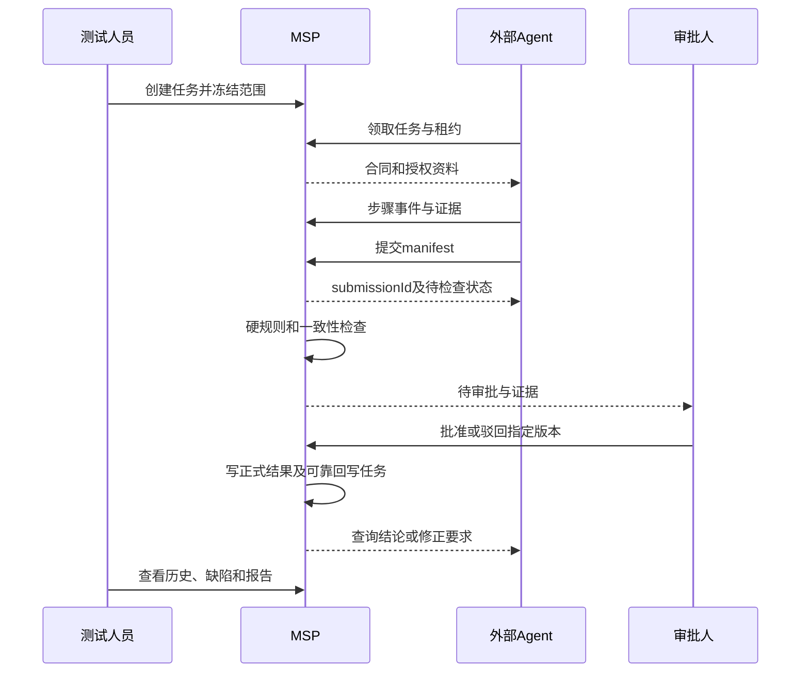

# MSP 综合改造实施方案

版本：v1.1 评审修订；日期：2026-09-23。

适用仓库：C:/SoftWare/JetBrains/metersphere。本文汇总本对话的需求、前期研究、模块评估和源码核对结果。本文为实施设计；2026-09-23 已在 v3.2 开始实施，首批为隔离验收环境与门禁策略配置。实际实现、验证与未完成项以 [实施追踪](msp-v3.2-implementation-progress.md) 为准，不能将本方案全部视为已交付。

开发分支约束（用户指定）：本次改造在 `v3.2` 分支实施，T0～T4 的代码、迁移、测试及交付文档均归属该分支。当前创建基线为 `89f0d2f0c8`，与创建时的 `metersphere/main` 一致；未合入当时 `upstream/main` 额外的 31 个提交。工作区已有未提交改动须保留并区分来源，不作为本次已实现功能的证据。

## 0. 阅读方式与结论

**本轮改造的中心目标：在 MSP 不接入大模型的情况下，形成“测试管理 → 外部 Agent 执行 → 证据存储 → 代码门禁 → 人工审批 → 正式执行记录、缺陷与报告”的完整链路。**

保留项目、计划、评审、用例、缺陷、资产的业务基础；把重复的 Agent 任务入口收敛成执行中心；接口测试与平台模型 API 执行预留扩展。采用现有工程的增量改造，不重新建设一个测试平台。

本文中的“现有”表示已读到源码或迁移文件；“新增/拟新增”表示本方案设计，不能理解为已经实现。未完成生产调用图审计的路径明确列为实施前检查任务。

阅读建议：负责人先看第 1～4、14～16 节；后端看第 5～10 节；前端看第 4、11 节；测试看第 12～13 节；上线负责人看第 14 节。

## 1. 目标基线：所有修改必须向这里收敛

### 1.1 用户已明确的八项需求

| ID | 基线需求 | 本轮交付边界 | 最终可观察结果 |
|---|---|---|---|
| R1 | 项目管理 | 项目、成员、权限、版本及必要环境配置复用并验证 | 任务、用例、资产、缺陷均有项目归属，不能跨项目越权 |
| R2 | 计划、评审、测试报告 | 保留主流程，增加冻结范围与验收状态 | 计划可组织测试；评审针对设计；报告解释结果范围与审批状态 |
| R3 | 用例管理、执行记录保存 | 分离用例定义与执行事实，统一结果查询 | 每次尝试、失败、驳回、补正和正式结果都可追溯 |
| R4 | 缺陷管理 | 保留缺陷流程，关联有效运行和验证 | 产品缺陷与门禁问题分开，关闭缺陷有验证依据 |
| R5 | 预留接口测试 | 保留能力边界、入口和历史，不扩大建设范围 | 功能状态清楚，已有接口测试不因改造被破坏 |
| R6 | 预留模型 API 的 AI 测试 | 保留可插拔执行通道与能力状态 | 当前不误报模型可用，未来复用任务及验收协议 |
| R7 | Agent 执行链路；MSP 审批、门禁、存储 | 当前重点：合同、领取、取证、提交、检查、审批、回写、反馈重测 | 外部 Agent 无需 MSP 模型即可完成任务，不能自己决定正式通过 |
| R8 | 文档、用例等测试资产 | 统一资产来源、版本与引用 | 业务文档关联用例，共享资产与工作用例不会无声分叉 |

### 1.2 必须保持的不变量

| ID | 不变量 | 必须落到哪里 |
|---|---|---|
| G01 | 无模型也能走通外部 Agent 主链路 | 创建任务、preflight、通道策略、前端表单 |
| G02 | 正式结果只能由受保护服务写入 | 计划/用例单条、批量、导入、同步、内部回写及 MCP |
| G03 | 必测范围由平台冻结，Agent 不能删减分母 | 执行合同、提交校验、报告聚合 |
| G04 | 上传成功、验收通过、审批批准和产品通过是不同事实 | DTO、状态机、数据库、页面、报告 |
| G05 | 执行不改写用例定义；历史不被新提交覆盖 | 用例服务、结果服务、快照、证据引用 |
| G06 | source=HUMAN 等请求字段不能改变认证主体和权限 | 认证上下文、MCP、HTTP、审计 |
| G07 | 未知、检查异常、过期授权和旧构建结果不能默认放行 | 门禁、回写、正式报告 |
| G08 | 所有失败和未采用记录仍可查询 | 原始运行/提交持久化、前端历史 |
| G09 | 一次修改有需求 ID、代码落点和验收证据 | 开发任务、PR、验收矩阵 |
| G10 | 菜单合并不删除业务历史或扩大权限 | 路由重定向、权限迁移、数据回归 |

### 1.3 本轮不做范围

- 不接入平台大模型，不建设 AI 语义审核服务，不增加模型网关或训练能力。
- 不扩建 API 测试引擎，不把当前模型 Runner 直接改名冒充独立脚本 Runner。
- 不大规模重写项目/用例/缺陷模块，不另建第二套用户、文件、通知或资产主数据。
- 不直接删除数据表、历史报告、证据和兼容 API；物理清理另案处理。
- 不承诺技术上绝对识别人或 AI，不声称哈希能证明现场真实执行。
- 不建设完整 CI/CD 发布平台。本轮提供可采用结果与可查询质量结论，发布集成为后续独立范围。

### 1.4 防止偏航的方法

每个开发任务必须填写“R 编号 → 用户动作 → 前端入口 → 接口 → Service/Mapper → 表/配置 → 测试 → 证据”。没有对应基线需求的改动先剥离到后续清单。

新增模型依赖、另起数据源、扩大跨项目共享或删除表均属于范围变化，需要单独说明收益、迁移与风险，不混入菜单调整。每阶段以可验证用户路径结束，不能只以代码量或接口数量验收。

## 2. 本对话结论如何收敛

| 前期观点 | 最终采用方式 |
|---|---|
| 提示词不足以形成门禁 | 采用。权限、状态和出口由服务端控制 |
| 独立 AI 审核 | 暂缓；当前代码规则加人工复核 |
| 哈希证明可信证据 | 修正为字节一致性检查；来源可信度另记 |
| Session 代表人、Token 代表 AI | 修正为认证主体与执行方式分别记录，不能据此绝对判断操作者 |
| ACCEPTED 可直接 CI 放行 | 修正。结果可采用不等于产品通过；CI 不纳入本轮完整建设 |
| 只守住 TestPlanFunctionalCaseService.run | 修正。纳入计划外、批量、用例编辑、同步与导入 |
| 缺证据拒绝一切保存 | 修正。保存原始事实和提交，限制正式采用 |
| 95 项功能精简 | 采用职责与入口收敛，不把全部功能重写一遍 |
| 未接模型仍保留 Agent 链路 | 采用外部 MCP Agent 通道；不得强制要求平台模型配置 |

依据文档：[最初控制方案](./ai-testing-quality-gates-code-control-solution.md)、[MSP 实现草案](./ai-testing-quality-gates-msp-implementation.md)、[研究与实践指南](./ai-quality-gates-research-and-practical-guide.md)、[全板块评估](./msp-module-purpose-and-redundancy-review.md)、[八项需求基线](./msp-product-scope-baseline.md)、[95 项处置表](./msp-module-function-disposition-table.md)。这些文件作为历史依据；相互冲突处以用户最新八项需求和本文明确的修正为准。本文新增默认决策仍属于建议。

## 3. 默认设计决策

为使方案能实施，先选择一组明确默认值；它们不是已获用户逐项确认的事实。

1. **首期所有外部 Agent 提交需人工批准。** 硬门禁先检查，人工不能覆盖身份非法、证据损坏、版本不符等底线；自动审批后置。
2. **一期按整次任务的一版提交审批。** 暂不支持一版中部分用例被批准。原提交未批准时，可以在同一 execution 内补传原始材料形成新 submission；如需重新执行业务，则整任务重测。只有原提交已批准且正式结果已生成，才允许局部重测并继承合法结果。控制任务规模避免大包阻塞，报告必须保持整体范围完整。
3. **用例评审是执行前设计评审。** 复用已有评审能力，不新增一套计划审批工作流。结果审批独立保存。
4. **支持计划内和计划外任务。** 计划外结果归属项目/用例，不自动成为所有关联计划的正式结果。
5. **执行方式来自可信任务上下文。** 人工入口记录 MANUAL_ATTESTED，外部 Agent 记录 EXTERNAL_AGENT；真实认证用户、代理 client 和发起人分别保存。
6. **受保护计划按范围控制，不只按 AI 身份控制。** 受保护范围的人工作业也需要合法结果来源；普通历史人工录入可继续保存为未验证结果，不能充当当前受保护计划的正式通过。
7. **结果选择采用用例级生效版本。** selectionGeneration 按项目、计划（或计划外范围）、构建、环境、用例管理；创建任务不递增，显式激活时原子更新该任务涉及的用例。互不相交任务互不影响，重叠用例以后激活者为准。取消不自动恢复旧结果；旧任务晚到只保存历史。完整算法见 6.5。
8. **首期资产聚焦文档与用例。** 跨项目共享维持现有授权，不扩大开放范围；Page Object、业务流按实际消费者启用。

## 4. 模块与页面改造范围

### 4.1 模块处置

| 模块 | 保留 | 本轮改造 | 暂缓/移除入口 |
|---|---|---|---|
| 项目 | 项目、成员、权限、版本、环境 | 环境统一引用、质量策略与角色配置 | 不另建 AI 项目体系 |
| 计划/评审/报告 | 现有主流程 | 计划范围快照、当前运行、审批统计、报告结果引用 | 功能报告重复主入口合并 |
| 用例 | 分类、维护、导入导出、版本、回收站 | 定义与执行分离、统一历史、阻止编辑绕过结果守卫 | 生成页重复文档维护收敛 |
| 缺陷 | 原缺陷状态机 | 运行证据关联、修复验证依据 | 资产缺陷独立标签移除 |
| 执行中心 | 现有自动化任务页与详情 | 合同、提交、审批、反馈、重测、统一查询 | Agent 队列重复列表和第二主详情入口收敛 |
| 资产 | 文档、用例、数据及版本引用 | 唯一数据来源、详情追溯、证据只读引用 | 环境/缺陷重复主标签移除 |
| 接入设置 | Token、MCP、必要执行资源 | 能力状态、最小权限、工具契约、审计 | 拆掉能力与授权混合页 |
| 模型与 API | 已有实现与历史 | 标明预留与真实可用状态 | 普通用户不显示未启用模型操作 |

### 4.2 目标页面与交互

| 页面 | 用户操作 | 数据/接口依赖 | 必须可见状态 |
|---|---|---|---|
| 计划详情 | 选用例、环境和构建，创建外部任务 | 现有计划 API；新 external-task 创建入口 | 可执行/缺配置/无权限/未评审提醒 |
| 执行列表 | 搜索、看运行与审批、取消 | 复用 task/search，扩展状态字段 | 运行、验收、审批、产品、回写分别显示 |
| 执行详情 | 步骤时间线、证据、提交版本、反馈、重测 | 现有事件/artifact；新质量 API | 上传缺口、逐规则结论、失败原因和可操作下一步 |
| 待审批 | 查看预期与实际、批准/驳回 | 新 approval 查询/命令 | 内容版本、证据定位、审批冲突、无审批资格 |
| 用例历史 | 比较多次运行和正式采用情况 | 统一结果查询 API | 来源、构建、结果、审批和未验证标识 |
| 测试报告 | 生成快照、查看范围和缺口 | 改造报告聚合服务 | 通过、失败、阻塞、未执行、待审批及历史来源 |
| 文档/用例资产 | 维护源文档、发布版本、引用 | 复用 TestAssetController | 源版本、引用关系、删除受限原因 |
| 项目质量策略 | 编辑草稿、发布固定规则版本 | 新 policy API | 当前版本、变更影响、发布权限 |
| 外部接入 | 创建/撤销 Token、看工具权限 | 现有个人 Token 和 MCP 接口 | 配置就绪、连通健康、项目允许、主体有权分别表达 |

全部页面覆盖 loading、empty、success、validation-error、permission-denied、network-error、server-error。错误展示中文业务说明和 traceId，不展示堆栈。批准按钮需理由/确认内容版本，不由前端猜测门禁状态。

## 5. 领域模型、状态与核心流程

### 5.1 标识与数据归属

复用 taskId 表示测试任务，executionId 表示一次逻辑执行尝试；lease 表示该尝试的一段执行授权。创建任务时冻结任务范围和合同模板，不预先生成 executionId；首次领取时原子生成 executionId、首次 lease 和 execution 合同快照。业务重测一期创建新 task，首次领取时产生新 executionId，并关联原提交。暂停恢复沿用 executionId、合同和 generation，但签发新 lease，不重放已完成业务动作。

现有 AgentTaskClaimService/AgentRunnerService 在领取时生成 executionId；AgentExecutionCheckpointService 恢复会清空 current_execution_id。实施时必须调整恢复与领取分支：仅合法 RESUME 状态复用已有尝试，校验 checkpoint、合同和预检兼容性，旧 lease 永久关闭，新 lease 轮换凭据；事件幂等绑定 executionId，写权限同时校验当前 lease。恢复预检如发现构建、环境或合同内容变化，拒绝恢复并引导创建新重测任务。历史 checkpoint 保留原语义；无法可靠关联的存量记录只读，不强行合并 execution。

计划 snapshot 固定用例范围/版本；execution_contract 固定本次执行的步骤、断言、工具许可、证据策略、环境与构建。submissionId 固定一版材料，decisionId 固定一次规则裁决，approvalId 固定人工决定，resultId 固定正式执行事实。

源码已有 ai_execution_task.execution_contract 及 hash 的构建逻辑。应扩充它而非另建平行任务系统；合同历史另存不可变记录以防重试覆盖。运行状态映射必须保留 WAITING_HUMAN/WAITING_LOGIN 等暂停子状态，不能将其误映射成完成或失败。

### 5.2 状态拆分

| 维度 | 新协议建议枚举 | 状态归属 |
|---|---|---|
| 运行 | CREATED / CLAIMED / RUNNING / COMPLETED / FAILED / CANCELED | 兼容映射现有运行状态，COMPLETED 仅表示执行结束 |
| 提交 | DRAFT / SEALED | SEALED 内容不可修改 |
| 检查任务 | PENDING / RUNNING / SUCCEEDED / ERROR | 超时或存储错误为 ERROR，不等于规则失败 |
| 门禁 | NOT_EVALUATED / PASS / FAIL / REVIEW_REQUIRED | 结构/来源失败为 FAIL；需人工语义确认进入 REVIEW_REQUIRED |
| 审批 | PENDING / APPROVED / REJECTED / REVOKED | 首期 PASS 也要人工批准；REVIEW_REQUIRED 可补充逐项人工判定 |
| 回写 | PENDING / APPLYING / APPLIED / RETRYABLE_ERROR / STALE | STALE 保存历史，不覆盖当前选择 |
| 产品 | PASSED / FAILED / BLOCKED / SKIPPED / NOT_RUN | 新 API 规范化，adapter 映射旧 SUCCESS/ERROR 等实际枚举 |

确定性产品断言失败，应记录产品 FAILED；只要执行证据支持该失败，门禁仍可 PASS。缺少全部执行项可以形成诚实的阻塞记录，但不能满足执行覆盖。人工批准不得把失败断言改写为产品成功。

### 5.3 可采用条件

```text
可采用 = 项目/合同/构建/环境/提交摘要匹配
      AND 检查任务成功
      AND 无硬规则失败
      AND 所有必需语义项已有合法人工结论
      AND 当前提交审批为 APPROVED 且未撤销
      AND 执行身份和证据引用有效
```

当前结果投影还必须满足 selectionGeneration。报告中“产品通过”还必须满足实际执行覆盖和产品断言；不把“可采用”直接当作通过。

### 5.4 完整链路



## 6. 后端代码改造清单

路径简称：AG=backend/services/agent-integration/src/main/java/io/metersphere/agent；PL=backend/services/test-plan/src/main/java/io/metersphere/plan；FC=backend/services/case-management/src/main/java/io/metersphere/functional；SDK=backend/framework/sdk/src/main/java/io/metersphere/sdk；DM=backend/framework/domain。以下简称均相对仓库根目录。

### 6.1 现有函数：逐项变更

| ID | 已核对文件/函数 | 当前行为或风险 | 具体改法 |
|---|---|---|---|
| BE01 | AG/service/AgentExecutionService.create、createPersonalMcp | 分平台/个人 MCP 创建通道；非个人路径绑定模型 | 新增 createExternalTaskForUser；登录用户可授权创建外部任务，不能简单伪造个人 Token 上下文。公共 createInternal 复用范围冻结，按通道校验依赖 |
| BE02 | AgentExecutionService.resolve | 存在任务范围解析 | 外部通道默认明确选择用例 ID/版本；自然语言模型解析无能力时返回明确不可用，不凭空解析成功 |
| BE03 | AgentExecutionService 中 buildExecutionContract | 冻结合同、生成 hash | 加 contractSchemaVersion、buildDigest、policyVersion、caseVersion、assertions、evidencePolicy、caseGenerationMap；按创建模板、激活范围、首次领取冻结 execution 合同的时序处理；对 canonical JSON 计算摘要 |
| BE04 | AgentExecutionChannelPolicy.assertCreatePair/assertClaimable/assertControllable | 约束来源与通道 | 新增 PROJECT_EXTERNAL 来源与 EXTERNAL_MCP_AGENT 合法配对；主体归属、任务指定客户端、租约控制均校验 |
| BE05 | AgentTaskController.claim/claimTask/context/events/complete | 外部任务/租约协议 | context 返回冻结合同而非最新可变对象；complete 只完成运行，不批准、不正式回写 |
| BE06 | AgentRunnerService.reportEvents/updateTaskState/completeLease/requireActiveLease | 运行事件与结束 | 事件幂等键绑定 executionId；结束后生成待提交/待检查流程；隔离结束租约与补传授权，不能允许任意过期租约写入 |
| BE07 | AgentExecutionStepResultService.submit | 已有步骤结果提交 | 验证合同 stepId、attempt/executionId、序号、重复键内容一致；sealed 后禁止原位改写，事实修正追加新版本 |
| BE08 | AgentExecutionArtifactService.prepare/uploadPrepared/commit/upload | 上传 token、哈希、artifact | 校验 executionId/stepId/主体/大小/类型；文件完成后才可冻结引用；服务端重算哈希；同内容跨运行不能自动复用来源 |
| BE09 | AgentExecutionArtifactService.cleanupExpiredArtifacts/download | 清理与读取 | 清理跳过有效 submission/result/report 引用及 hold；下载验证项目与证据可见性，URL 不替代授权 |
| BE10 | AgentFunctionalCaseSubmitService.submit/submitInPlan/submitOutOfPlan | 直接写计划或用例，再同步 | 从“结果写入器”改为兼容接收适配器；只有带 task/execution/contract 的请求可转新提交；无合同返回迁移错误或保存明确未验证导入，绝不正式采用 |
| BE11 | AgentFunctionalCaseSubmitService.updateFunctionalCaseStatus/normalizeSteps | 更新状态，可能规范化写步骤 | 正式路径移除直接更新；用例步骤定义由用例编辑服务维护，执行步骤只存运行/结果快照 |
| BE12 | AgentBatchSubmitService.batchSubmit | 批量旧提交 | 逐项转适配器，返回 submissionId/接收状态；统一批次键和逐项键，不能批量绕过或吞错 |
| BE13 | AgentExecutionWritebackService.writeback | 遍历逐用例回写 | 只由批准后的 outbox 调用；输入改为 submissionId/decisionId，不根据 task.status 推断批准 |
| BE14 | AgentExecutionCaseWritebackService.writeback/markFailed | 直接调用计划 run | 调用受保护结果写服务；同一结果重试只修回写，不重新运行测试；STale 与业务失败分开 |
| BE15 | PL/service/TestPlanFunctionalCaseService.run | 更新同一用例多计划、用例步骤、历史及附件通知 | 改为受保护 facade：验证结果引用，按选定计划/构建写 projection；历史保存 immutable steps，停止写回 functional_case_blob.steps |
| BE16 | 同文件 batchRun/handleBatchRun | 独立批量更新路径 | 路由到相同结果命令；每条目标鉴权/版本校验，明确批次部分成功语义，不直接 Mapper 批量改通过 |
| BE17 | 同文件 updateFunctionalCaseStatus/buildHistory/getCaseExecHistory | 写用例状态与历史 | update 只刷新最近执行摘要；history 增加 result/submission/actor/build 字段；历史查询按统一结果来源补齐计划外记录 |
| BE18 | FC/service/FunctionalCaseService.updateFunctionalCase/batchEditFunctionalCase | 编辑可修改 lastExecuteResult 并同步 | 保护范围禁止在编辑 DTO 携带执行状态变更；另走结果录入命令。非保护历史导入标为未验证，不能自动提升资格 |
| BE19 | 同文件 syncAssociatedPlanCaseExec | 将状态传播到关联计划 | 降为兼容摘要同步；正式计划结果改读 projection，不把一个构建的结果当所有计划结果 |
| BE20 | 同文件 saveImportData/updateImportData | 导入可能带执行字段 | 逐项审计字段映射，历史状态记录来源 LEGACY/IMPORTED_UNVERIFIED；拒绝导入为当前受保护计划的已批准结果 |
| BE21 | PL/service/TestPlanReportService.genReportByManual/genReportByAuto/genReportByExecution/genReport/preGenReport | 生成多类计划报告 | 统一调用拟新增 ResultSnapshotQuery，固定 resultIds 和缺口统计；正式/诊断报告明确区别；禁止回读可变 lastExecResult 充当验收依据 |
| BE22 | AG/controller/TestAssetController.publish/documents/versions/relations/governSource | 资产目录、版本和来源治理 | publish 创建固定版本并校验源权限；来源补记不改变证据信任等级；文档与用例主对象引用一致 |
| BE23 | AG/security/AgentTokenFilter、AgentTokenContext、AgentScopeAssert、AgentTokenProjectAccess | 现有认证及 scope/project 检查 | 构建不可由 body 覆盖的 ExecutionActor；新增质量权限；执行者没有审批/规则发布权；服务端多入口共享 |
| BE24 | AgentExecutionPreflightService.preflight/validateForCreate/consume/frozenSnapshotSection | 已有预检和快照消费 | 按通道分支：外部执行必须有范围/环境/权限，不要求模型、Prompt 或平台 Runner；consume 用 CAS 防重复消费，允许幂等返回同一 task |
| BE25 | AG/service/TestAssetCatalogService.publishAsset/resolveContext/deprecateVersion | 已有资产发布及版本上下文 | 合同仅解析指定已授权版本；版本废弃不能删除历史快照；任务不悄悄升级至最新版 |
| BE26 | AG/service/TestAssetGovernanceService.governSource/recordTrustedSource | 人工补记与可信来源记录 | 人工补记仅追加依据；可信标记只由内部可信调用产生，不能从通用编辑 DTO 赋值 |
| BE27 | AG/service/AgentBugWriteService.createDraft/transition/update/relateCase | Agent 缺陷草稿、修改与流转 | createDraft 关联 result/submission；transition 经统一工作流检查修复验证引用；update 不允许绕过流转接口直接改关闭状态 |
| BE28 | backend/services/bug-management/.../BugWorkflowRuntimeService.transition、BugWorkflowBatchService.execute | 已有统一单条/批量流转 | 受保护项目的验证/关闭类转换检查验收结果及修复构建，按工作流转换元数据识别，不硬编码中文状态名称 |
| BE29 | 同模块 BugWorkflowRuntimeService.recordTrustedThirdPartySync | 外部状态同步有独立记录路径 | 外部状态保留 provenance，未有验证依据时不能自动获得 MSP 的已验证标签；避免外部同步绕过验证规则 |
| BE30 | AgentExecutionCheckpointService.resume/resumeAfterHuman、AgentTaskClaimService 及 AgentRunnerService 领取分支 | 恢复会清空 current_execution_id，重新领取生成新尝试 | 按 5.1 区分暂停恢复与业务重测；恢复复用 execution 并轮换 lease，拒绝不兼容预检；保留旧记录并增加跨 lease 证据验收 |

BE12 的函数名经 Controller 调用确认，其完整内部事务及批次幂等需要实现前读全。BE20 不表示所有导入都已证实存在绕过，要求按实际 DTO/Mapper 排查并测试。

### 6.2 新增类与职责（拟新增）

| 类/方法 | 位置建议 | 明确职责 |
|---|---|---|
| ExecutionActorResolver.resolve | SDK 契约、认证模块实现 | 主体/代理/发起人/执行方式，默认缺身份拒绝 |
| ExecutionAcceptanceVerifier.verifyForWrite | SDK 接口 | 校验裁决、批准、撤销、绑定字段，返回已验收结果引用 |
| DatabaseExecutionAcceptanceVerifier | AG/quality | 只依赖质量 Repository 和权限，不依赖计划服务，避免 Spring 循环 |
| ExecutionContractService.freeze/getSnapshot | AG/quality | 固定计划、版本、环境、构建与规则；复用 task 合同 |
| QualityPolicyService.createDraft/publish | AG/quality | 校验规则配置，发布后不可变，不支持任意脚本执行 |
| QualitySubmissionService.seal/get | AG/quality | 校验身份、幂等、文件 commit 状态，锁定提交和引用 |
| QualityRuleEngine.evaluate | AG/quality | 确定性逐规则结果；不调用模型，不修改预期 |
| QualityDecisionService.evaluate/appendDecision | AG/quality | 聚合规则、生成 feedback、追加裁决，不修改旧结论 |
| QualityApprovalService.approve/reject/revoke | AG/quality | 版本 CAS、角色、自审禁止、逐语义项结论、批准事件 |
| AcceptedExecutionWriter.record | 建议 SDK 接口，业务模块实现 | 校验后写统一结果事实；计划投影由 plan 实现处理 |
| QualityWritebackWorker.process | AG/quality | 消费 outbox、幂等调用 adapter、重试/死信 |
| ExecutionResultQuery.page/get | 共享查询契约及业务实现 | 按项目、计划、构建、用例查历史与当前投影 |
| ExecutionRetestService.create | AG/quality | 计算失败步骤依赖闭包，创建新 execution；关联父提交 |
| ExecutionCapabilityService.get | AG/service | 返回 enabled/configured/healthy/authorized/projectAllowed/reasons |

agent-integration 已依赖 test-plan，禁止 test-plan 反向依赖 agent-integration。公共接口放现有 SDK，质量校验实现通过 DI 装配；必须提供唯一实现，缺失时启动检查失败或受保护写入失败，不能默认通过。校验实现不注入 writer，writer 不注入高层 orchestrator，避免运行时循环。

### 6.3 事务、并发与可靠回写

提交事务：锁 task/execution → 核对合同/主体 → 查幂等键 → 固定 manifest 和证据引用 → 写检查事件。相同键相同摘要返回原 submission；相同键不同摘要返回冲突。

审批事务：锁提交/当前裁决 → 校验 expectedVersion 与 evidence/decision 摘要 → 校验审批人 → 追加审批 → 更新 currentApproval 指针 → 写 outbox。审批不能调用远端执行器或重新操作业务。

回写事务：按稳定顺序锁批准状态及目标 projection → 验证批准未撤销 → 幂等创建 result 和历史 → CAS 更新选中运行的 projection → 更新 outbox。按用例分事务，整任务回写可部分完成，页面展示 PARTIAL/PENDING 统计，正式整任务报告要说明缺口。

新重测任务激活后若批准老版本：保存历史，但不覆盖相应用例 selectionGeneration 更新后的当前结果。撤销与回写使用相同锁顺序，撤销后标记 result 不再可采用，重建 projection；历史不删除，已发布报告追加失效提示/新修订，而不是无声改数字。

通知、报表刷新、缺陷建议等副作用由 outbox 驱动，不能“状态写成功但消息丢失”后靠重跑测试补救。使用数据库唯一约束实现至多一次事实记录，消费者按至少一次投递设计；不宣称消息天然 exactly-once。

### 6.4 复检、审批失效与继承传播

- checks:retry 接受后，在同一事务内 CAS 创建新 decision revision 并切换 current_decision_id；从 PENDING 起暂停该提交及其派生结果的可采用资格。旧批准只对旧 decision 有效，不自动继承至新 decision。
- 新检查为 PASS/REVIEW_REQUIRED 时仍须重新人工审批；FAIL/ERROR 保持不可采用，不回退旧 PASS。批准接口和 writer 必须校验审批绑定当前 decisionId/revision，而非仅检查存在 APPROVED。
- 复检发起、审批、回写、撤销共享锁顺序：submission → decision/approval → 按稳定键排序的 projection。复检先完成则旧版本批准/回写冲突；回写先完成则复检暂停其资格并追加影响事件，历史事实不删除。
- 继承关系持久化到 execution_result_dependency。seal 时校验无环，继承只能引用已存在且可采用的结果；后续写入再次校验。支持 A→B→C 的依赖追溯，禁止只检查直接父节点。
- 源结果撤销或复检开始后，所有传递依赖均立即不具备采用资格。正式查询、writer、报告发布和缺陷验证同步检查依赖链有效性；outbox 异步更新投影、失效提示和通知，不能把异步任务尚未消费当作继续有效的理由。
- 源结果重新获批不自动复活历史派生批准；派生提交需按当前有效依据重新检查、审批。已发布报告保留原数字和发布时快照，同时返回明确失效状态及影响原因。

### 6.5 用例级结果选择与激活

scope_key 的规范化维度固定为 projectId、planId（计划外使用固定标识）、buildDigest、environmentId；caseId 作为独立唯一键字段。合同保存每个 caseSnapshotId 对应的 generation 映射；task 上的单个 selection_generation 不作为整个任务的权威版本。

创建任务仅准备冻结范围；授权用户调用 activate 后，按稳定顺序锁全部涉及的 projection 行，对这些用例逐个递增 generation、设置 selected_task_id 并清空 current_result_id。整个范围激活原子提交。幂等重试返回同一次激活结果，不重复递增；未激活任务不可领取。缺失行通过唯一约束和事务重试建立。

互不相交的任务可并行；重叠用例以最后成功激活的任务为准，旧任务其他未重叠用例仍可正常采用。局部重测保持原合同完整范围，新执行项和继承项都属于新任务激活范围，因此需要在 UI 明示将替换的全部用例，并重新验证继承项。

取消新任务保留本轮 generation 和空结果，报告显示取消/未执行缺口；禁止静默恢复旧成功。需要采用旧材料时必须显式创建引用合法旧结果的新提交并完成审批。报告以固定计划快照枚举全部用例，从各用例当前 projection 聚合；待审批、取消和缺失不得缩小分母。不同 scope 不相互覆盖。

## 7. HTTP 接口契约与兼容策略

以下路径用 /api 前缀表达，现有 Controller 同时支持无 /api 别名的需保持一致。新 API 复用项目真实响应 envelope，不在新模块自建第二种包装。实施前生成 OpenAPI/TS 类型契约并纳入 CI。

### 7.1 复用/修改的现有接口

| 路径 | 改动 | 返回/失败行为 |
|---|---|---|
| POST /api/ai/execution/task | 原平台任务创建保留 | 平台模型未就绪返回 MODEL_CHANNEL_UNAVAILABLE，不假装切换成功 |
| POST /api/ai/execution/task/search；GET /task/{id} | 扩展查询 DTO | 增加最新 submission、check/gate/approval/writeback 状态，避免列表 N+1 查询 |
| POST /api/agent/v1/tasks/claim；/{id}/claim | 扩展可领取 PROJECT_EXTERNAL | 返回已有租约和 executionId、contractId，204 无任务或沿用现有空队列协议 |
| GET /api/agent/v1/tasks/{id}/context | 返回冻结上下文 | 加 schemaVersion、contractHash、资料的授权引用；禁止返回凭据明文 |
| POST /api/agent/v1/tasks/leases/{leaseId}/events:batch | 加 execution 约束 | 每批固定幂等键，逐事件拒绝重复内容冲突 |
| POST /api/agent/v1/tasks/leases/{leaseId}/artifacts；/{artifactId}:upload | 复用上传 | 只有完整上传/commit 的文件可进入 SEALED 提交 |
| POST /api/agent/v1/tasks/leases/{leaseId}/complete | 只结束执行 | 文档明确不表示结果已验收或正式采用 |
| POST /api/agent/v1/functional/submit；/submit/batch | 兼容期转新提交 | 有合同上下文返回接收信息；无上下文返回 UPGRADE_REQUIRED，不回旧成功 |
| POST /test-plan/functional/case/run；/batch/run | 现有人工结果入口 | 新 UI 传结果录入上下文；后端受保护范围检查不能靠 source 绕过 |

最后一行路径来自前序 Controller 核对；实施时核对网关 /api 重写规则并更新前端 requrls，禁止凭记忆拼路径。

### 7.2 拟新增接口

| 方法/路径 | 核心入参 | 权限/职责 | 输出 |
|---|---|---|---|
| GET /api/execution/capabilities?projectId= | projectId | 项目读取 | 各通道启用、健康、授权和原因 |
| POST /api/ai/execution/external-task | projectId、planId?、caseVersionRefs、environmentId、buildDigest、idempotencyKey | 执行创建 | taskId、contractTemplateId、scopeSummary；executionId 首次领取时返回 |
| POST /api/ai/execution/tasks/{taskId}/activate | expectedVersion、idempotencyKey | 执行创建权限，项目范围校验 | 激活状态及 caseGenerationMap；重叠范围替换提示 |
| GET /api/quality/tasks/{taskId}/contract | executionId | 项目/任务读取 | 只读合同 |
| POST /api/quality/tasks/{taskId}/submissions | executionId、contractHash、idempotencyKey、manifest | 提交权限+租约/补传令牌 | 202，submissionId、checkStatus=PENDING、qualityUrl |
| GET /api/quality/submissions/{id} | 无 | 结果读取 | 摘要、全部状态、decisionVersion、反馈和允许动作 |
| GET /api/quality/submissions/{id}/rules | 分页、ruleStatus | 结果读取 | 规则、预期、实际、证据引用 |
| POST /api/quality/submissions/{id}/checks:retry | expectedDecisionVersion、reason | 复核/运维权限 | 仅重新分析同一不可变材料，不重执行业务 |
| GET /api/quality/approvals | projectId、status、分页 | 审批读取 | 待处理及历史审批 |
| POST /api/quality/submissions/{id}/approvals | decisionVersion、expectedVersion、action、reason、semanticFindings | QUALITY_APPROVE | approvalId、新 version；并发变更 409 |
| POST /api/quality/submissions/{id}/revocations | expectedVersion、reason | QUALITY_REVOKE | 追加撤销及 projection 修正任务 |
| POST /api/quality/submissions/{id}/retests | reason、requestedScope | 执行重测 | 服务端计算后的实际范围、新 execution/task |
| GET /api/execution/results | projectId、caseId/planId、buildDigest、分页 | 用例/计划读取 | 全部尝试与已采用结果，含未验证历史 |
| POST /api/execution/manual-results | projectId、caseId、计划/构建、步骤与证据 | 人工执行权限 | 经共同结果服务保存，受保护范围遵循审批策略 |
| GET/POST /api/quality/policies | projectId；规则配置 | READ/MANAGE 分权 | 策略草稿与版本 |
| GET /api/quality/policy-schema | projectId、schemaVersion? | QUALITY_READ | JSON Schema、操作符白名单、不可修改规则及参数边界 |
| PUT /api/quality/policies/{id}/draft | expectedVersion、rulesJson | POLICY_MANAGE，仅草稿可写 | 草稿及新 version；冲突 409 |
| POST /api/quality/policies/validate | projectId、rulesJson | POLICY_MANAGE，只校验不发布 | valid、字段 JSON Pointer、中文错误说明、规范化摘要 |
| POST /api/quality/policies/{id}/simulate | expectedVersion、sampleSubmissionId | POLICY_MANAGE 且有样本读取权限 | 规则差异与预计影响；不改正式裁决和采用资格 |
| POST /api/quality/policies/{id}/publish | expectedVersion、changeReason | POLICY_PUBLISH | 不可变 policyVersionId |

文档、用例、缺陷、项目原 API 不重命名。菜单移动不要求后端 URL 同步改名。仅在旧 API 语义改变时通过契约版本和客户端升级明确过渡。

### 7.3 提交示例（拟议 schema）

```json
{
  "schemaVersion": "quality-submission.v1",
  "executionId": "EX-001",
  "contractHash": "服务端合同摘要",
  "idempotencyKey": "task-001-ex-001-submit-1",
  "parentSubmissionId": null,
  "cases": [{
    "caseSnapshotId": "CS-001",
    "steps": [{
      "stepId": "S-001",
      "eventIds": ["EVENT-001"],
      "observedStatus": "PASSED",
      "assertions": [{
        "assertionId": "ASSERT-001",
        "actual": {"orderId": "ORDER-123"},
        "evidenceRefs": [{"artifactId": "ART-001", "role": "AFTER_ACTION"}]
      }]
    }]
  }]
}
```

预期值来自合同，不能以提交里的 expected 替换。服务端自行计算 productResult。例中 observedStatus 仅为执行者观察，不是权威产品结论。规范要求 additionalProperties=false 或明确扩展区；步骤 ID 重复、未知断言、超大嵌套、非法枚举、未提交文件一律拒绝。

错误体延续统一结构：{code,message,details?,traceId?}。400 格式错误、401/403 身份权限、404 按项目策略屏蔽对象、409 版本/幂等冲突、413 文件过大。异步规则 FAIL 通过查询正常返回，不伪装 HTTP 500。内部异常对用户只给可理解信息，日志保留堆栈并按 traceId 关联。

## 8. MCP、身份和信任边界

### 8.1 两套 MCP 实现都必须更新

仓库同时存在 Java 远程 MCP 工具和 metersphere-mcp TypeScript 薄封装。只改其中之一会留下旧直接写入口或客户端无法读取新状态。

| 位置 | 具体变动 |
|---|---|
| AG/tool/BuiltinAgentMcpToolConfig.java | 修改 metersphere.functional.submit、submit.batch 描述和结果；新增质量查询/提交/重测工具 |
| AG/tool/AgentMcpToolSchemas.java | 新增严格 input/output schema，版本化；不接受 approvalStatus/source 作为可写权限字段 |
| AG/tool/AgentMcpToolRegistry.java | 工具 scope 与项目能力过滤；调用时仍独立鉴权，不能只过滤 tools/list |
| metersphere-mcp/src/tools/submitFunctionalResult.ts、submitFunctionalResultsBatch.ts | 返回 submissionId 与 pending 状态，不再将 HTTP 成功解释为正式通过 |
| metersphere-mcp/src/client.ts、src/index.ts | 注册新工具、传递幂等键和 traceId、统一错误映射 |
| metersphere-mcp/src/tools/qualitySubmission.ts（拟新增） | 提交/查询/反馈/重测薄适配，不本地计算最终验收 |
| scripts/pack-metersphere-mcp.ps1、后端 resources/mcp 包 | 测试后重新打包并更新版本清单，避免运行仍下载旧 ZIP |

建议新工具名：metersphere.quality.submit、metersphere.quality.get、metersphere.quality.feedback、metersphere.quality.retest。审批/策略发布不向执行 Agent 暴露；不要创建 markAccepted 工具。

### 8.2 权限矩阵

| 动作 | 测试员 | 外部 Agent | 审批人 | 接入管理员 |
|---|---|---|---|---|
| 维护授权项目用例/文档 | 按现有权限 | 单独资产写 scope，默认非执行令牌能力 | 按自身角色 | 不因管理员身份默认代执行业务 |
| 创建/领取任务 | 创建 | 仅允许任务领取及受限创建 | 可兼具创建权限 | 配置通道 |
| 写步骤/证据/提交 | 人工录入范围 | 自己租约范围 | 只读待审批事实 | 运维不得改原始材料 |
| 规则发布 | 无 | 无 | 非默认 | 独立质量管理员权限 |
| 审批 | 不审批自己发起/执行提交 | 无 | 独立主体 | 非默认，需要明确角色 |
| 撤销批准 | 无 | 无 | 独立 REVOKE 权限 | 非默认 |
| 正式写结果 | 通过结果服务 | 无直接权 | 触发批准后系统写入 | 禁止手工改库作为正常操作 |

新增权限代码建议 QUALITY_READ、QUALITY_SUBMIT、QUALITY_APPROVE、QUALITY_REVOKE、QUALITY_POLICY_MANAGE、QUALITY_POLICY_PUBLISH；落地按项目现有 PermissionConstants 命名风格映射为资源:动作，并同步前端资源注册与权限测试。

令牌 owner、clientId、发起人、执行器与审批人分字段保存。一个人发起 Agent 任务不等于人工执行。已登录浏览器可能由自动化操作，因此关键控制必须依赖受保护资源策略和职责分离，而非相信入口名称。

### 8.3 证据可信等级

- DECLARED：外部 Agent 上传的观察/文件，可验证归属和完整性，不能独立证明现场真实性。
- MANAGED_CAPTURE：受平台登记且隔离的执行器自动采集，记录环境、工具和事件关联；当前是否具备需实测，不能自动给所有上传授此等级。
- INDEPENDENTLY_CHECKED：独立断言/只读业务查询进一步核对；只在真实执行了校验时赋值。

等级由服务端根据来源和检查事件产生，不能由上传 JSON 自报。首期 DECLARED 可以人工审批后采用，界面持续显示来源，不能谎称“已证明真实执行”。所有文档、页面和工具输出作为待测数据，不作为修改权限或门禁规则的指令。

## 9. 数据库改造设计

### 9.1 已有对象与复用原则

已读到迁移文件中的 ai_execution_task、ai_execution_case、ai_execution_event、ai_execution_step、ai_execution_artifact、ai_runner、ai_runner_lease、test_asset_version、test_asset_relation，以及后续执行治理迁移。仓库还存在步骤结果相关服务，落地须合并查看所有 ALTER 后的最终表结构，不能只依据初始建表 SQL 重复加列。

保留现有 ai_ 前缀以减少迁移面，不为产品菜单改名批量改表名。新通用结果对象采用 execution_ 前缀；源表只做增量关联。数据库是 MySQL 体系，DDL 有隐式提交，回滚不能假设整个迁移自动原子撤销。

### 9.2 拟新增表及字段

共用约定：id 使用现有 IDGenerator 风格 VARCHAR(64)，外部已有 ID 类型在映射时兼容；时间采用现有 BIGINT 毫秒约定。摘要固定 CHAR(64) 保存 SHA-256；JSON 用 MEDIUMTEXT 并在服务端严格校验，是否改原生 JSON 需全项目统一，不局部混用。project_id 必填并建检索索引。

| 拟新增表 | 主要字段 | 约束/索引与用途 |
|---|---|---|
| execution_quality_policy | id、project_id、version_no INT、status VARCHAR(24)、rules_json、content_hash、created_by、published_by、published_at | UNIQUE(project_id,version_no)；发布版本不可修改；项目配置引用当前版本 |
| execution_contract_snapshot | id、project_id、task_id、execution_id、plan_snapshot_id?、environment_id、build_digest、policy_version_id、schema_version、snapshot_json（含 caseGenerationMap）、content_hash、compatibility_hash | UNIQUE(task_id,execution_id)；作为检查分母与重试历史 |
| execution_quality_submission | id、project_id、task_id、execution_id、contract_id、parent_id?、manifest_json、manifest_hash、idempotency_key、actor_id、client_id?、submit_status、current_decision_id?、current_approval_id?、row_version BIGINT、sealed_at | UNIQUE(project_id,task_id,execution_id,actor_id,idempotency_key)；sealed 内容只读；parent 索引 |
| execution_submission_evidence | submission_id、artifact_id、case_snapshot_id、step_id、assertion_id、role、artifact_hash | UNIQUE(submission_id,artifact_id,step_id,assertion_id,role)；字段非空或规范化哨兵，避免 MySQL NULL 破坏唯一性；artifact_id 反向索引 |
| execution_quality_decision | id、submission_id、revision INT、check_status、gate_status、policy_version_id、checker_version、input_hash、started_at、finished_at、error_code? | UNIQUE(submission_id,revision)；检查重试追加新 revision，不覆盖旧结论 |
| execution_quality_rule_result | id、decision_id、rule_id、case_snapshot_id、step_id、assertion_id、category、severity、status、expected_json、actual_json、evidence_refs、feedback_json | UNIQUE(decision_id,rule_id,case_snapshot_id,step_id,assertion_id)；全任务规则使用固定作用域值；反馈绑定规则，不一期额外建反馈状态机 |
| execution_quality_approval | id、submission_id、decision_id、revision、action、reviewer_id、reason、semantic_findings_json、content_hash、created_at、request_key | UNIQUE(submission_id,reviewer_id,request_key)；追加 APPROVE/REJECT/REVOKE，不改原记录 |
| execution_result | id、project_id、case_id、case_version_id、plan_id?、plan_case_id?、task_id?、execution_id、submission_id?、decision_id?、approval_id?、product_result、execution_source、trust_level、environment_id、build_digest、steps_json、actual_json、execution_time、recorded_time、eligibility | UNIQUE(submission_id,case_id) 用于有提交记录；历史导入另有非空 provenance_key UNIQUE；索引(project_id,case_id,execution_time) |
| execution_result_projection | id、project_id、scope_key、case_id、selected_task_id、selection_generation、current_result_id?、row_version | UNIQUE(project_id,scope_key,case_id)；scope_key 基于计划/构建/环境等规范化生成且保存原始维度，非 nullable 拼接 |
| execution_result_dependency | project_id、result_id、inherited_result_id、source_submission_id、source_decision_id、source_approval_id、source_content_hash | UNIQUE(result_id,inherited_result_id)；inherited_result_id 反向索引；事务校验同项目、兼容范围及无环，记录继承依据版本 |
| execution_quality_outbox | id、event_type、aggregate_id、aggregate_version、target_key、payload_json、status、attempts、next_retry_at、locked_until、last_error_code | UNIQUE(event_type,aggregate_id,aggregate_version,target_key)；索引(status,next_retry_at)；支持重试和人工重放 |
| test_plan_quality_snapshot | id、project_id、plan_id、build_digest、environment_id、scope_json、scope_hash、created_by、created_at | 每次正式测试范围一个版本；原计划修改不影响历史 |
| test_report_result_reference | report_id、result_id、submission_id?、approval_id?、eligibility_at_publish、scope_hash | UNIQUE(report_id,result_id)；固定报告输入，撤销后可定位受影响报告 |
| bug_execution_verification | id、project_id、bug_id、result_id、fix_build_digest、transition_history_id?、verification_status、created_by、created_at | UNIQUE(bug_id,result_id,fix_build_digest)；记录缺陷验证依据，result 撤销时可定位失效验证；已有等价关联结构时扩展复用 |

表数量服务于不可变事实与并发控制，不再为页面各造一张表。复用现有 outbox、计划/报告快照能力的前提是实施盘点证明其字段和事务语义等价；若等价应复用并记录映射，不能同时保留两套同义对象。

字段补充：contract snapshot 的 snapshot_json 保存 caseGenerationMap 和 compatibilityHash；submission 的 manifest 保存逐用例 inheritedResultId 及源裁决/批准摘要，封存时固定引用并为源证据建立保留关联；result 生成后在同一事务落 dependency 行。policy 增加 schema_version、row_version、change_reason，规则草稿更新用 CAS，发布时保存服务端规范化 JSON 和 content_hash。activation 的请求键、范围及 generation 映射必须持久化以支持幂等返回。上述关系和字段均为拟实施设计。

### 9.3 现有表增量

| 现有表/对象 | 建议变更 | 回填策略 |
|---|---|---|
| ai_execution_task | 当前 contract_id、latest_submission_id、activation 状态/版本、quality_mode；已有 build/执行字段先查终态 schema 再补 | 旧任务不自动产生批准，标记 LEGACY_UNVERIFIED |
| ai_execution_case | accepted_result_id 与当前回写状态关联 | 不把旧 result 直接回填为已批准 |
| ai_execution_artifact | 复用 execution_id/归属；缺失则补 producer_type、trust_level、capture_metadata、hold_until 等 | 历史默认 DECLARED/UNKNOWN；不伪造采集来源 |
| ai_execution_event、步骤结果表 | 事件唯一性纳入 executionId，审计原有 task sequence 兼容 | 先回填旧 executionId，再更换索引；不得直接丢旧唯一约束导致重复 |
| test_plan_case_execute_history | result_id、submission_id、actor_type、executor_principal、build_digest | 旧行标记 legacy，原显示值保留 |
| functional_case/test_plan_functional_case | 保留 last_* 兼容摘要，正式读取转 projection | 不全量重写历史状态；对照统计后切换 |
| 项目配置/权限资源表 | quality_mode、policyVersionId、权限资源与角色绑定 | 默认 OBSERVE；项目逐个切 ENFORCE，不自动给所有用户审批权 |

### 9.4 DDL 示意：只定义关键约束，不当作可直接生产执行的脚本

```sql
CREATE TABLE execution_quality_outbox (
  id VARCHAR(64) NOT NULL,
  event_type VARCHAR(40) NOT NULL,
  aggregate_id VARCHAR(64) NOT NULL,
  aggregate_version BIGINT NOT NULL,
  target_key VARCHAR(128) NOT NULL,
  payload_json MEDIUMTEXT NOT NULL,
  status VARCHAR(24) NOT NULL,
  attempts INT NOT NULL DEFAULT 0,
  next_retry_at BIGINT NOT NULL,
  locked_until BIGINT NULL,
  last_error_code VARCHAR(80) NULL,
  PRIMARY KEY (id),
  UNIQUE KEY uk_quality_event
    (event_type, aggregate_id, aggregate_version, target_key),
  KEY idx_quality_outbox_ready (status, next_retry_at)
) ENGINE=InnoDB DEFAULT CHARSET=utf8mb4;
```

新增迁移存 DM/src/main/resources/migration/<目标发布版本>/ddl。使用发布分支下一个可用序号，**不修改已经发布的 V3.7.2_*.sql，也不预先占用猜测编号**。上线前比对 flyway/schema history、实际列和索引，分“建表/可空列 → 回填 → 校验 → 强约束”执行。所有业务引用应通过外键或等价的事务校验与完整性扫描保证；选择与现有项目迁移规范一致的方式。

### 9.5 重测与材料复用的明确边界

传输重试：沿用 executionId 和原始文件，只补传字节；封存后内容修正产生新 submission。语义圈注修正作为派生证据，保留原图、转换版本和来源。

业务重测：创建新 task，首次领取时创建新 executionId。原提交未批准或所需源结果尚未生成时，一期必须整任务重测；不得引用尚不存在的 result，也不得把未批准材料伪装成合法继承。原提交已批准且源结果已落库后，才允许重跑受影响用例及前置依赖，并继承其余合法结果。依赖关系无法证明时，退回整任务重测。

继承 manifest 显式携带 inheritedResultId 及绑定摘要。兼容性不要求新旧 contractId/hash 相等，而比较服务端计算的 compatibilityHash：冻结用例范围/版本、步骤/断言、前置依赖、证据要求、环境、构建、策略版本；排除 taskId、executionId、generation 和创建时间。只有兼容内容一致、原结果及其传递依赖有效才可继承。构建、策略或环境变化时一期不跨版本继承。页面显示来源，证据保持原 execution 归属；同一用例不跨业务尝试拼步骤。暂停恢复属于同一 execution 下轮换 lease，按 5.1 处理。

整任务审批仍需覆盖合同中的全部用例：新执行结果加合法继承结果组成完整范围。新证据只引用新 execution，继承通过独立结果引用表达，避免把“禁止跨运行串图”和“允许合法结果复用”混淆。

## 10. 门禁规则、报告与业务一致性

### 10.1 一期规则目录

| 规则 ID | 检查 | 分类 | 失败行为 |
|---|---|---|---|
| Q-AUTH-01 | 主体、项目、任务、租约/补传授权匹配 | 身份硬约束 | 拒绝请求，不进入审批 |
| Q-CONTRACT-01 | 合同/构建/环境/策略版本一致 | 硬门禁 | FAIL，新合同需新执行上下文 |
| Q-SCOPE-01 | 必测用例/步骤/断言存在，无未知/重复 ID | 硬门禁 | FAIL，明确缺少项 |
| Q-EVIDENCE-01 | 必需 artifact 存在且 commit 完成 | 硬门禁 | 待上传时不 seal；冻结后异常 FAIL/ERROR 按原因区分 |
| Q-EVIDENCE-02 | 服务端哈希、归属、类型与大小符合 | 硬门禁 | FAIL；存储暂不可读为 ERROR |
| Q-ASSERT-01 | 用独立预期校验实际值 | 产品断言 | 生成产品 FAILED，不自动当材料不合格 |
| Q-CONSIST-01 | 自报结论与断言/证据一致 | 验收门禁 | 冲突 FAIL，禁止失败汇总成成功 |
| Q-COVERAGE-01 | 记录覆盖与实际执行覆盖分别统计 | 统计+发布条件 | 全 NOT_RUN 不计执行完成；允许诚实阻塞报告 |
| Q-SEMANTIC-01 | 图像/复杂语义不能确定性证明 | 人工项 | REVIEW_REQUIRED，逐项复核后批准或驳回 |
| Q-FRESH-01 | 当前投影的 generation 和批准有效 | 正式采用守卫 | 旧结果只存历史，撤销不再计正式采用 |

规则配置是声明式参数（例如必证类型、允许大小、断言操作符），不允许在规则页直接执行 Java/SQL/任意脚本。硬规则不被平均分或模型置信度抵消。

### 10.2 前端可配置门禁 JSON（一期纳入）

**可以在前端自行配置，但只有具备项目质量策略管理权限的用户可以编辑，具备发布权限的用户才可使版本生效。** 普通测试员按权限只读，执行 Agent 不具备策略写入和发布能力。前端是策略编辑入口，服务端是唯一校验和执行方；直接调用 HTTP 与页面操作采用相同权限和校验。

一期同时提供可视化表单和高级 JSON 编辑器，两者编辑同一草稿。切换模式不得丢失字段；JSON 语法错误时保持原文并阻止切换和发布。支持模板、导入/导出、字段提示、版本差异、保存草稿、样本试算和发布；不提供任意脚本编辑。导入仅填充草稿，不触发发布。

| 类型 | 可配置内容 | 服务端约束 |
|---|---|---|
| 证据要求 | 用例/步骤适用范围、必需证据类型、允许 MIME、大小上限 | 必须在服务器允许集合内；大小只能低于平台上限；不能关闭归属、commit 和完整性检查 |
| 产品断言 | 已支持的类型化操作符、容差、范围、必填值 | 白名单执行器；预期来自冻结用例/合同，提交者不能通过 JSON 替换预期；一期不支持脚本、表达式求值或远程 URL 回调 |
| 人工复核 | 平台硬要求之外的复核项目及说明 | 只能增加要求；外部 Agent 人工审批、自审禁止和语义项复核不可关闭 |
| 展示说明 | 策略名称、说明、规则提示 | 长度限制及输出转义；不允许注入 HTML 或系统指令 |
| 不可配置底线 | 主体/项目权限、范围完整性、版本绑定、证据真实性标识、撤销检查、结果写入守卫 | 不出现在可写 schema 中；即使绕过前端也由服务端拒绝；QUALITY_MODE 不属于规则 JSON |

下例仅展示拟议最小结构，不是已实现或可直接导入现有平台的配置：

```json
{
  "schemaVersion": "quality-policy.v1",
  "name": "外部 Agent 标准验收",
  "rules": [
    {
      "ruleId": "Q-EVIDENCE-01",
      "parameters": {
        "requiredRoles": ["AFTER_ACTION"],
        "allowedMimeTypes": ["image/png", "image/jpeg"],
        "maxArtifactBytes": 10485760
      }
    },
    {
      "ruleId": "Q-ASSERT-01",
      "parameters": {
        "allowedOperators": ["EQUALS", "IN_RANGE"],
        "expectedSource": "FROZEN_CONTRACT"
      }
    }
  ]
}
```

规则是否适用于某断言必须在合同冻结时确定；平台必需规则即使未在 JSON 列出也始终执行。服务端拒绝未知 schemaVersion、重复 ruleId、未知字段、非法枚举、越界值、不支持操作符以及超过大小/嵌套/规则数限制的配置。参数缩小后如与用例断言不兼容，冻结失败并返回具体定位，不跳过断言。数值边界和白名单由版本化 schema API 提供，前后端共享；发布时重新完整校验，不能信任前端的“校验通过”。

操作链路：项目质量策略 → 新建/复制草稿 → 表单或 JSON 编辑 → 服务端 validate → 使用授权样本 simulate → 查看版本差异及适用范围 → 填写原因并 publish。试算只返回诊断结果，不触发审批、回写、业务执行、通知或修改历史。无样本时明确显示“未试算”，不得伪造通过记录；是否必须试算由平台发布流程控制，不能由 JSON 自行关闭。

发布事务校验权限和 expectedVersion，冻结新版本并更新项目策略引用，记录操作者、前后摘要及原因。新版本仅影响之后创建的任务；已有任务、合同和已批准结果继续绑定原版本。需要切换已有任务时创建新任务并重新执行，不原位替换合同。回退通过复制历史内容发布新版本完成，禁止修改已发布版本。紧急安全失效通过单独的撤销/停用流程处理，不能靠改 JSON 静默追溯重算。

实现对应：新增前端 views/execution/quality-policy 页面及 PolicyForm/PolicyJsonEditor/PolicyVersionDiff，路由资源码绑定 QUALITY_POLICY_MANAGE/PUBLISH；复用 execution-quality API client 调用 7.2 的 schema/draft/validate/simulate/publish 接口；后端 QualityPolicyService 使用同一 schema 校验器和声明式规则引擎，写 execution_quality_policy。错误返回字段路径、中文说明及 traceId，覆盖无权限、网络失败、版本冲突和发布失败。

### 10.3 报告与缺陷

报告固定计划快照及 resultIds，列出应执行、实际执行、通过、失败、阻塞、未执行、待批准和回写未完成。重试成功不能抹去失败尝试，报告显示采用哪次、为何采用；构建未指定时不得生成“某构建已通过”结论。

缺陷仅由产品失败或人工确认触发，引用 result/evidence。门禁缺证据进入 feedback，基础设施故障进入运行告警。缺陷关闭校验关联的修复版本和批准结果；人工例外另记，不把原失败记录涂成通过。

正式结果被撤销后：追溯影响的计划/报告/缺陷验证记录，标记验证依据失效并通知责任人；不自动重新打开所有业务缺陷，是否恢复状态由缺陷工作流策略明确决定。

## 11. 前端、导航与配置的文件级改造

### 11.1 路由和组件清单

| 文件/目录（相对根目录） | 具体改动 | 不允许的退化 |
|---|---|---|
| frontend/src/router/routes/modules/agent.ts | 日常执行路由迁至拟新增 execution.ts；资源设置保留隐藏兼容跳转 | 不能继续让普通测试员只能通过管理员权限访问执行 |
| frontend/src/router/routes/modules/execution.ts（新增） | /execution/tasks、/execution/tasks/:id、/execution/approvals | 每个路由有资源码和细粒度权限，不因入口统一扩大读取范围 |
| frontend/src/router/routes/modules/caseManagement.ts | automation-execution 重定向至执行中心，携带原 task/query；生成通道按能力禁用 | 旧收藏和任务链接不能丢失上下文 |
| frontend/src/router/routes/modules/testAsset.ts | 删除环境/缺陷独立主标签，保留隐藏跳转和关系查询；文档/用例项目角色可见 | 不删数据接口、不让共享资产越权 |
| frontend/src/router/routes/modules/testPlan.ts | 统一报告入口，通过 reportType 选择现有功能报告/计划报告 | 不强行合并模板引擎或改变历史报告 ID |
| frontend/src/enums/routeEnum.ts、权限资源定义、菜单国际化 | 新执行路由、旧别名、资源码和中英文标签同步 | 不能只改中文菜单，权限资源扫描必须通过 |
| frontend/src/views/bug-management/automationExecution/index.vue | 分阶段抽出任务列表、创建表单、详情；新位置 views/execution 下 | 先复用后迁移，不一次重写所有操作 |
| frontend/src/views/agent/execution/detail.vue | 过渡 wrapper/redirect，最终统一详情 | 保持 taskId 参数与返回列表行为 |
| frontend/src/views/agent/queue.vue | 任务列表迁执行中心；租约/调度保留运维子视图 | 调度规则、历史及取消操作不丢失 |
| frontend/src/views/agent/components/AgentTabs.vue | 收敛主标签，不再展示能力混合页、重复评价/环境标签 | 隐藏项不能留下可见空白页面 |
| frontend/src/views/agent/capability.vue | 能力卡迁接入状态；Token 迁 access；告警迁运维；治理迁项目策略 | 拆完并验证才删除聚合页面 |
| frontend/src/views/agent/access.vue、setting/system/agentIntegration/index.vue | 一个维护入口，多处仅导航链接 | 不重复创建或暴露密钥 |
| frontend/src/views/agent/environment-profile.vue、login-profile.vue、credential-reference.vue | 复用表单嵌入项目环境/接入设置 | 旧配置 ID、环境关联、权限不变或有迁移映射 |
| frontend/src/views/agent/evaluation.vue | 指标复用至执行概览，人工评分移详情反馈 | 人工评分不作为“批准”按钮 |
| frontend/src/views/test-asset/catalog.vue 及包装页 | 主操作跳源模块；版本/追溯保留；按类型控制可执行动作 | 缺陷和环境不能获得不适用的通用“执行”动作 |
| frontend/src/views/case-management/caseGenerate/index.vue | 文档改资产选择器；无模型禁用生成，已有草稿可只读/人工处理 | 不删来源文档与历史会话 |
| frontend/src/views/test-plan/testPlan/detail/featureCase/detail/executionHistory/index.vue | 统一结果列表、来源/构建/审批列、证据入口 | 不只展示成功记录 |
| frontend/src/views/test-plan/testPlan/detail/featureCase/detail/executeSubmit.vue | 人工提交走新结果命令，受保护计划显示审批状态 | 不借人工 UI 直接写正式通过 |
| frontend/src/api/modules/ai-execution.ts、api/requrls/ai-execution.ts | 扩展通道及任务状态 DTO | 不在前端将 accepted 推导成 product success |
| frontend/src/api/modules/execution-quality.ts、models/executionQuality.ts（新增） | 统一提交/规则/审批/重测 API 和类型 | 所有接口实际可用后才启用按钮 |

每次组件迁移同时搜索 router.push、菜单配置、通知链接、MCP 返回 URL、任务中心抽屉和报告分享路径。兼容路由保留至少一个发布周期，退役基于访问日志，不凭日期自动删除。

### 11.2 新增交互组件

- QualityStatusGroup：集中展示运行/验收/审批/产品/回写，统一颜色与文案。
- EvidenceComparison：预期、实际、截图/接口证据并列；只读下载和引用定位。
- RuleResultTable：按失败/待复核筛选；展示可执行修正要求。
- ApprovalForm：绑定 decisionVersion 和 expectedVersion，填写理由，冲突时刷新而非覆盖。
- SubmissionVersionHistory：查看父版本、变更内容、审批与撤销记录。
- RetestScopeDialog：展示服务端计算的步骤依赖和副作用，用户不直接编辑服务端必测范围。

这些是拟新增组件；优先拆出已有详情组件复用，不重复实现文件预览、分页、表单和错误提示基础设施。

## 12. 改造后预期结果与验收矩阵

### 12.1 面向用户的验收场景

| 场景 ID | 前置与操作 | 预期结果 | 关联目标 |
|---|---|---|---|
| U01 | 无模型配置，测试员从计划创建外部 Agent 任务 | 不要求模型/Prompt，合同固定，授权 Agent 可领取 | R2/R7/G01 |
| U02 | Agent 完成全部步骤并上传有效证据 | MSP 保存原始事实，显示待审批，不直接变正式成功 | R3/R7/G04 |
| U03 | 独立审批人批准有效成功结果 | 正式历史、计划和报告一致，能打开证据 | R2/R3/R7 |
| U04 | 产品确实失败但材料完整，审批通过 | 产品失败可采用，关联缺陷；不误显示产品通过 | R4/G04 |
| U05 | 缺步骤/证据或错误版本 | 返回结构化反馈；旧提交保留；补正产生新提交 | G03/G05/G08 |
| U06 | 上传断网后重传 | 幂等接收原文件，不重新执行业务动作 | R7 |
| U07 | 用例修改后查看旧运行/报告 | 仍显示原合同、原预期与原审批 | G05 |
| U08 | 一个用例关联两个计划，仅执行一个计划 | 另一个计划不自动获得当前构建正式通过 | G02/G07 |
| U09 | AI 伪造 source=HUMAN 或走批量旧接口 | 不改变认证上下文；未批准不能正式采用 | G02/G06 |
| U10 | 普通测试员和审批人访问新导航及旧链接 | 能到相应页面，无管理员专属配置泄露 | R1/G10 |
| U11 | 无模型时点击平台模型入口 | 清楚显示未启用，API 也拒绝启动 | R6 |
| U12 | 资产文档关联用例并进入任务 | 所有引用指向固定版本，没有第二份脱节文档 | R8 |
| U13 | 撤销已批准结果 | 当前采用失效、报告有可追溯提示、历史保留 | R2/R7 |
| U14 | 人工录入受保护计划结果 | 走受保护结果服务，不能绕过审批要求 | G02/G06 |
| U15 | 100 条中 1 条缺证据导致整版未批准，要求局部业务重测 | 明确告知一期需整任务重测；原始材料补传不重执行业务；已批准且源结果落库才可继承 | R3/R7 |
| U16 | 用例执行中暂停、人工接管、预检后恢复 | executionId 不变、新 lease 生效、旧 lease 拒绝写入，前后证据可验收；环境变化拒绝恢复 | R7/G05 |
| U17 | A→B→C 合法继承后撤销 A，且 worker 暂停 | B/C 即时不能采用；新报告/缺陷验证拒绝，旧报告显示失效，历史保留；环和越权引用被拒绝 | R2/R3/R4/R7 |
| U18 | 已批准并回写后发起复检，与审批/worker 并发 | 新 decision 创建即暂停旧资格；FAIL/ERROR 不回退旧 PASS；PASS 需重新审批 | R2/R7 |
| U19 | 同 scope 下创建不相交/重叠任务、取消新任务、局部重测 | 不相交互不失效，重叠用例按激活顺序，取消不恢复旧结果；报告分母完整；activate 重试不重复增代 | R2/R3/R7 |
| U20 | 管理员用表单/JSON 修改草稿、校验、试算、发布及回退 | 两种编辑一致；错误定位字段；CAS 冲突安全返回；新任务用新策略，旧任务保持原版本；回退产生新版本 | R1/R7 |
| U21 | 普通用户/Agent 直调策略接口，或注入脚本、禁用硬规则 | 服务端拒绝；超限/未知字段拒绝；试算无写入副作用；跨项目样本不可读取 | R1/R7/G02/G06 |

### 12.2 后端、数据、MCP 与故障测试

| 测试组 | 至少覆盖 | 测试方式/断言 |
|---|---|---|
| 合同/范围 | 未知 ID、重复步骤、漏用例、修改分母、旧版本、空必测集 | 单元测试及真实持久化测试；不能自动 PASS |
| 规则语义 | FAILED 产品+完整证据、BLOCKED、NOT_RUN、合法不适用、成功缺证 | 固定输入与期望，分别断言 gate/product/coverage |
| 认证 | 跨项目、其他用户租约、撤销 token、过期租约、伪造 actor、自审 | Controller+Service 集成；数据库无越权写入 |
| 文件 | 未 commit、哈希冲突、超限、错误类型、跨 execution 引用、删除竞态 | 对象存储集成；seal 与 cleanup 不产生失效引用 |
| 幂等 | 同键同内容、同键异内容、批次部分失败、重复 outbox | 检查记录数与返回结果，不能重复写历史/通知 |
| 并发 | 两人审批、审批与重测、回写与撤销、旧任务晚到 | 并行事务测试；CAS/锁结果确定，无双批准或覆盖新结果 |
| 故障恢复 | DB 回滚、对象存储超时、worker 中断、通知失败、死信重放 | fault injection；不假通过，不重放业务执行 |
| 写路径封堵 | run、batchRun、submitOutOfPlan、用例 edit/batchEdit、import/sync | 参数化集成测试覆盖每条入口和直接业务服务调用 |
| 报告/统计 | 待审批、旧构建、部分回写、撤销、历史 legacy、不同 scope | 基准数据集比对分母、分类数及引用版本 |
| MCP 一致性 | Java MCP、TS wrapper、HTTP 相同请求与拒绝行为 | schema 契约测试与真实服务联调，逐工具权限 |
| 迁移 | 空库、升级库、重复启动、部分 DDL 完成、NULL 唯一键 | 克隆测试库执行迁移，检查约束、回填数与孤儿引用 |
| 传统能力回归 | 项目权限、用例 CRUD/导入、评审、缺陷流转、已有 API 报告 | 保留模块回归，不把接口预留误改为数据不可访问 |

### 12.3 前端与端到端测试

路由/菜单：测试员、审批人、管理员三类角色；所有新入口、旧重定向、query/taskId 保持；刷新深链接、无权限、已删除对象。

交互：空列表、加载、分页、轮询停止、上传重试、中文安全错误、409 审批冲突、证据加载失败、取消和重测范围确认。只测按钮存在不算通过，必须验证后端持久化结果。

端到端：真实数据库/对象存储的测试环境，创建文档→用例→评审→计划→外部任务→MCP 上传→门禁→独立账号审批→历史/缺陷/报告。执行 U01～U21，并保存浏览器 trace、接口 traceId、关键数据库只读核对与报告快照。

测试数据中的 Mock 只用于规则单测/故障注入；联调与 E2E 不能拿固定成功响应代替真实链路。已知测试跳过和 flaky 不能计为通过。

## 13. 验证命令与工程检查

以下是**实施时需要执行的命令**，本次编写方案没有运行它们。已核对 frontend/package.json、metersphere-mcp/package.json、根 pom 的 Java 21 与 pnpm 8.4.0 配置，以及 frontend/playwright.config.ts。

### 13.1 现有检查入口

在仓库根目录执行（依赖已安装，Java 21、Maven、Node、pnpm 和 Docker 按项目要求可用）：

```powershell
pnpm -C frontend run type:check
pnpm -C frontend exec eslint src --ext .vue,.js,.jsx,.cjs,.mjs,.ts,.tsx,.cts,.mts
pnpm -C frontend run test:api-contracts
pnpm -C frontend run test:route-tabs
pnpm -C frontend run test:permission-resources
pnpm -C frontend run test:layout-overflow
pnpm -C frontend run build
mvn -pl backend/services/agent-integration,backend/services/test-plan,backend/services/case-management -am test
mvn -pl backend/app -am package -DskipTests=false
npm --prefix metersphere-mcp test
pnpm -C frontend run test:e2e:information-architecture
```

现有 lint 脚本带 --fix，因此上方采用无修改的 eslint 检查命令。Maven 若受到本地环境/服务依赖影响，应修环境或明确失败，不把跳过测试的 package 当测试通过。前端 lockfile 和根 Maven 插件的实际安装策略应保持一致，不擅自改包管理器。

Playwright 使用 PW_BASE_URL 和 PW_STORAGE_STATE，默认本地地址；实施时以隔离测试环境配置，不使用生产账号或生产数据跑破坏性路径。

### 13.2 拟新增验收测试入口

| 产物（待创建） | 执行命令 | 必须覆盖 |
|---|---|---|
| ExecutionQualityRuleTests 等 *Tests | 上述 mvn test 自动发现 | 规则、状态和摘要 |
| ExecutionQualityIntegrationTests、ResultWriteGuardTests、QualityMigrationTests | 上述 mvn test；真实测试基础设施就绪 | 事务、写路径、迁移，不只单测 mock |
| frontend/e2e/execution-quality.spec.ts | pnpm -C frontend exec playwright test e2e/execution-quality.spec.ts | 完整执行审批闭环 |
| metersphere-mcp/test/quality.test.mjs | npm --prefix metersphere-mcp test | 质量工具、旧 submit 迁移、错误协议 |

测试类和文件此时尚未创建，因此新增入口不是本次已可执行的验证证据。

### 13.3 容器与迁移验证

根 Dockerfile 与 Dockerfile.backend 依赖 backend/app/target/dependency 中的解包产物。构建前确认 Maven 打包生成该目录；否则按项目 packaging 配置生成，不创建空目录骗过 COPY。

```powershell
Test-Path backend/app/target/dependency/BOOT-INF/classes
docker build -f Dockerfile.backend -t msp-quality:verify .
docker build -f Dockerfile -t msp-quality-full:verify .
```

已检查 dev/docker-compose.yml 只有基础设施，且配置面向宿主开发，不能把它直接宣称为完整应用验收环境。**本轮开发需新增 deploy/quality-verify.compose.yml 和 scripts/verify-quality-environment.ps1**，作为交付项：独立 project/容器名与卷、数据库/缓存/存储/消息地址使用容器 DNS、app readiness 检查、测试账号初始化、迁移校验、证据目录与资源限制。密钥由测试环境注入，不复制真实部署密钥。

新增文件完成后的命令契约：

```powershell
docker compose -p msp-quality-verify -f deploy/quality-verify.compose.yml config --quiet
docker compose -p msp-quality-verify -f deploy/quality-verify.compose.yml up -d --wait
docker compose -p msp-quality-verify -f deploy/quality-verify.compose.yml ps
powershell -NoProfile -File scripts/verify-quality-environment.ps1 -ComposeFile deploy/quality-verify.compose.yml -ProjectName msp-quality-verify
```

脚本须检查 app readiness、迁移版本/校验和、基本读写、对象存储及队列可用，健康不只是进程存活。上线前提交准确端口与 health 路径；本方案不猜测目前未核对的生产探针。清理使用专用验收项目，保留失败证据；不得删除共享开发卷或生产数据。

## 14. 分阶段落地、迁移和回滚

### 14.1 里程碑与完成条件

| 阶段 | 工作包 | 必须交付 | 离开阶段的条件 |
|---|---|---|---|
| T0 基线与清点 | 需求编号、写路径、生产启用能力、最终 schema、接口契约 | 需求追踪表、调用图、字段终态表、迁移和回滚演练设计 | 所有已知正式写路径有归属；未核对路径列明并完成审计 |
| T1 无模型任务闭环 | 外部任务创建、租约、合同、步骤、证据、版本提交 | 前后端完整用户路径、Java/TS MCP、能力状态 | U01/U02/U06/U11/U12 通过；阶段状态仍是部分完成 |
| T2 验收与审批核心 | 规则、审批、撤销、outbox、统一 writer、全出口守卫 | 全状态 UI、审批待办、失败反馈 | U03～U05/U09/U13/U14 通过，绕过和并发测试通过 |
| T3 业务投影与导航 | 历史、计划、报告、缺陷关联、资产和菜单收敛 | 主入口与旧链接兼容、数据口径一致 | U07/U08/U10 和保留模块回归通过 |
| T4 迁移与试点上线 | 真实升级演练、影子检查、单项目强制门禁、运维文档 | 可构建容器、健康检查、迁移报告、E2E 证据 | 全需求验收通过，无未披露缺口，方可标功能完成 |

T0～T4 仅表示本次改造阶段，不替代 [W37 周报](../doc/report.2026-W37.md) 的产品里程碑 M1～M4。以下准入条件补充上表，不能把真实环境验证全部拖到 T4：

- T0 退出前：重新确认当前部署版本、启动和 MCP 初始化状态；在隔离环境验证真实 MySQL、在线 tools/list 与最小调用、旧结果写入和读取链路，保存基线。复查 W37 的 RestartCount=95、Docker 不可用、全量 Lint 9 错误/379 警告是否仍存在，分别记录已关闭证据或当前问题，不把历史状态直接当今天事实。
- T1 启动前：第 13.3 节验收 compose、健康脚本及测试账号可用，基础镜像能启动；数据库/存储可读写。环境未就绪可继续设计和局部开发，但不能宣布 T0 退出或进入联调验收。
- T1 退出补充：U16/U19、旧 checkpoint 兼容回归通过；T2 退出补充：U15/U17/U18/U20/U21 通过，前端门禁配置、后端权限及发布链路贯通。
- 各阶段随变更执行真实迁移、并发和端到端增量检查；T4 做完整升级/回滚和试点验收，不承担首次数据库与容器验证。
- 全量 Lint 存量问题建立独立清单和责任人，进入 T4 完成验收前解决错误并按项目规则处理警告。修改范围通过不能替代第 16 节要求的整体检查。

依赖顺序 T0→T1→T2→T3→T4。导航与测试设计可提前，但不能在替代功能缺失时先删入口。每个工作包按 R/G/BE/U 编号追踪，不使用“Agent 优化”这种无法验收的任务名。

本方案不提供未经团队规模与存量缺陷评估的工期承诺。估算需在 T0 后按函数和迁移复杂度拆分，保留集成、迁移和回归时间，不能只估写页面的时间。

### 14.2 历史数据处理

1. 只读盘点现有用例状态、执行历史、任务、artifact、报告及引用数量，记录基线校验和与孤儿数据。
2. 新表和可空关联先上线，旧记录保留；来源未知标 UNKNOWN/LEGACY_UNVERIFIED，不能自动回填 APPROVED。
3. 历史任务和结果按 provenance_key 幂等迁移；能够关联的保留原作者/执行时间与入库时间，无法关联列异常报告。
4. 旧报告保持原可见内容，加历史来源说明；新受保护构建只使用新协议结果。
5. 菜单迁移前完成 ID/链接映射、角色权限对照；文档/用例资产合并只合入口和引用，复制实体需另有迁移方案。
6. 升级演练校验行数、唯一约束、引用完整性、状态分类合计和回滚后的读取能力。

### 14.3 灰度策略

QUALITY_MODE 建议 OFF/OBSERVE/ENFORCE：OFF 仅未纳入范围的传统项目；OBSERVE 记录比较结果但不能声称已强制门禁；ENFORCE 对目标项目所有相关正式写路径生效。

先用试点项目、非生产业务数据进行 OBSERVE，再启用 ENFORCE。策略关闭/降级只能由受限管理员执行且审计；执行 Agent 不得更改。受保护构建不能在服务故障时自动回落为旧无限制写入。

旧 MCP 客户端兼容：发布工具版本与变更说明；支持合同上下文的旧提交转提交；不能转换的返回 UPGRADE_REQUIRED 和新工具路径。不得继续返回空成功让客户端误以为正式结果已写入。

### 14.4 回滚边界

- UI 问题：回滚展示版本，兼容路由仍可用；后端门禁持续有效。
- 检查/审批服务故障：停止新正式采用，保留上传和读取，转人工运维修复；不能自动改 PASS。
- Worker 故障：保留 outbox，恢复后幂等重放；不让 Agent 再执行业务。
- 数据迁移问题：停止写入，按演练备份恢复或前向修复。MySQL DDL 不保证事务回滚，严禁以删除新表作为默认回滚。
- 应用降级：只有兼容旧版本不会绕过 ENFORCE 时可滚回。否则保留当前守卫版本，以修复发布回退故障功能。

## 15. 运维、指标和额外风险

### 15.1 可观测性

日志字段统一 projectId/taskId/executionId/submissionId/decisionId/resultId/traceId；日志不存 token/密钥明文。记录状态变化、失败原因码、审批责任和重试次数。

看板至少统计：待提交、检查错误、待审批积压、审批耗时、回写失败、过期租约、缺证据比例、旧客户端拒绝数、绕过请求拒绝数。业务通过率与报告验收率分别展示，不能用降低证据要求改善通过率。

试点测量任务创建步骤数、首次有效提交时间、审批操作耗时和错误修复成功率；据基线设置响应时间/上传大小/保留期预算。没有现网数据，不虚构 P95 目标已达成。

### 15.2 重要风险与应对

| 风险 | 应对 | 未消除的边界 |
|---|---|---|
| 外部 Agent 伪造文件 | 标来源、关联事件、人工复核及可独立计算断言 | 完整性校验不是真实性证明 |
| 人类 Session 被自动化使用 | 范围级策略、独立审批、不信 source 字段 | 无法绝对检测操作者是否人类 |
| 异步旧结果覆盖新结果 | selectionGeneration、CAS、历史与投影分离 | 需明确用户选择哪次运行生效 |
| 重测产生重复订单等副作用 | 依赖范围、隔离数据、幂等键、明确操作提示 | 不可幂等动作需业务侧补偿策略 |
| 证据过期导致报告不可复核 | 引用 hold、保留期、过期标识及删除审计 | 长期保留有成本，按项目政策治理 |
| 导入/批量/同步遗漏守卫 | 全仓 Mapper 写路径搜索、参数化绕过测试 | 本次静态检查不是最终完整调用图 |
| 组件合并导致权限扩大 | 角色矩阵和路由/API 双层测试 | 不能只检查菜单是否可见 |
| 历史状态误当已批准 | LEGACY_UNVERIFIED、报告标识、严格新构建绑定 | 历史事实无法事后自动证明 |
| 依赖循环/运行时循环 | SDK 契约、数据库 verifier 不引用 writer | 新依赖关系需编译与启动验证 |

审批积压由任务拆分、明确反馈、自动材料检查改善，不能通过允许自审或放宽硬规则解决。重传、重检、重测分别提供按钮与预算，避免无休止循环。

## 16. 总验收与交付清单

### 16.1 需求追踪总表

| 需求 | 前端入口 | 后端落点 | 数据/配置 | 必测场景 |
|---|---|---|---|---|
| R1 项目 | 项目设置、角色 | 既有项目授权+ActorResolver | 项目策略、权限资源 | 跨项目/角色测试，U10 |
| R2 计划评审报告 | 计划详情、评审、报告 | BE15～BE21、ResultSnapshotQuery | plan snapshot、projection、report refs | U01/U03/U07/U08/U13 |
| R3 用例历史 | 用例编辑、执行历史 | BE17～BE20、ResultQuery/Writer | execution_result、history 关联 | U05/U07/U08/U14 |
| R4 缺陷 | 缺陷详情与验证 | BE27～BE29、既有缺陷服务+结果引用检查 | 缺陷验证引用/审计，按现有结构扩展 | U04、撤销后验证失效 |
| R5 接口预留 | 接口入口及历史 | 原 API 服务保持 | 能力配置，不删原表 | 原报告可读、无回归 |
| R6 模型预留 | 未来模型入口/能力说明 | BE01/BE04、CapabilityService | 通道 enable/healthy 等 | U11，不错误要求模型 |
| R7 外部 Agent | 执行中心、待审批 | BE01～BE16、quality 新服务、MCP 两端 | contract/submission/decision/approval/outbox | U01～U06/U09/U13/U14 |
| R8 资产 | 文档/用例资产与追溯 | BE22、既有目录/治理服务 | test_asset_version/relation 复用 | U12、版本和删除引用测试 |

### 16.2 可以宣布功能完成的条件

- R1～R8 均有实现或明确的预留交付，需求 ID 对应证据可查。
- 页面入口、路由、权限、真实接口、Service 校验、持久化、错误展示完整。
- 全部已知正式写路径经过守卫；执行 Agent 不能发布规则或批准自己提交。
- 原始事实、审批、正式结果和报告版本可追溯，失败记录没有被静默删除。
- 单元、真实集成、前端检查和生产构建、MCP 契约、迁移演练、镜像构建、容器启动健康、核心 E2E 均有实际结果。
- 不存在未披露 Mock、占位成功、TODO 或未执行却声称通过的检查。
- 运维有故障处理、重放、证据保留和兼容降级流程。

## 17. 文档交付与修订记录

### 17.1 v1.0 初稿交付记录（历史）

本次新增：docs/msp-consolidated-transformation-plan.md。未删除旧文档、未修改前后端业务代码、未执行数据库或部署变更。

实际执行的核对：Get-Content 读取原需求基线、Controller/Service、pom.xml、package.json、迁移、Dockerfile 和开发 compose；rg -n 定位函数、请求路径、写入/同步调用；rg --files 查模块及部署文件；方案生成后用 Get-Item 和 rg 检查文件与章节。对 TestAssetService.java、AgentBugService.java 的猜测搜索未找到文件，随后从 Controller/目录确认真实服务为 TestAssetCatalogService/TestAssetGovernanceService、AgentBugWriteService，本文不使用不存在的类作现有实现依据。

未执行：开发测试、构建、迁移、镜像运行、生产访问和端到端测试。原因：当前交付为详细实施方案，不是功能开发；实际可用性仍需第 12～14 节验证。具体命令及新增验证产物契约见第 13 节，不将其列为本次通过证据。

已知待细化：真实生产使用率、所有 Mapper/导入写路径清单、最终 schema 和已应用迁移版本、审批角色分配及新组件视觉布局。T0 必须完成这些核对；本方案已给出默认设计和失败边界，不以未知事实承诺安全删除。

**状态：综合实施方案文档完成；业务功能改造未实施。** 首期建议按 T0～T4 推进，不提前启用平台模型通道，不先删除唯一可用入口。

### 17.2 v1.1 评审修订记录（2026-09-23）

本次仅修订本方案，未修改 W37 周报、前后端业务代码或部署配置。修订追踪：

| 修订 | 需求 | 设计落点 | 验收 |
|---|---|---|---|
| 整任务审批与局部重测一致 | R3/R7 | 3、9.5；未批准时业务重测全量执行 | U15 |
| 暂停恢复与租约分离 | R7 | 5.1、BE30；领取/恢复共用尝试生命周期 | U16 |
| 继承依赖与失效传播 | R2/R3/R4/R7 | 6.4、9.2 dependency；报告/缺陷同步校验 | U17 |
| 复检使旧批准失效 | R2/R7 | 6.4、checks:retry/current decision | U18 |
| 用例级 generation 与激活 | R2/R3/R7 | 6.5、activate、projection | U19 |
| W37 验收欠账及阶段准入 | R1～R8 | 14.1；使用 T0～T4，保留周报原 M1～M4 | T0 基线及逐阶段证据 |
| 前端可配置门禁 JSON | R1/R7 | 7.2、10.2、策略页面/QualityPolicyService/策略表 | U20/U21 |

本轮实际核对使用 Get-Content -Encoding UTF8、rg 和 Python 文档结构/JSON 示例检查；这些是文档检查，不是业务测试。单元、集成、前端检查与生产构建、数据库迁移、Docker/健康和核心 E2E 未执行，原因是仅修订设计；对应命令见第 13 节，新增测试及验收环境尚待创建。运行可靠性、权限隔离和并发一致性仍需真实实施验证。

状态：评审建议和门禁配置设计已纳入文档；业务功能改造未实施，不能据此宣布功能完成。
