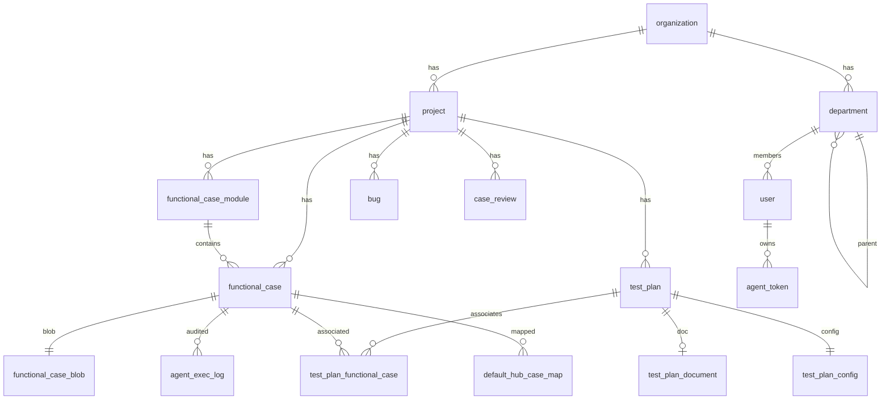

# MeterSphere 数据库结构与查询指南

> **生成日期**：2026-07-29  
> **标注**：【AI生成】已基于仓库 Flyway DDL 自动解析；关键语义与逻辑外键经方案文档对齐。  
> **机器可读全量**：同目录 [`MeterSphere-数据库结构-schema-2026-07-29.json`](./MeterSphere-数据库结构-schema-2026-07-29.json)（含全部表字段）。  
> **用途**：供其它 AI / 工程师连接数据库后正确查询；本地口令勿用于生产。

## 0. 给 AI 的阅读与查询协议

1. 先读 **§1 连接** 与 **§2 通用语义**，再查表。
2. 全量字段以 JSON 的 `tables.<name>.columns` 为准；本文展开核心与米多定制表。
3. **几乎没有物理外键**；用 `*_id` 做逻辑 JOIN。
4. 主键多为 **VARCHAR(50)**；时间为 **BIGINT 毫秒时间戳**。
5. 查询前建议 `SHOW FULL COLUMNS FROM <table>;` 与文档交叉验证。
6. 迁移状态看 `metersphere_version`。
7. **禁止**把 `agent_token.token_hash` 当明文 Token。
8. 表名 `user` 是保留字，SQL 中写 `` `user` ``。

## 1. 连接信息（本地开发）

| 项 | 值 |
|----|-----|
| RDBMS | MySQL 8.0.x |
| Host | `127.0.0.1` |
| Port | `3306` |
| Database | `metersphere` |
| User | `root` |
| Password | `Password123@mysql` |
| 容器名 | `ms-dev-mysql` |

```bash
cd C:\SoftWare\JetBrains\metersphere\dev && docker compose up -d mysql
docker exec -it ms-dev-mysql mysql -uroot -pPassword123@mysql metersphere
```

```text
jdbc:mysql://127.0.0.1:3306/metersphere?autoReconnect=false&useUnicode=true&characterEncoding=UTF-8&characterSetResults=UTF-8&zeroDateTimeBehavior=convertToNull&allowPublicKeyRetrieval=true&useSSL=false&serverTimezone=Asia/Shanghai
```

配置：`deploy/nacos/dev/metersphere.properties` → `local-runtime/conf/metersphere.properties`。

栈：MyBatis + HikariCP；Flyway 历史表 `metersphere_version`；脚本目录 `backend/framework/domain/src/main/resources/migration/`。

**解析表数量**：175

## 2. 通用语义（查询必读）

### 2.1 公共字段约定

- **id**：主键，多为 VARCHAR(50) 雪花/UUID 字符串，勿当整数
- **create_time / update_time**：毫秒时间戳 BIGINT，不是 DATETIME；可用 FROM_UNIXTIME(create_time/1000)
- **create_user / update_user**：用户 ID（user.id），不是显示名
- **project_id**：所属项目 ID → project.id
- **organization_id**：所属组织 ID → organization.id
- **deleted**：BIT(1)：0 否 / 1 是（回收站）；查业务数据默认 deleted=0
- **pos**：自定义排序，间隔常为 5000
- **LONGBLOB 文本字段**：如 functional_case_blob.steps：应用层当 UTF-8 文本/JSON 使用，客户端可用 CONVERT(steps USING utf8mb4)

### 2.2 重要枚举 / 状态

| 字段 | 含义 |
|------|------|
| `functional_case 无 priority 列` | 等级在自定义字段：functional_case_custom_field.value，关联 custom_field.name='functional_priority'（或模板内同名内部字段）。取值多为 P0/P1/P2/P3 |
| `functional_case_custom_field` | case_id + field_id + value；查优先级必须 JOIN custom_field |
| `functional_case.review_status` | UN_REVIEWED 等（未评审/评审中/通过/不通过/重新提审） |
| `functional_case.case_edit_type` | STEP 步骤模式 / TEXT 文本模式（与 blob 字段启用对应） |
| `functional_case.last_execute_result` | UN_EXECUTED / 通过/失败/阻塞/跳过 等 |
| `functional_case_module.module_type` | MODULE | FOLDER（默认项目下业务项目文件夹） |
| `functional_case_module.parent_id` | 根节点常用 'NONE' |
| `project.is_default` | BIT(1)，1=系统默认项目（枢纽） |
| `test_plan.type` | group=计划组 / testPlan=普通计划 |
| `test_plan.group_id` | 挂到计划组；无组时为 none |
| `test_plan.status` | 未开始/进行中/已完成/已归档（以实际存值为准） |
| `test_plan_functional_case.id` | 即 Agent/API 中的 testPlanCaseId（不是 functional_case.id） |
| `test_plan_functional_case.last_exec_result` | 计划维度最后执行结果 |
| `agent_token.token_prefix` | 如 msat；库内只存 token_hash |
| `agent_exec_log.last_exec_result` | SUCCESS / ERROR / BLOCKED / FAKE_ERROR 等 |
| `department.dept_status` | 1 启用 / 0 停用 |
| `department.sync_status / user.sync_status` | 0 未同步 / 1 已同步 / 2 同步失败 |
| `org_sync_log.sync_mode` | MANUAL / SCHEDULE / LOGIN |
| `org_sync_log.sync_status` | SUCCESS / PARTIAL / FAILED |
| `default_hub_sync_job.job_type` | EVENT / CRON / MANUAL |
| `default_hub_sync_job.status` | PENDING / RUNNING / SUCCESS / FAILED |
| `resource_edit_lock.resource_type` | FUNCTIONAL_CASE | BUG | TEST_PLAN_DOCUMENT | ... |
| `test_plan_document.content_type` | RICH_TEXT / MARKDOWN |

## 3. 逻辑表关系（ER 要点）



| 从表 | 到表 | 关联字段 | 说明 |
|------|------|----------|------|
| `user` | `organization` | `last_organization_id` | 用户最近组织 |
| `user` | `department` | `department_id` | 用户主部门 |
| `department` | `organization` | `organization_id` | 部门属于组织 |
| `department` | `department` | `parent_id` | 部门父子树 |
| `project` | `organization` | `organization_id` | 项目属于组织 |
| `functional_case` | `project` | `project_id` | 用例属于项目 |
| `functional_case` | `functional_case_module` | `module_id` | 用例所属模块 |
| `functional_case_blob` | `functional_case` | `id (= functional_case.id)` | 用例大字段（步骤/前置等） |
| `functional_case_module` | `project` | `project_id` | 模块树归属项目 |
| `functional_case_module` | `project` | `ref_project_id` | 默认项目 FOLDER 映射业务项目 |
| `test_plan` | `project` | `project_id` | 测试计划归属 |
| `test_plan` | `test_plan` | `group_id` | 子计划挂到 type=group 的计划组；默认 none |
| `test_plan_config` | `test_plan` | `test_plan_id PK` | 计划配置 1:1 |
| `test_plan_functional_case` | `test_plan` | `test_plan_id` | 计划-用例关联行；其 id 即 Agent 的 testPlanCaseId |
| `test_plan_functional_case` | `functional_case` | `functional_case_id` | 关联功能用例 |
| `test_plan_case_execute_history` | `test_plan_functional_case` | `test_plan_case_id` | 计划内执行历史；test_plan_case_id = test_plan_functional_case.id |
| `test_plan_document` | `test_plan` | `test_plan_id UNIQUE` | 计划文档 1:1 |
| `case_review` | `project` | `project_id` | 评审归属项目 |
| `case_review_functional_case` | `case_review` | `review_id` | 评审关联用例 |
| `bug` | `project` | `project_id` | 缺陷归属 |
| `bug_relation_case` | `bug` | `bug_id` | 缺陷关联用例 |
| `api_definition` | `project` | `project_id` | 接口定义 |
| `api_test_case` | `api_definition` | `api_definition_id` | 接口用例 |
| `api_scenario` | `project` | `project_id` | 接口场景 |
| `agent_token` | `user` | `user_id` | Token 对应用户 |
| `agent_token` | `project` | `project_id` | Token 默认项目 |
| `agent_exec_log` | `functional_case` | `case_id` | 执行审计 |
| `agent_exec_attachment` | `agent_exec_log` | `exec_log_id` | 计划外证据 |
| `default_hub_case_map` | `functional_case` | `biz_case_id / hub_case_id` | 业务↔枢纽用例 |
| `default_hub_plan_map` | `test_plan` | `biz_plan_id / hub_plan_id` | 业务↔枢纽计划 |
| `org_wecom_sync_config` | `organization` | `organization_id` | 企微同步配置 |
| `org_sync_log` | `organization` | `organization_id` | 同步日志 |
| `resource_edit_lock` | `project` | `project_id` | 编辑锁 |
| `resource_edit_snapshot` | `resource_edit_pointer` | `resource_type + resource_id` | 快照与 Undo 指针 |
| `user_role_relation` | `user` | `user_id` | 用户-角色 |
| `user_role_relation` | `user_role` | `role_id` | 角色定义 |
| `user_role_permission` | `user_role` | `role_id` | 角色权限点 |

## 4. 模块 → 表清单

### Agent API 集成（米多）（4）

`agent_exec_attachment`, `agent_exec_log`, `agent_module_alias`, `agent_token`

### AI 相关（4）

`ai_conversation`, `ai_conversation_content`, `ai_model_source`, `ai_user_prompt_config`

### 接口测试（36）

`api_debug`, `api_debug_blob`, `api_debug_module`, `api_definition`, `api_definition_blob`, `api_definition_custom_field`, `api_definition_follower`, `api_definition_mock`, `api_definition_mock_config`, `api_definition_module`, `api_definition_swagger`, `api_doc_share`, `api_file_resource`, `api_report`, `api_report_detail`, `api_report_log`, `api_report_relate_task`, `api_report_step`, `api_scenario`, `api_scenario_blob`, `api_scenario_csv`, `api_scenario_csv_step`, `api_scenario_follower`, `api_scenario_module`, `api_scenario_record`, `api_scenario_report`, `api_scenario_report_detail`, `api_scenario_report_detail_blob`, `api_scenario_report_log`, `api_scenario_report_step`, `api_scenario_step`, `api_scenario_step_blob`, `api_test_case`, `api_test_case_blob`, `api_test_case_follower`, `api_test_case_record`

### 缺陷管理（7）

`bug`, `bug_comment`, `bug_content`, `bug_custom_field`, `bug_follower`, `bug_local_attachment`, `bug_relation_case`

### 默认项目枢纽（米多）（3）

`default_hub_case_map`, `default_hub_plan_map`, `default_hub_sync_job`

### 编辑锁与 Undo（米多）（3）

`resource_edit_lock`, `resource_edit_pointer`, `resource_edit_snapshot`

### 环境 / 操作日志 / 参数（9）

`environment`, `environment_blob`, `environment_group`, `environment_group_relation`, `operation_history`, `operation_log`, `operation_log_blob`, `share_info`, `worker_node`

### 功能用例 / 用例评审（20）

`case_review`, `case_review_follower`, `case_review_functional_case`, `case_review_functional_case_archive`, `case_review_functional_case_user`, `case_review_history`, `case_review_module`, `case_review_user`, `functional_case`, `functional_case_attachment`, `functional_case_blob`, `functional_case_comment`, `functional_case_custom_field`, `functional_case_demand`, `functional_case_follower`, `functional_case_module`, `functional_case_relationship_edge`, `functional_case_test`, `functional_case_xmind_file`, `functional_minder_extra_node`

### 组织架构 / 企微同步（米多）（3）

`department`, `org_sync_log`, `org_wecom_sync_config`

### 项目管理 / 文件 / 通知（17）

`custom_function`, `custom_function_blob`, `fake_error`, `file_association`, `file_metadata`, `file_metadata_repository`, `file_module`, `file_module_repository`, `message_task`, `message_task_blob`, `notification`, `project`, `project_application`, `project_parameter`, `project_robot`, `project_test_resource_pool`, `project_version`

### Quartz 调度（11）

`qrtz_blob_triggers`, `qrtz_calendars`, `qrtz_cron_triggers`, `qrtz_fired_triggers`, `qrtz_job_details`, `qrtz_locks`, `qrtz_paused_trigger_grps`, `qrtz_scheduler_state`, `qrtz_simple_triggers`, `qrtz_simprop_triggers`, `qrtz_triggers`

### 系统设置 / 用户组织权限（32）

`auth_source`, `custom_field`, `custom_field_option`, `license`, `novice_statistics`, `organization`, `organization_parameter`, `plugin`, `plugin_organization`, `plugin_script`, `schedule`, `service_integration`, `status_definition`, `status_flow`, `status_item`, `system_parameter`, `template`, `template_custom_field`, `test_resource_pool`, `test_resource_pool_blob`, `test_resource_pool_organization`, `user`, `user_extend`, `user_invite`, `user_key`, `user_layout`, `user_local_config`, `user_role`, `user_role_permission`, `user_role_relation`, `user_view`, `user_view_condition`

### 测试计划 / 报告 / 文档（21）

`functional_test_report`, `test_plan`, `test_plan_allocation`, `test_plan_api_case`, `test_plan_api_scenario`, `test_plan_case_execute_history`, `test_plan_collection`, `test_plan_config`, `test_plan_document`, `test_plan_execution_queue`, `test_plan_follower`, `test_plan_functional_case`, `test_plan_module`, `test_plan_report`, `test_plan_report_api_case`, `test_plan_report_api_scenario`, `test_plan_report_attachment`, `test_plan_report_bug`, `test_plan_report_component`, `test_plan_report_function_case`, `test_plan_report_summary`

### 其它（5）

`exec_task`, `exec_task_item`, `export_task`, `mind_additional_node`, `platform_source`

## 5. 常用查询配方

### 5.1 按项目查功能用例（含模块名与优先级，排除回收站）

```sql
SELECT c.id, c.num, c.name, c.review_status, c.last_execute_result, c.module_id,
       m.name AS module_name, cfv.value AS priority, c.execute_user, c.create_user, c.create_time
FROM functional_case c
LEFT JOIN functional_case_module m ON m.id = c.module_id
LEFT JOIN functional_case_custom_field cfv ON cfv.case_id = c.id
LEFT JOIN custom_field cf ON cf.id = cfv.field_id AND cf.name = 'functional_priority'
WHERE c.project_id = '{project_id}'
  AND c.deleted = 0
  AND c.latest = 1
ORDER BY c.pos, c.create_time DESC
LIMIT 50;
```

### 5.2 仅按优先级过滤用例

```sql
SELECT c.id, c.name, f.value AS priority
FROM functional_case c
JOIN functional_case_custom_field f ON f.case_id = c.id
JOIN custom_field cf ON cf.id = f.field_id AND cf.name = 'functional_priority'
WHERE c.project_id = '{project_id}' AND c.deleted = 0 AND c.latest = 1
  AND f.value = 'P0';
```

### 5.3 查用例步骤正文（blob，转文本）

```sql
SELECT c.id, c.name, c.case_edit_type,
       CONVERT(b.steps USING utf8mb4) AS steps_json,
       CONVERT(b.prerequisite USING utf8mb4) AS prerequisite,
       CONVERT(b.text_description USING utf8mb4) AS text_description,
       CONVERT(b.expected_result USING utf8mb4) AS expected_result,
       CONVERT(b.description USING utf8mb4) AS description
FROM functional_case c
JOIN functional_case_blob b ON b.id = c.id
WHERE c.id = '{case_id}';
```

### 5.4 测试计划关联的功能用例（test_plan_case_id）

```sql
SELECT tpf.id AS test_plan_case_id, tpf.test_plan_id, tpf.functional_case_id AS case_id,
       c.name, tpf.last_exec_result, tpf.execute_user, tpf.last_exec_time, tpf.pos
FROM test_plan_functional_case tpf
JOIN functional_case c ON c.id = tpf.functional_case_id
WHERE tpf.test_plan_id = '{test_plan_id}'
ORDER BY tpf.pos;
```

### 5.5 计划组与子计划

```sql
SELECT id, num, name, type, status, group_id, project_id
FROM test_plan
WHERE project_id = '{project_id}'
ORDER BY type, name;
```

### 5.6 默认项目 / 枢纽项目

```sql
SELECT id, name, organization_id, is_default, create_time
FROM project
WHERE is_default = 1;
```

### 5.7 业务用例到枢纽映射

```sql
SELECT * FROM default_hub_case_map
WHERE biz_project_id = '{biz_project_id}'
LIMIT 100;
```

### 5.8 组织部门树

```sql
SELECT id, name, parent_id, wecom_dept_id, dept_status, sort_order
FROM department
WHERE organization_id = '{organization_id}'
ORDER BY sort_order, name;
```

### 5.9 用户及部门

```sql
SELECT u.id, u.name, u.email, u.wecom_userid, u.department_id, d.name AS dept_name, u.last_organization_id
FROM `user` u
LEFT JOIN department d ON d.id = u.department_id
WHERE u.last_organization_id = '{organization_id}'
LIMIT 100;
```

### 5.10 Agent Token 元数据（无明文）

```sql
SELECT id, name, token_prefix, user_id, project_id, scopes, expire_time, enable, create_time
FROM agent_token
WHERE enable = 1;
```

### 5.11 资源编辑锁是否占用

```sql
SELECT * FROM resource_edit_lock
WHERE resource_type = 'FUNCTIONAL_CASE' AND resource_id = '{resource_id}'
  AND expire_time > UNIX_TIMESTAMP()*1000;
```

### 5.12 Flyway 迁移历史

```sql
SELECT installed_rank, version, description, success, installed_on
FROM metersphere_version
ORDER BY installed_rank DESC
LIMIT 30;
```

## 6. 核心与定制表字段明细

全量字段亦写入 JSON。大模块中次要表仅给字段摘要。

## 6.org_structure 组织架构 / 企微同步（米多）

### `department`

**表含义**：组织部门表

- **模块**：组织架构 / 企微同步（米多）
- **主键**：`id`
- **来源迁移**：`3.7.0/ddl/V3.7.0_1__org_structure.sql`

| 字段 | 类型 | 可空 | 默认 | 含义 |
|------|------|------|------|------|
| `id` | VARCHAR(50) | NO |  | 部门ID |
| `organization_id` | VARCHAR(50) | NO |  | 所属MeterSphere组织ID |
| `name` | VARCHAR(255) | NO |  | 部门名称 |
| `parent_id` | VARCHAR(50) | YES |  | 父部门本地ID |
| `wecom_dept_id` | BIGINT | YES |  | 企微部门ID |
| `sort_order` | INT | YES | 0 | 排序 |
| `dept_status` | TINYINT | YES | 1 | 1启用 0停用 |
| `sync_status` | TINYINT | YES | 0 | 0未同步 1已同步 2同步失败 |
| `sync_time` | BIGINT | YES |  | 最近同步时间戳 |
| `leader_wecom_userid` | VARCHAR(100) | YES |  | 部门负责人企微UserID |
| `create_time` | BIGINT | NO |  |  |
| `update_time` | BIGINT | NO |  |  |
| `create_user` | VARCHAR(50) | NO |  |  |
| `update_user` | VARCHAR(50) | NO |  |  |

**索引（摘要）**：
- `UNIQUE KEY uk_org_wecom_dept (organization_id, wecom_dept_id)`
- `KEY idx_org_parent (organization_id, parent_id)`
- `KEY idx_org_status (organization_id, dept_status)`

### `org_sync_log`

**表含义**：组织同步日志

- **模块**：组织架构 / 企微同步（米多）
- **主键**：`id`
- **来源迁移**：`3.7.0/ddl/V3.7.0_1__org_structure.sql`

| 字段 | 类型 | 可空 | 默认 | 含义 |
|------|------|------|------|------|
| `id` | VARCHAR(50) | NO |  |  |
| `organization_id` | VARCHAR(50) | NO |  |  |
| `sync_mode` | VARCHAR(20) | NO |  | MANUAL/SCHEDULE/LOGIN |
| `sync_status` | VARCHAR(20) | NO |  | SUCCESS/PARTIAL/FAILED |
| `dept_total` | INT | YES | 0 |  |
| `dept_success` | INT | YES | 0 |  |
| `dept_failed` | INT | YES | 0 |  |
| `user_total` | INT | YES | 0 |  |
| `user_success` | INT | YES | 0 |  |
| `user_failed` | INT | YES | 0 |  |
| `duration_ms` | BIGINT | YES | 0 |  |
| `error_message` | TEXT | YES |  |  |
| `create_time` | BIGINT | NO |  |  |
| `create_user` | VARCHAR(50) | NO |  |  |

**索引（摘要）**：
- `KEY idx_org_time (organization_id, create_time DESC)`

### `org_wecom_sync_config`

**表含义**：组织企微同步配置

- **模块**：组织架构 / 企微同步（米多）
- **主键**：`id`
- **来源迁移**：`3.7.0/ddl/V3.7.0_1__org_structure.sql`

| 字段 | 类型 | 可空 | 默认 | 含义 |
|------|------|------|------|------|
| `id` | VARCHAR(50) | NO |  |  |
| `organization_id` | VARCHAR(50) | NO |  | MS组织ID |
| `corp_id` | VARCHAR(100) | NO |  | 企微CorpID |
| `contact_secret` | VARCHAR(255) | NO |  | 通讯录Secret |
| `agent_id` | VARCHAR(50) | YES |  | 应用AgentId（可选） |
| `schedule_enabled` | TINYINT | YES | 0 | 是否启用定时同步 |
| `schedule_cron` | VARCHAR(50) | YES |  | Cron表达式 |
| `retry_times` | INT | YES | 3 | 失败重试次数 |
| `last_sync_time` | BIGINT | YES |  | 最近同步时间 |
| `create_time` | BIGINT | NO |  |  |
| `update_time` | BIGINT | NO |  |  |
| `create_user` | VARCHAR(50) | NO |  |  |
| `update_user` | VARCHAR(50) | NO |  |  |

**索引（摘要）**：
- `UNIQUE KEY uk_org_config (organization_id)`

## 6.agent Agent API 集成（米多）

### `agent_exec_attachment`

**表含义**：Agent 执行证据附件

- **模块**：Agent API 集成（米多）
- **主键**：`id`
- **来源迁移**：`3.7.1/ddl/V3.7.1_2__agent_p2.sql`

| 字段 | 类型 | 可空 | 默认 | 含义 |
|------|------|------|------|------|
| `id` | VARCHAR(50) | NO |  |  |
| `exec_history_id` | VARCHAR(50) | YES |  | 计划内执行历史 ID |
| `exec_log_id` | VARCHAR(50) | YES |  | 计划外审计日志 ID |
| `file_id` | VARCHAR(50) | NO |  | 平台临时文件 ID |
| `file_name` | VARCHAR(255) | YES |  |  |
| `step_num` | INT | YES |  |  |
| `create_time` | BIGINT | YES |  |  |
| `create_user` | VARCHAR(50) | YES |  |  |

**索引（摘要）**：
- `INDEX idx_agent_exec_attachment_history (exec_history_id)`
- `INDEX idx_agent_exec_attachment_log (exec_log_id)`

### `agent_exec_log`

**表含义**：Agent 执行审计日志

- **模块**：Agent API 集成（米多）
- **主键**：`id`
- **来源迁移**：`3.7.1/ddl/V3.7.1_1__agent_integration.sql`

| 字段 | 类型 | 可空 | 默认 | 含义 |
|------|------|------|------|------|
| `id` | VARCHAR(50) | NO |  |  |
| `case_id` | VARCHAR(50) | NO |  |  |
| `test_plan_id` | VARCHAR(50) | YES |  |  |
| `test_plan_case_id` | VARCHAR(50) | YES |  |  |
| `last_exec_result` | VARCHAR(20) | NO |  |  |
| `executed_by` | VARCHAR(100) | YES |  | Agent 标识 |
| `steps_snapshot` | LONGTEXT | YES |  | 步骤执行快照 JSON |
| `content` | LONGTEXT | YES |  | 执行备注 |
| `create_time` | BIGINT | YES |  |  |
| `create_user` | VARCHAR(50) | YES |  |  |

**索引（摘要）**：
- `INDEX idx_agent_exec_log_case (case_id, create_time DESC)`

### `agent_module_alias`

**表含义**：Agent 模块别名

- **模块**：Agent API 集成（米多）
- **主键**：`id`
- **来源迁移**：`3.7.1/ddl/V3.7.1_2__agent_p2.sql`

| 字段 | 类型 | 可空 | 默认 | 含义 |
|------|------|------|------|------|
| `id` | VARCHAR(50) | NO |  |  |
| `project_id` | VARCHAR(50) | NO |  |  |
| `alias` | VARCHAR(50) | NO |  | 别名，如 CW |
| `module_id` | VARCHAR(50) | NO |  | 目标模块 ID |
| `create_time` | BIGINT | YES |  |  |
| `create_user` | VARCHAR(50) | YES |  |  |

**索引（摘要）**：
- `UNIQUE KEY uk_project_alias (project_id, alias)`

### `agent_token`

**表含义**：Agent API Token

- **模块**：Agent API 集成（米多）
- **主键**：`id`
- **来源迁移**：`3.7.1/ddl/V3.7.1_1__agent_integration.sql`

| 字段 | 类型 | 可空 | 默认 | 含义 |
|------|------|------|------|------|
| `id` | VARCHAR(50) | NO |  |  |
| `name` | VARCHAR(100) | NO |  | Token 名称 |
| `token_prefix` | VARCHAR(10) | NO |  | 前缀 msat |
| `token_hash` | VARCHAR(128) | NO |  | SHA-256(token) |
| `user_id` | VARCHAR(50) | NO |  | 关联用户 |
| `project_id` | VARCHAR(50) | YES |  | 默认项目 ID |
| `scopes` | VARCHAR(255) | YES |  | 权限范围 |
| `expire_time` | BIGINT | YES |  | 过期时间戳，NULL=永不过期 |
| `enable` | TINYINT(1) | YES | 1 |  |
| `create_time` | BIGINT | YES |  |  |
| `create_user` | VARCHAR(50) | YES |  |  |

**索引（摘要）**：
- `INDEX idx_agent_token_hash (token_hash)`

## 6.default_hub 默认项目枢纽（米多）

### `default_hub_case_map`

**表含义**：业务用例→默认项目枢纽映射

- **模块**：默认项目枢纽（米多）
- **主键**：`id`
- **来源迁移**：`3.7.2/ddl/V3.7.2_9__default_hub.sql`

| 字段 | 类型 | 可空 | 默认 | 含义 |
|------|------|------|------|------|
| `id` | VARCHAR(50) | NO |  |  |
| `biz_project_id` | VARCHAR(50) | NO |  |  |
| `biz_case_id` | VARCHAR(50) | NO |  |  |
| `hub_case_id` | VARCHAR(50) | NO |  |  |
| `content_hash` | VARCHAR(64) | YES | NULL |  |
| `create_time` | BIGINT | NO |  |  |
| `update_time` | BIGINT | NO |  |  |

**索引（摘要）**：
- `UNIQUE KEY uk_hub_case_biz (biz_case_id)`
- `KEY idx_hub_case_biz_project (biz_project_id)`
- `KEY idx_hub_case_hub (hub_case_id)`

### `default_hub_plan_map`

**表含义**：业务计划→默认项目枢纽映射

- **模块**：默认项目枢纽（米多）
- **主键**：`id`
- **来源迁移**：`3.7.2/ddl/V3.7.2_9__default_hub.sql`

| 字段 | 类型 | 可空 | 默认 | 含义 |
|------|------|------|------|------|
| `id` | VARCHAR(50) | NO |  |  |
| `biz_project_id` | VARCHAR(50) | NO |  |  |
| `biz_plan_id` | VARCHAR(50) | NO |  |  |
| `hub_plan_id` | VARCHAR(50) | NO |  |  |
| `content_hash` | VARCHAR(64) | YES | NULL |  |
| `create_time` | BIGINT | NO |  |  |
| `update_time` | BIGINT | NO |  |  |

**索引（摘要）**：
- `UNIQUE KEY uk_hub_plan_biz (biz_plan_id)`
- `KEY idx_hub_plan_biz_project (biz_project_id)`
- `KEY idx_hub_plan_hub (hub_plan_id)`

### `default_hub_sync_job`

**表含义**：默认项目枢纽同步任务

- **模块**：默认项目枢纽（米多）
- **主键**：`id`
- **来源迁移**：`3.7.2/ddl/V3.7.2_9__default_hub.sql`

| 字段 | 类型 | 可空 | 默认 | 含义 |
|------|------|------|------|------|
| `id` | VARCHAR(50) | NO |  |  |
| `job_type` | VARCHAR(20) | NO |  | EVENT\|CRON\|MANUAL |
| `scope_project_id` | VARCHAR(50) | YES | NULL | 空=全量 |
| `status` | VARCHAR(20) | NO |  | PENDING\|RUNNING\|SUCCESS\|FAILED |
| `progress` | INT | NO | 0 |  |
| `success_count` | INT | NO | 0 |  |
| `fail_count` | INT | NO | 0 |  |
| `error_message` | VARCHAR(2000) | YES | NULL |  |
| `create_user` | VARCHAR(50) | YES | NULL |  |
| `create_time` | BIGINT | NO |  |  |
| `update_time` | BIGINT | NO |  |  |
| `finish_time` | BIGINT | YES | NULL |  |

**索引（摘要）**：
- `KEY idx_hub_sync_status (status)`
- `KEY idx_hub_sync_create (create_time)`

## 6.edit_lock 编辑锁与 Undo（米多）

### `resource_edit_lock`

**表含义**：资源编辑锁

- **模块**：编辑锁与 Undo（米多）
- **主键**：`id`
- **来源迁移**：`3.7.2/ddl/V3.7.2_12__resource_edit_lock_snapshot.sql`

| 字段 | 类型 | 可空 | 默认 | 含义 |
|------|------|------|------|------|
| `id` | VARCHAR(50) | NO |  |  |
| `resource_type` | VARCHAR(50) | NO |  | FUNCTIONAL_CASE\|BUG\|TEST_PLAN_DOCUMENT\|... |
| `resource_id` | VARCHAR(50) | NO |  |  |
| `project_id` | VARCHAR(50) | NO |  |  |
| `holder_user_id` | VARCHAR(50) | NO |  |  |
| `holder_user_name` | VARCHAR(255) | YES | NULL |  |
| `expire_time` | BIGINT | NO |  | 过期时间戳毫秒 |
| `create_time` | BIGINT | NO |  |  |
| `update_time` | BIGINT | NO |  |  |

**索引（摘要）**：
- `UNIQUE KEY uk_resource_edit_lock (resource_type, resource_id)`
- `KEY idx_rel_expire (expire_time)`
- `KEY idx_rel_holder (holder_user_id)`

### `resource_edit_pointer`

**表含义**：资源编辑 Undo 指针

- **模块**：编辑锁与 Undo（米多）
- **主键**：`resource_type`, `resource_id`
- **来源迁移**：`3.7.2/ddl/V3.7.2_12__resource_edit_lock_snapshot.sql`

| 字段 | 类型 | 可空 | 默认 | 含义 |
|------|------|------|------|------|
| `resource_type` | VARCHAR(50) | NO |  |  |
| `resource_id` | VARCHAR(50) | NO |  |  |
| `active_seq` | BIGINT | NO | 0 | 当前 Undo 指针对应快照 seq |
| `update_time` | BIGINT | NO |  |  |

### `resource_edit_snapshot`

**表含义**：资源编辑滚动快照

- **模块**：编辑锁与 Undo（米多）
- **主键**：`id`
- **来源迁移**：`3.7.2/ddl/V3.7.2_12__resource_edit_lock_snapshot.sql`

| 字段 | 类型 | 可空 | 默认 | 含义 |
|------|------|------|------|------|
| `id` | VARCHAR(50) | NO |  |  |
| `resource_type` | VARCHAR(50) | NO |  |  |
| `resource_id` | VARCHAR(50) | NO |  |  |
| `project_id` | VARCHAR(50) | NO |  |  |
| `seq` | BIGINT | NO |  | 单调序号 |
| `payload` | MEDIUMTEXT | NO |  | 整单 JSON 快照 |
| `content_hash` | VARCHAR(64) | YES | NULL |  |
| `create_user` | VARCHAR(50) | YES | NULL |  |
| `create_time` | BIGINT | NO |  |  |

**索引（摘要）**：
- `UNIQUE KEY uk_res_snap_seq (resource_type, resource_id, seq)`
- `KEY idx_res_snap_resource (resource_type, resource_id, seq)`

## 6.system 系统设置 / 用户组织权限

### `auth_source`

**表含义**：三方认证源

- **模块**：系统设置 / 用户组织权限
- **主键**：`id`
- **来源迁移**：`3.0.0/ddl/V3.0.0_11__system_setting.sql`

| 字段 | 类型 | 可空 | 默认 | 含义 |
|------|------|------|------|------|
| `id` | VARCHAR(50) | NO |  | 认证源ID |
| `configuration` | BLOB | NO |  | 认证源配置 |
| `enable` | BIT | NO | 0 | 是否启用 |
| `create_time` | BIGINT | NO |  | 创建时间 |
| `update_time` | BIGINT | NO |  | 更新时间 |
| `description` | VARCHAR(1000) | YES |  | 描述 |
| `name` | VARCHAR(255) | YES |  | 名称 |
| `type` | VARCHAR(30) | YES |  | 类型 |

**索引（摘要）**：
- `INDEX idx_name (`name`)`
- `INDEX idx_create_time (`create_time` desc)`
- `INDEX idx_update_time (`update_time` desc)`

### `custom_field`

**表含义**：自定义字段

- **模块**：系统设置 / 用户组织权限
- **主键**：`id`
- **来源迁移**：`3.0.0/ddl/V3.0.0_11__system_setting.sql`, `3.0.0/ddl/V3.0.0_12__beta_ddl.sql`

| 字段 | 类型 | 可空 | 默认 | 含义 |
|------|------|------|------|------|
| `id` | VARCHAR(50) | NO |  | 自定义字段ID |
| `name` | VARCHAR(255) | NO |  | 自定义字段名称 |
| `scene` | VARCHAR(30) | NO |  | 使用场景 |
| `type` | VARCHAR(30) | NO |  | 自定义字段类型 |
| `remark` | VARCHAR(1000) | YES |  | 自定义字段备注 |
| `internal` | BIT | NO | 0 | 是否是内置字段 |
| `scope_type` | VARCHAR(50) | NO | 0 | 组织或项目级别字段（PROJECT, ORGANIZATION） |
| `create_time` | BIGINT | NO |  | 创建时间 |
| `update_time` | BIGINT | NO |  | 更新时间 |
| `create_user` | VARCHAR(50) | NO |  | 创建人 |
| `ref_id` | VARCHAR(50) | YES |  | 项目字段所关联的组织字段ID |
| `enable_option_key` | BIT | YES | 0 | 是否需要手动输入选项key |
| `scope_id` | VARCHAR(50) | NO |  | 组织或项目ID |

**索引（摘要）**：
- `INDEX idx_scope_id (scope_id)`
- `INDEX idx_scene (scene)`
- `INDEX idx_internal (internal)`

### `custom_field_option`

**表含义**：自定义字段选项

- **模块**：系统设置 / 用户组织权限
- **主键**：`field_id`, `value`
- **来源迁移**：`3.0.0/ddl/V3.0.0_11__system_setting.sql`

| 字段 | 类型 | 可空 | 默认 | 含义 |
|------|------|------|------|------|
| `field_id` | VARCHAR(50) | NO |  | 自定义字段ID |
| `value` | VARCHAR(50) | NO |  | 选项值 |
| `text` | VARCHAR(255) | NO |  | 选项值名称 |
| `internal` | BIT | NO | 0 | 是否内置 |
| `pos` | INT | NO |  | 自定义排序，间隔1 |

### `license`

- **模块**：系统设置 / 用户组织权限
- **主键**：`id`
- **来源迁移**：`3.0.0/ddl/V3.0.0_11__system_setting.sql`

| 字段 | 类型 | 可空 | 默认 | 含义 |
|------|------|------|------|------|
| `id` | VARCHAR(50) | NO |  | ID |
| `create_time` | BIGINT | NO |  | Create timestamp |
| `update_time` | BIGINT | NO |  | Update timestamp |
| `license_code` | LONGTEXT | YES |  | license_code |

### `novice_statistics`

**表含义**：新手村

- **模块**：系统设置 / 用户组织权限
- **主键**：`id`
- **来源迁移**：`3.0.0/ddl/V3.0.0_11__system_setting.sql`

| 字段 | 类型 | 可空 | 默认 | 含义 |
|------|------|------|------|------|
| `id` | VARCHAR(50) | NO |  |  |
| `user_id` | VARCHAR(50) | YES |  | 用户id |
| `guide_step` | BIT | NO | 0 | 新手引导完成的步骤 |
| `guide_num` | INT | NO | 1 | 新手引导的次数 |
| `data_option` | LONGBLOB | YES |  | data option (JSON format) |
| `create_time` | BIGINT | YES |  |  |
| `update_time` | BIGINT | YES |  |  |

### `organization`

**表含义**：组织

- **模块**：系统设置 / 用户组织权限
- **主键**：`id`
- **来源迁移**：`3.0.0/ddl/V3.0.0_11__system_setting.sql`

| 字段 | 类型 | 可空 | 默认 | 含义 |
|------|------|------|------|------|
| `id` | VARCHAR(50) | NO |  | 组织ID |
| `num` | BIGINT | NO |  | 组织编号 |
| `name` | VARCHAR(255) | NO |  | 组织名称 |
| `description` | VARCHAR(1000) | YES |  | 描述 |
| `create_time` | BIGINT | NO |  | 创建时间 |
| `update_time` | BIGINT | NO |  | 更新时间 |
| `create_user` | VARCHAR(50) | NO |  | 创建人 |
| `update_user` | VARCHAR(50) | NO |  | 修改人 |
| `deleted` | BIT | NO | 0 | 是否删除 |
| `delete_user` | VARCHAR(50) | YES |  | 删除人 |
| `delete_time` | BIGINT | YES |  | 删除时间 |
| `enable` | BIT | NO | 1 | 是否启用 |

**索引（摘要）**：
- `CONSTRAINT idx_num UNIQUE (num)`
- `INDEX idx_name (`name`)`
- `INDEX idx_create_user (`create_user`)`
- `INDEX idx_create_time (`create_time` desc)`
- `INDEX idx_update_time (`update_time` desc)`
- `INDEX idx_deleted (`deleted`)`
- `INDEX idx_update_user (`update_user`)`

### `organization_parameter`

**表含义**：组织参数

- **模块**：系统设置 / 用户组织权限
- **主键**：`organization_id`, `param_key`
- **来源迁移**：`3.0.0/ddl/V3.0.0_11__system_setting.sql`

| 字段 | 类型 | 可空 | 默认 | 含义 |
|------|------|------|------|------|
| `organization_id` | VARCHAR(50) | NO |  | 项目ID |
| `param_key` | VARCHAR(50) | NO |  | 配置项 |
| `param_value` | VARCHAR(255) | YES |  | 配置值 |

### `plugin`

**表含义**：插件

- **模块**：系统设置 / 用户组织权限
- **主键**：`id`
- **来源迁移**：`3.0.0/ddl/V3.0.0_11__system_setting.sql`

| 字段 | 类型 | 可空 | 默认 | 含义 |
|------|------|------|------|------|
| `id` | VARCHAR(100) | NO |  | ID |
| `name` | VARCHAR(255) | NO |  | 插件名称 |
| `plugin_id` | VARCHAR(300) | NO |  | 插件ID（名称加版本号） |
| `file_name` | VARCHAR(300) | NO |  | 文件名 |
| `create_time` | BIGINT | NO |  | 创建时间 |
| `update_time` | BIGINT | NO |  | 更新时间 |
| `create_user` | VARCHAR(50) | NO |  | 创建人 |
| `enable` | BIT | NO | 1 | 是否启用插件 |
| `global` | BIT | NO | 1 | 是否是全局插件 |
| `xpack` | BIT | NO | 0 | 是否是企业版插件 |
| `description` | VARCHAR(1000) | YES |  | 插件描述 |
| `scenario` | VARCHAR(50) | NO |  | 插件使用场景API_PROTOCOL/PLATFORM |

### `plugin_organization`

**表含义**：插件和组织的关联表

- **模块**：系统设置 / 用户组织权限
- **主键**：`plugin_id`, `organization_id`
- **来源迁移**：`3.0.0/ddl/V3.0.0_11__system_setting.sql`

| 字段 | 类型 | 可空 | 默认 | 含义 |
|------|------|------|------|------|
| `plugin_id` | VARCHAR(50) | NO |  | 插件ID |
| `organization_id` | VARCHAR(50) | NO |  | 组织ID |

### `plugin_script`

**表含义**：插件的前端配置脚本

- **模块**：系统设置 / 用户组织权限
- **主键**：`plugin_id`, `script_id`
- **来源迁移**：`3.0.0/ddl/V3.0.0_11__system_setting.sql`

| 字段 | 类型 | 可空 | 默认 | 含义 |
|------|------|------|------|------|
| `plugin_id` | VARCHAR(50) | NO |  | 插件的ID |
| `script_id` | VARCHAR(50) | NO |  | 插件中对应表单配置的ID |
| `name` | VARCHAR(255) | YES |  | 插件中对应表单配置的名称 |
| `script` | LONGBLOB | YES |  | 脚本内容 |

### `schedule`

**表含义**：定时任务

- **模块**：系统设置 / 用户组织权限
- **主键**：`id`
- **来源迁移**：`3.0.0/ddl/V3.0.0_11__system_setting.sql`, `3.4.0/ddl/V3.4.0_2__ga_ddl.sql`

| 字段 | 类型 | 可空 | 默认 | 含义 |
|------|------|------|------|------|
| `id` | VARCHAR(50) | NO |  |  |
| `key` | VARCHAR(50) | YES |  | qrtz UUID |
| `type` | VARCHAR(50) | NO |  | 执行类型 cron |
| `value` | VARCHAR(255) | NO |  | cron 表达式 |
| `job` | VARCHAR(64) | NO |  | Schedule Job Class Name |
| `resource_type` | VARCHAR(50) | NO | 'NONE' | 资源类型 API_IMPORT,API_SCENARIO,UI_SCENARIO,LOAD_TEST,TEST_PLAN,CLEAN_REPORT,BUG_SYNC |
| `enable` | BIT | YES |  | 是否开启 |
| `resource_id` | VARCHAR(50) | YES |  | 资源ID，api_scenario ui_scenario load_test |
| `create_user` | VARCHAR(50) | NO |  | 创建人 |
| `create_time` | BIGINT | NO |  | 创建时间 |
| `update_time` | BIGINT | NO |  | 更新时间 |
| `project_id` | VARCHAR(50) | YES |  | 项目ID |
| `name` | VARCHAR(255) | YES |  | 名称 |
| `config` | VARCHAR(1000) | YES |  | 配置 |
| `num` | bigint | NO |  | 业务ID |

**索引（摘要）**：
- `INDEX idx_resource_id (`resource_id`)`
- `INDEX idx_create_user (`create_user`)`
- `INDEX idx_create_time (`create_time` desc)`
- `INDEX idx_update_time (`update_time` desc)`
- `INDEX idx_project_id (`project_id`)`
- `INDEX idx_enable (`enable`)`
- `INDEX idx_name (`name`)`
- `INDEX idx_type (`type`)`
- `INDEX idx_resource_type (`resource_type`)`
- `INDEX idx_num (`num`)`

### `service_integration`

**表含义**：服务集成

- **模块**：系统设置 / 用户组织权限
- **主键**：`id`
- **来源迁移**：`3.0.0/ddl/V3.0.0_11__system_setting.sql`

| 字段 | 类型 | 可空 | 默认 | 含义 |
|------|------|------|------|------|
| `id` | VARCHAR(50) | NO |  | ID |
| `plugin_id` | VARCHAR(50) | NO |  | 插件的ID |
| `enable` | BIT | NO | 1 | 是否启用 |
| `configuration` | BLOB | NO |  | 配置内容 |
| `organization_id` | VARCHAR(50) | NO |  | 组织ID |

**索引（摘要）**：
- `INDEX idx_organization_id (`organization_id`)`

### `status_definition`

**表含义**：状态定义

- **模块**：系统设置 / 用户组织权限
- **主键**：`status_id`, `definition_id`
- **来源迁移**：`3.0.0/ddl/V3.0.0_11__system_setting.sql`

| 字段 | 类型 | 可空 | 默认 | 含义 |
|------|------|------|------|------|
| `status_id` | VARCHAR(50) | NO |  | 状态ID |
| `definition_id` | VARCHAR(100) | NO |  | 状态定义ID(在代码中定义) |

**索引（摘要）**：
- `INDEX idx_status_id (status_id)`

### `status_flow`

**表含义**：状态流转

- **模块**：系统设置 / 用户组织权限
- **主键**：`id`
- **来源迁移**：`3.0.0/ddl/V3.0.0_11__system_setting.sql`

| 字段 | 类型 | 可空 | 默认 | 含义 |
|------|------|------|------|------|
| `id` | VARCHAR(50) | NO |  | ID |
| `from_id` | VARCHAR(50) | NO |  | 起始状态ID |
| `to_id` | VARCHAR(50) | NO |  | 目的状态ID |

### `status_item`

**表含义**：状态流的状态项

- **模块**：系统设置 / 用户组织权限
- **主键**：`id`
- **来源迁移**：`3.0.0/ddl/V3.0.0_11__system_setting.sql`

| 字段 | 类型 | 可空 | 默认 | 含义 |
|------|------|------|------|------|
| `id` | VARCHAR(50) | NO |  | 状态ID |
| `name` | VARCHAR(255) | NO |  | 状态名称 |
| `scene` | VARCHAR(30) | NO |  | 使用场景 |
| `remark` | VARCHAR(1000) | YES |  | 状态说明 |
| `internal` | BIT | NO | 0 | 是否是内置字段 |
| `scope_type` | VARCHAR(50) | NO | 0 | 组织或项目级别字段（PROJECT, ORGANIZATION） |
| `ref_id` | VARCHAR(50) | YES |  | 项目状态所关联的组织状态ID |
| `scope_id` | VARCHAR(50) | NO |  | 组织或项目ID |
| `pos` | INT | NO | 0 | 排序字段 |

**索引（摘要）**：
- `INDEX idx_scope_id (scope_id)`

### `system_parameter`

**表含义**：系统参数

- **模块**：系统设置 / 用户组织权限
- **主键**：`param_key`
- **来源迁移**：`3.0.0/ddl/V3.0.0_11__system_setting.sql`

| 字段 | 类型 | 可空 | 默认 | 含义 |
|------|------|------|------|------|
| `param_key` | VARCHAR(64) | NO |  | 参数名称 |
| `param_value` | VARCHAR(255) | YES |  | 参数值 |
| `type` | VARCHAR(100) | NO | 'text' | 类型 |

### `template`

**表含义**：模版

- **模块**：系统设置 / 用户组织权限
- **主键**：`id`
- **来源迁移**：`3.0.0/ddl/V3.0.0_11__system_setting.sql`

| 字段 | 类型 | 可空 | 默认 | 含义 |
|------|------|------|------|------|
| `id` | VARCHAR(50) | NO |  | ID |
| `name` | VARCHAR(255) | NO |  | 名称 |
| `remark` | VARCHAR(1000) | YES |  | 备注 |
| `internal` | BIT | NO | 0 | 是否是内置模板 |
| `update_time` | BIGINT | NO |  | 创建时间 |
| `create_time` | BIGINT | NO |  | 创建时间 |
| `create_user` | VARCHAR(50) | NO |  | 创建人 |
| `scope_type` | VARCHAR(50) | NO |  | 组织或项目级别字段（PROJECT, ORGANIZATION） |
| `scope_id` | VARCHAR(50) | NO |  | 组织或项目ID |
| `enable_third_part` | BIT | NO | 0 | 是否开启api字段名配置 |
| `ref_id` | VARCHAR(50) | YES |  | 项目模板所关联的组织模板ID |
| `scene` | VARCHAR(30) | NO |  | 使用场景 |

**索引（摘要）**：
- `INDEX idx_scope_id_scene (`scope_id`,`scene`)`

### `template_custom_field`

**表含义**：模板和字段的关联关系

- **模块**：系统设置 / 用户组织权限
- **主键**：`id`
- **来源迁移**：`3.0.0/ddl/V3.0.0_11__system_setting.sql`

| 字段 | 类型 | 可空 | 默认 | 含义 |
|------|------|------|------|------|
| `id` | VARCHAR(50) | NO |  | ID |
| `field_id` | VARCHAR(50) | NO |  | 字段ID |
| `template_id` | VARCHAR(50) | NO |  | 模版ID |
| `required` | BIT | NO | 0 | 是否必填 |
| `system_field` | BIT | NO | 0 | 是否是系统字段 |
| `pos` | INT | NO | 0 | 排序字段 |
| `api_field_id` | VARCHAR(255) | YES |  | api字段名 |
| `default_value` | VARCHAR(1500) | YES |  | 默认值 |

**索引（摘要）**：
- `INDEX idx_template_id (template_id)`

### `test_resource_pool`

**表含义**：测试资源池

- **模块**：系统设置 / 用户组织权限
- **主键**：`id`
- **来源迁移**：`3.0.0/ddl/V3.0.0_11__system_setting.sql`

| 字段 | 类型 | 可空 | 默认 | 含义 |
|------|------|------|------|------|
| `id` | VARCHAR(50) | NO |  | 资源池ID |
| `name` | VARCHAR(255) | NO |  | 名称 |
| `type` | VARCHAR(30) | NO |  | 类型 |
| `description` | VARCHAR(1000) | YES |  | 描述 |
| `enable` | BIT | NO | 1 | 是否启用 |
| `create_time` | BIGINT | NO |  | 创建时间 |
| `update_time` | BIGINT | NO |  | 更新时间 |
| `create_user` | VARCHAR(50) | YES |  | 创建人 |
| `api_test` | BIT | YES |  | 是否用于接口测试 |
| `load_test` | BIT | YES |  | 是否用于性能测试 |
| `ui_test` | BIT | YES |  | 是否用于ui测试 |
| `server_url` | VARCHAR(255) | YES |  | ms部署地址 |
| `all_org` | BIT | NO | 1 | 资源池应用类型（组织/全部） |
| `deleted` | BIT | NO | 0 | 是否删除 |

**索引（摘要）**：
- `INDEX idx_name (`name`)`
- `INDEX idx_type (`type`)`
- `INDEX idx_deleted (`deleted`)`
- `INDEX idx_enable (`enable`)`
- `INDEX idx_create_time (`create_time` desc)`
- `INDEX idx_update_time (`update_time` desc)`
- `INDEX idx_create_user (`create_user`)`
- `INDEX idx_all_org (`all_org`)`

### `test_resource_pool_blob`

**表含义**：测试资源池大字段

- **模块**：系统设置 / 用户组织权限
- **主键**：`id`
- **来源迁移**：`3.0.0/ddl/V3.0.0_11__system_setting.sql`

| 字段 | 类型 | 可空 | 默认 | 含义 |
|------|------|------|------|------|
| `id` | VARCHAR(50) | NO |  | id |
| `configuration` | LONGBLOB | YES |  | 资源节点配置 |

### `test_resource_pool_organization`

**表含义**：测试资源池项目关系

- **模块**：系统设置 / 用户组织权限
- **主键**：`id`
- **来源迁移**：`3.0.0/ddl/V3.0.0_11__system_setting.sql`

| 字段 | 类型 | 可空 | 默认 | 含义 |
|------|------|------|------|------|
| `id` | VARCHAR(50) | NO |  | 测试资源池项目关系ID |
| `test_resource_pool_id` | VARCHAR(50) | NO |  | 资源池ID |
| `org_id` | VARCHAR(50) | NO |  | 组织ID |

**索引（摘要）**：
- `INDEX idx_test_resource_pool_id (`test_resource_pool_id`)`
- `INDEX idx_org_id (`org_id`)`

### `user`

**表含义**：用户

- **模块**：系统设置 / 用户组织权限
- **主键**：`id`
- **来源迁移**：`3.0.0/ddl/V3.0.0_11__system_setting.sql`, `3.0.1/ddl/V3.0.1_2__ga_ddl.sql`, `3.7.0/ddl/V3.7.0_2__user_org_structure.sql`

| 字段 | 类型 | 可空 | 默认 | 含义 |
|------|------|------|------|------|
| `id` | VARCHAR(50) | NO |  | 用户ID |
| `name` | VARCHAR(255) | NO |  | 用户名 |
| `email` | VARCHAR(64) | NO |  | 用户邮箱 |
| `password` | VARCHAR(256) | YES |  | 用户密码 |
| `enable` | BIT | NO | 1 | 是否启用 |
| `create_time` | BIGINT | NO |  | 创建时间 |
| `update_time` | BIGINT | NO |  | 更新时间 |
| `language` | VARCHAR(30) | YES |  | 语言 |
| `last_organization_id` | VARCHAR(50) | YES |  | 当前组织ID |
| `phone` | VARCHAR(50) | YES |  | 手机号 |
| `source` | VARCHAR(50) | NO |  | 来源：LOCAL OIDC CAS OAUTH2 |
| `last_project_id` | VARCHAR(50) | YES |  | 当前项目ID |
| `create_user` | VARCHAR(50) | NO |  | 创建人 |
| `update_user` | VARCHAR(50) | NO |  | 修改人 |
| `deleted` | BIT | NO | 0 | 是否删除 |
| `cft_token` | varchar(255) | NO | 'NONE' | 身份令牌 |
| `wecom_userid` | VARCHAR(100) | YES |  | 企微UserID |
| `department_id` | VARCHAR(50) | YES |  | 主部门本地ID |
| `position` | VARCHAR(100) | YES |  | 职位 |
| `sync_status` | TINYINT | YES | 0 | 同步状态 |
| `sync_time` | BIGINT | YES |  | 最近同步时间 |

**索引（摘要）**：
- `INDEX idx_name (`name`)`
- `INDEX idx_email (`email`)`
- `INDEX idx_create_time (`create_time` desc)`
- `INDEX idx_update_time (`update_time` desc)`
- `INDEX idx_organization_id (`last_organization_id`)`
- `INDEX idx_project_id (`last_project_id`)`
- `INDEX idx_create_user (`create_user`)`
- `INDEX idx_update_user (`update_user`)`
- `INDEX idx_deleted (`deleted`)`
- `INDEX uk_user_wecom_userid (wecom_userid)`
- `INDEX idx_user_department (department_id)`
- `INDEX idx_user_org_dept (last_organization_id, department_id)`

### `user_extend`

**表含义**：用户扩展

- **模块**：系统设置 / 用户组织权限
- **主键**：`id`
- **来源迁移**：`3.0.0/ddl/V3.0.0_11__system_setting.sql`

| 字段 | 类型 | 可空 | 默认 | 含义 |
|------|------|------|------|------|
| `id` | VARCHAR(50) | NO |  | 用户ID |
| `platform_info` | BLOB | YES |  | 其他平台对接信息 |
| `avatar` | VARCHAR(255) | YES |  | 头像 |

### `user_invite`

**表含义**：用户邀请记录

- **模块**：系统设置 / 用户组织权限
- **主键**：`id`
- **来源迁移**：`3.0.0/ddl/V3.0.0_11__system_setting.sql`, `3.1.0/ddl/V3.1.0_2__ga_ddl.sql`

| 字段 | 类型 | 可空 | 默认 | 含义 |
|------|------|------|------|------|
| `id` | VARCHAR(50) | NO |  | 用户ID |
| `email` | VARCHAR(255) | NO |  | 邀请邮箱 |
| `roles` | TEXT | YES |  | 所属权限 |
| `invite_user` | VARCHAR(50) | NO |  | 邀请用户 |
| `invite_time` | BIGINT | NO |  | 邀请时间 |
| `organization_id` | VARCHAR(50) | YES |  | 组织ID |
| `project_id` | VARCHAR(50) | YES |  | 项目ID |

### `user_key`

**表含义**：用户api key

- **模块**：系统设置 / 用户组织权限
- **主键**：`id`
- **来源迁移**：`3.0.0/ddl/V3.0.0_11__system_setting.sql`

| 字段 | 类型 | 可空 | 默认 | 含义 |
|------|------|------|------|------|
| `id` | VARCHAR(50) | NO |  | user_key ID |
| `create_user` | VARCHAR(50) | NO |  | 用户ID |
| `access_key` | VARCHAR(50) | NO |  | access_key |
| `secret_key` | VARCHAR(50) | NO |  | secret key |
| `create_time` | BIGINT | NO |  | 创建时间 |
| `enable` | BIT | NO | 1 | 状态 |
| `forever` | BIT | NO | 1 | 是否永久有效 |
| `expire_time` | BIGINT | YES |  | 到期时间 |
| `description` | VARCHAR(255) | YES |  | 描述 |

**索引（摘要）**：
- `INDEX idx_ak (`access_key`)`
- `INDEX idx_create_user (`create_user`)`

### `user_layout`

**表含义**：用户布局表

- **模块**：系统设置 / 用户组织权限
- **主键**：`id`
- **来源迁移**：`3.5.0/ddl/V3.5.0_2__ga_ddl.sql`

| 字段 | 类型 | 可空 | 默认 | 含义 |
|------|------|------|------|------|
| `id` | VARCHAR(50) | NO |  | id |
| `user_id` | VARCHAR(50) | NO |  | 用户ID |
| `org_id` | VARCHAR(50) | NO |  | 组织ID |
| `configuration` | LONGBLOB | YES |  | 用户布局配置字段 |

**索引（摘要）**：
- `INDEX idx_user_id_org_id (`user_id`,`org_id`)`

### `user_local_config`

**表含义**：本地执行配置

- **模块**：系统设置 / 用户组织权限
- **主键**：`id`
- **来源迁移**：`3.0.0/ddl/V3.0.0_11__system_setting.sql`

| 字段 | 类型 | 可空 | 默认 | 含义 |
|------|------|------|------|------|
| `id` | VARCHAR(50) | NO |  | ID |
| `user_url` | VARCHAR(50) | NO |  | 本地执行程序url |
| `enable` | BIT | NO | 0 | 本地执行优先 |
| `type` | VARCHAR(50) | NO |  | API/UI |
| `create_user` | VARCHAR(50) | NO |  | 创建人 |

**索引（摘要）**：
- `INDEX idx_create_user (`create_user`)`
- `INDEX idx_type (`type`)`

### `user_role`

**表含义**：用户组

- **模块**：系统设置 / 用户组织权限
- **主键**：`id`
- **来源迁移**：`3.0.0/ddl/V3.0.0_11__system_setting.sql`

| 字段 | 类型 | 可空 | 默认 | 含义 |
|------|------|------|------|------|
| `id` | VARCHAR(50) | NO |  | 组ID |
| `name` | VARCHAR(255) | NO |  | 组名称 |
| `description` | VARCHAR(1000) | YES |  | 描述 |
| `internal` | BIT | NO |  | 是否是内置用户组 |
| `type` | VARCHAR(20) | NO |  | 所属类型 SYSTEM ORGANIZATION PROJECT |
| `create_time` | BIGINT | NO |  | 创建时间 |
| `update_time` | BIGINT | NO |  | 更新时间 |
| `create_user` | VARCHAR(50) | NO |  | 创建人(操作人） |
| `scope_id` | VARCHAR(50) | NO |  | 应用范围 |

**索引（摘要）**：
- `INDEX idx_group_name (`name`)`
- `INDEX idx_create_time (`create_time` desc)`
- `INDEX idx_create_user (`create_user`)`
- `INDEX idx_scope_id (`scope_id`)`
- `INDEX idx_update_time (`update_time` desc)`

### `user_role_permission`

**表含义**：用户组权限

- **模块**：系统设置 / 用户组织权限
- **主键**：`id`
- **来源迁移**：`3.0.0/ddl/V3.0.0_11__system_setting.sql`

| 字段 | 类型 | 可空 | 默认 | 含义 |
|------|------|------|------|------|
| `id` | VARCHAR(64) | NO |  |  |
| `role_id` | VARCHAR(64) | NO |  | 用户组ID |
| `permission_id` | VARCHAR(128) | NO |  | 权限ID |

**索引（摘要）**：
- `INDEX idx_group_id (`role_id`)`
- `INDEX idx_permission_id (`permission_id`)`

### `user_role_relation`

**表含义**：用户组关系

- **模块**：系统设置 / 用户组织权限
- **主键**：`id`
- **来源迁移**：`3.0.0/ddl/V3.0.0_11__system_setting.sql`

| 字段 | 类型 | 可空 | 默认 | 含义 |
|------|------|------|------|------|
| `id` | VARCHAR(50) | NO |  | 用户组关系ID |
| `user_id` | VARCHAR(50) | NO |  | 用户ID |
| `role_id` | VARCHAR(50) | NO |  | 组ID |
| `source_id` | VARCHAR(50) | NO |  | 组织或项目ID |
| `organization_id` | VARCHAR(50) | NO |  | 记录所在的组织ID |
| `create_time` | BIGINT | NO |  | 创建时间 |
| `create_user` | VARCHAR(50) | NO |  | 创建人 |

**索引（摘要）**：
- `INDEX idx_user_id (`user_id`)`
- `INDEX idx_group_id (`role_id`)`
- `INDEX idx_source_id (`source_id`)`
- `INDEX idx_create_time (`create_time` desc)`

### `user_view`

**表含义**：用户视图

- **模块**：系统设置 / 用户组织权限
- **主键**：`id`
- **来源迁移**：`3.3.0/ddl/V3.3.0_2__ga_ddl.sql`

| 字段 | 类型 | 可空 | 默认 | 含义 |
|------|------|------|------|------|
| `id` | VARCHAR(50) | NO |  | 视图ID |
| `user_id` | VARCHAR(50) | NO |  | 用户ID |
| `name` | VARCHAR(255) | NO |  | 视图名称 |
| `view_type` | VARCHAR(50) | NO |  | 视图类型，例如功能用例视图 |
| `scope_id` | VARCHAR(50) | NO |  | 视图的应用范围，一般为项目ID |
| `pos` | BIGINT | NO |  | 自定义排序 |
| `search_mode` | VARCHAR(10) | NO | 'AND' | 匹配模式：AND/OR |
| `create_time` | BIGINT | NO |  | 创建时间 |
| `update_time` | BIGINT | NO |  | 更新时间 |

**索引（摘要）**：
- `INDEX idx_user_id_scope_id_type (`user_id`,`view_type`,`scope_id`)`

### `user_view_condition`

**表含义**：用户视图条件项

- **模块**：系统设置 / 用户组织权限
- **主键**：`id`
- **来源迁移**：`3.3.0/ddl/V3.3.0_2__ga_ddl.sql`

| 字段 | 类型 | 可空 | 默认 | 含义 |
|------|------|------|------|------|
| `id` | VARCHAR(50) | NO |  | 条件ID |
| `user_view_id` | VARCHAR(50) | NO |  | 视图ID |
| `name` | VARCHAR(255) | NO |  | 参数名称 |
| `value` | VARCHAR(1000) | YES |  | 查询的期望值 |
| `value_type` | VARCHAR(20) | YES | 'STRING' | 期望值的数据类型：STRING,INT,FLOAT,ARRAY |
| `custom_field` | BIT | NO | 1 | 是否为自定义字段 |
| `operator` | VARCHAR(50) | YES |  | 操作符：等于、大于、小于、等 |

**索引（摘要）**：
- `INDEX idx_user_view_id (`user_view_id`)`

## 6.project 项目管理 / 文件 / 通知

### `custom_function`

**表含义**：自定义函数-代码片段

- **模块**：项目管理 / 文件 / 通知
- **主键**：`id`
- **来源迁移**：`3.0.0/ddl/V3.0.0_4__project_management.sql`

| 字段 | 类型 | 可空 | 默认 | 含义 |
|------|------|------|------|------|
| `id` | VARCHAR(50) | NO |  | 主键ID |
| `project_id` | VARCHAR(50) | NO |  | 项目ID |
| `name` | VARCHAR(255) | NO |  | 函数名 |
| `tags` | VARCHAR(1000) | YES |  | 标签 |
| `description` | VARCHAR(1000) | YES |  | 函数描述 |
| `type` | VARCHAR(50) | YES | NULL | 脚本语言类型 |
| `status` | VARCHAR(50) | YES |  | 脚本状态（草稿/测试通过） |
| `create_time` | BIGINT | YES |  | 创建时间 |
| `update_time` | BIGINT | YES |  | 更新时间 |
| `create_user` | VARCHAR(50) | YES |  | 创建人 |
| `update_user` | VARCHAR(50) | YES |  | 更新人 |

**索引（摘要）**：
- `INDEX name (name)`

### `custom_function_blob`

**表含义**：自定义函数-代码片段大字段

- **模块**：项目管理 / 文件 / 通知
- **主键**：`id`
- **来源迁移**：`3.0.0/ddl/V3.0.0_4__project_management.sql`

| 字段 | 类型 | 可空 | 默认 | 含义 |
|------|------|------|------|------|
| `id` | VARCHAR(50) | NO |  |  |
| `params` | LONGBLOB | YES |  | 参数列表 |
| `script` | LONGBLOB | YES |  | 函数体 |
| `result` | LONGBLOB | YES |  | 执行结果 |

### `fake_error`

**表含义**：误报库

- **模块**：项目管理 / 文件 / 通知
- **主键**：`id`
- **来源迁移**：`3.0.0/ddl/V3.0.0_4__project_management.sql`

| 字段 | 类型 | 可空 | 默认 | 含义 |
|------|------|------|------|------|
| `id` | VARCHAR(50) | NO |  | 误报ID |
| `project_id` | VARCHAR(50) | NO |  | 项目ID |
| `name` | VARCHAR(255) | NO |  | 误报名称 |
| `create_time` | BIGINT | NO |  | 创建时间 |
| `update_time` | BIGINT | NO |  | 更新时间 |
| `create_user` | VARCHAR(64) | NO |  | 创建人 |
| `update_user` | VARCHAR(64) | NO |  | 更新人 |
| `type` | VARCHAR(20) | NO |  | 匹配类型/文本内容 |
| `resp_type` | VARCHAR(20) | NO |  | 响应内容类型/header/data/body |
| `relation` | VARCHAR(20) | NO |  | 操作类型/大于/等于/小于 |
| `expression` | VARCHAR(255) | NO |  | 表达式 |
| `enable` | BIT(1) | NO | 1 | 启用/禁用 |

**索引（摘要）**：
- `INDEX idx_project_id (project_id)`
- `INDEX project_id_status (project_id,expression)`
- `INDEX idx_create_time (create_time desc)`
- `INDEX idx_update_time (update_time desc)`
- `INDEX idx_create_user (create_user)`
- `INDEX idx_update_user (update_user)`
- `INDEX idx_name (name)`

### `file_association`

**表含义**：文件资源关联

- **模块**：项目管理 / 文件 / 通知
- **主键**：`id`
- **来源迁移**：`3.0.0/ddl/V3.0.0_4__project_management.sql`

| 字段 | 类型 | 可空 | 默认 | 含义 |
|------|------|------|------|------|
| `id` | VARCHAR(50) | NO |  |  |
| `source_type` | VARCHAR(50) | NO |  | 资源类型 |
| `source_id` | VARCHAR(50) | NO |  | 资源ID |
| `file_id` | VARCHAR(50) | NO |  | 文件ID |
| `file_ref_id` | VARCHAR(50) | NO |  | 文件同版本ID |
| `file_version` | VARCHAR(50) | NO |  | 文件版本 |
| `create_time` | BIGINT | NO |  | 创建时间 |
| `update_user` | VARCHAR(50) | NO |  | 修改人 |
| `update_time` | BIGINT | NO |  | 更新时间 |
| `create_user` | VARCHAR(50) | YES |  | 创建人 |
| `deleted` | BIT | NO | 0 | 是否删除 |
| `deleted_file_name` | VARCHAR(255) | YES |  | 删除时的文件名称 |

**索引（摘要）**：
- `INDEX idx_file_metadata_id (file_id)`
- `INDEX idx_source_type (source_type)`
- `INDEX idx_source_id (source_id)`

### `file_metadata`

**表含义**：文件基础信息

- **模块**：项目管理 / 文件 / 通知
- **主键**：`id`
- **来源迁移**：`3.0.0/ddl/V3.0.0_4__project_management.sql`

| 字段 | 类型 | 可空 | 默认 | 含义 |
|------|------|------|------|------|
| `id` | VARCHAR(50) | NO |  | 文件ID |
| `name` | VARCHAR(255) | NO |  | 文件名 |
| `original_name` | VARCHAR(255) | YES |  | 原始名（含后缀） |
| `type` | VARCHAR(64) | YES |  | 文件类型 |
| `size` | BIGINT | NO |  | 文件大小 |
| `create_time` | BIGINT | NO |  | 创建时间 |
| `update_time` | BIGINT | NO |  | 更新时间 |
| `project_id` | VARCHAR(50) | NO |  | 项目ID |
| `storage` | VARCHAR(50) | NO | 'MINIO' | 文件存储方式 |
| `create_user` | VARCHAR(50) | NO |  | 创建人 |
| `update_user` | VARCHAR(50) | NO |  | 修改人 |
| `tags` | VARCHAR(1000) | YES |  | 标签 |
| `description` | VARCHAR(1000) | YES |  | 描述 |
| `module_id` | VARCHAR(50) | YES |  | 文件所属模块 |
| `path` | VARCHAR(1000) | YES |  | 文件存储路径 |
| `latest` | BIT | NO | 1 | 是否是最新版 |
| `enable` | BIT | NO | 0 | 启用/禁用;启用禁用（一般常用于jar文件） |
| `ref_id` | VARCHAR(50) | NO |  | 同版本数据关联的ID |
| `file_version` | VARCHAR(50) | YES |  | 文件版本号 |

**索引（摘要）**：
- `INDEX idx_file_name (name)`
- `INDEX idx_latest (latest)`
- `INDEX idx_ref_id (ref_id)`
- `INDEX idx_storage (storage)`
- `INDEX idx_module_id (module_id)`
- `INDEX idx_project_id (project_id)`

### `file_metadata_repository`

**表含义**：存储库文件信息拓展

- **模块**：项目管理 / 文件 / 通知
- **主键**：`file_metadata_id`
- **来源迁移**：`3.0.0/ddl/V3.0.0_4__project_management.sql`

| 字段 | 类型 | 可空 | 默认 | 含义 |
|------|------|------|------|------|
| `file_metadata_id` | VARCHAR(50) | NO |  | 文件ID |
| `branch` | VARCHAR(255) | NO |  | 分支 |
| `commit_id` | VARCHAR(255) | YES |  | 提交ID |
| `commit_message` | TEXT | YES |  | 提交信息 |

### `file_module`

**表含义**：文件管理模块

- **模块**：项目管理 / 文件 / 通知
- **主键**：`id`
- **来源迁移**：`3.0.0/ddl/V3.0.0_4__project_management.sql`

| 字段 | 类型 | 可空 | 默认 | 含义 |
|------|------|------|------|------|
| `id` | VARCHAR(50) | NO |  | ID |
| `project_id` | VARCHAR(50) | NO |  | 项目ID |
| `name` | VARCHAR(255) | NO |  | 模块名称 |
| `parent_id` | VARCHAR(50) | YES |  | 父级ID |
| `create_time` | BIGINT | NO |  | 创建时间 |
| `update_time` | BIGINT | NO |  | 更新时间 |
| `pos` | BIGINT | NO | 0 | 排序用的标识 |
| `update_user` | VARCHAR(50) | YES |  | 修改人 |
| `create_user` | VARCHAR(50) | YES |  | 创建人 |
| `module_type` | VARCHAR(20) | YES | 'module' | 模块类型: module/repository |

**索引（摘要）**：
- `INDEX idx_project_id (project_id)`
- `INDEX idx_name (name)`
- `INDEX idx_create_time (create_time desc)`
- `INDEX idx_update_timed (update_time desc)`
- `INDEX idx_pos (pos)`
- `INDEX idx_create_user (create_user)`
- `INDEX uq_name_project_parent_type (project_id, name, module_type, parent_id)`

### `file_module_repository`

**表含义**：文件存储库模块

- **模块**：项目管理 / 文件 / 通知
- **主键**：`file_module_id`
- **来源迁移**：`3.0.0/ddl/V3.0.0_4__project_management.sql`

| 字段 | 类型 | 可空 | 默认 | 含义 |
|------|------|------|------|------|
| `file_module_id` | VARCHAR(50) | NO |  | file_module_id |
| `platform` | VARCHAR(10) | NO |  | 所属平台;GitHub/Gitlab/Gitee |
| `url` | VARCHAR(255) | NO |  | 存储库地址 |
| `token` | VARCHAR(255) | NO |  | 存储库Token |
| `user_name` | VARCHAR(255) | YES |  | 用户名;platform为Gitee时必填 |

**索引（摘要）**：
- `INDEX idx_token (token)`

### `message_task`

**表含义**：消息通知任务

- **模块**：项目管理 / 文件 / 通知
- **主键**：`id`
- **来源迁移**：`3.0.0/ddl/V3.0.0_4__project_management.sql`

| 字段 | 类型 | 可空 | 默认 | 含义 |
|------|------|------|------|------|
| `id` | VARCHAR(50) | NO |  |  |
| `event` | VARCHAR(255) | NO |  | 通知事件类型 |
| `receivers` | VARCHAR(1000) | NO |  | 接收人id集合 |
| `project_robot_id` | VARCHAR(50) | NO | 'NONE' | 机器人id |
| `task_type` | VARCHAR(64) | NO |  | 任务类型 |
| `test_id` | VARCHAR(50) | NO | 'NONE' | 具体测试的ID |
| `project_id` | VARCHAR(50) | NO |  | 项目ID |
| `enable` | BIT | NO | 0 | 是否启用 |
| `create_user` | VARCHAR(50) | NO |  | 创建人 |
| `create_time` | BIGINT | NO | 0 | 创建时间 |
| `update_user` | VARCHAR(50) | NO |  | 修改人 |
| `update_time` | BIGINT | NO |  | 更新时间 |
| `use_default_template` | BIT | NO | 1 | 是否使用默认模版 |
| `use_default_subject` | BIT | NO | 1 | 是否使用默认标题（仅邮件） |
| `subject` | VARCHAR(1000) | YES |  | 邮件标题 |

**索引（摘要）**：
- `INDEX idx_project_id (project_id)`
- `INDEX idx_create_time (create_time desc)`
- `INDEX idx_test_id (test_id)`
- `INDEX idx_task_type (task_type)`
- `INDEX idx_project_robot_id (project_robot_id)`
- `INDEX idx_event (event)`
- `INDEX idx_enable (enable)`
- `INDEX idx_use_default_subject (use_default_subject)`
- `INDEX idx_use_default_template (use_default_template)`

### `message_task_blob`

**表含义**：消息通知任务大字段

- **模块**：项目管理 / 文件 / 通知
- **主键**：`id`
- **来源迁移**：`3.0.0/ddl/V3.0.0_4__project_management.sql`

| 字段 | 类型 | 可空 | 默认 | 含义 |
|------|------|------|------|------|
| `id` | VARCHAR(50) | NO |  |  |
| `template` | TEXT | YES |  | 消息模版 |

### `notification`

**表含义**：消息通知

- **模块**：项目管理 / 文件 / 通知
- **主键**：`id`
- **来源迁移**：`3.0.0/ddl/V3.0.0_4__project_management.sql`

| 字段 | 类型 | 可空 | 默认 | 含义 |
|------|------|------|------|------|
| `id` | BIGINT | NO |  | ID |
| `type` | VARCHAR(64) | NO |  | 通知类型 |
| `receiver` | VARCHAR(50) | NO |  | 接收人 |
| `subject` | VARCHAR(255) | NO |  | 标题 |
| `status` | VARCHAR(64) | NO |  | 状态 |
| `create_time` | BIGINT | NO |  | 创建时间 |
| `operator` | VARCHAR(50) | NO |  | 操作人 |
| `operation` | VARCHAR(50) | NO |  | 操作 |
| `resource_id` | VARCHAR(50) | NO |  | 资源ID |
| `project_id` | VARCHAR(50) | NO |  | 项目id |
| `organization_id` | VARCHAR(50) | NO |  | 组织id |
| `resource_type` | VARCHAR(64) | NO |  | 资源类型 |
| `resource_name` | VARCHAR(255) | NO |  | 资源名称 |
| `content` | TEXT | NO |  | 通知内容 |

**索引（摘要）**：
- `INDEX idx_receiver (receiver)`
- `INDEX idx_create_time (create_time)`
- `INDEX idx_type (type)`
- `INDEX idx_subject (subject)`
- `INDEX idx_resource_type (resource_type)`
- `INDEX idx_operator (operator)`
- `INDEX idx_resource_id (resource_id)`
- `INDEX idx_project_id (project_id)`
- `INDEX idx_organization_id (organization_id)`

### `project`

**表含义**：项目

- **模块**：项目管理 / 文件 / 通知
- **主键**：`id`
- **来源迁移**：`3.0.0/ddl/V3.0.0_4__project_management.sql`, `3.4.0/ddl/V3.4.0_2__ga_ddl.sql`, `3.7.2/ddl/V3.7.2_9__default_hub.sql`

| 字段 | 类型 | 可空 | 默认 | 含义 |
|------|------|------|------|------|
| `id` | VARCHAR(50) | NO |  | 项目ID |
| `num` | BIGINT | NO |  | 项目编号 |
| `organization_id` | VARCHAR(50) | NO |  | 组织ID |
| `name` | VARCHAR(255) | NO |  | 项目名称 |
| `description` | VARCHAR(1000) | YES |  | 项目描述 |
| `create_time` | BIGINT | NO |  | 创建时间 |
| `update_time` | BIGINT | NO |  | 更新时间 |
| `update_user` | VARCHAR(50) | NO |  | 修改人 |
| `create_user` | VARCHAR(50) | YES |  | 创建人 |
| `delete_time` | BIGINT | YES |  | 删除时间 |
| `deleted` | BIT | NO | 0 | 是否删除 |
| `delete_user` | VARCHAR(50) | YES |  | 删除人 |
| `enable` | BIT | NO | 1 | 是否启用 |
| `module_setting` | VARCHAR(255) | YES |  | 模块设置 |
| `all_resource_pool` | BIT | NO | b'0' | 全部资源池 |
| `is_default` | BIT(1) | NO | 0 | 是否系统默认项目（米多公司默认项目） |

**索引（摘要）**：
- `CONSTRAINT idx_num UNIQUE (num)`
- `INDEX idx_organization_id (organization_id)`
- `INDEX idx_create_user (create_user)`
- `INDEX idx_create_time (create_time desc)`
- `INDEX idx_update_time (update_time desc)`
- `INDEX idx_name (name)`
- `INDEX idx_deleted (deleted)`
- `INDEX idx_update_user (update_user)`
- `INDEX idx_all_resource_pool (all_resource_pool)`
- `INDEX idx_project_is_default (is_default)`

### `project_application`

**表含义**：项目应用

- **模块**：项目管理 / 文件 / 通知
- **主键**：`project_id`, `type`
- **来源迁移**：`3.0.0/ddl/V3.0.0_4__project_management.sql`

| 字段 | 类型 | 可空 | 默认 | 含义 |
|------|------|------|------|------|
| `project_id` | VARCHAR(50) | NO |  | 项目ID |
| `type` | VARCHAR(50) | NO |  | 配置项 |
| `type_value` | VARCHAR(512) | YES |  | 配置值 |

**索引（摘要）**：
- `INDEX idx_project_application_type (type)`

### `project_parameter`

**表含义**：项目级参数

- **模块**：项目管理 / 文件 / 通知
- **主键**：`id`
- **来源迁移**：`3.0.0/ddl/V3.0.0_2__sdk_ddl.sql`

| 字段 | 类型 | 可空 | 默认 | 含义 |
|------|------|------|------|------|
| `id` | VARCHAR(50) | NO |  | ID |
| `project_id` | VARCHAR(50) | NO |  | 项目ID |
| `create_user` | VARCHAR(50) | NO |  | 创建人 |
| `update_user` | VARCHAR(50) | NO |  | 修改人 |
| `create_time` | BIGINT | NO |  | 创建时间 |
| `update_time` | BIGINT | NO |  | 更新时间 |
| `parameters` | LONGBLOB | YES |  | 参数配置 |

**索引（摘要）**：
- `INDEX idx_project_id (project_id)`

### `project_robot`

**表含义**：项目机器人

- **模块**：项目管理 / 文件 / 通知
- **主键**：`id`
- **来源迁移**：`3.0.0/ddl/V3.0.0_4__project_management.sql`

| 字段 | 类型 | 可空 | 默认 | 含义 |
|------|------|------|------|------|
| `id` | VARCHAR(50) | NO |  | id |
| `project_id` | VARCHAR(50) | NO |  | 项目ID |
| `name` | VARCHAR(255) | NO |  | 名称 |
| `platform` | VARCHAR(50) | NO |  | 所属平台（飞书，钉钉，企业微信，自定义） |
| `webhook` | VARCHAR(255) | NO |  | webhook |
| `type` | VARCHAR(50) | YES |  | 自定义和内部 |
| `app_key` | VARCHAR(50) | YES |  | 钉钉AppKey |
| `app_secret` | VARCHAR(255) | YES |  | 钉钉AppSecret |
| `enable` | BIT | YES |  | 是否启用 |
| `create_user` | VARCHAR(50) | YES |  | 创建人 |
| `create_time` | BIGINT | NO |  | 创建时间 |
| `update_user` | VARCHAR(50) | NO |  | 修改人 |
| `update_time` | BIGINT | NO |  | 更新时间 |
| `description` | VARCHAR(1000) | YES |  | 描述 |

**索引（摘要）**：
- `INDEX idx_project_id (project_id)`
- `INDEX idx_platform (platform)`
- `INDEX idx_webhook (webhook)`

### `project_test_resource_pool`

**表含义**：项目与资源池关系表

- **模块**：项目管理 / 文件 / 通知
- **主键**：`project_id`, `test_resource_pool_id`
- **来源迁移**：`3.0.0/ddl/V3.0.0_4__project_management.sql`

| 字段 | 类型 | 可空 | 默认 | 含义 |
|------|------|------|------|------|
| `project_id` | VARCHAR(50) | NO |  | 项目ID |
| `test_resource_pool_id` | VARCHAR(50) | NO |  | 资源池ID |

### `project_version`

**表含义**：版本管理

- **模块**：项目管理 / 文件 / 通知
- **主键**：`id`
- **来源迁移**：`3.0.0/ddl/V3.0.0_4__project_management.sql`

| 字段 | 类型 | 可空 | 默认 | 含义 |
|------|------|------|------|------|
| `id` | VARCHAR(50) | NO |  | 版本ID |
| `project_id` | VARCHAR(50) | NO |  | 项目ID |
| `name` | VARCHAR(255) | NO |  | 版本名称 |
| `description` | VARCHAR(1000) | YES |  | 描述 |
| `status` | VARCHAR(20) | YES |  | 状态 |
| `latest` | BIT | NO |  | 是否是最新版 |
| `publish_time` | BIGINT | YES |  | 发布时间 |
| `start_time` | BIGINT | YES |  | 开始时间 |
| `end_time` | BIGINT | YES |  | 结束时间 |
| `create_time` | BIGINT | NO |  | 创建时间 |
| `create_user` | VARCHAR(50) | NO |  | 创建人 |

**索引（摘要）**：
- `INDEX idx_project_id (project_id)`
- `INDEX idx_name (name)`
- `INDEX idx_create_time (create_time desc)`
- `INDEX idx_create_user (create_user)`
- `INDEX idx_latest (latest)`

## 6.functional_case 功能用例 / 用例评审

### `case_review`

**表含义**：用例评审

- **模块**：功能用例 / 用例评审
- **主键**：`id`
- **来源迁移**：`3.0.0/ddl/V3.0.0_10__functional_case.sql`, `3.5.0/ddl/V3.5.0_2__ga_ddl.sql`

| 字段 | 类型 | 可空 | 默认 | 含义 |
|------|------|------|------|------|
| `id` | VARCHAR(50) | NO |  | ID |
| `num` | BIGINT | NO |  | 业务ID |
| `name` | VARCHAR(255) | NO |  | 名称 |
| `module_id` | VARCHAR(50) | NO |  | 模块id |
| `project_id` | VARCHAR(50) | NO |  | 项目ID |
| `status` | VARCHAR(64) | NO | 'PREPARE' | 评审状态：未开始/进行中/已完成/已结束/已归档 |
| `review_pass_rule` | VARCHAR(64) | NO | 'SINGLE' | 通过标准：单人通过/全部通过 |
| `pos` | BIGINT | NO | 0 | 自定义排序，间隔5000 |
| `start_time` | BIGINT | YES |  | 评审开始时间 |
| `end_time` | BIGINT | YES |  | 评审结束时间 |
| `case_count` | INT | NO | 0 | 用例数 |
| `pass_rate` | DECIMAL(5,2) | NO | 0.00 | 通过率(保留两位小数) |
| `tags` | VARCHAR(1000) | YES |  | 标签 |
| `description` | VARCHAR(1000) | YES |  | 描述 |
| `create_time` | BIGINT | NO |  | 创建时间 |
| `create_user` | VARCHAR(50) | NO |  | 创建人 |
| `update_time` | BIGINT | NO |  | 更新时间 |
| `update_user` | VARCHAR(50) | NO |  | 更新人 |

**索引（摘要）**：
- `INDEX idx_create_user (create_user)`
- `INDEX idx_project_id (project_id)`
- `INDEX idx_name (name)`
- `INDEX idx_status (status)`
- `INDEX idx_review_pass_rule (review_pass_rule)`
- `INDEX idx_create_time (create_time desc)`
- `INDEX idx_update_time (update_time desc)`
- `INDEX idx_update_user (update_user)`
- `INDEX idx_module_id (module_id)`
- `INDEX idx_pos (pos)`
- `INDEX idx_case_count (case_count)`
- `INDEX idx_pass_rate (pass_rate)`
- `INDEX idx_num (num)`
- `INDEX idx_project_id_create_time (project_id, create_time)`
- `INDEX idx_project_id_create_time_create_user (project_id, create_time, create_user)`

### `case_review_follower`

**表含义**：用例评审和关注人的中间表

- **模块**：功能用例 / 用例评审
- **主键**：`review_id`, `user_id`
- **来源迁移**：`3.0.0/ddl/V3.0.0_10__functional_case.sql`

| 字段 | 类型 | 可空 | 默认 | 含义 |
|------|------|------|------|------|
| `review_id` | VARCHAR(50) | NO |  | 评审ID |
| `user_id` | VARCHAR(50) | NO |  | 关注人 |

### `case_review_functional_case`

**表含义**：用例评审和功能用例的中间表

- **模块**：功能用例 / 用例评审
- **主键**：`id`
- **来源迁移**：`3.0.0/ddl/V3.0.0_10__functional_case.sql`

| 字段 | 类型 | 可空 | 默认 | 含义 |
|------|------|------|------|------|
| `id` | VARCHAR(50) | NO |  | ID |
| `review_id` | VARCHAR(50) | NO |  | 评审ID |
| `case_id` | VARCHAR(50) | NO |  | 用例ID |
| `status` | VARCHAR(64) | NO | 'UNDERWAY' | 评审状态：进行中/通过/不通过/重新提审 |
| `create_time` | BIGINT | NO |  | 创建时间 |
| `create_user` | VARCHAR(50) | NO |  | 创建人 |
| `update_time` | BIGINT | NO |  | 更新时间 |
| `pos` | BIGINT | NO | 0 | 自定义排序，间隔5000 |

**索引（摘要）**：
- `INDEX idx_case_id (case_id)`
- `INDEX idx_review_id (review_id)`
- `INDEX idx_status (status)`
- `INDEX idx_pos (pos)`
- `INDEX idx_case_id_review_id (review_id,case_id)`

### `case_review_functional_case_archive`

**表含义**：用例评审归档表

- **模块**：功能用例 / 用例评审
- **来源迁移**：`3.0.0/ddl/V3.0.0_10__functional_case.sql`

| 字段 | 类型 | 可空 | 默认 | 含义 |
|------|------|------|------|------|
| `review_id` | VARCHAR(50) | NO |  | 用例评审ID |
| `case_id` | VARCHAR(50) | NO |  | 功能用例ID |
| `content` | LONGBLOB | YES |  | 功能用例快照（JSON) |

**索引（摘要）**：
- `INDEX idx_review_id (review_id)`
- `INDEX idx_case_id (case_id)`
- `INDEX idx_review_id_case_id (review_id, case_id)`

### `case_review_functional_case_user`

**表含义**：功能用例评审和评审人的中间表

- **模块**：功能用例 / 用例评审
- **来源迁移**：`3.0.0/ddl/V3.0.0_10__functional_case.sql`

| 字段 | 类型 | 可空 | 默认 | 含义 |
|------|------|------|------|------|
| `case_id` | VARCHAR(50) | NO |  | 功能用例ID |
| `review_id` | VARCHAR(50) | NO |  | 评审ID |
| `user_id` | VARCHAR(50) | NO |  | 评审人ID |

**索引（摘要）**：
- `INDEX idx_case_review_user (review_id, user_id, case_id)`
- `INDEX idx_case_id_review_id (case_id, review_id)`
- `INDEX idx_case_id (case_id)`
- `INDEX idx_review_id (review_id)`
- `INDEX idx_user_id (user_id)`

### `case_review_history`

**表含义**：评审历史表

- **模块**：功能用例 / 用例评审
- **主键**：`id`
- **来源迁移**：`3.0.0/ddl/V3.0.0_10__functional_case.sql`

| 字段 | 类型 | 可空 | 默认 | 含义 |
|------|------|------|------|------|
| `id` | VARCHAR(50) | NO |  | ID |
| `review_id` | VARCHAR(50) | NO |  | 评审ID |
| `case_id` | VARCHAR(50) | NO |  | 用例ID |
| `content` | LONGBLOB | YES |  | 评审意见 |
| `status` | VARCHAR(64) | NO |  | 评审结果：通过/不通过/建议 |
| `deleted` | BIT(1) | NO | 0 | 是否是取消关联或评审被删除的：0-否，1-是 |
| `abandoned` | BIT(1) | NO | 0 | 是否是废弃的评审记录：0-否，1-是 |
| `notifier` | VARCHAR(1000) | YES |  | 通知人 |
| `create_user` | VARCHAR(50) | NO |  | 操作人 |
| `create_time` | BIGINT | NO |  | 操作时间 |

**索引（摘要）**：
- `INDEX idx_case_id (case_id)`
- `INDEX idx_review_id (review_id)`
- `INDEX idx_review_id_case_id (review_id, case_id)`
- `INDEX idx_status (status)`
- `INDEX idx_deleted (deleted)`
- `INDEX idx_abandoned (abandoned)`

### `case_review_module`

**表含义**：用例评审模块

- **模块**：功能用例 / 用例评审
- **主键**：`id`
- **来源迁移**：`3.0.0/ddl/V3.0.0_10__functional_case.sql`

| 字段 | 类型 | 可空 | 默认 | 含义 |
|------|------|------|------|------|
| `id` | VARCHAR(50) | NO |  | ID |
| `project_id` | VARCHAR(50) | NO |  | 项目ID |
| `name` | VARCHAR(255) | NO |  | 名称 |
| `parent_id` | VARCHAR(50) | NO | 'NONE' | 父节点ID |
| `pos` | BIGINT | NO | 0 | 同一节点下的顺序 |
| `create_time` | BIGINT | NO |  | 创建时间 |
| `update_time` | BIGINT | NO |  | 更新时间 |
| `create_user` | VARCHAR(50) | NO |  | 创建人 |
| `update_user` | VARCHAR(50) | NO |  | 更新人 |

**索引（摘要）**：
- `INDEX idx_project_id (project_id)`
- `INDEX idx_name (name)`
- `INDEX idx_pos (pos)`
- `INDEX idx_parent_id (parent_id)`
- `INDEX idx_create_user (create_user)`
- `INDEX idx_update_user (update_user)`
- `INDEX idx_create_time (create_time desc)`
- `INDEX idx_update_time (update_time desc)`
- `INDEX uq_name_project_parent (name,project_id,parent_id)`

### `case_review_user`

**表含义**：评审和评审人中间表

- **模块**：功能用例 / 用例评审
- **主键**：`review_id`, `user_id`
- **来源迁移**：`3.0.0/ddl/V3.0.0_10__functional_case.sql`

| 字段 | 类型 | 可空 | 默认 | 含义 |
|------|------|------|------|------|
| `review_id` | VARCHAR(50) | NO |  | 评审ID |
| `user_id` | VARCHAR(50) | NO |  | 评审人ID |

### `functional_case`

**表含义**：功能用例

- **模块**：功能用例 / 用例评审
- **主键**：`id`
- **来源迁移**：`3.0.0/ddl/V3.0.0_10__functional_case.sql`, `3.5.0/ddl/V3.5.0_2__ga_ddl.sql`, `3.6.0/ddl/V3.6.4_1__ga_ddl.sql`, `3.7.2/ddl/V3.7.2_11__default_hub_import_audit.sql`, `3.7.2/ddl/V3.7.2_6__functional_case_execute_user.sql`

| 字段 | 类型 | 可空 | 默认 | 含义 |
|------|------|------|------|------|
| `id` | VARCHAR(50) | NO |  | ID |
| `num` | BIGINT | NO |  | 业务ID |
| `module_id` | VARCHAR(50) | NO | '' | 模块ID |
| `project_id` | VARCHAR(50) | NO |  | 项目ID |
| `template_id` | VARCHAR(50) | NO |  | 模板ID |
| `name` | VARCHAR(255) | NO |  | 名称 |
| `review_status` | VARCHAR(64) | NO | 'UN_REVIEWED' | 评审结果：未评审/评审中/通过/不通过/重新提审 |
| `tags` | VARCHAR(1000) | YES |  | 标签（JSON) |
| `case_edit_type` | VARCHAR(50) | NO | 'STEP' | 编辑模式：步骤模式/文本模式 |
| `pos` | BIGINT | NO | 0 | 自定义排序，间隔5000 |
| `version_id` | VARCHAR(50) | NO |  | 版本ID |
| `ref_id` | VARCHAR(50) | NO |  | 指向初始版本ID |
| `last_execute_result` | VARCHAR(64) | NO | 'UN_EXECUTED' | 最近的执行结果：未执行/通过/失败/阻塞/跳过 |
| `deleted` | BIT(1) | NO | 0 | 是否在回收站：0-否，1-是 |
| `public_case` | BIT(1) | NO | 0 | 是否是公共用例：0-否，1-是 |
| `latest` | BIT(1) | NO | 0 | 是否为最新版本：0-否，1-是 |
| `create_user` | VARCHAR(50) | NO |  | 创建人 |
| `update_user` | VARCHAR(50) | YES |  | 更新人 |
| `delete_user` | VARCHAR(50) | YES |  | 删除人 |
| `create_time` | BIGINT | NO |  | 创建时间 |
| `update_time` | BIGINT | NO |  | 更新时间 |
| `delete_time` | BIGINT | YES |  | 删除时间 |
| `ai_create` | bit | NO | b'0' | 是否是ai自动生成的用例：0-否，1-是 |
| `imported_from_hub_case_id` | VARCHAR(50) | YES | NULL | 导入源枢纽用例ID |
| `execute_user` | VARCHAR(50) | YES | NULL | 执行人用户ID |

**索引（摘要）**：
- `INDEX idx_module_id (module_id)`
- `INDEX idx_project_id_pos (project_id, pos)`
- `INDEX idx_public_case_pos (public_case, pos)`
- `INDEX idx_ref_id (ref_id)`
- `INDEX idx_version_id (version_id)`
- `INDEX idx_create_time (create_time desc)`
- `INDEX idx_delete_time (delete_time desc)`
- `INDEX idx_update_time (update_time desc)`
- `INDEX idx_num (num)`
- `INDEX idx_project_id (project_id)`
- `INDEX idx_pos (pos)`
- `INDEX idx_project_id_delete_create_time_create_user (project_id, deleted, create_time, create_user)`
- `INDEX idx_project_id_delete_create_time (project_id, deleted, create_time)`
- `INDEX idx_fc_imported_hub (imported_from_hub_case_id)`
- `INDEX idx_functional_case_execute_user (execute_user)`

### `functional_case_attachment`

**表含义**：功能用例和附件的中间表

- **模块**：功能用例 / 用例评审
- **主键**：`id`
- **来源迁移**：`3.0.0/ddl/V3.0.0_10__functional_case.sql`

| 字段 | 类型 | 可空 | 默认 | 含义 |
|------|------|------|------|------|
| `id` | VARCHAR(50) | NO |  | id |
| `case_id` | VARCHAR(50) | NO |  | 功能用例ID |
| `file_id` | VARCHAR(50) | NO |  | 文件的ID |
| `file_name` | VARCHAR(255) | NO |  | 文件名称 |
| `file_source` | VARCHAR(50) | NO | 'ATTACHMENT' | 文件来源 |
| `size` | BIGINT | NO |  | 文件大小 |
| `local` | BIT(1) | NO |  | 是否本地 |
| `create_user` | VARCHAR(50) | NO |  | 创建人 |
| `create_time` | BIGINT | NO |  | 创建时间 |

**索引（摘要）**：
- `INDEX idx_case_id (case_id)`
- `INDEX idx_local (local)`
- `INDEX idx_file_id (file_id)`
- `INDEX idx_file_name (file_name)`
- `INDEX idx_file_source (file_source)`

### `functional_case_blob`

**表含义**：功能用例

- **模块**：功能用例 / 用例评审
- **主键**：`id`
- **来源迁移**：`3.0.0/ddl/V3.0.0_10__functional_case.sql`

| 字段 | 类型 | 可空 | 默认 | 含义 |
|------|------|------|------|------|
| `id` | VARCHAR(50) | NO |  | 功能用例ID |
| `steps` | LONGBLOB | YES |  | 用例步骤（JSON)，step_model 为 Step 时启用 |
| `text_description` | LONGBLOB | YES |  | 文本描述，step_model 为 Text 时启用 |
| `expected_result` | LONGBLOB | YES |  | 预期结果，step_model 为 Text  时启用 |
| `prerequisite` | LONGBLOB | YES |  | 前置条件 |
| `description` | LONGBLOB | YES |  | 备注 |

### `functional_case_comment`

**表含义**：功能用例评论

- **模块**：功能用例 / 用例评审
- **主键**：`id`
- **来源迁移**：`3.0.0/ddl/V3.0.0_10__functional_case.sql`

| 字段 | 类型 | 可空 | 默认 | 含义 |
|------|------|------|------|------|
| `id` | VARCHAR(50) | NO |  | ID |
| `case_id` | VARCHAR(50) | NO |  | 功能用例ID |
| `create_user` | VARCHAR(50) | NO |  | 评论人 |
| `parent_id` | VARCHAR(50) | YES |  | 父评论ID |
| `resource_id` | VARCHAR(50) | YES |  | 资源ID: 评审ID/测试计划ID |
| `notifier` | VARCHAR(1000) | YES |  | 通知人 |
| `content` | TEXT | NO |  | 内容 |
| `reply_user` | VARCHAR(50) | YES |  | 回复人 |
| `create_time` | BIGINT | NO |  | 创建时间 |
| `update_time` | BIGINT | NO |  | 更新时间 |

**索引（摘要）**：
- `INDEX idx_create_time (create_time desc)`
- `INDEX idx_case_id (case_id)`
- `INDEX idx_resource_id (resource_id)`

### `functional_case_custom_field`

**表含义**：自定义字段功能用例关系

- **模块**：功能用例 / 用例评审
- **主键**：`case_id`, `field_id`
- **来源迁移**：`3.0.0/ddl/V3.0.0_10__functional_case.sql`

| 字段 | 类型 | 可空 | 默认 | 含义 |
|------|------|------|------|------|
| `case_id` | VARCHAR(50) | NO |  | 资源ID |
| `field_id` | VARCHAR(50) | NO |  | 字段ID |
| `value` | VARCHAR(1000) | YES |  | 字段值 |

### `functional_case_demand`

**表含义**：功能用例和需求的中间表

- **模块**：功能用例 / 用例评审
- **主键**：`id`
- **来源迁移**：`3.0.0/ddl/V3.0.0_10__functional_case.sql`

| 字段 | 类型 | 可空 | 默认 | 含义 |
|------|------|------|------|------|
| `id` | VARCHAR(50) | NO |  | ID |
| `case_id` | VARCHAR(50) | NO |  | 功能用例ID |
| `parent` | VARCHAR(255) | NO | 'NONE' | 父需求id |
| `with_parent` | BIT(1) | NO | 0 | 是否与父节点一起关联：0-否，1-是 |
| `demand_id` | VARCHAR(255) | YES |  | 需求ID |
| `demand_name` | VARCHAR(255) | NO | 'NONE' | 需求标题 |
| `demand_url` | VARCHAR(255) | YES |  | 需求地址 |
| `demand_platform` | VARCHAR(64) | NO | 'LOCAL' | 需求所属平台 |
| `create_time` | BIGINT | NO |  | 创建时间 |
| `update_time` | BIGINT | NO |  | 更新时间 |
| `create_user` | VARCHAR(50) | NO |  | 创建人 |
| `update_user` | VARCHAR(50) | NO |  | 更新人 |

**索引（摘要）**：
- `INDEX idx_case_id (case_id)`
- `INDEX idx_demand_platform (demand_platform)`

### `functional_case_follower`

**表含义**：功能用例和关注人的中间表

- **模块**：功能用例 / 用例评审
- **主键**：`case_id`, `user_id`
- **来源迁移**：`3.0.0/ddl/V3.0.0_10__functional_case.sql`

| 字段 | 类型 | 可空 | 默认 | 含义 |
|------|------|------|------|------|
| `case_id` | VARCHAR(50) | NO |  | 功能用例ID |
| `user_id` | VARCHAR(50) | NO |  | 关注人ID |

### `functional_case_module`

**表含义**：功能用例模块

- **模块**：功能用例 / 用例评审
- **主键**：`id`
- **来源迁移**：`3.0.0/ddl/V3.0.0_10__functional_case.sql`, `3.7.2/ddl/V3.7.2_9__default_hub.sql`

| 字段 | 类型 | 可空 | 默认 | 含义 |
|------|------|------|------|------|
| `id` | VARCHAR(50) | NO |  | ID |
| `project_id` | VARCHAR(50) | NO |  | 项目ID |
| `name` | VARCHAR(255) | NO |  | 名称 |
| `parent_id` | VARCHAR(50) | NO | 'NONE' | 父节点ID |
| `pos` | BIGINT | NO | 0 | 同一节点下的顺序 |
| `create_time` | BIGINT | NO |  | 创建时间 |
| `update_time` | BIGINT | NO |  | 更新时间 |
| `create_user` | VARCHAR(50) | NO |  | 创建人 |
| `update_user` | VARCHAR(50) | NO |  | 更新人 |
| `module_type` | VARCHAR(20) | NO | 'MODULE' | MODULE\|FOLDER |
| `ref_project_id` | VARCHAR(50) | YES | NULL | 同步业务项目ID（默认项目下文件夹） |

**索引（摘要）**：
- `INDEX idx_project_id (project_id)`
- `INDEX idx_name (name)`
- `INDEX idx_pos (pos)`
- `INDEX idx_parent_id (parent_id)`
- `INDEX idx_create_user (create_user)`
- `INDEX idx_update_user (update_user)`
- `INDEX idx_create_time (create_time desc)`
- `INDEX idx_update_time (update_time desc)`
- `INDEX uq_name_project_parent (project_id,name,parent_id)`
- `INDEX idx_fcm_ref_project (ref_project_id)`
- `INDEX idx_fcm_module_type (module_type)`

### `functional_case_relationship_edge`

**表含义**：功能用例的前后置关系

- **模块**：功能用例 / 用例评审
- **主键**：`id`
- **来源迁移**：`3.0.0/ddl/V3.0.0_10__functional_case.sql`

| 字段 | 类型 | 可空 | 默认 | 含义 |
|------|------|------|------|------|
| `id` | VARCHAR(50) | NO |  | ID |
| `source_id` | VARCHAR(50) | NO |  | 源节点的ID |
| `target_id` | VARCHAR(50) | NO |  | 目标节点的ID |
| `graph_id` | VARCHAR(50) | NO |  | 所属关系图的ID |
| `create_user` | VARCHAR(50) | NO |  | 创建人 |
| `update_time` | BIGINT | NO |  | 更新时间 |
| `create_time` | BIGINT | NO |  | 创建时间 |

**索引（摘要）**：
- `INDEX source_id_index (source_id)`
- `INDEX target_id_index (target_id)`

### `functional_case_test`

**表含义**：功能用例和其他用例的中间表

- **模块**：功能用例 / 用例评审
- **主键**：`id`
- **来源迁移**：`3.0.0/ddl/V3.0.0_10__functional_case.sql`

| 字段 | 类型 | 可空 | 默认 | 含义 |
|------|------|------|------|------|
| `id` | VARCHAR(50) | NO |  | ID |
| `case_id` | VARCHAR(50) | NO |  | 功能用例ID |
| `source_id` | VARCHAR(50) | NO |  | 其他类型用例ID |
| `source_type` | VARCHAR(64) | NO |  | 用例类型：接口用例/场景用例/性能用例/UI用例 |
| `project_id` | VARCHAR(50) | NO |  | 用例所属项目 |
| `version_id` | VARCHAR(50) | NO |  | 用例的版本id |
| `create_time` | BIGINT | NO |  | 创建时间 |
| `update_time` | BIGINT | NO |  | 更新时间 |
| `create_user` | VARCHAR(50) | NO |  | 创建人 |
| `update_user` | VARCHAR(50) | NO |  | 更新人 |

**索引（摘要）**：
- `INDEX idx_case_id (case_id)`
- `INDEX idx_source_id (source_id)`
- `INDEX idx_source_type (source_type)`
- `INDEX idx_project_id (project_id)`

### `functional_case_xmind_file`

**表含义**：Xmind用例文件库（仅存文件资产，不解析为功能用例）

- **模块**：功能用例 / 用例评审
- **主键**：`id`
- **来源迁移**：`3.7.2/ddl/V3.7.2_3__functional_case_xmind_file.sql`

| 字段 | 类型 | 可空 | 默认 | 含义 |
|------|------|------|------|------|
| `id` | VARCHAR(50) | NO |  | 主键 |
| `project_id` | VARCHAR(50) | NO |  | 项目ID |
| `name` | VARCHAR(255) | NO |  | 显示名称 |
| `original_name` | VARCHAR(255) | NO |  | 上传原始文件名 |
| `file_id` | VARCHAR(50) | NO |  | MinIO 文件标识 |
| `size` | BIGINT | NO |  | 字节大小 |
| `storage` | VARCHAR(50) | NO | 'MINIO' | 存储类型 |
| `create_time` | BIGINT | NO |  |  |
| `update_time` | BIGINT | NO |  |  |
| `create_user` | VARCHAR(50) | NO |  |  |
| `update_user` | VARCHAR(50) | NO |  |  |

**索引（摘要）**：
- `KEY idx_project_id (project_id)`
- `KEY idx_update_time (update_time)`

### `functional_minder_extra_node`

**表含义**：功能用例脑图临时节点

- **模块**：功能用例 / 用例评审
- **主键**：`id`
- **来源迁移**：`3.0.0/ddl/V3.0.0_10__functional_case.sql`

| 字段 | 类型 | 可空 | 默认 | 含义 |
|------|------|------|------|------|
| `id` | VARCHAR(50) | NO |  | ID |
| `parent_id` | VARCHAR(50) | NO |  | 父节点的ID，即模块ID |
| `group_id` | VARCHAR(50) | NO |  | 项目ID，可扩展为其他资源ID |
| `node_data` | LONGTEXT | NO |  | 存储脑图节点额外信息 |

**索引（摘要）**：
- `INDEX idx_parent_id (parent_id)`

## 6.test_plan 测试计划 / 报告 / 文档

### `functional_test_report`

**表含义**：功能测试报告

- **模块**：测试计划 / 报告 / 文档
- **主键**：`id`
- **来源迁移**：`3.7.2/ddl/V3.7.2_2__functional_test_report.sql`

| 字段 | 类型 | 可空 | 默认 | 含义 |
|------|------|------|------|------|
| `id` | VARCHAR(50) | NO |  | 主键 |
| `project_id` | VARCHAR(50) | NO |  | 项目ID |
| `name` | VARCHAR(255) | NO |  | 报告名称 |
| `plan_id` | VARCHAR(50) | YES | NULL | 关联测试计划ID，可空 |
| `content` | LONGTEXT | NO |  | 报告正文 JSON 分节 |
| `stats_snapshot` | LONGTEXT | YES | NULL | 统计快照 JSON |
| `create_time` | BIGINT | NO |  |  |
| `update_time` | BIGINT | NO |  |  |
| `create_user` | VARCHAR(50) | NO |  |  |
| `update_user` | VARCHAR(50) | NO |  |  |

**索引（摘要）**：
- `KEY idx_project_id (project_id)`

### `test_plan`

**表含义**：测试计划

- **模块**：测试计划 / 报告 / 文档
- **主键**：`id`
- **来源迁移**：`3.0.0/ddl/V3.0.0_12__beta_ddl.sql`, `3.0.0/ddl/V3.0.0_3__test_plan.sql`, `3.0.1/ddl/V3.0.1_2__ga_ddl.sql`, `3.5.0/ddl/V3.5.0_2__ga_ddl.sql`, `3.6.0/ddl/V3.6.0_2__ga_ddl.sql`, `3.7.2/ddl/V3.7.2_11__default_hub_import_audit.sql`

| 字段 | 类型 | 可空 | 默认 | 含义 |
|------|------|------|------|------|
| `id` | VARCHAR(50) | NO |  | ID |
| `num` | BIGINT | YES |  | num |
| `project_id` | VARCHAR(50) | NO |  | 测试计划所属项目 |
| `group_id` | VARCHAR(50) | NO |  | 测试计划组ID;默认为none.只关联type为group的测试计划 |
| `module_id` | VARCHAR(50) | NO |  | 测试计划模块ID |
| `name` | VARCHAR(255) | NO |  | 测试计划名称 |
| `status` | VARCHAR(20) | NO |  | 测试计划状态;未开始，进行中，已完成，已归档 |
| `type` | VARCHAR(30) | NO |  | 数据类型;测试计划组（group）/测试计划（testPlan） |
| `tags` | VARCHAR(500) | YES |  | 标签 |
| `create_time` | BIGINT | NO |  | 创建时间 |
| `create_user` | VARCHAR(50) | NO |  | 创建人 |
| `update_time` | BIGINT | YES |  | 更新时间 |
| `update_user` | VARCHAR(50) | YES |  | 更新人 |
| `planned_start_time` | BIGINT | YES |  | 计划开始时间 |
| `planned_end_time` | BIGINT | YES |  | 计划结束时间 |
| `actual_start_time` | BIGINT | YES |  | 实际开始时间 |
| `actual_end_time` | BIGINT | YES |  | 实际结束时间 |
| `description` | VARCHAR(2000) | YES |  | 描述 |
| `pos` | BIGINT | NO | 0 | 自定义排序 |
| `imported_from_hub_plan_id` | VARCHAR(50) | YES | NULL | 导入源枢纽计划ID |

**索引（摘要）**：
- `INDEX idx_num (num)`
- `INDEX idx_group_id (group_id)`
- `INDEX idx_project_id (project_id)`
- `INDEX idx_create_user (create_user)`
- `INDEX idx_status (status)`
- `INDEX uq_name_project (project_id, name)`
- `INDEX idx_module_id (module_id)`
- `INDEX idx_project_id_delete_create_time (project_id, create_time)`
- `INDEX idx_project_id_create_time_create_user (project_id, create_time, create_user)`
- `INDEX idx_type_project_id (type, project_id)`
- `INDEX idx_tp_imported_hub (imported_from_hub_plan_id)`

### `test_plan_allocation`

**表含义**：测试计划配置

- **模块**：测试计划 / 报告 / 文档
- **主键**：`id`
- **来源迁移**：`3.0.0/ddl/V3.0.0_12__beta_ddl.sql`

| 字段 | 类型 | 可空 | 默认 | 含义 |
|------|------|------|------|------|
| `id` | VARCHAR(50) | NO |  | ID |
| `test_plan_id` | VARCHAR(50) | NO |  | 测试计划ID |
| `run_mode_config` | LONGBLOB | NO |  | 运行配置 |

**索引（摘要）**：
- `INDEX idx_test_plan_id (test_plan_id)`

### `test_plan_api_case`

**表含义**：测试计划关联接口用例

- **模块**：测试计划 / 报告 / 文档
- **主键**：`id`
- **来源迁移**：`3.0.0/ddl/V3.0.0_3__test_plan.sql`, `3.0.1/ddl/V3.0.1_2__ga_ddl.sql`

| 字段 | 类型 | 可空 | 默认 | 含义 |
|------|------|------|------|------|
| `id` | VARCHAR(50) | NO |  | ID |
| `num` | BIGINT | NO |  | num |
| `test_plan_id` | VARCHAR(50) | NO |  | 测试计划ID |
| `api_case_id` | VARCHAR(50) | NO |  | 接口用例ID |
| `environment_id` | LONGTEXT | YES |  | 所属环境 |
| `last_exec_result` | VARCHAR(50) | YES |  | 最后执行结果 |
| `last_exec_report_id` | VARCHAR(50) | YES |  | 最后执行报告 |
| `execute_user` | VARCHAR(50) | YES |  | 执行人 |
| `create_time` | BIGINT | NO |  | 创建时间 |
| `create_user` | VARCHAR(50) | NO |  | 创建人 |
| `pos` | BIGINT | NO |  | 自定义排序，间隔5000 |
| `test_plan_collection_id` | VARCHAR(50) | NO |  | 测试计划集id |
| `last_exec_time` | BIGINT | YES |  | 最后执行时间 |

**索引（摘要）**：
- `INDEX idx_api_case_id (api_case_id)`
- `INDEX idx_test_plan_id (test_plan_id)`
- `INDEX idx_create_user (create_user)`
- `INDEX idx_test_plan_collection_id (test_plan_collection_id)`
- `INDEX idx_pos (pos)`

### `test_plan_api_scenario`

**表含义**：测试计划关联场景用例

- **模块**：测试计划 / 报告 / 文档
- **主键**：`id`
- **来源迁移**：`3.0.0/ddl/V3.0.0_3__test_plan.sql`, `3.0.1/ddl/V3.0.1_2__ga_ddl.sql`

| 字段 | 类型 | 可空 | 默认 | 含义 |
|------|------|------|------|------|
| `id` | VARCHAR(50) | NO |  | ID |
| `num` | BIGINT | NO |  | num |
| `test_plan_id` | VARCHAR(50) | NO |  | 测试计划ID |
| `api_scenario_id` | VARCHAR(50) | YES |  | 场景ID |
| `environment_id` | LONGTEXT | YES |  | 所属环境 |
| `execute_user` | VARCHAR(50) | YES |  | 执行人 |
| `last_exec_result` | VARCHAR(50) | YES |  | 最后执行结果 |
| `last_exec_report_id` | VARCHAR(50) | YES |  | 最后执行报告 |
| `create_time` | BIGINT | NO |  | 创建时间 |
| `create_user` | VARCHAR(40) | NO |  | 创建人 |
| `pos` | BIGINT | NO |  | 自定义排序，间隔5000 |
| `test_plan_collection_id` | VARCHAR(50) | NO | 'NONE' | 测试计划集id |
| `grouped` | BIT | YES | 0 | 是否为环境组 |
| `last_exec_time` | BIGINT | YES |  | 最后执行时间 |

**索引（摘要）**：
- `INDEX idx_api_scenario_id (api_scenario_id)`
- `INDEX idx_test_plan_id (test_plan_id)`
- `INDEX idx_create_user (create_user)`
- `INDEX idx_test_plan_collection_id (test_plan_collection_id)`
- `INDEX idx_pos (pos)`

### `test_plan_case_execute_history`

**表含义**：功能用例执行历史表

- **模块**：测试计划 / 报告 / 文档
- **主键**：`id`
- **来源迁移**：`3.0.0/ddl/V3.0.0_12__beta_ddl.sql`

| 字段 | 类型 | 可空 | 默认 | 含义 |
|------|------|------|------|------|
| `id` | VARCHAR(50) | NO |  | ID |
| `test_plan_case_id` | VARCHAR(50) | NO |  | 计划关联用例表ID |
| `test_plan_id` | VARCHAR(50) | NO |  | 测试计划id |
| `case_id` | VARCHAR(50) | NO |  | 用例ID |
| `status` | VARCHAR(64) | NO |  | 执行结果：成功/失败/阻塞 |
| `content` | LONGBLOB | YES |  | 执行评论意见 |
| `steps` | LONGBLOB | YES |  | 用例步骤执行记录（JSON)，step_model 为 Step 时启用 |
| `deleted` | BIT(1) | NO | 0 | 是否是取消关联或执行被删除的：0-否，1-是 |
| `notifier` | VARCHAR(1000) | YES |  | 通知人 |
| `create_user` | VARCHAR(50) | NO |  | 操作人 |
| `create_time` | BIGINT | NO |  | 操作时间 |

**索引（摘要）**：
- `INDEX idx_test_plan_case_id (test_plan_case_id)`
- `INDEX idx_status (status)`
- `INDEX idx_deleted (deleted)`
- `INDEX idx_test_plan_id (test_plan_id)`
- `INDEX idx_case_id (case_id)`

### `test_plan_collection`

**表含义**：测试集

- **模块**：测试计划 / 报告 / 文档
- **主键**：`id`
- **来源迁移**：`3.0.1/ddl/V3.0.1_2__ga_ddl.sql`

| 字段 | 类型 | 可空 | 默认 | 含义 |
|------|------|------|------|------|
| `id` | VARCHAR(50) | NO |  | ID |
| `test_plan_id` | VARCHAR(50) | NO |  | 测试计划ID |
| `parent_id` | VARCHAR(50) | NO | 'NONE' | 父级ID |
| `name` | VARCHAR(255) | NO |  | 测试集名称 |
| `type` | VARCHAR(255) | NO |  | 测试集类型(功能/接口/场景) |
| `execute_method` | VARCHAR(50) | NO | 'SERIAL' | 执行方式(串行/并行) |
| `extended` | BIT | NO | 1 | 是否继承 |
| `grouped` | BIT | NO | 0 | 是否使用环境组 |
| `environment_id` | VARCHAR(50) | NO | 'NONE' | 环境ID/环境组ID |
| `test_resource_pool_id` | VARCHAR(50) | NO |  | 测试资源池ID |
| `retry_on_fail` | BIT | NO | 0 | 是否失败重试 |
| `retry_times` | INT | YES | 1 | 失败重试次数 |
| `retry_interval` | INT | YES | 1000 | 失败重试间隔(单位: ms) |
| `stop_on_fail` | BIT | NO | 0 | 是否失败停止 |
| `create_user` | VARCHAR(50) | NO |  | 创建人 |
| `create_time` | BIGINT | NO |  | 创建时间 |
| `pos` | BIGINT | NO |  | 自定义排序，间隔为4096 |

**索引（摘要）**：
- `INDEX idx_test_plan_id_and_type (test_plan_id,type)`
- `INDEX idx_parent_id (parent_id)`

### `test_plan_config`

**表含义**：测试计划配置

- **模块**：测试计划 / 报告 / 文档
- **主键**：`test_plan_id`
- **来源迁移**：`3.0.0/ddl/V3.0.0_12__beta_ddl.sql`, `3.0.0/ddl/V3.0.0_3__test_plan.sql`, `3.0.1/ddl/V3.0.1_2__ga_ddl.sql`

| 字段 | 类型 | 可空 | 默认 | 含义 |
|------|------|------|------|------|
| `test_planning` | BIT | NO | 0 | 是否开启测试规划 |
| `test_plan_id` | VARCHAR(50) | NO |  | 测试计划ID |
| `run_mode_config` | TEXT | YES |  | 运行模式 |
| `automatic_status_update` | BIT | NO | 0 | 是否自定更新功能用例状态 |
| `repeat_case` | BIT | NO | 0 | 是否允许重复添加用例 |
| `pass_threshold` | DOUBLE | NO | 100 | 测试计划通过阈值;0-100 |
| `case_run_mode` | VARCHAR(50) | NO | 'PARALLEL' | 不同用例之间的执行方式(串行/并行) |

### `test_plan_document`

**表含义**：测试计划文档

- **模块**：测试计划 / 报告 / 文档
- **主键**：`id`
- **来源迁移**：`3.7.2/ddl/V3.7.2_1__test_plan_document.sql`

| 字段 | 类型 | 可空 | 默认 | 含义 |
|------|------|------|------|------|
| `id` | VARCHAR(50) | NO |  | 主键 |
| `test_plan_id` | VARCHAR(50) | NO |  | 测试计划ID |
| `project_id` | VARCHAR(50) | NO |  | 项目ID |
| `content` | LONGTEXT | NO |  | 文档内容 |
| `content_type` | VARCHAR(20) | NO | 'RICH_TEXT' | RICH_TEXT/MARKDOWN |
| `create_time` | BIGINT | NO |  |  |
| `update_time` | BIGINT | NO |  |  |
| `create_user` | VARCHAR(50) | NO |  |  |
| `update_user` | VARCHAR(50) | NO |  |  |

**索引（摘要）**：
- `UNIQUE KEY uk_test_plan (test_plan_id)`
- `KEY idx_project (project_id)`

### `test_plan_execution_queue`

**表含义**：测试计划执行队列

- **模块**：测试计划 / 报告 / 文档
- **主键**：`id`
- **来源迁移**：`3.0.1/ddl/V3.0.1_2__ga_ddl.sql`

| 字段 | 类型 | 可空 | 默认 | 含义 |
|------|------|------|------|------|
| `id` | VARCHAR(50) | NO |  | ID |
| `execute_queue_id` | VARCHAR(50) | NO |  | 执行队列唯一ID |
| `test_plan_id` | VARCHAR(50) | NO |  | 测试计划id |
| `pos` | BIGINT | NO |  | 排序 |
| `prepare_report_id` | VARCHAR(50) | NO |  | 预生成报告ID |
| `run_mode` | VARCHAR(10) | NO |  | 运行模式(SERIAL/PARALLEL) |
| `create_user` | VARCHAR(50) | NO |  | 操作人 |
| `create_time` | BIGINT | NO |  | 操作时间 |

### `test_plan_follower`

**表含义**：测试计划关注人

- **模块**：测试计划 / 报告 / 文档
- **主键**：`test_plan_id`, `user_id`
- **来源迁移**：`3.0.0/ddl/V3.0.0_3__test_plan.sql`

| 字段 | 类型 | 可空 | 默认 | 含义 |
|------|------|------|------|------|
| `test_plan_id` | VARCHAR(50) | NO |  | 测试计划ID;联合主键 |
| `user_id` | VARCHAR(50) | NO |  | 用户ID;联合主键 |

### `test_plan_functional_case`

**表含义**：测试计划关联功能用例

- **模块**：测试计划 / 报告 / 文档
- **主键**：`id`
- **来源迁移**：`3.0.0/ddl/V3.0.0_3__test_plan.sql`, `3.0.1/ddl/V3.0.1_2__ga_ddl.sql`

| 字段 | 类型 | 可空 | 默认 | 含义 |
|------|------|------|------|------|
| `id` | VARCHAR(50) | NO |  | ID |
| `num` | BIGINT | NO |  | num |
| `test_plan_id` | VARCHAR(50) | NO |  | 测试计划ID |
| `functional_case_id` | VARCHAR(50) | NO |  | 功能用例ID |
| `create_time` | BIGINT | NO |  | 创建时间 |
| `create_user` | VARCHAR(50) | NO |  | 创建人 |
| `execute_user` | VARCHAR(50) | YES |  | 执行人 |
| `last_exec_time` | BIGINT | YES |  | 最后执行时间 |
| `last_exec_result` | VARCHAR(50) | YES |  | 最后执行结果 |
| `pos` | BIGINT | NO |  | 自定义排序，间隔5000 |
| `test_plan_collection_id` | VARCHAR(50) | NO | 'NONE' | 测试计划集id |

**索引（摘要）**：
- `INDEX idx_functional_case_id (functional_case_id)`
- `INDEX idx_test_plan_id (test_plan_id)`
- `INDEX idx_create_user (create_user)`
- `INDEX idx_test_plan_collection_id (test_plan_collection_id)`

### `test_plan_module`

**表含义**：测试计划模块

- **模块**：测试计划 / 报告 / 文档
- **主键**：`id`
- **来源迁移**：`3.0.0/ddl/V3.0.0_3__test_plan.sql`

| 字段 | 类型 | 可空 | 默认 | 含义 |
|------|------|------|------|------|
| `id` | VARCHAR(50) | NO |  | ID |
| `project_id` | VARCHAR(50) | NO |  | 项目名称 |
| `name` | VARCHAR(64) | NO |  | 模块名称 |
| `parent_id` | VARCHAR(50) | NO |  | 模块ID |
| `pos` | BIGINT | NO |  | 排序标识 |
| `create_time` | BIGINT | NO |  | 创建时间 |
| `update_time` | BIGINT | NO |  | 更新时间 |
| `create_user` | VARCHAR(100) | YES |  | 创建人 |
| `update_user` | VARCHAR(100) | YES |  | 更新人 |

**索引（摘要）**：
- `INDEX idx_project_id (project_id)`
- `INDEX idx_name (name)`
- `INDEX idx_pos (pos)`
- `INDEX uq_name_project_parent (project_id, name, parent_id)`

### `test_plan_report`

**表含义**：测试计划报告

- **模块**：测试计划 / 报告 / 文档
- **主键**：`id`
- **来源迁移**：`3.0.0/ddl/V3.0.0_12__beta_ddl.sql`, `3.0.1/ddl/V3.0.1_2__ga_ddl.sql`, `3.1.0/ddl/V3.1.0_2__ga_ddl.sql`

| 字段 | 类型 | 可空 | 默认 | 含义 |
|------|------|------|------|------|
| `id` | VARCHAR(50) | NO |  | ID |
| `test_plan_id` | VARCHAR(50) | NO |  | 测试计划ID |
| `name` | VARCHAR(300) | NO |  | 报告名称 |
| `create_user` | VARCHAR(50) | NO |  | 创建人 |
| `create_time` | BIGINT | NO |  | 创建时间 |
| `execute_time` | BIGINT | YES |  | 执行时间;计划真正执行的时间 |
| `start_time` | BIGINT | YES |  | 开始时间;计划开始执行的时间 |
| `end_time` | BIGINT | YES |  | 结束时间;计划结束执行的时间 |
| `exec_status` | VARCHAR(50) | NO | 'PENDING' | 执行状态 |
| `result_status` | VARCHAR(50) | NO | '-' | 结果状态 |
| `pass_rate` | DECIMAL(10,4) | YES |  | 通过率 |
| `trigger_mode` | VARCHAR(50) | NO |  | 触发类型 |
| `pass_threshold` | DECIMAL(10,2) | NO |  | 通过阈值 |
| `project_id` | VARCHAR(50) | NO |  | 项目id |
| `integrated` | BIT | NO | 0 | 是否是集成报告 |
| `deleted` | BIT | NO | 0 | 是否删除 |
| `execute_rate` | DECIMAL(10,4) | YES |  | 执行率 |
| `parent_id` | VARCHAR(50) | YES |  | 独立报告的父级ID |
| `test_plan_name` | VARCHAR(255) | NO |  | 测试计划名称 |
| `default_layout` | BIT | NO | 1 | 是否默认布局 |

**索引（摘要）**：
- `INDEX idx_test_plan_id (test_plan_id)`
- `INDEX idx_create_user (create_user)`
- `INDEX idx_create_time (create_time)`
- `INDEX idx_exec_status (exec_status)`
- `INDEX idx_result_status (result_status)`
- `INDEX idx_pass_rate (pass_rate)`
- `INDEX idx_project_id (project_id)`
- `INDEX idx_integrated (integrated)`
- `INDEX idx_deleted (deleted)`

### `test_plan_report_api_case`

**表含义**：测试计划报告内容接口用例部分

- **模块**：测试计划 / 报告 / 文档
- **主键**：`id`
- **来源迁移**：`3.0.1/ddl/V3.0.1_2__ga_ddl.sql`, `3.1.0/ddl/V3.1.0_2__ga_ddl.sql`, `3.3.0/ddl/V3.3.0_2__ga_ddl.sql`

| 字段 | 类型 | 可空 | 默认 | 含义 |
|------|------|------|------|------|
| `id` | VARCHAR(50) | NO |  | ID |
| `test_plan_report_id` | VARCHAR(50) | NO |  | 测试计划报告ID |
| `test_plan_collection_id` | VARCHAR(50) | NO |  | 测试集ID |
| `environment_id` | VARCHAR(50) | YES |  | 环境ID |
| `test_plan_api_case_id` | VARCHAR(50) | NO |  | 测试计划接口用例关联ID |
| `api_case_id` | VARCHAR(50) | NO |  | 接口用例ID |
| `api_case_num` | BIGINT | NO |  | 接口用例业务ID |
| `api_case_name` | VARCHAR(255) | NO |  | 接口用例名称 |
| `api_case_module` | VARCHAR(500) | YES |  | 接口用例所属模块 |
| `api_case_priority` | VARCHAR(255) | YES |  | 接口用例等级 |
| `api_case_execute_user` | VARCHAR(50) | YES |  | 接口用例执行人 |
| `api_case_execute_result` | VARCHAR(50) | YES |  | 接口用例执行结果 |
| `api_case_execute_report_id` | VARCHAR(50) | YES |  | 接口用例执行报告ID |
| `pos` | BIGINT | NO |  | 自定义排序 |
| `test_plan_name` | VARCHAR(255) | YES |  | 测试计划名称 |
| `api_case_bug_count` | bigint | NO | 0 | 接口用例关联缺陷数 |

**索引（摘要）**：
- `INDEX idx_test_plan_report_id (test_plan_report_id)`
- `INDEX idx_test_plan_collection_id (test_plan_collection_id)`
- `INDEX idx_pos (pos)`

### `test_plan_report_api_scenario`

**表含义**：测试计划报告内容接口场景部分

- **模块**：测试计划 / 报告 / 文档
- **主键**：`id`
- **来源迁移**：`3.0.1/ddl/V3.0.1_2__ga_ddl.sql`, `3.1.0/ddl/V3.1.0_2__ga_ddl.sql`, `3.3.0/ddl/V3.3.0_2__ga_ddl.sql`

| 字段 | 类型 | 可空 | 默认 | 含义 |
|------|------|------|------|------|
| `id` | VARCHAR(50) | NO |  | ID |
| `test_plan_report_id` | VARCHAR(50) | NO |  | 测试计划报告ID |
| `test_plan_collection_id` | VARCHAR(50) | NO |  | 测试集ID |
| `grouped` | BIT(1) | YES |  | 是否环境组 |
| `environment_id` | VARCHAR(50) | YES |  | 环境ID |
| `test_plan_api_scenario_id` | VARCHAR(50) | NO |  | 测试计划场景用例关联ID |
| `api_scenario_id` | VARCHAR(50) | NO |  | 场景用例ID |
| `api_scenario_num` | BIGINT | NO |  | 场景用例业务ID |
| `api_scenario_name` | VARCHAR(255) | NO |  | 场景用例名称 |
| `api_scenario_module` | VARCHAR(500) | YES |  | 场景用例所属模块 |
| `api_scenario_priority` | VARCHAR(255) | YES |  | 场景用例等级 |
| `api_scenario_execute_user` | VARCHAR(50) | YES |  | 场景用例执行人 |
| `api_scenario_execute_result` | VARCHAR(50) | YES |  | 场景用例执行结果 |
| `api_scenario_execute_report_id` | VARCHAR(50) | YES |  | 场景用例执行报告ID |
| `pos` | BIGINT | NO |  | 自定义排序 |
| `test_plan_name` | VARCHAR(255) | YES |  | 测试计划名称 |
| `api_scenario_bug_count` | bigint | NO | 0 | 场景用例关联缺陷数 |

**索引（摘要）**：
- `INDEX idx_test_plan_report_id (test_plan_report_id)`
- `INDEX idx_test_plan_collection_id (test_plan_collection_id)`
- `INDEX idx_pos (pos)`

### `test_plan_report_attachment`

**表含义**：测试计划报告附件关系表

- **模块**：测试计划 / 报告 / 文档
- **主键**：`id`
- **来源迁移**：`3.0.0/ddl/V3.0.0_12__beta_ddl.sql`

| 字段 | 类型 | 可空 | 默认 | 含义 |
|------|------|------|------|------|
| `id` | VARCHAR(50) | NO |  | ID |
| `test_plan_report_id` | VARCHAR(50) | NO |  | 报告ID |
| `file_id` | VARCHAR(50) | NO |  | 文件ID |
| `file_name` | VARCHAR(255) | NO |  | 文件名称 |
| `size` | BIGINT | NO |  | 文件大小 |
| `source` | VARCHAR(255) | NO |  | 文件来源 |
| `create_user` | VARCHAR(50) | NO |  | 创建人 |
| `create_time` | BIGINT | NO |  | 创建时间 |

**索引（摘要）**：
- `INDEX idx_report_id (test_plan_report_id)`
- `INDEX idx_file_id (file_id)`
- `INDEX idx_source (source)`

### `test_plan_report_bug`

**表含义**：测试计划报告内容缺陷部分

- **模块**：测试计划 / 报告 / 文档
- **主键**：`id`
- **来源迁移**：`3.0.0/ddl/V3.0.0_12__beta_ddl.sql`

| 字段 | 类型 | 可空 | 默认 | 含义 |
|------|------|------|------|------|
| `id` | VARCHAR(50) | NO |  | ID |
| `test_plan_report_id` | VARCHAR(50) | NO |  | 测试计划报告ID |
| `bug_id` | VARCHAR(50) | NO |  | 缺陷ID |
| `bug_num` | BIGINT | NO |  | 缺陷业务ID |
| `bug_title` | VARCHAR(255) | NO |  | 缺陷标题 |
| `bug_status` | VARCHAR(50) | YES |  | 缺陷状态 |
| `bug_handle_user` | VARCHAR(50) | YES |  | 缺陷处理人 |
| `bug_case_count` | BIGINT | NO |  | 缺陷用例数 |

**索引（摘要）**：
- `INDEX idx_test_plan_report_id (test_plan_report_id)`

### `test_plan_report_component`

**表含义**：测试计划报告逐组件表

- **模块**：测试计划 / 报告 / 文档
- **主键**：`id`
- **来源迁移**：`3.1.0/ddl/V3.1.0_2__ga_ddl.sql`

| 字段 | 类型 | 可空 | 默认 | 含义 |
|------|------|------|------|------|
| `id` | VARCHAR(50) | NO |  | ID |
| `test_plan_report_id` | VARCHAR(50) | NO |  | 测试计划报告ID |
| `name` | VARCHAR(50) | NO |  | 组件名称 |
| `label` | VARCHAR(255) | NO |  | 组件标题 |
| `type` | VARCHAR(50) | NO |  | 组件分类 |
| `value` | LONGTEXT | YES |  | 组件内容 |
| `pos` | BIGINT | NO |  | 自定义排序，1开始整数递增 |

### `test_plan_report_function_case`

**表含义**：测试计划报告内容功能用例部分

- **模块**：测试计划 / 报告 / 文档
- **主键**：`id`
- **来源迁移**：`3.0.0/ddl/V3.0.0_12__beta_ddl.sql`, `3.0.1/ddl/V3.0.1_2__ga_ddl.sql`, `3.1.0/ddl/V3.1.0_2__ga_ddl.sql`

| 字段 | 类型 | 可空 | 默认 | 含义 |
|------|------|------|------|------|
| `id` | VARCHAR(50) | NO |  | ID |
| `test_plan_report_id` | VARCHAR(50) | NO |  | 测试计划报告ID |
| `test_plan_function_case_id` | VARCHAR(50) | NO |  | 测试计划功能用例关联ID(同一计划下可重复关联, 暂时保留) |
| `function_case_id` | VARCHAR(50) | NO |  | 功能用例ID |
| `function_case_num` | BIGINT | NO |  | 功能用例业务ID |
| `function_case_name` | VARCHAR(255) | NO |  | 功能用例名称 |
| `function_case_module` | VARCHAR(255) | YES |  | 功能用例所属模块 |
| `function_case_priority` | VARCHAR(50) | YES |  | 功能用例用例等级 |
| `function_case_execute_user` | VARCHAR(50) | YES |  | 功能用例执行人 |
| `function_case_bug_count` | BIGINT | YES |  | 功能用例关联缺陷数 |
| `function_case_execute_result` | VARCHAR(50) | NO |  | 执行结果 |
| `test_plan_collection_id` | VARCHAR(50) | NO |  | 测试集ID |
| `pos` | BIGINT | NO |  | 自定义排序 |
| `function_case_execute_report_id` | VARCHAR(50) | YES |  | 执行报告ID |
| `test_plan_name` | VARCHAR(255) | YES |  | 测试计划名称 |

**索引（摘要）**：
- `INDEX idx_test_plan_report_id (test_plan_report_id)`
- `INDEX idx_test_plan_collection_id (test_plan_collection_id)`
- `INDEX idx_pos (pos)`

### `test_plan_report_summary`

**表含义**：测试计划报告内容统计

- **模块**：测试计划 / 报告 / 文档
- **主键**：`id`
- **来源迁移**：`3.0.0/ddl/V3.0.0_12__beta_ddl.sql`, `3.0.1/ddl/V3.0.1_2__ga_ddl.sql`

| 字段 | 类型 | 可空 | 默认 | 含义 |
|------|------|------|------|------|
| `id` | VARCHAR(50) | NO |  | ID |
| `functional_case_count` | BIGINT | NO | 0 | 功能用例数量 |
| `api_case_count` | BIGINT | NO | 0 | 接口用例数量 |
| `api_scenario_count` | BIGINT | NO | 0 | 场景用例数量 |
| `bug_count` | BIGINT(255) | NO |  | 缺陷数量 |
| `test_plan_report_id` | VARCHAR(50) | NO |  | 测试计划报告ID |
| `summary` | LONGTEXT | YES |  | 总结 |
| `report_count` | BLOB | YES |  | 报告统计内容 |
| `plan_count` | BIGINT | NO | 0 | 计划数量 |
| `functional_execute_result` | BLOB | YES |  | 功能用例执行结果 |
| `api_execute_result` | BLOB | YES |  | 接口执行结果 |
| `scenario_execute_result` | BLOB | YES |  | 场景执行结果 |
| `execute_result` | BLOB | YES |  | 执行结果 |

**索引（摘要）**：
- `INDEX un_idx_test_plan_report_id (test_plan_report_id)`

## 6.bug 缺陷管理

### `bug`

**表含义**：缺陷

- **模块**：缺陷管理
- **主键**：`id`
- **来源迁移**：`3.0.0/ddl/V3.0.0_7__bug_management.sql`, `3.5.0/ddl/V3.5.0_2__ga_ddl.sql`, `3.7.2/ddl/V3.7.2_7__bug_handle_close_time.sql`

| 字段 | 类型 | 可空 | 默认 | 含义 |
|------|------|------|------|------|
| `id` | VARCHAR(50) | NO |  | ID |
| `num` | INT | NO |  | 业务ID |
| `title` | VARCHAR(255) | NO |  | 缺陷标题 |
| `handle_users` | VARCHAR(1000) | YES |  | 处理人集合;预留字段, 后续工作台统计可能需要 |
| `handle_user` | VARCHAR(50) | NO |  | 处理人 |
| `create_user` | VARCHAR(50) | NO |  | 创建人 |
| `create_time` | BIGINT | NO |  | 创建时间 |
| `update_user` | VARCHAR(50) | NO |  | 更新人 |
| `update_time` | BIGINT | NO |  | 更新时间 |
| `project_id` | VARCHAR(50) | NO |  | 项目ID |
| `template_id` | VARCHAR(50) | NO |  | 模板ID |
| `platform` | VARCHAR(50) | NO |  | 缺陷平台 |
| `status` | VARCHAR(50) | NO | '' | 状态 |
| `tags` | VARCHAR(1000) | YES |  | 标签 |
| `platform_bug_id` | VARCHAR(50) | YES |  | 第三方平台缺陷ID |
| `delete_user` | VARCHAR(50) | YES |  | 删除人 |
| `delete_time` | BIGINT | YES |  | 删除时间 |
| `deleted` | BIT(1) | NO |  | 删除状态 |
| `pos` | BIGINT | NO |  | 自定义排序，间隔5000 |
| `handle_time` | BIGINT | YES | NULL | 处理人变更时间 |
| `close_time` | BIGINT | YES | NULL | 缺陷关闭时间 |

**索引（摘要）**：
- `INDEX idx_num (num)`
- `INDEX idx_title (title)`
- `INDEX idx_assign_user (handle_user)`
- `INDEX idx_create_user (create_user)`
- `INDEX idx_create_time (create_time)`
- `INDEX idx_update_user (update_user)`
- `INDEX idx_update_time (update_time)`
- `INDEX idx_project_id (project_id)`
- `INDEX idx_platform (platform)`
- `INDEX idx_status (status)`
- `INDEX idx_deleted (deleted)`
- `INDEX idx_pos (pos)`
- `INDEX idx_project_id_delete_create_time (project_id, deleted, create_time)`
- `INDEX idx_project_id_delete_create_time_create_user (project_id, deleted, create_time, create_user)`

### `bug_comment`

**表含义**：缺陷评论

- **模块**：缺陷管理
- **主键**：`id`
- **来源迁移**：`3.0.0/ddl/V3.0.0_7__bug_management.sql`

| 字段 | 类型 | 可空 | 默认 | 含义 |
|------|------|------|------|------|
| `id` | VARCHAR(50) | NO |  | ID |
| `bug_id` | VARCHAR(50) | NO |  | 缺陷ID |
| `reply_user` | VARCHAR(50) | YES |  | 回复人 |
| `notifier` | VARCHAR(1000) | YES |  | 通知人 |
| `parent_id` | VARCHAR(50) | YES |  | 父评论ID |
| `content` | TEXT | NO |  | 内容 |
| `create_user` | VARCHAR(50) | NO |  | 评论人 |
| `create_time` | BIGINT | NO |  | 创建时间 |
| `update_user` | VARCHAR(50) | NO |  | 更新人 |
| `update_time` | BIGINT | NO |  | 更新时间 |

**索引（摘要）**：
- `INDEX idx_bug_id (bug_id)`
- `INDEX idx_parent_id (parent_id)`

### `bug_content`

**表含义**：缺陷内容

- **模块**：缺陷管理
- **主键**：`bug_id`
- **来源迁移**：`3.0.0/ddl/V3.0.0_7__bug_management.sql`

| 字段 | 类型 | 可空 | 默认 | 含义 |
|------|------|------|------|------|
| `bug_id` | VARCHAR(50) | NO |  | 缺陷ID |
| `description` | LONGTEXT | YES |  | 缺陷描述 |

### `bug_custom_field`

**表含义**：缺陷自定义字段

- **模块**：缺陷管理
- **主键**：`bug_id`, `field_id`
- **来源迁移**：`3.0.0/ddl/V3.0.0_7__bug_management.sql`, `3.5.0/ddl/V3.5.0_2__ga_ddl.sql`

| 字段 | 类型 | 可空 | 默认 | 含义 |
|------|------|------|------|------|
| `bug_id` | VARCHAR(50) | NO |  | 缺陷ID |
| `field_id` | VARCHAR(50) | NO |  | 字段ID |
| `value` | VARCHAR(1000) | YES |  | 字段值 |
| `content` | longtext | YES |  | 字段文本 |

### `bug_follower`

**表含义**：缺陷关注人

- **模块**：缺陷管理
- **主键**：`bug_id`, `user_id`
- **来源迁移**：`3.0.0/ddl/V3.0.0_7__bug_management.sql`

| 字段 | 类型 | 可空 | 默认 | 含义 |
|------|------|------|------|------|
| `bug_id` | VARCHAR(50) | NO |  | 缺陷ID |
| `user_id` | VARCHAR(50) | NO |  | 关注人ID |

**索引（摘要）**：
- `INDEX idx_follow_id (user_id)`

### `bug_local_attachment`

**表含义**：缺陷本地附件

- **模块**：缺陷管理
- **主键**：`id`
- **来源迁移**：`3.0.0/ddl/V3.0.0_7__bug_management.sql`

| 字段 | 类型 | 可空 | 默认 | 含义 |
|------|------|------|------|------|
| `id` | VARCHAR(255) | NO |  | ID |
| `bug_id` | VARCHAR(50) | NO |  | 缺陷ID |
| `file_id` | VARCHAR(50) | NO |  | 文件ID |
| `file_name` | VARCHAR(255) | NO |  | 文件名称 |
| `size` | BIGINT | NO |  | 文件大小 |
| `source` | VARCHAR(255) | NO | 'ATTACHMENT' | 文件来源 |
| `create_user` | VARCHAR(50) | NO |  | 创建人 |
| `create_time` | BIGINT | NO |  | 创建时间 |

**索引（摘要）**：
- `INDEX idx_bug_id (bug_id)`
- `INDEX idx_file_id (file_id)`
- `INDEX idx_source (source)`

### `bug_relation_case`

**表含义**：用例和缺陷的关联表

- **模块**：缺陷管理
- **主键**：`id`
- **来源迁移**：`3.0.0/ddl/V3.0.0_7__bug_management.sql`, `3.5.0/ddl/V3.5.0_2__ga_ddl.sql`

| 字段 | 类型 | 可空 | 默认 | 含义 |
|------|------|------|------|------|
| `id` | VARCHAR(50) | NO |  | ID |
| `case_id` | VARCHAR(50) | YES |  | 关联功能用例ID |
| `bug_id` | VARCHAR(50) | NO |  | 缺陷ID |
| `case_type` | VARCHAR(64) | NO | 'functional' | 关联的用例类型;functional/api/ui/performance |
| `test_plan_id` | VARCHAR(50) | YES |  | 关联测试计划ID |
| `test_plan_case_id` | VARCHAR(50) | YES |  | 关联测试计划用例ID |
| `create_user` | VARCHAR(50) | NO |  | 创建人 |
| `create_time` | BIGINT | NO |  | 创建时间 |
| `update_time` | BIGINT | NO |  | 更新时间 |

**索引（摘要）**：
- `INDEX idx_bug_id (bug_id)`
- `INDEX idx_plan_case_id (test_plan_id,test_plan_case_id)`
- `INDEX idx_case_id (case_id)`
- `INDEX idx_case_type (case_type)`
- `INDEX idx_test_plan_id_bug_id (test_plan_id, bug_id)`

## 6.api_test 接口测试

### `api_debug`

**表含义**：接口调试

字段摘要：`id`, `name`, `protocol`, `method`, `path`, `pos`, `project_id`, `module_id`, `create_time`, `create_user`, `update_time`, `update_user`。完整定义见 JSON `tables.api_debug`。

### `api_debug_blob`

**表含义**：接口调试详情内容

字段摘要：`id`, `request`, `response`。完整定义见 JSON `tables.api_debug_blob`。

### `api_debug_module`

**表含义**：接口调试模块

字段摘要：`id`, `name`, `parent_id`, `project_id`, `pos`, `create_time`, `update_time`, `update_user`, `create_user`。完整定义见 JSON `tables.api_debug_module`。

### `api_definition`

**表含义**：接口定义

- **模块**：接口测试
- **主键**：`id`
- **来源迁移**：`3.0.0/ddl/V3.0.0_5__api_test.sql`, `3.5.0/ddl/V3.5.0_2__ga_ddl.sql`

| 字段 | 类型 | 可空 | 默认 | 含义 |
|------|------|------|------|------|
| `id` | VARCHAR(50) | NO |  | 接口pk |
| `name` | VARCHAR(255) | NO |  | 接口名称 |
| `protocol` | VARCHAR(20) | NO |  | 接口协议 |
| `method` | VARCHAR(20) | YES |  | http协议类型post/get/其它协议则是协议名(mqtt) |
| `path` | VARCHAR(500) | YES |  | http协议路径/其它协议则为空 |
| `status` | VARCHAR(50) | NO |  | 接口状态/进行中/已完成 |
| `num` | BIGINT | NO |  | 自定义id |
| `tags` | VARCHAR(1000) | YES |  | 标签 |
| `pos` | BIGINT | NO |  | 自定义排序 |
| `project_id` | VARCHAR(50) | NO |  | 项目fk |
| `module_id` | VARCHAR(50) | NO | 'root' | 模块fk |
| `latest` | BIT(1) | NO | 0 | 是否为最新版本 0:否，1:是 |
| `version_id` | VARCHAR(50) | NO |  | 版本fk |
| `ref_id` | VARCHAR(50) | NO |  | 版本引用fk |
| `description` | VARCHAR(1000) | YES |  | 描述 |
| `create_time` | BIGINT | NO |  | 创建时间 |
| `create_user` | VARCHAR(50) | NO |  | 创建人 |
| `update_time` | BIGINT | NO |  | 修改时间 |
| `update_user` | VARCHAR(50) | NO |  | 修改人 |
| `delete_user` | VARCHAR(50) | YES |  | 删除人 |
| `delete_time` | BIGINT | YES |  | 删除时间 |
| `deleted` | BIT(1) | NO | 0 | 删除状态 |

**索引（摘要）**：
- `INDEX idx_project_id (project_id)`
- `INDEX idx_module_id (module_id)`
- `INDEX idx_ref_id (ref_id)`
- `INDEX idx_version_id (version_id)`
- `INDEX idx_status (status)`
- `INDEX idx_pos (pos)`
- `INDEX idx_protocol (protocol)`
- `INDEX idx_create_time (create_time desc)`
- `INDEX idx_create_user (create_user)`
- `INDEX idx_name (name)`
- `INDEX idx_project_id_delete_create_time_create_user (project_id, deleted, create_time, create_user)`
- `INDEX idx_project_id_delete_create_time (project_id, deleted, create_time)`

### `api_definition_blob`

**表含义**：接口定义详情内容

- **模块**：接口测试
- **主键**：`id`
- **来源迁移**：`3.0.0/ddl/V3.0.0_5__api_test.sql`

| 字段 | 类型 | 可空 | 默认 | 含义 |
|------|------|------|------|------|
| `id` | VARCHAR(50) | NO |  | 接口fk/ 一对一关系 |
| `request` | LONGBLOB | YES |  | 请求内容 |
| `response` | LONGBLOB | YES |  | 响应内容 |

### `api_definition_custom_field`

**表含义**：自定义字段接口定义关系

字段摘要：`api_id`, `field_id`, `value`。完整定义见 JSON `tables.api_definition_custom_field`。

### `api_definition_follower`

**表含义**：接口定义关注人

字段摘要：`api_definition_id`, `user_id`。完整定义见 JSON `tables.api_definition_follower`。

### `api_definition_mock`

**表含义**：mock配置

字段摘要：`status_code`, `update_user`, `version_id`, `id`, `create_time`, `update_time`, `create_user`, `name`, `tags`, `enable`, `expect_num`, `project_id`, `api_definition_id`。完整定义见 JSON `tables.api_definition_mock`。

### `api_definition_mock_config`

**表含义**：mock期望值配置

字段摘要：`id`, `matching`, `response`。完整定义见 JSON `tables.api_definition_mock_config`。

### `api_definition_module`

**表含义**：接口模块

字段摘要：`id`, `name`, `parent_id`, `project_id`, `pos`, `create_time`, `update_time`, `update_user`, `create_user`。完整定义见 JSON `tables.api_definition_module`。

### `api_definition_swagger`

**表含义**：定时同步配置

字段摘要：`id`, `num`, `name`, `swagger_url`, `module_id`, `config`, `cover_data`, `cover_module`, `project_id`, `version_id`。完整定义见 JSON `tables.api_definition_swagger`。

### `api_doc_share`

**表含义**：接口文档分享

字段摘要：`id`, `name`, `is_private`, `password`, `allow_export`, `api_range`, `range_match_symbol`, `range_match_val`, `invalid_time`, `project_id`, `create_time`, `create_user`, `update_time`, `update_user`。完整定义见 JSON `tables.api_doc_share`。

### `api_file_resource`

**表含义**：接口和所需文件资源的关联表

字段摘要：`resource_id`, `file_id`, `file_name`, `resource_type`, `create_time`, `project_id`。完整定义见 JSON `tables.api_file_resource`。

### `api_report`

**表含义**：API/CASE执行结果

- **模块**：接口测试
- **主键**：`id`
- **来源迁移**：`3.0.0/ddl/V3.0.0_5__api_test.sql`, `3.0.1/ddl/V3.0.1_2__ga_ddl.sql`

| 字段 | 类型 | 可空 | 默认 | 含义 |
|------|------|------|------|------|
| `id` | VARCHAR(50) | NO |  | 接口报告pk |
| `name` | VARCHAR(300) | NO |  | 接口报告名称 |
| `test_plan_id` | VARCHAR(50) | NO | 'NONE' | 测试计划id |
| `create_user` | VARCHAR(50) | NO |  | 创建人 |
| `delete_time` | BIGINT | YES |  | 删除时间 |
| `delete_user` | VARCHAR(50) | YES |  | 删除人 |
| `deleted` | BIT(1) | NO | 0 | 删除标识 |
| `update_user` | VARCHAR(50) | NO |  | 修改人 |
| `update_time` | BIGINT | NO |  | 更新时间 |
| `start_time` | BIGINT | NO |  | 开始时间/同创建时间一致 |
| `end_time` | BIGINT | YES |  | 结束时间/报告执行完成 |
| `request_duration` | BIGINT | NO | 0 | 请求总耗时 |
| `status` | VARCHAR(20) | NO | 'PENDING' | 报告状态/SUCCESS/ERROR |
| `trigger_mode` | VARCHAR(20) | NO |  | 触发方式 |
| `run_mode` | VARCHAR(20) | NO |  | 执行模式 |
| `pool_id` | VARCHAR(50) | NO |  | 资源池 |
| `integrated` | BIT(1) | NO | 0 | 是否是集成报告 |
| `project_id` | VARCHAR(50) | NO |  | 项目fk |
| `environment_id` | VARCHAR(50) | YES |  | 环境 |
| `error_count` | BIGINT | NO | 0 | 失败数 |
| `fake_error_count` | BIGINT | NO | 0 | 误报数 |
| `pending_count` | BIGINT | NO | 0 | 未执行数 |
| `success_count` | BIGINT | NO | 0 | 成功数 |
| `assertion_count` | BIGINT | NO | 0 | 总断言数 |
| `assertion_success_count` | BIGINT | NO | 0 | 成功断言数 |
| `request_error_rate` | VARCHAR(20) | NO | 'Calculating' | 请求失败率 |
| `request_pending_rate` | VARCHAR(20) | NO | 'Calculating' | 请求未执行率 |
| `request_fake_error_rate` | VARCHAR(20) | NO | 'Calculating' | 请求误报率 |
| `request_pass_rate` | VARCHAR(20) | NO | 'Calculating' | 请求通过率 |
| `assertion_pass_rate` | VARCHAR(20) | NO | 'Calculating' | 断言通过率 |
| `script_identifier` | VARCHAR(255) | YES |  | 脚本标识 |
| `exec_status` | VARCHAR(20) | NO | 'PENDING' | 执行状态 |
| `plan` | BIT(1) | NO | 0 | 是否是测试计划整体执行 |

**索引（摘要）**：
- `INDEX idx_project_id (project_id)`
- `INDEX idx_trigger_mode (trigger_mode)`
- `INDEX idx_run_mode (run_mode)`
- `INDEX idx_status (status)`
- `INDEX idx_update_time (update_time)`
- `INDEX idx_create_user (create_user)`
- `INDEX idx_name (name)`
- `INDEX idx_pool_id (pool_id)`
- `INDEX idx_start_time (start_time)`
- `INDEX idx_integrated (integrated)`
- `INDEX idx_test_plan_id (test_plan_id)`
- `INDEX idx_exec_status (exec_status)`
- `INDEX idx_test_plan_case_id (test_plan_case_id)`
- `INDEX idx_plan (`plan`)`

### `api_report_detail`

**表含义**：API/CASE执行结果详情

字段摘要：`id`, `report_id`, `step_id`, `status`, `fake_code`, `request_name`, `request_time`, `code`, `response_size`, `content`, `script_identifier`。完整定义见 JSON `tables.api_report_detail`。

### `api_report_log`

**表含义**：接口报告过程日志

字段摘要：`id`, `report_id`, `console`。完整定义见 JSON `tables.api_report_log`。

### `api_report_relate_task`

**表含义**：报告与任务关联表

字段摘要：`task_resource_id`, `report_id`。完整定义见 JSON `tables.api_report_relate_task`。

### `api_report_step`

**表含义**：API报告步骤

字段摘要：`step_id`, `report_id`, `name`, `sort`, `step_type`。完整定义见 JSON `tables.api_report_step`。

### `api_scenario`

**表含义**：场景

- **模块**：接口测试
- **主键**：`id`
- **来源迁移**：`3.0.0/ddl/V3.0.0_5__api_test.sql`, `3.5.0/ddl/V3.5.0_2__ga_ddl.sql`

| 字段 | 类型 | 可空 | 默认 | 含义 |
|------|------|------|------|------|
| `id` | VARCHAR(50) | NO |  | id |
| `name` | VARCHAR(255) | NO |  | 场景名称 |
| `priority` | VARCHAR(10) | NO |  | 场景级别/P0/P1等 |
| `status` | VARCHAR(20) | NO |  | 场景状态/未规划/已完成 等 |
| `step_total` | INT | NO | 0 | 场景步骤总数 |
| `request_pass_rate` | VARCHAR(20) | NO | 'Calculating' | 请求通过率 |
| `last_report_status` | VARCHAR(50) | NO | 'PENDING' | 最后一次执行的结果状态 |
| `last_report_id` | VARCHAR(50) | YES |  | 最后一次执行的报告fk |
| `num` | BIGINT | NO |  | 编号 |
| `deleted` | BIT(1) | NO | 0 | 删除状态 |
| `pos` | BIGINT | NO |  | 自定义排序 |
| `version_id` | VARCHAR(50) | NO |  | 版本fk |
| `ref_id` | VARCHAR(50) | NO |  | 引用资源fk |
| `latest` | BIT(1) | NO | 0 | 是否为最新版本 0:否，1:是 |
| `project_id` | VARCHAR(50) | NO |  | 项目fk |
| `module_id` | VARCHAR(50) | NO |  | 场景模块fk |
| `description` | VARCHAR(1000) | YES |  | 描述信息 |
| `tags` | VARCHAR(1000) | YES |  | 标签 |
| `grouped` | BIT(1) | YES | 0 | 是否为环境组 |
| `environment_id` | VARCHAR(50) | YES |  | 环境或者环境组ID |
| `create_user` | VARCHAR(50) | NO |  | 创建人 |
| `create_time` | BIGINT | NO |  | 创建时间 |
| `delete_time` | BIGINT | YES |  | 删除时间 |
| `delete_user` | VARCHAR(50) | YES |  | 删除人 |
| `update_user` | VARCHAR(50) | NO |  | 更新人 |
| `update_time` | BIGINT | NO |  | 更新时间 |

**索引（摘要）**：
- `INDEX idx_module_id (module_id)`
- `INDEX idx_ref_id (ref_id)`
- `INDEX idx_version_id (version_id)`
- `INDEX idx_project_id (project_id)`
- `INDEX idx_status (status)`
- `INDEX idx_report_status (last_report_status)`
- `INDEX idx_create_time (create_time desc)`
- `INDEX idx_update_time (update_time desc)`
- `INDEX idx_create_user (create_user)`
- `INDEX idx_num (num)`
- `INDEX idx_priority (priority)`
- `INDEX idx_name (name)`
- `INDEX idx_project_id_delete_create_time (project_id, deleted, create_time)`
- `INDEX idx_project_id_delete_create_time_create_user (project_id, deleted, create_time, create_user)`

### `api_scenario_blob`

**表含义**：场景配置信息等详情

字段摘要：`id`, `config`。完整定义见 JSON `tables.api_scenario_blob`。

### `api_scenario_csv`

**表含义**：场景csv

字段摘要：`id`, `file_id`, `scenario_id`, `name`, `file_name`, `scope`, `enable`, `association`, `encoding`, `random`, `variable_names`, `ignore_first_line`, `delimiter`, `allow_quoted_data`, `recycle_on_eof`, `stop_thread_on_eof` … 共 17 列。完整定义见 JSON `tables.api_scenario_csv`。

### `api_scenario_csv_step`

**表含义**：场景csv引用关系

字段摘要：`scenario_id`, `id`, `file_id`, `step_id`。完整定义见 JSON `tables.api_scenario_csv_step`。

### `api_scenario_follower`

**表含义**：关注记录

字段摘要：`api_scenario_id`, `user_id`。完整定义见 JSON `tables.api_scenario_follower`。

### `api_scenario_module`

**表含义**：场景模块

字段摘要：`id`, `name`, `pos`, `create_time`, `update_time`, `update_user`, `create_user`, `project_id`, `parent_id`。完整定义见 JSON `tables.api_scenario_module`。

### `api_scenario_record`

**表含义**：场景执行记录

字段摘要：`api_scenario_report_id`, `api_scenario_id`。完整定义见 JSON `tables.api_scenario_record`。

### `api_scenario_report`

**表含义**：场景报告

字段摘要：`id`, `name`, `test_plan_id`, `create_user`, `delete_time`, `delete_user`, `deleted`, `update_user`, `update_time`, `start_time`, `end_time`, `request_duration`, `status`, `trigger_mode`, `run_mode`, `pool_id` … 共 34 列。完整定义见 JSON `tables.api_scenario_report`。

### `api_scenario_report_detail`

**表含义**：场景报告步骤结果

字段摘要：`id`, `report_id`, `step_id`, `status`, `fake_code`, `request_name`, `request_time`, `code`, `response_size`, `script_identifier`, `content`, `sort`。完整定义见 JSON `tables.api_scenario_report_detail`。

### `api_scenario_report_detail_blob`

**表含义**：场景报告步骤结果内容

字段摘要：`id`, `report_id`, `content`。完整定义见 JSON `tables.api_scenario_report_detail_blob`。

### `api_scenario_report_log`

**表含义**：场景报告过程日志

字段摘要：`id`, `report_id`, `console`。完整定义见 JSON `tables.api_scenario_report_log`。

### `api_scenario_report_step`

**表含义**：场景报告步骤

字段摘要：`step_id`, `report_id`, `name`, `sort`, `step_type`, `parent_id`。完整定义见 JSON `tables.api_scenario_report_step`。

### `api_scenario_step`

**表含义**：场景步骤

- **模块**：接口测试
- **主键**：`id`
- **来源迁移**：`3.0.0/ddl/V3.0.0_5__api_test.sql`

| 字段 | 类型 | 可空 | 默认 | 含义 |
|------|------|------|------|------|
| `id` | VARCHAR(50) | NO |  | 步骤id |
| `scenario_id` | VARCHAR(50) | NO |  | 场景id |
| `name` | VARCHAR(255) | YES |  | 步骤名称 |
| `sort` | BIGINT | NO |  | 序号 |
| `enable` | BIT(1) | NO | 1 | 启用/禁用 |
| `resource_id` | VARCHAR(50) | YES |  | 资源id |
| `resource_num` | VARCHAR(50) | YES |  | 资源编号 |
| `step_type` | VARCHAR(50) | YES |  | 步骤类型/API/CASE等 |
| `project_id` | VARCHAR(50) | YES |  | 项目fk |
| `parent_id` | VARCHAR(50) | YES | 'NONE' | 父级fk |
| `version_id` | VARCHAR(50) | YES |  | 版本号 |
| `ref_type` | VARCHAR(20) | YES |  | 引用/复制/自定义 |
| `origin_project_id` | VARCHAR(50) | YES |  | 记录跨项目复制的步骤的原项目ID |
| `config` | VARCHAR(500) | YES |  | 循环等组件基础数据 |

**索引（摘要）**：
- `INDEX idx_project_id (project_id)`
- `INDEX idx_sort (sort)`
- `INDEX idx_resource_id (resource_id)`
- `INDEX idx_enable (enable)`
- `INDEX idx_resource_num (resource_num)`

### `api_scenario_step_blob`

**表含义**：场景步骤内容

字段摘要：`id`, `scenario_id`, `content`。完整定义见 JSON `tables.api_scenario_step_blob`。

### `api_test_case`

**表含义**：接口用例

- **模块**：接口测试
- **主键**：`id`
- **来源迁移**：`3.0.0/ddl/V3.0.0_5__api_test.sql`, `3.2.0/ddl/V3.2.0_2__ga_ddl.sql`, `3.4.0/ddl/V3.4.0_2__ga_ddl.sql`, `3.5.0/ddl/V3.5.0_2__ga_ddl.sql`, `3.6.0/ddl/V3.6.4_1__ga_ddl.sql`

| 字段 | 类型 | 可空 | 默认 | 含义 |
|------|------|------|------|------|
| `id` | VARCHAR(50) | NO |  | 接口用例pk |
| `name` | VARCHAR(255) | NO |  | 接口用例名称 |
| `priority` | VARCHAR(50) | NO |  | 用例等级 |
| `num` | BIGINT | NO |  | 接口用例编号id |
| `tags` | VARCHAR(1000) | YES |  | 标签 |
| `status` | VARCHAR(20) | NO |  | 用例状态 |
| `last_report_status` | VARCHAR(20) | NO | 'PENDING' | 最新执行结果状态 |
| `last_report_id` | VARCHAR(50) | YES |  | 最后执行结果报告fk |
| `pos` | BIGINT | NO |  | 自定义排序 |
| `project_id` | VARCHAR(50) | NO |  | 项目fk |
| `api_definition_id` | VARCHAR(50) | NO |  | 接口fk |
| `version_id` | VARCHAR(50) | NO |  | 版本fk |
| `environment_id` | VARCHAR(50) | YES |  | 环境fk |
| `create_time` | BIGINT | NO |  | 创建时间 |
| `create_user` | VARCHAR(50) | NO |  | 创建人 |
| `update_time` | BIGINT | NO |  | 更新时间 |
| `update_user` | VARCHAR(50) | NO |  | 更新人 |
| `delete_time` | BIGINT | YES |  | 删除时间 |
| `delete_user` | VARCHAR(50) | YES |  | 删除人 |
| `deleted` | BIT(1) | NO | 0 | 删除标识 |
| `api_change` | BIT(1) | NO | 0 | 接口定义参数变更标识 |
| `ignore_api_change` | BIT(1) | NO | 0 | 忽略接口定义参数变更 |
| `ignore_api_diff` | BIT(1) | NO | 0 | 忽略接口与用例参数不一致 |
| `ai_create` | bit | NO | b'0' | 是否是ai自动生成的用例：0-否，1-是 |

**索引（摘要）**：
- `INDEX idx_api_definition_id (api_definition_id)`
- `INDEX idx_project_id (project_id)`
- `INDEX idx_status (status)`
- `INDEX idx_version_id (version_id)`
- `INDEX idx_priority (priority)`
- `INDEX idx_create_time (create_time desc)`
- `INDEX idx_update_time (update_time desc)`
- `INDEX idx_create_user (create_user)`
- `INDEX idx_name (name)`
- `INDEX idx_num (num)`
- `INDEX idx_deleted (`deleted`)`
- `INDEX idx_project_id_delete_create_time (project_id, deleted, create_time)`
- `INDEX idx_project_id_delete_create_time_create_user (project_id, deleted, create_time, create_user)`

### `api_test_case_blob`

**表含义**：接口用例详情

- **模块**：接口测试
- **主键**：`id`
- **来源迁移**：`3.0.0/ddl/V3.0.0_5__api_test.sql`

| 字段 | 类型 | 可空 | 默认 | 含义 |
|------|------|------|------|------|
| `id` | VARCHAR(50) | NO |  | 接口用例pk |
| `request` | LONGBLOB | YES |  | 请求内容 |

### `api_test_case_follower`

**表含义**：接口用例关注人

字段摘要：`case_id`, `user_id`。完整定义见 JSON `tables.api_test_case_follower`。

### `api_test_case_record`

**表含义**：用例执行记录

字段摘要：`api_report_id`, `api_test_case_id`。完整定义见 JSON `tables.api_test_case_record`。

## 6.environment 环境 / 操作日志 / 参数

### `environment`

**表含义**：环境

- **模块**：环境 / 操作日志 / 参数
- **主键**：`id`
- **来源迁移**：`3.0.0/ddl/V3.0.0_2__sdk_ddl.sql`

| 字段 | 类型 | 可空 | 默认 | 含义 |
|------|------|------|------|------|
| `id` | VARCHAR(50) | NO |  | 环境ID |
| `name` | VARCHAR(255) | NO |  | 环境名称 |
| `project_id` | VARCHAR(50) | NO |  | 项目ID |
| `create_user` | VARCHAR(50) | NO |  | 创建人 |
| `update_user` | VARCHAR(50) | NO |  | 修改人 |
| `create_time` | BIGINT | NO |  | 创建时间 |
| `update_time` | BIGINT | NO |  | 更新时间 |
| `mock` | BIT | NO | 0 | 是否是mock环境 |
| `description` | VARCHAR(1000) | YES |  | 描述 |
| `pos` | BIGINT | NO |  | 排序 |

**索引（摘要）**：
- `INDEX idx_project_id (project_id)`
- `INDEX idx_name (name)`
- `INDEX idx_create_time (create_time desc)`

### `environment_blob`

**表含义**：环境配置

- **模块**：环境 / 操作日志 / 参数
- **主键**：`id`
- **来源迁移**：`3.0.0/ddl/V3.0.0_2__sdk_ddl.sql`

| 字段 | 类型 | 可空 | 默认 | 含义 |
|------|------|------|------|------|
| `id` | VARCHAR(50) | NO |  | 环境ID |
| `config` | LONGBLOB | NO |  | Config Data (JSON format) |

### `environment_group`

**表含义**：环境组

- **模块**：环境 / 操作日志 / 参数
- **主键**：`id`
- **来源迁移**：`3.0.0/ddl/V3.0.0_2__sdk_ddl.sql`

| 字段 | 类型 | 可空 | 默认 | 含义 |
|------|------|------|------|------|
| `id` | VARCHAR(50) | NO |  | 环境组id |
| `name` | VARCHAR(255) | NO |  | 环境组名 |
| `project_id` | VARCHAR(50) | NO |  | 所属项目id |
| `description` | VARCHAR(1000) | YES |  | 环境组描述 |
| `create_user` | VARCHAR(50) | NO |  | 创建人 |
| `update_user` | VARCHAR(50) | NO |  | 修改人 |
| `create_time` | BIGINT | NO |  | 创建时间 |
| `update_time` | BIGINT | NO |  | 更新时间 |
| `pos` | BIGINT | NO |  | 排序 |

**索引（摘要）**：
- `INDEX idx_name (name)`
- `INDEX idx_project_id (project_id)`
- `INDEX idx_create_user (create_user)`
- `INDEX idx_create_time (create_time desc)`
- `INDEX idx_update_time (update_time desc)`

### `environment_group_relation`

**表含义**：环境组关联关系

- **模块**：环境 / 操作日志 / 参数
- **主键**：`id`
- **来源迁移**：`3.0.0/ddl/V3.0.0_2__sdk_ddl.sql`

| 字段 | 类型 | 可空 | 默认 | 含义 |
|------|------|------|------|------|
| `id` | VARCHAR(50) | NO |  |  |
| `environment_group_id` | VARCHAR(50) | NO |  | 环境组id |
| `environment_id` | VARCHAR(50) | NO |  | 环境ID |
| `project_id` | VARCHAR(50) | NO |  | 项目id |

**索引（摘要）**：
- `INDEX idx_environment_group_id (environment_group_id)`
- `INDEX idx_environment_id (environment_id)`
- `INDEX idx_project_id (project_id)`

### `operation_history`

**表含义**：变更记录

- **模块**：环境 / 操作日志 / 参数
- **主键**：`id`
- **来源迁移**：`3.0.0/ddl/V3.0.0_12__beta_ddl.sql`, `3.0.0/ddl/V3.0.0_2__sdk_ddl.sql`

| 字段 | 类型 | 可空 | 默认 | 含义 |
|------|------|------|------|------|
| `id` | BIGINT(50) | NO |  | 主键 |
| `project_id` | VARCHAR(50) | NO | 'NONE' | 项目id |
| `create_time` | BIGINT | NO |  | 操作时间 |
| `create_user` | VARCHAR(50) | YES |  | 操作人 |
| `source_id` | VARCHAR(50) | YES |  | 资源id |
| `type` | VARCHAR(20) | NO |  | 操作类型/add/update/delete |
| `module` | VARCHAR(50) | YES |  | 操作模块/api/case/scenario/ui |
| `ref_id` | BIGINT(50) | YES |  | 关联id（关联变更记录id来源） |

**索引（摘要）**：
- `INDEX idx_source_id (`source_id`)`
- `INDEX idx_create_time (`create_time` desc)`
- `INDEX idx_create_user (`create_user`)`
- `INDEX idx_module (`module`)`
- `INDEX idx_project_id (`project_id`)`
- `INDEX idx_type (`type`)`

### `operation_log`

**表含义**：操作日志

- **模块**：环境 / 操作日志 / 参数
- **主键**：`id`
- **来源迁移**：`3.0.0/ddl/V3.0.0_2__sdk_ddl.sql`

| 字段 | 类型 | 可空 | 默认 | 含义 |
|------|------|------|------|------|
| `id` | BIGINT | NO |  | 主键 |
| `project_id` | VARCHAR(50) | NO | 'NONE' | 项目id |
| `organization_id` | VARCHAR(50) | NO | 'NONE' | 组织id |
| `create_time` | BIGINT | NO |  | 操作时间 |
| `create_user` | VARCHAR(50) | YES |  | 操作人 |
| `source_id` | VARCHAR(50) | YES |  | 资源id |
| `method` | VARCHAR(255) | NO |  | 操作方法 |
| `type` | VARCHAR(20) | NO |  | 操作类型/add/update/delete |
| `module` | VARCHAR(50) | YES |  | 操作模块/api/case/scenario/ui |
| `content` | VARCHAR(500) | YES |  | 操作详情 |
| `path` | VARCHAR(255) | YES |  | 操作路径 |

**索引（摘要）**：
- `INDEX idx_create_time (create_time desc)`
- `INDEX idx_create_user (create_user)`
- `INDEX idx_method (method)`
- `INDEX idx_module (module)`
- `INDEX idx_project_id (project_id)`
- `INDEX idx_type (type)`
- `INDEX idx_organization_id (organization_id)`
- `INDEX idx_source_id (source_id)`

### `operation_log_blob`

**表含义**：操作日志内容详情

- **模块**：环境 / 操作日志 / 参数
- **主键**：`id`
- **来源迁移**：`3.0.0/ddl/V3.0.0_2__sdk_ddl.sql`

| 字段 | 类型 | 可空 | 默认 | 含义 |
|------|------|------|------|------|
| `id` | BIGINT | NO |  | 主键,与operation_log表id一致 |
| `original_value` | LONGBLOB | YES |  | 变更前内容 |
| `modified_value` | LONGBLOB | YES |  | 变更后内容 |

### `share_info`

**表含义**：分享

- **模块**：环境 / 操作日志 / 参数
- **主键**：`id`
- **来源迁移**：`3.0.0/ddl/V3.0.0_2__sdk_ddl.sql`

| 字段 | 类型 | 可空 | 默认 | 含义 |
|------|------|------|------|------|
| `id` | VARCHAR(50) | NO |  | 分享ID |
| `create_time` | BIGINT | NO |  | 创建时间 |
| `create_user` | VARCHAR(50) | NO |  | 创建人 |
| `update_time` | BIGINT | NO |  | 更新时间 |
| `share_type` | VARCHAR(64) | YES |  | 分享类型 资源的类型 Single, Batch, API_SHARE_REPORT, TEST_PLAN_SHARE_REPORT |
| `custom_data` | LONGBLOB | YES |  | 分享扩展数据 资源的id |
| `lang` | VARCHAR(10) | YES |  | 语言 |
| `project_id` | VARCHAR(50) | NO |  | 项目id |

**索引（摘要）**：
- `INDEX idx_share_type (share_type)`
- `INDEX idx_project_id (project_id)`

### `worker_node`

**表含义**：DB WorkerID Assigner for UID Generator

- **模块**：环境 / 操作日志 / 参数
- **主键**：`id`
- **来源迁移**：`3.0.0/ddl/V3.0.0_2__sdk_ddl.sql`

| 字段 | 类型 | 可空 | 默认 | 含义 |
|------|------|------|------|------|
| `id` | BIGINT | NO |  | auto increment id |
| `host_name` | VARCHAR(64) | NO |  | host name |
| `port` | VARCHAR(64) | NO |  | port |
| `type` | INT | NO |  | node type: ACTUAL or CONTAINER |
| `launch_date` | BIGINT | NO |  | launch date |
| `modified` | BIGINT | NO |  | modified time |
| `created` | BIGINT | NO |  | created time |

## 6.ai AI 相关

### `ai_conversation`

**表含义**：AI对话

- **模块**：AI 相关
- **主键**：`id`
- **来源迁移**：`3.6.0/ddl/V3.6.4_1__ga_ddl.sql`

| 字段 | 类型 | 可空 | 默认 | 含义 |
|------|------|------|------|------|
| `id` | VARCHAR(50) | NO |  | ID |
| `title` | VARCHAR(255) | NO |  | 对话标题 |
| `create_time` | BIGINT | NO |  | 创建时间 |
| `create_user` | VARCHAR(50) | NO |  | 创建人(操作人） |

**索引（摘要）**：
- `INDEX idx_create_user (`create_user`)`

### `ai_conversation_content`

**表含义**：AI对话内容

- **模块**：AI 相关
- **主键**：`id`
- **来源迁移**：`3.6.0/ddl/V3.6.4_1__ga_ddl.sql`

| 字段 | 类型 | 可空 | 默认 | 含义 |
|------|------|------|------|------|
| `id` | VARCHAR(50) | NO |  | ID |
| `conversation_id` | VARCHAR(50) | NO |  | 对话ID |
| `type` | VARCHAR(10) | NO |  | 记录类型（USER, ASSISTANT, SYSTEM, TOOL） |
| `content` | TEXT | NO |  | 对话标题 |
| `create_time` | BIGINT | NO |  | 创建时间 |

**索引（摘要）**：
- `INDEX idx_conversation_create_time (`conversation_id`,`create_time` DESC)`

### `ai_model_source`

**表含义**：模型对接保存参数

- **模块**：AI 相关
- **主键**：`id`
- **来源迁移**：`3.6.0/ddl/V3.6.4_1__ga_ddl.sql`

| 字段 | 类型 | 可空 | 默认 | 含义 |
|------|------|------|------|------|
| `id` | VARCHAR(50) | NO |  | ID |
| `name` | VARCHAR(255) | NO |  | 模型名称 |
| `type` | VARCHAR(50) | NO |  | 模型类别（大语言/视觉/音频） |
| `provider_name` | VARCHAR(255) | NO |  | 模型供应商 |
| `permission_type` | VARCHAR(50) | NO |  | 模型类型（公有/私有） |
| `status` | BIT | NO | 0 | 模型连接状态 |
| `owner` | VARCHAR(255) | NO |  | 模型拥有者 |
| `owner_type` | VARCHAR(255) | NO |  | 模型拥有者类型（个人/企业） |
| `base_name` | VARCHAR(255) | NO |  | 基础名称 |
| `app_key` | VARCHAR(255) | NO |  | 模型key |
| `api_url` | VARCHAR(255) | NO |  | 模型url |
| `adv_settings` | VARCHAR(500) | NO |  | 模型参数配置值 |
| `create_time` | BIGINT | NO |  | 创建时间 |
| `create_user` | VARCHAR(50) | NO |  | 创建人(操作人） |

**索引（摘要）**：
- `INDEX idx_type (`type`)`
- `INDEX idx_owner (`owner`)`

### `ai_user_prompt_config`

**表含义**：用户Ai提示词配置表

- **模块**：AI 相关
- **主键**：`id`
- **来源迁移**：`3.6.0/ddl/V3.6.4_1__ga_ddl.sql`

| 字段 | 类型 | 可空 | 默认 | 含义 |
|------|------|------|------|------|
| `id` | VARCHAR(50) | NO |  | id |
| `user_id` | VARCHAR(50) | NO |  | 用户id |
| `type` | VARCHAR(50) | NO |  | 配置类型（API/CASE/BUG） |
| `config` | LONGBLOB | NO |  | 配置内容 |

**索引（摘要）**：
- `INDEX idx_user_id (`user_id`)`
- `INDEX idx_type (`type`)`

## 6.quartz Quartz 调度

### `qrtz_blob_triggers`

字段摘要：`sched_name`, `trigger_name`, `trigger_group`, `blob_data`。完整定义见 JSON `tables.qrtz_blob_triggers`。

### `qrtz_calendars`

字段摘要：`sched_name`, `calendar_name`, `calendar`。完整定义见 JSON `tables.qrtz_calendars`。

### `qrtz_cron_triggers`

字段摘要：`sched_name`, `trigger_name`, `trigger_group`, `cron_expression`, `time_zone_id`。完整定义见 JSON `tables.qrtz_cron_triggers`。

### `qrtz_fired_triggers`

字段摘要：`sched_name`, `entry_id`, `trigger_name`, `trigger_group`, `instance_name`, `fired_time`, `sched_time`, `priority`, `state`, `job_name`, `job_group`, `is_nonconcurrent`, `requests_recovery`。完整定义见 JSON `tables.qrtz_fired_triggers`。

### `qrtz_job_details`

字段摘要：`sched_name`, `job_name`, `job_group`, `description`, `job_class_name`, `is_durable`, `is_nonconcurrent`, `is_update_data`, `requests_recovery`, `job_data`。完整定义见 JSON `tables.qrtz_job_details`。

### `qrtz_locks`

字段摘要：`sched_name`, `lock_name`。完整定义见 JSON `tables.qrtz_locks`。

### `qrtz_paused_trigger_grps`

字段摘要：`sched_name`, `trigger_group`。完整定义见 JSON `tables.qrtz_paused_trigger_grps`。

### `qrtz_scheduler_state`

字段摘要：`sched_name`, `instance_name`, `last_checkin_time`, `checkin_interval`。完整定义见 JSON `tables.qrtz_scheduler_state`。

### `qrtz_simple_triggers`

字段摘要：`sched_name`, `trigger_name`, `trigger_group`, `repeat_count`, `repeat_interval`, `times_triggered`。完整定义见 JSON `tables.qrtz_simple_triggers`。

### `qrtz_simprop_triggers`

字段摘要：`sched_name`, `trigger_name`, `trigger_group`, `str_prop_1`, `str_prop_2`, `str_prop_3`, `int_prop_1`, `int_prop_2`, `long_prop_1`, `long_prop_2`, `dec_prop_1`, `dec_prop_2`, `bool_prop_1`, `bool_prop_2`。完整定义见 JSON `tables.qrtz_simprop_triggers`。

### `qrtz_triggers`

字段摘要：`sched_name`, `trigger_name`, `trigger_group`, `job_name`, `job_group`, `description`, `next_fire_time`, `prev_fire_time`, `priority`, `trigger_state`, `trigger_type`, `start_time`, `end_time`, `calendar_name`, `misfire_instr`, `job_data`。完整定义见 JSON `tables.qrtz_triggers`。

## 6.other 其它

### `exec_task`

**表含义**：执行任务表

字段摘要：`id`, `num`, `task_name`, `status`, `case_count`, `result`, `task_type`, `resource_id`, `trigger_mode`, `project_id`, `organization_id`, `integrated`, `create_time`, `create_user`, `start_time`, `end_time` … 共 21 列。完整定义见 JSON `tables.exec_task`。

### `exec_task_item`

**表含义**：执行任务详情表

字段摘要：`id`, `task_id`, `resource_id`, `resource_name`, `task_origin`, `status`, `result`, `resource_pool_id`, `resource_pool_node`, `resource_type`, `project_id`, `organization_id`, `thread_id`, `start_time`, `end_time`, `executor` … 共 22 列。完整定义见 JSON `tables.exec_task_item`。

### `export_task`

**表含义**：导出任务

字段摘要：`id`, `name`, `type`, `file_id`, `file_type`, `project_id`, `state`, `create_user`, `create_time`, `update_user`, `update_time`。完整定义见 JSON `tables.export_task`。

### `mind_additional_node`

**表含义**：平台对接保存参数

字段摘要：`id`, `project_id`, `name`, `parent_id`, `pos`, `create_time`, `update_time`, `create_user`, `update_user`。完整定义见 JSON `tables.mind_additional_node`。

### `platform_source`

**表含义**：平台对接保存参数

字段摘要：`platform`, `config`, `enable`, `valid`。完整定义见 JSON `tables.platform_source`。

## 7. 运维与校验

```sql
SHOW TABLES LIKE 'agent_%';
SHOW FULL COLUMNS FROM functional_case;
SHOW FULL COLUMNS FROM `user`;
SELECT version, description, success FROM metersphere_version ORDER BY installed_rank;
```

| 文档 | 路径 |
|------|------|
| 本地连接对齐 | `docs/summary/Metersphere-本地与线上环境对齐改造方案.md` |
| Flyway 排障 | `docs/summary/MeterSphere-Flyway迁移故障-排障与防再发-2026-07-24.md` |
| 组织架构 | `docs/summary/community-unlock-and-org-structure.md` |
| Agent 数据模型 | `docs/task/metersphere_agent/task002-P0-数据模型与Flyway迁移.md` |
| 自动保存 | `docs/summary/MeterSphere-编辑自动保存与撤销-优化方案-2026-07-24.md` |
| 默认项目 | `docs/summary/MeterSphere-默认项目与跨项目导入-优化方案-2026-07-23.md` |

## 8. 再生方式

```bash
python scripts/gen_db_schema_docs.py
```

生成时间：2026-07-29T09:36:25
