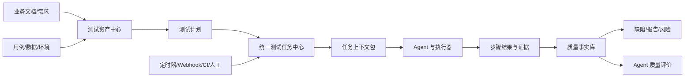

# MeterSphere 测试资产管理与 Agent 任务委派平台改造方案

> 文档版本：V1.0  
> 编制日期：2026-08-12  
> 适用范围：MeterSphere 产品、前端、后端、Agent Bridge、MCP、Browser Runner 及测试团队  
> 方案状态：建议稿

## 1. 方案摘要

MeterSphere 后续定位为企业的**测试资产可信管理中心**与**人机测试任务协作平台**。平台管理资产、版本、任务、权限、证据和质量结论；Agent 读取平台提供的任务上下文，调用受控执行器完成测试并回写结构化结果。

本次改造不推翻现有项目、功能用例、测试计划、缺陷和报告能力，也不新建独立的通用 Agent 编排平台。改造采用“**内核收敛、协议开放、执行外置、证据可信**”的策略：

1. 将功能用例、文档、数据、环境、证据和缺陷统一为可版本化、可关联的测试资产。
2. 将测试计划与单次执行解耦，以统一测试任务承载人工、定时、CI 和 Agent 执行。
3. 收敛现有自动化执行能力为标准执行器，通过统一任务和结果协议接入。
4. 复用并明确现有 `metersphere-mcp`、`agent-bridge`、`ai-browser-runner` 的职责。
5. 先完成一条可靠的 Agent 执行闭环，再扩展智能分析和自主决策。

## 2. 建设目标与非目标

### 2.1 建设目标

- 建立“业务文档 → 用例 → 计划 → 任务 → 执行 → 证据 → 缺陷 → 质量结论”的完整资产链。
- 同一套结构化用例同时服务人工执行和不同类型的 Agent。
- 支持 Agent 定时或按事件获取测试任务，可靠领取、续租、执行、暂停和回写。
- 固定任务执行时读取的文档、用例和环境版本，保证历史结果可解释、可复现。
- 将产品失败、Agent 失败、环境失败、数据失败和用例阻塞分开统计。
- 通过标准 REST API、事件协议、MCP 和 SDK 接入 Codex、Cursor、企业自研 Agent 等执行端。
- 所有执行结论具备步骤级证据、来源标识和完整审计记录。

### 2.2 非目标

- 不把 MeterSphere 建设成通用大模型对话或多 Agent 开发平台。
- 不允许 Agent 直接访问平台数据库或绕过领域服务写入结果。
- 不在首期追求完全无人干预的自主测试。
- 不在首期替代企业已有的语雀、Confluence、TAPD 等文档和研发协作平台。
- 不强制重写现有接口、性能和浏览器执行引擎。

## 3. 现状判断与复用策略

当前仓库已具备较好的演进基础：

| 现有组件/能力 | 当前基础 | 改造定位 |
|---|---|---|
| 项目、权限、功能用例、计划、缺陷、报告 | 已形成测试管理主链 | 作为测试资产与质量事实的权威数据源 |
| `metersphere-mcp` | 已支持资产读写、计划检索、执行创建、事件读取、取消与恢复 | 保持无业务逻辑的 Agent 工具适配层 |
| `agent-bridge` | 已支持设备配对、出站 WSS、Provider CLI 调用和本地凭据边界 | 负责设备身份、Agent 连接、心跳、任务通道与本地进程控制 |
| `ai-browser-runner` | 已支持冻结动作、确定性断言、Origin 白名单和证据脱敏 | 作为浏览器执行器，不承担平台任务编排和业务决策 |
| AI 执行任务相关接口 | 已有范围解析、任务创建、事件、取消与恢复基础 | 收敛为统一任务领域，不再继续产生平行任务模型 |

改造首先做协议和模型收敛，然后补齐资产版本、任务可靠性、证据链和调度能力。

## 4. 目标业务架构



### 4.1 平台与 Agent 的职责边界

| 平台控制面 | Agent 执行面 |
|---|---|
| 资产、版本和关联关系 | 理解任务上下文 |
| 任务生成、路由和状态机 | 选择已授权工具 |
| Agent 身份、能力和权限 | 执行用例步骤和断言 |
| 凭据引用和短期授权 | 采集截图、日志等证据 |
| 人工审批与介入 | 报告进度和申请介入 |
| 结果验收、审计和统计 | 提交结构化结果 |

## 5. 产品模块增删改方案

### 5.1 保留并强化

1. **系统—组织—项目体系**：继续作为资产、权限、环境和 Agent 授权边界。
2. **功能用例**：增加版本、发布状态、数据集、结构化断言、证据要求、风险等级和 Agent 执行策略。
3. **测试计划**：保留范围组织能力，改为引用用例版本；计划本身不再等同于一次执行。
4. **缺陷与报告**：加强与用例版本、任务、步骤、证据、修复和复测的双向关系。
5. **接口/性能/浏览器自动化**：保留编辑和执行能力，逐步接入统一任务与结果协议。

### 5.2 重点改造

| 当前模块 | 改造内容 |
|---|---|
| 测试计划执行 | 拆分为“计划定义”和“测试任务实例” |
| 执行状态 | 将任务运行状态与测试业务结论分离 |
| 环境配置 | 拆分环境元数据、测试账号、凭据引用、数据和健康状态 |
| 执行报告 | 改为可追溯的任务—用例—步骤—断言—证据结构 |
| 自动化模块 | 统一为执行器，复用同一任务入口和结果模型 |
| AI 功能 | 从通用聊天转向用例建议、影响分析、任务创建与结果归因 |

### 5.3 新增模块

- **测试资产中心**：统一检索文档、用例、数据、环境、公共步骤、接口、证据和缺陷。
- **业务文档中心**：接入外部文档，保存章节索引、同步版本、内容摘要和任务引用快照。
- **AI 生成用例**：从选定业务文档或需求生成结构化用例草稿和变更建议，经质量校验、差异展示与人工评审后发布为正式用例版本。
- **统一任务中心**：管理人工、定时、事件、CI 和 Agent 任务。
- **Agent 管理中心**：管理注册、在线状态、能力、授权、并发、版本和质量指标。
- **调度与触发器**：支持 Cron、Webhook、CI、资产变更和手工触发。
- **人工复核与介入中心**：处理登录、验证码、数据补充、高风险审批和结果复核。
- **统一证据中心**：以任务、用例和步骤为索引保存截图、视频、日志、HAR 和请求响应。

### 5.4 弱化、合并和逐步下线

- 合并功能、接口、性能等模块中重复的任务调度、执行记录和报告入口。
- 弱化按工具划分的一级导航，执行技术改为资产类型或执行器筛选条件。
- 停止新增不可审计的“一键生成并覆盖正式资产”能力，统一改为“AI 提议—差异—审批—发布新版本”。
- 逐步删除各执行器自建的平台级状态机和重复结果模型；原始产物仍可保留。
- 弱化长时间执行型站内聊天，持续运行任务转交给任务中心和外部 Agent。

## 6. 建议的信息架构

```text
工作台
├─ 待处理任务
├─ 执行动态
├─ 质量风险
└─ Agent 状态

测试资产
├─ 业务文档
├─ 测试用例
│  ├─ 功能用例
│  ├─ 接口用例
│  ├─ 用例评审
│  ├─ AI 生成用例
│  └─ AI 变更建议
├─ 测试数据
├─ 公共步骤与断言
├─ 接口与测试对象
└─ 环境

测试活动
├─ 测试计划
├─ 测试任务
├─ 调度与触发器
├─ 执行记录
└─ 人工复核

质量管理
├─ 缺陷
├─ 测试证据
├─ 质量报告
└─ 覆盖与趋势

Agent
├─ Agent 列表
├─ 能力与授权
├─ 调度队列
├─ 执行评价
└─ 接入配置
```

为控制迁移风险，首期保留原导航并增加统一入口；稳定后再合并旧入口。

### 6.1 AI 生成用例产品流程

AI 生成用例属于测试资产的生产与治理能力，不作为独立的通用聊天功能。建议流程为：

```text
选择业务文档/需求及固定版本
→ 选择生成范围、用例类型和策略
→ AI 提取业务规则、风险点和验收条件
→ 生成结构化用例草稿
→ 完整性、重复、冲突和可执行性校验
→ 展示来源引用、生成依据和现有用例差异
→ 人工编辑与评审
→ 发布正式用例新版本
→ 可选加入测试计划或创建测试任务
```

每次生成需要保存生成批次、来源资产版本、引用片段、模型/Provider、提示模板版本、生成参数、输出草稿、校验结果、审批人和发布时间。正式用例仍由测试资产版本体系管理。

生成模式建议包括：

- 根据新业务文档首次生成用例。
- 根据文档变更生成新增、修改和废弃建议。
- 对已有用例进行覆盖缺口补充。
- 分别生成正常、异常、边界、权限、兼容性和数据校验场景。

AI 输出默认进入草稿或变更建议状态，禁止直接覆盖或静默发布正式用例。文档中的提示性内容视为不可信业务资料，不能改变平台指令、权限或安全策略。

## 7. 核心领域模型

### 7.1 测试资产统一属性

所有主要资产应具备：`id`、`projectId`、`type`、`name`、`version`、`status`、`owner`、`tags`、`permissionPolicy`、`createdAt`、`updatedAt` 和内容摘要。资产间关系使用独立关联表管理，不在正文中保存易失链接。

### 7.2 用例版本模型

- 用例主记录保存稳定身份和当前发布版本。
- 用例版本保存前置条件、步骤、数据、预期、断言和证据要求。
- 测试计划引用明确的用例版本；创建任务后再次冻结为任务快照。
- Agent 对步骤的调整作为执行偏差记录，不能静默修改原用例。

### 7.3 统一测试任务

建议核心字段：

```text
taskId / projectId / planId / source / taskType / objective
priority / status / verdict / riskLevel / environmentSnapshotId
contextPackageId / executorType / requiredCapabilities
assignedAgentId / leaseOwner / leaseExpireAt / heartbeatAt
idempotencyKey / timeoutAt / retryPolicy / approvalPolicy
createdBy / createdAt / startedAt / finishedAt
```

任务与业务结论必须分离：

- `status` 表示 `PENDING/RUNNING/WAITING/COMPLETED/CANCELED` 等运行状态。
- `verdict` 表示 `PASSED/PRODUCT_FAILED/AGENT_FAILED/ENV_FAILED/DATA_FAILED/BLOCKED/INCONCLUSIVE`。

### 7.4 任务状态机

```text
DRAFT → WAITING_APPROVAL → QUEUED → CLAIMED → PREPARING_CONTEXT
      → RUNNING → WAITING_HUMAN（可选） → SUBMITTING
      → WAITING_REVIEW（按策略） → COMPLETED

任意活动状态 → CANCELING → CANCELED
租约超时 → REQUEUED 或 FAILED
```

任务采用租约领取，领取、续租、结果提交和取消均需幂等。Agent 掉线后由平台回收任务，高风险动作不得自动重试。

### 7.5 任务上下文包

上下文包由平台按权限生成，至少包括：目标、验收标准、文档片段及版本、用例快照、环境引用、测试数据引用、已知问题、允许工具、禁止操作、证据要求和审批点。上下文包保存摘要及不可变快照，记录 Agent 当时实际读取的内容。

### 7.6 统一结果与证据模型

```text
任务结果
└─ 用例结果
   └─ 步骤结果
      ├─ 动作记录
      ├─ 断言结果
      ├─ 实际结果
      ├─ 执行偏差
      └─ 证据引用
```

每条结果记录执行来源、Agent/Runner 版本、时间、耗时、失败分类、置信度和人工复核状态。Agent 判断仅作为分析信息，最终结论必须能够指向原始证据或确定性断言。

### 7.7 AI 用例生成批次

建议建立 `ai_case_generation_batch`、`ai_case_generation_item` 或等效逻辑实体：

- 批次记录项目、来源资产及版本、生成模式、模型配置、模板版本、状态、Token/成本摘要和创建人。
- 生成项记录结构化用例草稿、来源引用、校验问题、与现有用例的相似度、差异类型和审批状态。
- 发布动作通过现有用例领域服务创建或更新用例版本，不能由生成服务直接写用例表。
- 原始模型输出可按审计策略保留，但必须脱敏并与正式结构化内容区分。

## 8. Agent 接入与任务协议

### 8.1 支持的触发方式

1. **事件推送**：新任务、资产变更、人工恢复后即时通知。
2. **队列领取**：Agent 按项目授权和能力领取任务。
3. **定时触发**：用于夜间回归和周期巡检。
4. **CI/Webhook**：由构建、发布或需求状态变化触发。

首期可用“短轮询 + 长轮询/事件通知”实现，但领域协议必须支持租约、心跳和回收。

### 8.2 核心接口建议

| 接口 | 作用 |
|---|---|
| `POST /api/agent/v1/tasks/search` | 查询 Agent 有资格领取的任务 |
| `POST /api/agent/v1/tasks/{id}/claim` | 原子领取任务并获得租约 |
| `POST /api/agent/v1/tasks/{id}/heartbeat` | 续租并上报进度 |
| `GET /api/agent/v1/tasks/{id}/context` | 获取已授权上下文包 |
| `POST /api/agent/v1/tasks/{id}/events` | 追加结构化执行事件 |
| `POST /api/agent/v1/tasks/{id}/artifacts` | 上传证据并返回引用 |
| `POST /api/agent/v1/tasks/{id}/results` | 幂等提交阶段或最终结果 |
| `POST /api/agent/v1/tasks/{id}/human-request` | 申请人工介入 |
| `POST /api/agent/v1/tasks/{id}/release` | 主动释放无法执行的任务 |
| `GET /api/agent/v1/tasks/{id}/control` | 获取取消、暂停和恢复指令 |

现有 `metersphere.execution.*` 工具应映射到上述领域能力，不在 MCP 包中实现选例、重试和状态判断逻辑。

### 8.3 Agent 能力声明

```json
{
  "agentType": "browser-agent",
  "version": "1.0.0",
  "capabilities": ["browser.chrome", "api.http"],
  "taskTypes": ["functional-ui", "api-regression"],
  "maxConcurrency": 2,
  "supportedEvidence": ["screenshot", "video", "network-log"]
}
```

调度器只按已验证能力、项目授权、环境范围、健康状态和并发余量分配任务。

## 9. 组件改造职责

### 9.1 MeterSphere 后端

- 建立资产版本、关联关系、统一任务、上下文包、证据和 Agent 注册领域服务。
- 成为状态机、权限、租约、幂等、调度和结果验收的唯一权威实现。
- 复用现有功能用例、计划、附件、缺陷与报告领域服务，不直接跨表写入。
- 发布任务、资产变更、取消和人工恢复事件。

### 9.2 MeterSphere 前端

- 新增任务中心、Agent 管理、证据查看和人工复核页面。
- 在用例和计划页面增加“创建任务”，替代每种执行器独立入口。
- 执行详情统一展示任务、用例、步骤、断言、证据、失败类型和回写状态。
- 对高风险操作、范围过大、生产环境和低置信度结果提供明确审批。

### 9.3 `metersphere-mcp`

- 继续保持 REST API 的薄封装和稳定 Schema。
- 补齐任务领取、心跳、上下文、人工介入、结果和证据工具。
- 对旧 Tool 保持兼容并标注迁移路径，不在客户端复制平台业务规则。

### 9.4 `agent-bridge`

- 在现有设备配对和 WSS 基础上增加 Agent 能力注册、在线心跳、任务通知和控制指令。
- 管理 Provider 本地进程生命周期、并发和任务隔离。
- 不上传 Provider 凭据、Cookie 或本地账号密码。
- Bridge 与服务端都不把“进程启动成功”视为“测试执行成功”。

### 9.5 `ai-browser-runner`

- 保持冻结动作、确定性断言、Origin 白名单和隔离 Browser Context。
- 接入统一任务租约、取消、事件、步骤结果和证据协议。
- 不解释开放式业务文档；动作生成由上游 Agent 完成并经策略校验。
- 保留人工登录和 MFA 处理，不绕过安全验证。

## 10. 权限、安全与审计

### 10.1 身份与最小权限

- Agent、Bridge、Runner 分别使用独立身份，禁止共用普通用户 Token。
- 权限按组织、项目、任务类型、环境、工具和操作粒度授权。
- 生产环境默认只读；删除、支付、发布、权限变更和批量修改必须审批或禁止。
- Token 短期化、可撤销，并与任务、设备和受众绑定。

### 10.2 凭据处理

- 任务正文只携带 `credentialRef`，不携带明文凭据。
- 凭据由受控执行环境按任务期注入；模型上下文、日志、截图不得出现密钥。
- Cookie、LocalStorage Token、密码和私钥不得上传平台普通日志。

### 10.3 提示注入防护

- 平台控制指令、业务资料和外部页面内容分为不同信任层。
- 文档或页面中的文本不能扩大 Agent 权限、改变禁止操作或指示泄露信息。
- 工具调用由策略层校验，不能仅依赖模型遵守提示词。

### 10.4 审计

完整记录任务创建、审批、分配、上下文读取、工具调用摘要、动作、断言、证据、结果、人工介入、取消和资产修改。审计日志只追加并支持按组织保留策略归档。

## 11. 数据改造建议

建议在详细设计阶段评审以下逻辑实体，表名可按现有规范调整：

| 逻辑实体 | 主要用途 |
|---|---|
| `test_asset_version` | 文档、用例等资产版本及摘要 |
| `test_asset_relation` | 需求、文档、用例、缺陷和结果之间的关系 |
| `test_task` | 统一任务主表 |
| `test_task_case` | 任务冻结的用例范围与版本 |
| `test_task_context` | 上下文包快照和权限范围 |
| `test_task_lease` | Agent 领取、续租与回收 |
| `test_task_event` | 只追加执行事件流 |
| `test_step_result` | 步骤动作、断言、实际结果和失败类型 |
| `test_artifact` | 证据元数据、存储引用、摘要和脱敏状态 |
| `agent_instance` | Agent 身份、能力、状态和版本 |
| `agent_task_metric` | Agent 执行质量、耗时和成本指标 |
| `task_trigger` | Cron、Webhook、CI 和资产变更触发器 |
| `ai_case_generation_batch` | 一次 AI 生成任务的来源、模型、策略、状态与成本摘要 |
| `ai_case_generation_item` | 用例草稿、来源引用、差异、质量校验和审批状态 |

迁移采用“新表旁路写入—双读校验—统一入口—旧模型只读—下线”的顺序，不直接删除现有执行数据。

## 12. 分阶段实施计划

### 阶段 0：模型与协议收敛（2～3 周）

交付：

- 统一术语、任务状态、业务结论、失败分类和证据 Schema。
- 梳理现有 AI 执行相关表、接口和页面，明确兼容矩阵。
- 决定已有 `ai_execution_task` 等结构是演进、映射还是迁移。
- 发布 Agent API V1、事件协议、幂等和租约规范。
- 建立功能开关、数据库迁移和回滚方案。

验收：同一任务在后端、MCP、Bridge、Runner 和前端中不存在不同含义的状态。

### 阶段 1：最小可靠闭环 P0（4～6 周）

范围限定为一个项目、一种 Browser Agent、测试环境和功能用例：

- 从计划或用例创建任务。
- Agent 注册、能力声明、领取、心跳、续租、取消和掉线回收。
- 冻结用例版本和基础上下文包。
- 步骤级事件、结果、截图和失败分类。
- 人工登录、任务恢复和结果复核。
- 计划内结果兼容回写。

验收：20 条以内的冒烟用例可以稳定完成“创建—领取—执行—证据—结果—报告”闭环；重复提交不会产生重复结果。

### 阶段 2：资产与调度增强 P1（6～10 周）

- 业务文档接入、版本同步和章节引用。
- AI 生成用例、覆盖缺口补充、差异展示和评审发布闭环。
- 环境、测试数据和凭据引用治理。
- 定时任务、Webhook、CI 和事件触发。
- 统一任务中心、Agent 管理中心、证据中心和人工复核中心。
- 多 Agent 能力路由、并发、配额、超时和重试策略。
- 接口测试和 MeterSphere 原生执行器接入统一协议。

验收：不同触发方式和至少两类执行器共用同一任务、证据与报告模型。

### 阶段 3：智能反馈闭环 P2（持续演进）

- 文档变更影响分析和回归范围推荐。
- 用例覆盖缺口、重复和过期识别。
- 失败聚类、缺陷草稿和复测建议。
- Agent 质量评价、准入和自动路由。
- 任务成本、稳定性和资产复用分析。

智能结果默认作为建议，不直接覆盖正式资产或发布结论。

## 13. 迁移与兼容策略

1. **API 兼容**：现有 MCP Tool 与 `/api/agent/v1` 接口至少保留一个发布周期，通过适配层映射新任务模型。
2. **数据兼容**：旧计划执行记录保持可查；新任务通过关联 ID 回写原报告，避免历史报表断裂。
3. **页面兼容**：首期保留原入口并显示对应统一任务；稳定后再合并导航。
4. **执行器兼容**：先让执行器上报统一事件和结果，再迁移其内部调度逻辑。
5. **灰度策略**：按组织、项目、Agent 类型和环境开放功能开关。
6. **回滚策略**：关闭新任务入口后，旧人工执行能力仍可工作；迁移脚本只新增或可逆扩展字段，不在首期删除旧表。

## 14. 验收标准

### 14.1 功能验收

- [ ] 测试计划与单次测试任务已经解耦，同一计划可产生多次任务。
- [ ] 任务固定文档、用例、环境和数据版本，历史执行可复现。
- [ ] Agent 只能领取能力、权限和环境均匹配的任务。
- [ ] Agent 掉线后任务能够按租约回收，不会永久卡死或并发重复执行。
- [ ] 取消、心跳、结果提交和证据上传均具有幂等保障。
- [ ] 人工执行、Browser Agent 和原生执行器结果可以进入统一报告模型。
- [ ] 每个失败结论至少关联一项有效证据或明确的确定性断言。
- [ ] 产品、Agent、环境、数据和用例问题可以独立统计。
- [ ] Agent 可申请人工登录、审批或补充数据，并从断点继续。
- [ ] AI 生成的每条用例均可追溯到业务文档/需求版本和引用片段。
- [ ] AI 输出默认进入草稿或变更建议，未评审内容不能覆盖或发布正式用例。
- [ ] 新增、修改和废弃建议均展示与现有用例的差异及质量校验结果。

### 14.2 安全验收

- [ ] Agent、Bridge 和 Runner 使用独立、可撤销、最小权限身份。
- [ ] 密码、Token、Cookie 和私钥不进入模型上下文、普通日志和未脱敏证据。
- [ ] 未授权 Origin、文件路径和高风险操作被执行器拒绝。
- [ ] 文档和网页内容不能覆盖平台安全策略。
- [ ] 所有 Agent 行为都能定位到组织、项目、任务、身份和时间。

### 14.3 非功能验收建议

- 任务领取接口 P95 小于 500 ms（不含外部网络）。
- 任务事件可断点续读，客户端重连不丢失已确认事件。
- 任务创建与结果提交在相同幂等键下只产生一份业务记录。
- Agent 非正常退出后，在租约到期加一个调度周期内完成任务回收。
- 证据上传失败不能把任务标记为成功。

## 15. 运营指标与成功标准

首期不以“执行任务数量”作为唯一成功指标，建议持续观察：

- 测试资产复用率、版本完整率和关联完整率。
- Agent 任务完成率、有效失败发现率、误报率和人工驳回率。
- 证据完整率、人工接管率、环境失败率和平均恢复时间。
- 单任务耗时、成本以及相同任务重复执行一致性。
- 从需求或文档变更到回归任务产生的平均时间。

建议 P0 试点门槛：任务闭环成功率不低于 95%，证据完整率 100%，无越权及敏感信息泄露，重复提交不产生重复业务数据。

## 16. 风险与应对

| 风险 | 应对措施 |
|---|---|
| 现有 AI 执行模型与新任务模型重复 | 阶段 0 完成模型盘点，优先演进或映射，禁止平行建设 |
| 文档和用例质量不足 | 先治理核心链路和高频回归资产，再扩大 Agent 范围 |
| Agent 结果不稳定 | 结构化步骤、确定性断言、证据验收和人工复核 |
| 多执行器结果口径不同 | 强制统一结果 Schema，执行器原始结果作为附件保留 |
| 凭据和生产环境风险 | 短期令牌、凭据引用、隔离环境、审批和禁止动作 |
| 任务重复或丢失 | 幂等键、租约、心跳、事件日志和补偿扫描 |
| 改造范围过大 | 单项目单执行器试点，功能开关灰度，按阶段验收 |

## 17. 首批实施任务建议

| 优先级 | 任务 | 主要产出 |
|---|---|---|
| P0 | 现有 AI 执行模型与接口盘点 | 状态、表、API、页面和兼容矩阵 |
| P0 | 统一任务领域设计 | 状态机、结论、失败分类、租约和幂等规范 |
| P0 | 用例版本及任务快照 | 版本引用、冻结范围和摘要校验 |
| P0 | Agent 注册与领取协议 | 能力声明、领取、心跳、回收和取消 |
| P0 | 统一事件、结果和证据 Schema | 步骤级可追溯闭环 |
| P0 | Browser Runner 协议适配 | 统一任务控制和回写 |
| P0 | 任务详情与人工复核页面 | 状态、步骤、证据、审批和恢复 |
| P1 | 文档接入与上下文包 | 文档版本、章节引用和权限裁剪 |
| P1 | AI 生成用例闭环 | 生成批次、结构化草稿、来源引用、质量校验、差异评审和版本发布 |
| P1 | 定时/事件/CI 触发 | 触发器、调度、配额和审计 |
| P1 | 原生执行器适配 | 接口测试等进入统一结果模型 |
| P2 | Agent 评价与智能反馈 | 质量评分、自动路由和影响分析 |

## 18. 最终决策建议

1. 先批准“统一任务模型和协议收敛”，暂缓继续扩展平行的 AI 执行入口。
2. 以现有功能用例、测试计划和 Browser Runner 为 P0 试点，不同时覆盖所有测试类型。
3. `metersphere-mcp` 保持薄封装，业务规则全部落在 MeterSphere 后端。
4. Agent 创建定时任务属于受控写操作：平台负责审批、持久化和调度，Agent 只能按权限提出或创建触发器。
5. 只有执行完成、证据持久化、结果回写和汇总校验全部成功，任务才能进入成功终态。

通过以上改造，MeterSphere 将从以测试工具分类为核心的平台，逐步演进为以测试资产和质量事实为核心的平台，同时成为不同 AI Agent 可安全接入、可靠领取任务并形成证据闭环的测试控制中心。
