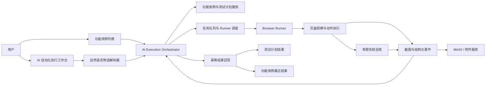

# MeterSphere AI Web UI 自动化测试执行改造方案

> 文档版本：V1.0
> 编制日期：2026-08-06
> 第一阶段范围：手工选择用例、自然语言筛选用例、AI 执行、截图留证、结果回写、失败自愈
> 适用代码基线：MeterSphere 当前仓库（`agent-integration`、功能用例、测试计划、AI Provider、附件服务）

## 1. 方案结论

第一阶段建议采用“**MeterSphere 服务端统一编排 + 独立 Browser Runner 执行 + 现有功能用例/测试计划链路回写**”的方案，不在大模型进程中直接操作数据库，也不把浏览器执行逻辑嵌入 MeterSphere 主服务。

现有代码已经具备以下基础能力：

- `agent-integration` 已提供功能用例检索、执行范围解析、执行任务、事件日志、结果提交和附件上传能力。
- 已存在 `ai_execution_task`、`ai_execution_case`、`ai_execution_event` 和回写幂等表。
- 前端已有功能用例列表【AI执行】入口和自动化执行工作台雏形。
- 系统设置已具备 AI Provider/模型接入能力。
- 测试计划内、计划外功能用例结果已有可复用的回写链路。

第一阶段真正需要补齐的核心是：

1. 将自然语言稳定地转换为可审计的结构化筛选条件。
2. 建设可部署、可调度的 Browser Runner。
3. 建设“观察—动作—校验—有限自愈”的 Web UI 执行引擎。
4. 将步骤级结果、截图、自愈轨迹和最终结果可靠回写。
5. 完成权限、凭据、目标域名、敏感数据和高风险动作治理。

不建议第一阶段实现任意桌面应用控制、接口/性能测试、跨项目混合执行、自动修改原始用例、无限制自主探索或生产环境破坏性操作。

## 2. 目标与范围

### 2.1 业务目标

用户可以通过以下两种入口发起 Web UI 功能测试：

- 在功能用例列表中手工勾选一个或多个已有用例，点击【AI执行】。
- 在自动化执行工作台输入自然语言，例如“执行用户管理模块中 P0 且最近失败的用例”，由系统返回匹配范围，用户确认后执行。

系统读取用例前置条件、步骤、预期结果和测试数据，在受控浏览器中完成操作；执行过程中按策略截图，页面轻微变化时进行有限自愈；结束后将步骤结果、最终状态、截图和失败分析回写 MeterSphere。

### 2.2 第一阶段包含

- 仅执行 MeterSphere 已有的功能测试用例，目标为 Web 页面。
- 手工选择单条或批量用例。
- 自然语言筛选项目内用例，执行前展示并确认最终 `caseId` 快照。
- Chromium 首发，架构上预留 Firefox/WebKit。
- 常用浏览器动作：导航、点击、输入、选择、勾选、上传、键盘操作、等待、滚动。
- 常用断言：文本、元素状态、URL、数量、页面标题和可见性。
- 步骤级截图、失败截图、执行日志和自愈记录。
- 计划内及计划外执行结果回写。
- 元素定位、等待、遮罩/弹窗等有限失败自愈。
- 暂停、取消、人工登录、失败项重试和任务恢复。

### 2.3 第一阶段不包含

- 自动生成或永久修改原始测试用例。
- 接口测试、性能测试、移动端原生 App 和任意桌面应用测试。
- 验证码、MFA、扫码、硬件密钥的自动绕过。
- 未经审批的支付、删除、发布、退款、权限变更等高风险操作。
- 基于像素坐标的长期录制回放方案。
- 视频和完整 HAR 默认采集；可作为后续增强，首期以截图和必要日志为主。

## 3. 可行性与现状差距

| 能力 | 当前基础 | 第一阶段处理 |
| --- | --- | --- |
| 功能用例读取 | `AgentFunctionalCaseSearchService`、MCP search/get 已有 | 复用，补充执行所需步骤标准化和版本快照 |
| 手工选择用例 | 用例列表已有【AI执行】入口 | 完善环境、浏览器、登录方式、风险确认 |
| 自然语言筛选 | 已有 `resolve` 和查询解析基础 | 新增结构化 NL Filter、候选预览和解析置信度 |
| 执行任务 | `AgentExecutionService`、任务/用例/事件表已有 | 拆分编排职责，补充租约、心跳和步骤状态 |
| 浏览器执行 | 仅协议/占位，未形成真实 Runner | 新建独立 Browser Runner，是首期关键路径 |
| 截图证据 | 附件上传及关联能力已有，采集链路未完成 | Runner 采集，服务端落 MinIO 并建立步骤关联 |
| 结果回写 | 计划内/计划外、批量、幂等基础已有 | 增加步骤、自愈和证据映射，完成对账 |
| 失败自愈 | 尚无完整实现 | 新增 Healing Engine，严格限制次数和动作范围 |
| 实时状态 | 当前以事件游标轮询为主 | 首期可继续游标轮询，稳定后升级 SSE |
| AI Provider | 系统设置已有 Provider/模型能力 | 统一复用，不为执行模块再建模型配置 |

结论：业务与平台链路可复用度较高，最大技术不确定性集中在 Browser Runner、非结构化步骤可执行性、断言可靠性和自愈误操作控制。应先用限定用例集完成技术验证，再扩大覆盖范围。

## 4. 总体架构



### 4.1 组件职责

| 组件 | 部署位置 | 主要职责 |
| --- | --- | --- |
| 自动化执行工作台 | MeterSphere Frontend | NL 输入、候选确认、执行配置、进度、证据和人工操作 |
| Execution Orchestrator | `agent-integration` | 权限校验、范围固化、状态机、Runner 调度、结果汇总和回写 |
| NL Filter Resolver | `agent-integration` + AI Provider | 将提示词转为受控筛选 DSL；后端执行确定性查询 |
| Browser Runner | 独立进程/容器 | 浏览器生命周期、页面观察、动作、断言、截图、心跳和事件上报 |
| Healing Engine | Runner 内部 | 失败分类、候选定位、有限重试和自愈证据采集 |
| Artifact Service | 复用附件/MinIO | 截图上传、元数据、权限、保留和清理 |
| Writeback Adapter | `agent-integration` | 适配计划内/计划外结果，保证幂等与部分成功 |

### 4.2 关键设计原则

- **执行范围先固化**：任务创建时保存用例 ID、用例版本和步骤快照，运行中列表变化不得改变任务范围。
- **模型输出不直接执行**：模型只能输出符合 JSON Schema 的动作计划；Runner 对动作、域名和参数再次校验。
- **单步闭环**：每一步都遵循观察、规划、执行、验证、记录；禁止一次生成长脚本后无反馈地盲跑。
- **证据优先**：失败、自愈和最终断言必须有可追踪证据。
- **结果可解释**：原始执行、自愈尝试和最终判定分别记录，不能用自愈结果覆盖首次失败事实。

## 5. 端到端业务流程

### 5.1 手工选择用例

1. 用户在功能用例列表勾选用例并点击【AI执行】。
2. 前端提交稳定 `caseIds`，后端复核项目权限、删除状态、最新版本及数量限制。
3. 弹窗选择目标环境、基础 URL、浏览器、登录方式、自愈策略。
4. 后端展示用例范围、高风险提示和预计耗时；用户确认后创建任务。
5. Orchestrator 固化用例与步骤快照，分配 Runner。
6. Runner 准备浏览器；需要人工登录时任务进入 `WAITING_LOGIN`。
7. 按用例和步骤执行，持续上报状态、截图、自愈事件。
8. 用例结束后幂等回写；全部处理后进行结果与证据对账。

### 5.2 自然语言筛选用例

1. 用户输入提示词。
2. AI 将提示词解析为受控 DSL，不直接拼接 SQL。
3. 后端用现有检索服务执行 DSL，返回匹配用例、命中原因、排除项、总数和风险提示。
4. 用户可以调整筛选条件或移除个别用例。
5. 用户确认后，系统将最终 `caseIds` 快照写入任务，后续流程与手工选择一致。

建议 DSL 示例：

```json
{
  "projectId": "project-id",
  "moduleIds": ["user-management"],
  "keywords": ["登录"],
  "priorities": ["P0"],
  "tags": ["smoke"],
  "lastResults": ["FAILED", "BLOCKED"],
  "excludeRiskActions": true,
  "limit": 20,
  "sort": ["priority:asc", "updateTime:desc"]
}
```

解析结果必须区分“模型理解结果”和“数据库实际命中结果”。项目不明确、候选模块重名、数量超阈值或出现高风险用例时必须人工确认。

## 6. Web UI 执行模型

### 6.1 用例步骤标准化

现有功能用例可能是文本步骤，不能假定每条都可直接自动执行。任务准备阶段将步骤转换为以下内部模型：

```json
{
  "stepId": "step-1",
  "instruction": "输入用户名 admin",
  "expected": "用户名输入成功",
  "action": {
    "type": "FILL",
    "target": {
      "role": "textbox",
      "name": "用户名",
      "testId": null
    },
    "valueRef": "credential.username"
  },
  "assertions": [
    {"type": "ATTRIBUTE", "name": "value", "operator": "NOT_EMPTY"}
  ],
  "riskLevel": "LOW"
}
```

当步骤无法形成明确动作或预期结果不可验证时，任务在执行前标记该步骤为 `NEEDS_REVIEW`；第一阶段不允许模型自行补造业务预期。

### 6.2 定位优先级

元素定位按稳定性从高到低选择：

1. `data-testid`、稳定业务属性。
2. ARIA role + accessible name。
3. 表单 label、placeholder、可见文本。
4. 语义结构与邻近元素。
5. DOM/CSS/XPath 候选。
6. 视觉定位只作为最后候选，首期不作为唯一通过依据。

Runner 每次执行前验证候选元素唯一性、可见性、可操作性和所在域名。模型不得直接注入任意 JavaScript。

### 6.3 断言与结果判定

- 动作执行成功不等于用例通过；必须验证预期结果。
- 断言由确定性检查优先完成，视觉/模型判断仅用于难以结构化的场景。
- 模型判断必须输出结论、置信度和证据引用；低于项目阈值时标记 `NEEDS_REVIEW`。
- 用例状态建议统一为 `SUCCESS`、`FAILED`、`BLOCKED`、`SKIPPED`、`NEEDS_REVIEW`、`ERROR`。

## 7. 失败自愈方案

### 7.1 自愈目标

自愈用于处理页面非业务性、小范围变化，提升执行稳定性；不能改变测试意图、业务数据或预期结果。第一阶段只实施执行层自愈，不自动更新平台原始用例。

### 7.2 失败分类与策略

| 失败类型 | 可执行自愈 | 禁止行为 |
| --- | --- | --- |
| 元素未找到 | 重新观察 DOM/可访问性树，按同义文本、role、label、邻近关系生成候选 | 修改测试预期或点击语义无关元素 |
| 元素不可操作 | 等待动画/加载，滚动到可见区域，关闭已知低风险遮罩 | 强制执行隐藏元素或移除业务弹窗 |
| 页面加载超时 | 在总超时预算内等待网络空闲或重试导航 | 无限刷新、绕过证书或域名策略 |
| 点击无效果 | 检查目标状态，尝试可访问性点击或键盘操作 | 对提交/支付/删除动作重复点击 |
| 登录失效 | 进入 `WAITING_LOGIN` 或使用受控凭据重新登录 | 将密码、Cookie、Token 发送给模型 |
| 断言失败 | 重新采集页面和等待短暂一致性；确认仍失败后结束 | 修改断言使其通过 |
| 业务错误提示 | 截图并判定失败/阻塞 | 隐藏错误或改用其他业务路径规避 |

### 7.3 自愈状态机

```text
STEP_RUNNING
  → STEP_FAILED_INITIAL
  → HEALING_ANALYSIS
  → HEALING_ATTEMPT
  → STEP_SUCCESS_HEALED / STEP_FAILED_FINAL / NEEDS_REVIEW
```

每次自愈必须保存：失败类型、首次截图、原定位策略、候选策略、选择理由、置信度、重试次数、重试截图、耗时和最终结果。

### 7.4 默认约束

- 单步骤最多 2 次自愈，单用例最多 5 次，单任务可配置总预算。
- 自愈后仍必须执行原始断言。
- 删除、支付、发布、退款、权限变更、批量提交等动作默认 `retryable=false`。
- 同一动作在结果未知时不得重放，防止重复提交。
- 自愈置信度低、候选元素不唯一或页面跳转到非白名单域名时转人工确认。
- 自愈成功的用例结果可以为 `SUCCESS`，但必须携带 `healed=true` 和完整审计轨迹，以便评估用例维护需求。

## 8. Runner 方案

### 8.1 部署形态

推荐首期提供两种模式，共用协议：

- **平台托管 Runner**：容器化运行，适用于测试环境和 CI，便于弹性伸缩与隔离。
- **用户侧 Runner**：安装在可访问内网测试环境的机器上，适用于专网、人工登录和已有浏览器会话场景。

首期优先实现 Playwright + Chromium。每个任务或用例使用独立 Browser Context，是否跨用例复用登录态由项目策略控制。

### 8.2 Runner 协议

Runner 需要支持：

- 注册与能力上报：版本、浏览器、操作系统、并发数、可访问环境标签。
- 心跳与租约：服务端分配短期租约，超时后重新调度或标记阻塞。
- 拉取任务：只获得已固化的步骤快照、目标 URL、策略和密钥引用。
- 事件上报：使用单调递增序号和幂等键，支持断线续传。
- 证据上传：先申请临时上传凭证，再回传附件 ID 和校验值。
- 控制指令：暂停、继续、取消、人工登录完成。
- 完成上报：提交用例级结果、步骤明细和证据清单；由服务端决定最终任务状态。

Runner 使用一次性任务令牌，只能访问当前任务和允许的附件接口，任务结束或租约过期后立即失效。

## 9. 状态机与调度

建议任务状态：

```text
CREATED → RESOLVING_SCOPE → WAITING_CONFIRMATION
        → QUEUED → PREPARING_BROWSER → WAITING_LOGIN
        → RUNNING → WRITING_BACK
        → SUCCESS / PARTIAL_SUCCESS / FAILED / CANCELED / EXPIRED
```

建议用例状态：

```text
PENDING → RUNNING → HEALING
        → SUCCESS / FAILED / BLOCKED / SKIPPED / NEEDS_REVIEW / ERROR
```

状态变更只允许由服务端状态机执行。Runner 上报事实事件，不能直接把任务标记为 `SUCCESS`。仅当用例全部进入终态、必需证据已落库、结果回写完成且统计对账一致时，任务才能成功。

## 10. 数据模型改造

现有任务、用例和事件表继续复用，建议新增或扩展如下。

### 10.1 `ai_execution_task` 扩展

| 字段 | 说明 |
| --- | --- |
| `selection_mode` | `MANUAL` / `NATURAL_LANGUAGE` |
| `prompt` | 用户原始提示词，按审计策略脱敏 |
| `resolved_filter` | 结构化筛选 DSL |
| `case_snapshot_hash` | 最终用例范围摘要，防止范围漂移 |
| `policy_snapshot` | 超时、自愈、截图和风险策略快照 |
| `runner_lease_id` | 当前 Runner 租约 |
| `writeback_status` | 回写汇总状态 |
| `artifact_status` | 证据落库汇总状态 |

### 10.2 `ai_execution_case` 扩展

| 字段 | 说明 |
| --- | --- |
| `case_version` | 执行时用例版本 |
| `case_snapshot` | 名称、前置条件、步骤和预期结果快照 |
| `heal_count` | 自愈次数 |
| `healed` | 是否发生过成功自愈 |
| `failure_category` | 定位、超时、断言、业务、环境等分类 |
| `writeback_status` | 单用例回写状态 |

### 10.3 新增 `ai_execution_step`

保存任务步骤快照及执行结果，关键字段包括：`task_id`、`execution_case_id`、`source_step_id`、`pos`、`instruction`、`expected`、`action_json`、`assertion_json`、`status`、`actual_result`、`started_at`、`finished_at`、`retry_count`、`healed`、`failure_category`。

### 10.4 新增 `ai_execution_healing`

保存每次自愈：`task_id`、`execution_case_id`、`execution_step_id`、`attempt`、`failure_type`、`original_locator`、`candidate_locators`、`selected_locator`、`reason`、`confidence`、`result`、`before_artifact_id`、`after_artifact_id`、`duration_ms`。

### 10.5 新增 `ai_runner` 与 `ai_runner_lease`

保存 Runner 能力、状态、心跳、并发容量、环境标签以及任务租约。不要在数据库中保存浏览器 Cookie、密码或 Token 明文。

### 10.6 证据关联

优先复用现有附件表和 MinIO，仅增加任务、用例、步骤与附件的关联表或资源类型：

```text
resource_type = AI_EXECUTION_TASK / AI_EXECUTION_CASE / AI_EXECUTION_STEP / AI_HEALING
purpose = BEFORE_STEP / AFTER_STEP / FAILURE / HEALING_BEFORE / HEALING_AFTER
```

## 11. 接口改造

### 11.1 平台接口

| 接口 | 说明 | 处理建议 |
| --- | --- | --- |
| `POST /ai/execution/resolve` | 解析自然语言或显式用例范围 | 扩展返回 DSL、命中原因、风险、置信度 |
| `POST /ai/execution/task` | 创建任务 | 扩展用例/策略快照，保持幂等 |
| `GET /ai/execution/task/{id}` | 获取详情 | 增加步骤、自愈、证据和回写摘要 |
| `GET /ai/execution/task/{id}/events` | 增量事件 | 首期保持游标查询，预留 SSE |
| `POST /ai/execution/task/{id}/confirm` | 确认范围/风险 | 记录确认人、快照哈希和原因 |
| `POST /ai/execution/task/{id}/pause` | 暂停 | 等待当前安全点后暂停 |
| `POST /ai/execution/task/{id}/cancel` | 取消 | 已完成项正常回写，未执行项标记跳过 |
| `POST /ai/execution/task/{id}/retry` | 重试失败项 | 创建新 attempt，保留原始结果 |
| `POST /ai/execution/task/{id}/login-ready` | 人工登录完成 | 校验 Runner 会话后恢复 |

### 11.2 Runner 内部接口

建议使用独立内部前缀，例如 `/internal/ai-runner/v1`：

- `POST /register`
- `POST /heartbeat`
- `POST /lease/poll`
- `POST /lease/{id}/accept`
- `POST /lease/{id}/events:batch`
- `POST /lease/{id}/artifacts:prepare`
- `POST /lease/{id}/complete`
- `GET /lease/{id}/commands`

Runner 接口不进入公网 OpenAPI，也不复用长期个人 Agent Token。

## 12. 前端改造

### 12.1 功能用例列表

- 批量操作增加或完善【AI执行】。
- 执行前弹窗展示已选用例、环境、URL、浏览器、登录方式、自愈开关和截图策略。
- 超过 20 条、存在高风险动作或环境不完整时要求显式确认。
- 创建成功后跳转自动化执行工作台并定位任务。

### 12.2 自动化执行工作台

- 左侧：提示词输入、模型选择、结构化筛选条件、候选用例及命中原因。
- 右侧：任务状态、浏览器画面/最新截图、用例树、步骤进度、事件日志、证据和回写状态。
- 操作：确认、暂停、继续、取消、人工登录完成、重试失败项、转人工确认。
- 自愈步骤使用明显标识，允许查看首次失败和自愈前后证据。

### 12.3 配置入口

项目级新增 Web UI AI 执行配置：允许域名、默认环境、Runner 标签、并发数、单步/单例超时、自愈次数、截图策略、敏感字段、证据保留时间和高风险动作策略。AI Provider 继续复用系统设置，不重复建设。

## 13. 结果与证据回写

### 13.1 回写内容

- 任务 ID、执行来源、执行人（AI）、环境、浏览器、模型和 Runner 版本。
- 用例最终状态、开始/结束时间、实际结果和失败分类。
- 每个步骤的实际结果、状态、耗时和断言结果。
- 截图附件及与步骤/自愈事件的关联。
- 自愈次数、原策略、替代策略和最终结果。
- 原始提示词、解析后的筛选条件和最终用例范围摘要。

### 13.2 一致性规则

- 使用 `taskId + caseId + attempt + operation` 生成幂等键。
- 计划内用例必须携带 `testPlanId + testPlanCaseId`，复用测试计划执行链路。
- 计划外用例复用功能用例最近执行结果和执行历史链路。
- 单条回写失败不回滚已成功项；任务进入 `PARTIAL_SUCCESS` 并异步重试。
- 截图上传成功但数据库关联失败时不得清理原始上传记录，应进入对账任务。
- `SUCCESS` 必须满足用例终态、证据、回写和统计四项对账一致。

## 14. 权限、安全与治理

### 14.1 权限

建议沿用或完善：

- `AI_EXECUTION:READ`
- `AI_EXECUTION:RUN`
- `AI_EXECUTION:CANCEL`
- `AI_EXECUTION:LOGIN`
- `AI_EXECUTION:ADMIN`

发起执行时还要校验当前用户的项目访问权和功能用例读取权；计划内回写还需校验测试计划执行权限。

### 14.2 凭据与会话

- 模型只能看到凭据引用和脱敏账号标识，不能看到密码、Cookie、Token 或私钥。
- 首期无安全凭据服务时，采用 `WAITING_LOGIN` 人工登录，不在任务参数中传递明文密码。
- 用户侧 Runner 接管现有会话必须显式授权并校验域名、用户和任务。
- MFA、验证码和扫码统一转人工处理。

### 14.3 目标环境与动作治理

- 项目配置允许域名和协议；导航、上传、下载和跨域跳转均需校验。
- 默认禁止访问本机文件、云元数据地址、回环地址及未授权内网段。
- 高风险动作在隔离测试环境也要求明确策略；结果未知时绝不自动重放。
- 页面内容视为不可信输入，防止页面中的提示注入改变系统指令、目标域名或回写对象。

### 14.4 数据脱敏

- 输入密码前暂停普通截图，输入框及相邻敏感区域打码。
- 事件元数据过滤 Authorization、Cookie、Set-Cookie、Token、密码和密钥字段。
- URL 查询参数按项目规则脱敏。
- 截图和日志应用与项目附件相同的权限隔离和保留策略。

## 15. 非功能指标

建议第一阶段以小规模受控执行为目标：

| 指标 | 建议目标 |
| --- | --- |
| 单任务用例数 | 默认不超过 20 条，最大 100 条且需确认 |
| Runner 并发 | 单 Runner 默认 1～3 个 Browser Context |
| 事件上报延迟 | P95 小于 3 秒 |
| 取消生效时间 | 安全点场景下小于 10 秒 |
| 任务状态恢复 | Runner 断线 60 秒内识别，支持从用例边界恢复 |
| 结果回写幂等 | 同一幂等键重复提交不产生重复历史 |
| 截图关联成功率 | 目标 99.9%，失败进入对账 |
| 审计覆盖 | 范围确认、登录、动作、自愈、证据、回写 100% 留痕 |

## 16. 实施阶段与工作量

### 16.1 推荐拆分

| 子阶段 | 交付内容 | 预估工作量 |
| --- | --- | ---: |
| A：范围与快照闭环 | NL DSL、候选确认、步骤标准化、数据迁移、任务快照 | 12～18 人日 |
| B：Runner MVP | Runner 协议、Playwright Chromium、心跳租约、人工登录 | 20～30 人日 |
| C：执行与自愈 | 动作/断言引擎、失败分类、有限自愈、风险控制 | 20～30 人日 |
| D：证据与回写 | 截图采集、附件关联、步骤回写、幂等和对账 | 12～18 人日 |
| E：前端与治理 | 工作台、确认弹窗、配置、权限、脱敏和审计 | 15～22 人日 |
| F：测试与灰度 | 单元、集成、E2E、故障注入、安全和灰度验证 | 15～22 人日 |

整体约 **94～140 人日**。建议配置 2 名后端、1 名 Runner/自动化工程师、1 名前端和 1 名测试工程师，日历周期约 8～12 周。若只交付最小 PoC（固定环境、Chromium、人工登录、10～20 条标准化用例），可控制在 3～4 周，但不等同于可生产交付。

### 16.2 关键依赖顺序


## 17. 测试与验收

### 17.1 测试策略

- 单元测试：NL DSL 校验、状态机、风险分类、Locator 排序、自愈预算、幂等键。
- 契约测试：Orchestrator 与 Runner 的任务、事件、证据和控制协议。
- 集成测试：用例读取、任务创建、附件上传、计划内/计划外回写和权限。
- E2E 测试：构建稳定的测试站点，覆盖登录、表单、表格、弹窗、上传、断言和页面改版。
- 故障注入：Runner 断线、浏览器崩溃、附件失败、回写失败、网络超时和重复事件。
- 安全测试：SSRF、跨域跳转、提示注入、凭据泄漏、越权读取和恶意文件上传。

### 17.2 第一阶段验收标准

- [ ] 能从功能用例列表手工选择 1～20 条用例并创建任务。
- [ ] 自然语言能解析为可见的结构化条件，用户确认后范围固化且不漂移。
- [ ] 项目、环境或候选用例存在歧义时系统不自动执行。
- [ ] Chromium Runner 能执行导航、点击、输入、选择、上传、等待和常用断言。
- [ ] 不可自动化或预期不明确的步骤在执行前或执行中进入人工确认，不伪造结果。
- [ ] 关键步骤按策略截图，失败步骤必有失败截图和错误摘要。
- [ ] 元素属性或 DOM 层级轻微变化时可进行有限自愈，并完整记录前后证据。
- [ ] 高风险动作、结果未知的提交动作不会被自动重试。
- [ ] 计划内和计划外用例分别进入正确回写链路，重复上报不产生重复记录。
- [ ] 单条回写失败时任务为 `PARTIAL_SUCCESS`，并可重试和对账。
- [ ] 密码、Token、Cookie 和私钥不进入模型上下文、普通日志和未脱敏截图。
- [ ] 暂停、取消、Runner 断线和人工登录后可以按状态机安全处理。
- [ ] 任务最终统计与用例、步骤、证据和回写记录一致。

建议灰度门槛：选择 20 条已标准化的 Web UI 用例，连续执行 10 轮；无误操作和越权，确定性步骤成功率不低于 95%，自愈不得造成错误业务操作，结果回写与证据关联准确率达到 100%。

## 18. 风险与应对

| 风险 | 影响 | 应对措施 |
| --- | --- | --- |
| 用例步骤过于抽象 | AI 无法稳定执行或断言 | 引入执行前可自动化检查；推动步骤与预期结果标准化 |
| NL 筛选误匹配 | 执行错误用例 | DSL 白名单、候选预览、命中原因、数量门槛和范围快照 |
| 自愈选错元素 | 产生错误业务操作 | 唯一性校验、置信阈值、动作风险分级、有限次数和人工确认 |
| 重试导致重复提交 | 测试数据污染 | 动作幂等分类；结果未知时禁止重放；高风险动作默认不重试 |
| 页面视觉判断误判 | 错误标记通过 | DOM/可访问性断言优先，视觉判断低置信度转人工 |
| Runner 不可达目标环境 | 任务阻塞 | Runner 环境标签、预检、用户侧 Runner 和明确错误分类 |
| 凭据或证据泄漏 | 严重安全事件 | 凭据引用、本地注入、截图遮罩、日志过滤和短期令牌 |
| 执行成功但回写失败 | 平台状态不一致 | 幂等回写、`PARTIAL_SUCCESS`、异步重试和对账任务 |
| AI 调用成本或延迟过高 | 批量执行效率差 | 确定性动作优先、按失败调用模型、缓存页面语义和配额控制 |

## 19. 上线与回滚

- 使用项目级 Feature Flag：`aiWebExecutionEnabled`。
- 首先仅对内部测试项目和托管 Runner 开放，限制 Chromium、20 条以内和非生产域名。
- 数据库迁移仅新增表/字段，不删除原有结构；旧功能用例和测试计划链路保持兼容。
- Runner 使用版本能力协商，平台可拒绝不兼容版本。
- 关闭 Feature Flag 后停止新任务，允许运行中任务安全结束或取消；历史任务与证据仍可查询。
- 自愈可单独关闭，关闭后执行引擎按首次失败结果结束，不影响基础执行和回写。

## 20. 最终建议

第一阶段应按“**先确定性闭环，再增加 AI 自主性**”推进：

1. 先完成用例范围确认、任务/步骤快照、Runner 协议和确定性动作/断言。
2. 再打通截图、步骤结果、计划内/计划外回写和对账。
3. 在稳定测试站点上加入有限自愈，先覆盖定位变化、等待和低风险遮罩。
4. 最后开放自然语言批量筛选和更多项目灰度。

上线前的硬门槛是：Runner 真正可用、结果回写可对账、证据可追踪、凭据不进入模型、高风险动作不会被错误重试。缺少任一项时，只能作为 PoC，不应标记为生产可用。
