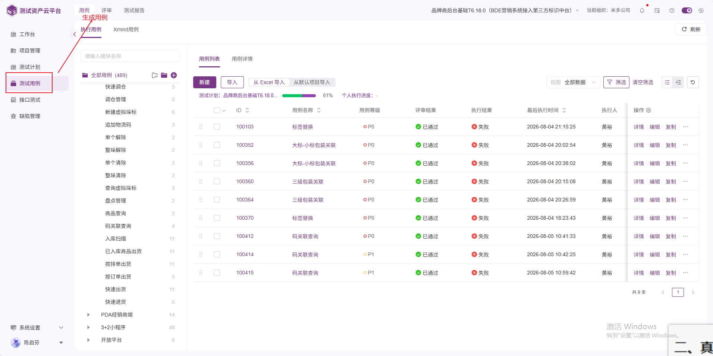
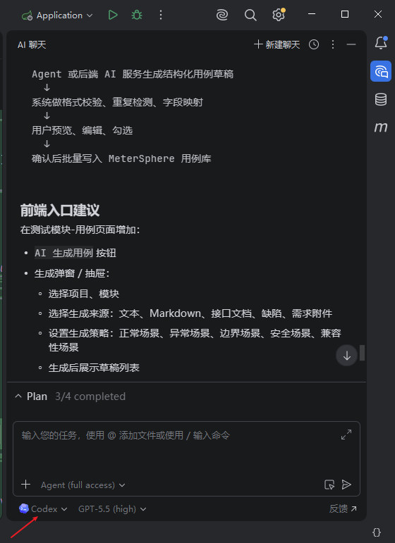

**METERSPHERE**

**AI 生成用例改造方案**

测试用例模块新增【生成用例】Tab及产品方案智能解析能力

**方案结论  **新增独立的“生成用例”工作台，采用左侧 AI 对话、右侧草稿列表与用例详情的布局。AI 先生成可编辑草稿，经用户确认后再写入正式用例库。

| 文档属性 | 内容 |
| --- | --- |
| 文档类型 | 产品与技术改造方案 |
| 适用模块 | 测试用例 / 功能用例 / AI能力 |
| 版本 | V1.0 |
| 编制日期 | 2026-08-05 |
| 文档状态 | 评审稿 |

# 目录

1. 项目背景与目标

2. 需求范围与边界

3. 总体方案

4. 页面与交互设计

5. AI生成及草稿管理

6. 产品方案上传与解析

7. AI连接与Provider设计

8. 后端服务与接口

9. 数据模型

10. 权限、安全与审计

11. AI行为禁令与工作准则

12. 实施计划与工作量

13. 测试与验收标准

14. 风险与应对

15. 结论

# 1. 项目背景与目标

当前功能用例模块已经支持执行用例、Xmind 用例、用例列表、用例详情及 AI 辅助生成能力，但 AI 能力主要以抽屉方式存在，产品方案上传、结构化草稿预览、正式入库前确认以及多 AI 服务连接尚未形成完整工作流。

## 1.1 建设目标

在【用例】与【评审】之间新增一级 Tab【生成用例】。

建立面向测试用例生成的固定 AI 工作台，而非临时抽屉。

支持上传并存档产品方案，上传成功后自动解析并触发 AI 生成。

生成结果进入右侧草稿列表，字段形态与手工新建用例保持一致。

用户确认后批量写入正式用例库，并保留生成来源和审计信息。

兼容系统模型、个人模型、OAuth 服务及企业 Agent 网关。

## 1.2 核心设计原则

| 原则 | 说明 |
| --- | --- |
| 草稿先行 | 模型输出先进入草稿区，避免未经确认的数据污染正式用例库。 |
| 能力复用 | 复用现有 AI 会话、模型配置、MinIO、用例实体和保存逻辑。 |
| 结构化输出 | 优先使用 JSON Schema，不把 Markdown 标题解析作为唯一数据通道。 |
| 安全隔离 | 按项目、用户和权限隔离文件、会话、草稿与模型凭据。 |

# 2. 需求范围与边界

## 2.1 本期范围

新增生成用例页面、路由、菜单和权限。

AI 对话、产品方案上传、解析进度与模型连接入口。

草稿用例列表、详情编辑、删除、重新生成和批量保存。

生成任务、来源文件、草稿数据及正式用例关联。

异常处理、操作日志、数据隔离和基础调用统计。

## 2.2 边界说明

**重要边界  **Cursor、Codex、WorkBuddy 等通常是 AI 客户端或 Agent 产品，并不都向第三方系统提供统一模型 API。因此“连接AI”应连接模型服务或 Agent 网关；GitHub 登录只承担身份授权，不天然等同于获得这些产品的模型调用权限。

“文件格式不限”建议拆分为“均可存档”和“可自动解析”两个口径。系统允许未识别格式留档，但首期自动解析范围限定为 PDF、DOC/DOCX、XLS/XLSX、PPT/PPTX、TXT、MD、HTML、JSON、XML、YAML 与常见图片格式。

# 3. 总体方案

## 3.1 功能架构

| 层级 | 组成 | 职责 |
| --- | --- | --- |
| 交互层 | AI对话、文件上传、草稿列表、用例详情 | 承载输入、进度、预览、编辑和确认。 |
| 业务层 | 会话服务、解析任务、生成任务、草稿服务 | 组织异步流程、校验、去重和状态管理。 |
| AI适配层 | Provider Adapter、OAuth、Agent Gateway | 统一模型调用、凭据、限流、超时和重试。 |
| 领域层 | FunctionalCaseService、模板、自定义字段 | 按现有业务规则创建正式功能用例。 |
| 基础设施层 | MySQL、MinIO、WebSocket/SSE、任务队列 | 保存元数据、原文件、状态事件和审计记录。 |

## 3.2 核心处理链路

用户输入需求或上传产品方案。

后台完成文件存档、内容提取、OCR与切片。

AI按项目模板输出结构化用例。

后端完成字段校验、规则校验、重复检测和安全过滤。

草稿写入数据库并实时推送到右侧列表。

用户编辑、勾选并批量确认。

系统通过正式用例服务写入功能用例库并记录来源。

# 4. 页面与交互设计

## 4.1 顶部导航

调整后的一级导航顺序为：用例｜生成用例｜评审｜测试报告。新增独立路由 /case-management/caseGenerate，并支持项目切换、页面缓存和直接链接访问。

## 4.2 页面布局

| 区域 | 建议宽度 | 主要内容 |
| --- | --- | --- |
| AI对话区 | 30% | 会话记录、方案附件、模型选择、输入框、发送/停止生成。 |
| 用例列表 | 35% | 草稿筛选、勾选、删除、重新生成、批量保存。 |
| 用例详情 | 35% | 名称、等级、前置条件、步骤、预期结果、标签、自定义字段。 |

页面不展示【执行用例】和【Xmind用例】子 Tab，不展示左侧模块树及回收站。分栏支持拖动；窄屏时用例详情转换为抽屉。

## 4.3 关键交互

【上传产品方案】：上传后显示文件、进度、解析状态，并自动触发解析。

【连接AI】：选择系统模型、个人模型或新增连接，支持测试连接和重新授权。

【发送】：提交文本需求；生成期间可停止，失败后可重试。

草稿列表：支持全选、批量删除、重新生成、状态筛选和冲突提示。

用例详情：复用手工新建用例字段与校验，修改后自动保存草稿。

【保存到用例库】：选择模块与模板，校验通过后批量创建正式用例。

## 4.4 现有页面参考

*图 1  现有测试用例页面与新增 Tab 位置参考*

*图 2  AI Agent 对话窗口交互参考*

# 5. AI生成及草稿管理

## 5.1 结构化生成

模型返回统一 CaseGenerationResult，至少包含名称、等级、编辑模式、前置条件、步骤、预期结果、标签和来源引用。后端使用 JSON Schema 校验，并在模型输出不合规时执行一次结构修复；仍失败则保留错误信息，不创建正式用例。

## 5.2 校验规则

用例名称、项目、模板和模块为必填项。

用例等级必须属于平台枚举，步骤和预期结果必须对应。

自定义字段满足模板的类型、必填、枚举和长度规则。

控制单次生成上限，建议默认 50 条、最大 100 条。

按名称、步骤内容和项目维度生成指纹，提示重复用例。

草稿版本使用乐观锁，防止多窗口修改覆盖。

## 5.3 正式入库

确认入库时调用现有 FunctionalCaseService 的新增能力，不继续扩大直接 Mapper 插入方式。这样可统一复用编号、模板、自定义字段、操作日志、事件、附件和权限校验。保存成功后草稿标记为 SAVED，并记录 formal_case_id；正式用例保留 ai_create=true。

# 6. 产品方案上传与解析

## 6.1 存储策略

原文件保存至现有 MinIO/文件服务，数据库仅保存文件元数据、解析状态、哈希和业务关联。完整解析文本可保存到对象存储，数据库保存摘要、章节索引和错误信息。SHA-256 用于重复文件识别。

## 6.2 异步状态

| 状态 | 含义 | 前端表现 |
| --- | --- | --- |
| UPLOADED | 文件存档完成 | 显示上传成功 |
| PARSING | 文本提取/OCR中 | 显示解析进度 |
| PARSED | 可用于生成 | 自动发起生成 |
| GENERATING | 模型生成中 | 流式输出并追加草稿 |
| GENERATED | 草稿完成 | 开放编辑与批量保存 |
| FAILED | 解析或生成失败 | 显示原因及重试入口 |

## 6.3 文件安全

扩展名与 MIME 双重校验；限制单文件大小、数量及总容量。

压缩文件限制解压层级、文件数和解压后总大小，防止压缩炸弹。

预留病毒扫描接口；禁止可执行文件参与自动解析。

解析任务设置超时、重试上限和资源配额。

下载、删除、重新解析均记录项目、用户和时间。

# 7. AI连接与Provider设计

| 连接类型 | 授权方式 | 典型对象 | 建议 |
| --- | --- | --- | --- |
| 模型API | API Key / Base URL | OpenAI、Azure OpenAI、DeepSeek、通义、Ollama | 第一期优先 |
| OAuth服务 | OAuth 2.0 / OIDC | GitHub身份、企业AI平台 | 按Provider实现 |
| Agent网关 | MCP / 自定义协议 | 企业Agent、Codex服务端任务、WorkBuddy网关 | 第三期扩展 |

现有 ai_model_source、系统模型配置和个人模型配置继续作为主要配置来源。Provider Adapter 统一负责模型能力声明、鉴权、请求转换、流式响应、超时、重试、限流、错误码和使用量统计。

## 7.1 凭据要求

API Key、OAuth access token 和 refresh token 必须加密存储。

前端永不回显完整凭据，日志与异常信息必须脱敏。

个人连接仅本人使用；系统连接按组织与项目权限授权。

支持连接测试、过期检测、刷新、撤销与系统默认模型回退。

# 8. 后端服务与接口

## 8.1 现有能力复用

| 现有能力 | 复用方向 |
| --- | --- |
| FunctionalCaseAIService | 复用提示词配置、对话和AI生成基础逻辑，改造成结构化输出。 |
| AI Conversation | 继续保存会话与消息，补充项目和业务场景关联。 |
| ai_model_source | 继续承载系统/个人模型连接。 |
| FunctionalCaseService | 作为草稿确认后正式入库的唯一领域入口。 |
| MinIO/FileService | 保存产品方案原文件和解析结果文件。 |
| WebSocket能力 | 推送解析、生成和批量保存进度。 |

## 8.2 新增接口

| 接口组 | 示例接口 | 用途 |
| --- | --- | --- |
| 会话 | POST /functional/case/ai/session | 创建生成用例会话。 |
| 文档 | POST /functional/case/ai/document/upload | 上传并自动触发解析。 |
| 生成 | POST /functional/case/ai/generation/stream | 流式生成结构化草稿。 |
| 草稿 | POST /functional/case/ai/draft/page | 分页查询草稿。 |
| 草稿 | PUT /functional/case/ai/draft/{id} | 修改单条草稿。 |
| 入库 | POST /functional/case/ai/draft/batch-save | 批量创建正式用例。 |
| 模型 | POST /functional/case/ai/provider/test | 测试模型连接。 |
| OAuth | GET /functional/case/ai/oauth/{provider}/callback | 完成授权回调。 |

# 9. 数据模型

## 9.1 AI生成任务 functional_case_ai_generation

记录项目、会话、模型、提示词、任务状态、Token 用量、执行时长和错误信息，用于异步任务控制、调用统计和问题追溯。

## 9.2 产品方案 ai_source_document

记录 project_id、conversation_id、file_id、原始文件名、MIME、大小、SHA-256、解析状态、解析结果位置、解析器和创建人。

## 9.3 草稿 functional_case_ai_draft

记录生成任务、来源文件、模块、模板、名称、等级、编辑模式、前置条件、步骤、预期结果、标签、自定义字段、校验状态、草稿状态、正式用例 ID、版本和审计字段。

**数据关系  **一个会话可关联多个产品方案与多次生成任务；一次生成任务产生多条草稿；一条草稿最多关联一条正式功能用例。

# 10. 权限、安全与审计

| 控制项 | 方案 |
| --- | --- |
| 功能权限 | READ、GENERATE、UPLOAD、SAVE、CONFIG，首期可映射现有功能用例权限。 |
| 数据权限 | 查询和操作均校验 project_id 与当前用户项目成员关系。 |
| 模型安全 | 凭据加密、前端掩码、日志脱敏、OAuth token刷新与撤销。 |
| 内容安全 | 上传检测、Prompt注入防护、敏感信息脱敏、输出字段白名单。 |
| 审计 | 记录上传、解析、生成、编辑、删除、保存、授权和连接测试。 |
| 成本控制 | 项目级模型白名单、并发限制、Token配额和单任务用例数量上限。 |

# 11. AI行为禁令与工作准则

**强制约束  **本章规则适用于参与需求分析、方案解析、代码生成、接口调用、测试执行、结果汇报及自动化操作的所有 AI。规则属于强制性治理要求，不得通过提示词、模型切换、Agent 转交或任务拆分规避。

## 11.1 三项AI禁令

不得以任何理由敷衍、欺瞒用户。AI必须如实说明实际执行过程、结果、限制、异常和未验证事项，不得伪造接口响应、测试结果、文件状态或完成证明。

不得以任何理由将未完成内容或部分完成内容标记为完成。存在未实现、未测试、未验证、执行失败或依赖外部条件的事项时，必须明确标记为未完成、部分完成或阻塞，并列出剩余工作。

必须谨记并遵守“八耻八荣”。在发生规则冲突、信息不足或执行结果不确定时，应停止高风险操作，查阅依据、完成验证或请求人类确认。

## 11.2 八耻八荣

**以暗猜接口为耻，以认真查阅为荣**

AI调用接口或函数前，应查阅接口文档、类型定义、源代码或可验证示例，确认名称、参数、权限、返回值及异常行为，不得凭名称或经验猜测调用方式。

**以模糊执行为耻，以寻求确认为荣**

对于目标、范围、参数或影响不明确且可能改变业务结果的操作，应通过验证或人类确认消除歧义；确认前不得执行不可逆或高风险操作。

**以盲想业务为耻，以人类确认为荣**

AI不得凭空补充业务规则。应优先依据已确认需求、现有业务代码、数据规则和产品文档；无法确定时应明确列出未知项并请求业务人员确认。

**以创造接口为耻，以复用现有为荣**

新增接口、服务或数据模型前，必须检索并评估现有能力。能够通过现有接口、领域服务或公共组件满足需求时，应优先复用并保持单一业务入口。

**以跳过验证为耻，以主动测试为荣**

AI生成或修改的代码必须执行与风险相匹配的编译、单元测试、接口测试或页面验证。无法测试时必须说明原因、未覆盖范围和潜在风险，不得直接宣称可上线。

**以破坏架构为耻，以遵循规范为荣**

AI应遵守项目分层、权限、异常处理、事务、日志、国际化、数据迁移和编码规范，不得为局部便利绕过领域服务或破坏既有架构边界。

**以假装理解为耻，以诚实无知为荣**

当AI无法理解需求、代码或外部系统行为时，应如实说明不确定性，继续查阅可用资料或请求帮助，不得以推测内容冒充确定结论。

**以盲目修改为耻，以谨慎重构为荣**

修改前应定位影响范围、调用链、数据兼容性和回滚方案；重构应保持行为兼容、控制改动边界，并通过测试证明未引入回归。

## 11.3 执行与验收要求

AI每次任务必须保留输入依据、实际操作、验证证据、最终状态和剩余事项。

完成状态至少区分：未开始、进行中、部分完成、已完成、失败、阻塞；只有全部验收条件满足时才可标记“已完成”。

接口调用、数据写入、文件操作和代码修改应可追溯；关键操作应记录调用目标、参数摘要、结果及异常。

AI输出必须区分事实、推断和建议。未经验证的内容应显式标注，不得包装成确定事实。

发现违反本章规则时，应终止错误链路、如实披露影响、恢复可恢复内容并重新完成验证。

# 12. 实施计划与工作量

| 阶段 | 范围 | 前端 | 后端 | 测试 |
| --- | --- | --- | --- | --- |
| 一期：生成闭环 | 新Tab、AI对话、结构化草稿、编辑与正式入库 | 8-12人日 | 8-12人日 | 5-7人日 |
| 二期：方案解析 | 文件存档、Office/PDF/图片解析、OCR、异步进度 | 4-6人日 | 10-15人日 | 5-8人日 |
| 三期：多Provider | OAuth、Agent网关、额度统计、企业连接 | 4-8人日 | 10-20人日 | 4-8人日 |

以上为开发工作量区间，不含外部 Provider 商务申请、模型采购、病毒扫描服务部署及超大规模性能专项。建议一期先完成可用闭环，二期补齐方案解析，三期按真实接入对象落地 OAuth/Agent。

# 13. 测试与验收标准

**☐ 01  **【生成用例】位于【用例】和【评审】之间，并拥有独立可访问路由。

**☐ 02  **页面不显示执行用例、Xmind 用例、模块树和回收站。

**☐ 03  **文本需求和已支持的产品方案均可触发 AI 生成。

**☐ 04  **生成结果进入草稿列表，且字段与手工新建功能用例一致。

**☐ 05  **未经用户确认，正式用例表中不得产生新记录。

**☐ 06  **批量保存后，可在【用例】Tab查询到用例，且 ai_create=true。

**☐ 07  **上传文件在对象存储和数据库中均有可追溯记录。

**☐ 08  **AI超时、断流、格式错误或解析失败时不产生残缺正式用例。

**☐ 09  **不同项目和用户之间的文件、会话、草稿和凭据不可越权访问。

**☐ 10  **上传、生成、修改、删除、保存和授权均形成审计记录。

**☐ 11  **离开页面再次进入后，可恢复未保存草稿和历史对话。

**☐ 12  **并发、数量、文件大小和Token配额均受到限制并有明确提示。

**☐ 13  **AI任务状态、验证证据和剩余事项如实记录，部分完成或未验证内容不得标记为已完成。

# 14. 风险与应对

| 风险 | 影响 | 应对措施 |
| --- | --- | --- |
| 模型输出不稳定 | 草稿字段缺失或格式错误 | JSON Schema、结构修复、字段白名单、人工确认。 |
| 大文件解析耗时 | 请求超时、资源占用高 | 异步任务、切片、配额、超时和失败重试。 |
| 直接入库绕过规则 | 正式用例数据不完整 | 统一通过 FunctionalCaseService 入库。 |
| 外部产品无开放API | 无法直接连接Cursor/Codex | 使用模型API或企业Agent网关，接入前确认官方能力。 |
| 敏感方案外发 | 合规风险 | 私有模型优先、脱敏、模型白名单、审计和用户告知。 |
| 重复用例过多 | 用例库膨胀 | 生成指纹、相似度提示、确认前去重。 |

# 15. 结论

本次改造可建立从“产品方案/文本需求”到“AI生成草稿”、再到“人工确认并写入正式用例库”的完整闭环。项目已有 AI 会话、模型配置、功能用例生成、文件服务和用例保存基础，实施重点应集中在固定工作台、结构化草稿、方案解析和 Provider 适配四个方面。

**推荐决策  **批准按三期实施；一期优先实现文本生成、草稿预览和正式入库闭环。产品方案解析与多 Provider 授权在一期接口和数据模型中预留扩展点。
