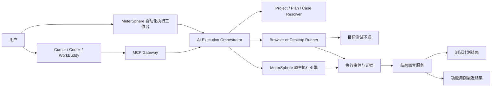

# MeterSphere Agent 自动化执行改造方案

> 文档版本：V1.0  
> 编制日期：2026-08-05  
> 适用范围：Agent 集成、测试用例、测试计划、缺陷管理、浏览器自动化

## 1. 方案结论

本需求建议基于 MeterSphere 现有 `agent-integration` 服务、Streamable HTTP MCP、功能用例检索、计划内/计划外结果回写及附件日志能力进行扩展。

新增统一的 **AI Execution Orchestrator（AI 执行编排服务）**，负责解析用户意图、确定项目/计划/用例范围、执行前确认、调度受控浏览器 Runner、输出实时日志并回写执行结果。

核心原则：

- Agent 只通过 MeterSphere MCP/API 访问平台，不得直接查询或修改数据库。
- 用例选择和降级规则集中在平台后端，Cursor、Codex、WorkBuddy 等客户端不得各自实现一套业务规则。
- 浏览器接管必须使用受控浏览器、浏览器扩展或 Desktop Runner，并经过用户授权。
- AI 不得读取、输出或记录浏览器 Cookie、密码、Token、私钥等敏感信息。
- 只有全部用例执行完成、证据落库且结果回写成功，任务才允许标记为完成。

## 2. 建设目标与范围

### 2.1 建设目标

- 支持外部 Agent 按自然语言定位项目、测试计划和指定功能测试用例。
- 按确定性优先级自动确定执行范围，项目缺失或结果存在歧义时要求用户确认。
- 在缺陷管理下新增【自动化执行】模块，左侧为 AI 对话，右侧为实时执行视窗和日志。
- 在测试用例列表勾选用例后提供【AI执行】入口。
- 支持已登录会话接管、受控凭据登录、人工登录暂停和恢复。
- 回写步骤结果、最终结果、截图、视频、网络日志和执行说明。

### 2.2 本期边界

第一阶段聚焦功能测试用例的浏览器自动化执行：

- 接口用例和场景用例应优先调用 MeterSphere 现有原生执行引擎，AI只负责编排。
- 性能测试暂不纳入本期。
- Cursor、Codex、WorkBuddy 是 Agent 客户端，不应直接连接 MeterSphere 数据库。
- 服务端无法直接发现用户本机浏览器窗口，必须通过 Runner 或扩展建立受控连接。

## 3. 用例选择与执行决策

| 用户描述 | 解析与确认 | 执行对象 | 结果回写 |
|---|---|---|---|
| 指定项目和具体用例 | 解析项目、编号、名称和模块；多匹配时展示候选项 | 仅确认后的指定用例 | 计划内回写计划；计划外回写用例最近结果和 Agent 日志 |
| 仅指定项目 | 查询项目下可执行测试计划，并按规则选择 | 优先执行计划关联的功能用例 | 测试计划执行记录与报告 |
| 无计划或计划未关联用例 | 提示降级范围和预计数量；超过阈值必须确认 | 项目【测试用例】模块内全部有效用例 | 计划外结果和 Agent 执行批次 |
| 未指定项目 | 不猜测项目、不静默采用默认项目 | 不执行 | 提示用户提供项目名称或编号 |

### 3.1 测试计划选择规则

“优先查找测试计划”不得实现为随机选择。建议按以下顺序筛选：

1. 项目精确匹配且未归档。
2. 计划状态允许执行。
3. 已关联功能测试用例。
4. 当前用户或 Agent Token 具有执行权限。
5. 用户点名计划时优先使用该计划。
6. 未点名时按“进行中、最近更新”排序。
7. 第一名不唯一或可能重复执行时，展示候选计划并要求用户确认。

### 3.2 执行确认门槛

- 精确指定并且只匹配少量用例时，可直接进入执行准备。
- 执行整个计划、整个项目或用例数超过阈值（建议20条）时，必须展示范围、环境、地址和预计耗时并二次确认。
- 存在删除、支付、发布、权限修改、批量修改等破坏性步骤时必须确认。
- 项目、环境、账号或预期结果不明确时，任务保持 `WAITING_CONFIRMATION`，不得猜测执行。

## 4. 总体架构



### 4.1 分层职责

| 层级 | 组件 | 职责 |
|---|---|---|
| 交互层 | 自动化执行工作台、AI执行按钮、外部 Agent | 发起任务、确认范围、人工登录、查看日志和结果 |
| 接入层 | AI Provider、MCP Gateway、Agent Token | 身份认证、工具发现、Scope 校验、限流和审计 |
| 编排层 | Execution Orchestrator、Case Resolver、Plan Resolver | 解析意图、固定执行范围、拆分任务、控制状态 |
| 执行层 | Browser Runner、Desktop Runner、原生执行引擎 | 页面操作、会话附着、断言、截图和证据采集 |
| 领域层 | AgentFunctionalCaseSubmitService、TestPlanFunctionalCaseService | 按计划内或计划外规则回写结果 |
| 基础设施 | MySQL、MinIO、SSE/WebSocket、任务队列 | 保存任务、日志、事件、证据和状态 |

### 4.2 执行状态机

```text
CREATED
  → RESOLVING_SCOPE
  → WAITING_CONFIRMATION（可选）
  → PREPARING_BROWSER
  → WAITING_LOGIN（可选）
  → RUNNING
  → WRITING_BACK
  → SUCCESS / PARTIAL_SUCCESS / FAILED / CANCELED
```

任何步骤失败都必须保留已完成步骤、执行证据和未执行原因。`PARTIAL_SUCCESS` 不得显示为成功。

## 5. 【自动化执行】页面设计

### 5.1 路由与权限

在缺陷管理一级导航下新增：

```text
/bug-management/automation-execution
```

虽然入口位于缺陷管理下，但不能只使用 `PROJECT_BUG:READ` 权限。建议新增：

- `AI_EXECUTION:READ`
- `AI_EXECUTION:RUN`
- `AI_EXECUTION:CANCEL`
- `AI_EXECUTION:LOGIN`
- `AI_EXECUTION:ADMIN`

### 5.2 页面布局

```text
┌──────────────────────┬──────────────────────────────────────────┐
│ AI 对话区（35%）      │ 执行视窗与日志（65%）                    │
├──────────────────────┼──────────────────────────────────────────┤
│ 会话历史              │ 任务状态 / 项目 / 计划 / Agent           │
│ 项目与用例解析结果     │ 浏览器实时画面或关键截图                 │
│ 执行范围确认          │ 用例和步骤执行进度                       │
│ 登录提示              │ INFO / WARN / ERROR 日志                │
│ [连接AI] [停止任务]   │ 结果统计 / 回写状态 / 失败原因           │
│ [输入执行要求] [发送] │ [暂停] [停止] [重试失败项] [下载日志]    │
└──────────────────────┴──────────────────────────────────────────┘
```

### 5.3 右侧执行视窗

- 顶部展示任务状态、项目、计划、环境、Agent、开始时间及暂停/停止操作。
- 画面区展示 Runner 实时画面或定时截图，密码、Token、个人信息区域默认打码。
- 步骤区按照“用例 → 步骤 → 动作 → 断言 → 证据”展示。
- 日志区按 `INFO/WARN/ERROR`、用例和步骤筛选，支持导出。
- 结果区展示成功、失败、阻塞、未执行数量，以及结果回写状态。

### 5.4 连接AI

连接方式复用【生成用例】模块的 Provider 选择、系统模型、个人模型和 OAuth/Agent 网关能力。两个页面应共享 Provider Selector 和连接状态组件，不维护两套配置。

## 6. 测试用例列表【AI执行】入口

在功能用例列表批量操作区新增【AI执行】：

- 只有勾选至少一条有效用例且拥有 `AI_EXECUTION:RUN` 权限时可用。
- 点击后先打开执行确认弹窗，不立即执行。
- 确认弹窗展示选中范围、测试计划、目标环境、地址、浏览器、登录方式和高风险提示。
- 创建任务时前端只传稳定的 `caseId` 列表，后端重新校验项目、权限、删除状态及数量限制。
- 创建成功后跳转【自动化执行】页面并定位到对应 `executionTaskId`。

## 7. Agent 与 MCP 改造

### 7.1 现有能力复用

| 现有能力 | 处理建议 |
|---|---|
| `metersphere.project.search/list/get` | 直接复用，用于项目解析和候选确认 |
| `metersphere.functional.search/get` | 直接复用，用于获取功能用例、步骤和计划关联 ID |
| `metersphere.functional.submit` | 直接复用，现已支持计划内和计划外回写 |
| `submit_functional_results_batch` | 复用批量回写，补充 `executionTaskId` 和幂等键 |
| `upload_execution_attachment` | 复用截图、视频和日志附件上传 |
| Agent Token Scope、限流、幂等记录 | 继续作为外部 Agent 调用的安全基础 |

### 7.2 新增 MCP Tools

| Tool | 权限 | 作用 |
|---|---|---|
| `metersphere.test_plan.search` | `PLAN_READ` | 按项目、名称、状态查询计划和关联用例数量 |
| `metersphere.test_plan.cases` | `FUNCTIONAL_READ` | 分页获取计划关联用例及 `testPlanCaseId` |
| `metersphere.execution.create` | `AI_EXECUTION_RUN` | 按明确 `caseIds` 或 `testPlanId` 创建任务 |
| `metersphere.execution.get` | `AI_EXECUTION_READ` | 查询任务范围、状态、统计和待处理动作 |
| `metersphere.execution.events` | `AI_EXECUTION_READ` | 按游标增量获取执行事件 |
| `metersphere.execution.cancel` | `AI_EXECUTION_RUN` | 幂等取消任务 |
| `metersphere.execution.resume` | `AI_EXECUTION_RUN` | 人工登录或确认后恢复任务 |

MCP 包继续保持薄封装。范围选择、权限、幂等、状态机和回写事务必须放在 MeterSphere `agent-integration` 服务中。

## 8. 浏览器会话与登录处理

### 8.1 登录处理顺序

1. 检查任务绑定的受控 Runner 是否存在与目标域名匹配的已授权活动会话。
2. 如存在，向用户展示即将接管的窗口、域名和账号标识；授权后附着会话。
3. 如不存在，查询平台凭据库中当前项目、环境和域名可用的凭据引用。
4. 凭据可用且用户有权限时，由 Runner 本地解密或注入并完成登录；模型不得获得明文凭据。
5. 无会话且无凭据时，任务进入 `WAITING_LOGIN`，提示用户在受控窗口完成登录。
6. Runner 检测到登录成功后只回传“会话就绪”，由用户点击继续或按策略恢复执行。

### 8.2 安全边界

- 服务端不得直接读取用户本机浏览器进程或浏览器数据目录。
- 不得导出、复制或向大模型暴露 Cookie、LocalStorage Token、密码和私钥。
- 已登录窗口接管要求域名白名单、同一用户校验和显式授权。
- MFA、验证码、扫码或硬件密钥必须交由用户处理，AI不得绕过。
- Runner 使用短期一次性任务令牌；任务结束后撤销授权。

## 9. 日志、证据与结果回写

### 9.1 结构化事件日志

每条事件至少包含：

```text
taskId / caseId / stepId / sequence / timestamp
level / eventType / message / artifactIds / sanitizedMetadata
```

日志采用只追加事件流。前端通过 SSE 或 WebSocket 按游标订阅，断线后从最后游标继续。

### 9.2 回写规则

| 场景 | 回写方式 | 一致性要求 |
|---|---|---|
| 计划内用例 | 使用 `testPlanId + testPlanCaseId` 调用现有计划执行链路 | 写入步骤结果、评论、附件、执行历史，并同步用例最近结果 |
| 计划外用例 | 使用 `caseId` 调用现有计划外提交链路 | 更新最近结果、实际结果、Agent 日志和附件 |
| 批量任务 | 逐条幂等回写并汇总 | 单条失败不回滚已成功项，任务标记 `PARTIAL_SUCCESS` |
| 取消或中断 | 已完成项正常回写，运行中项标记阻塞或未执行 | 不得把未执行步骤写成成功 |

### 9.3 执行证据

- 失败步骤默认保存截图、脱敏 URL、错误摘要和关键控制台信息。
- 视频、HAR、DOM 快照按项目策略启用。
- 证据使用现有临时附件和 MinIO 服务保存，并关联任务、用例、步骤和执行日志。
- 配置证据保留期限、单任务容量和项目总容量。

## 10. 数据模型

| 表 | 关键字段 | 用途 |
|---|---|---|
| `ai_execution_task` | project_id、test_plan_id、source、status、runner_id、provider_id、统计和时间 | 任务主表 |
| `ai_execution_case` | task_id、case_id、test_plan_case_id、status、result、order、retry_count | 固定任务范围及单例状态 |
| `ai_execution_event` | task_id、case_id、step_id、sequence、level、type、content | 结构化追加日志 |
| `ai_runner_session` | runner_id、user_id、domain、status、lease_expire_time | 受控 Runner 会话租约 |
| `ai_credential_reference` | project_id、environment_id、domain、secret_ref、policy | 密钥管理系统引用，不存明文 |

## 11. 平台接口

| 接口 | 用途 |
|---|---|
| `POST /ai/execution/resolve` | 解析项目、计划和用例范围，返回确认预览 |
| `POST /ai/execution/task` | 创建幂等执行任务 |
| `GET /ai/execution/task/{id}` | 查询任务详情和汇总 |
| `GET /ai/execution/task/{id}/events` | SSE 或游标分页读取事件 |
| `POST /ai/execution/task/{id}/confirm` | 确认大范围或高风险执行 |
| `POST /ai/execution/task/{id}/login-ready` | 通知人工登录完成并恢复 |
| `POST /ai/execution/task/{id}/cancel` | 取消任务 |
| `POST /ai/execution/task/{id}/retry` | 仅重试失败或阻塞用例 |

## 12. 权限与安全

- 外部 Agent 使用最小 Scope Token；读取用例、创建任务、取消任务和结果回写分别授权。
- 平台内执行要求当前用户同时具有项目访问、功能用例读取和 AI 执行权限。
- 目标域名使用项目白名单，默认禁止内网探测、任意文件访问及非授权跨域跳转。
- 所有范围确认、点击、输入、文件上传、断言和回写均生成审计事件。
- 支付、删除、发布、权限变更等高风险动作默认禁止；确需验证时使用隔离环境和显式审批。
- 任务、Runner、附件、日志和凭据引用按组织与项目隔离。

## 13. AI 强制禁令

### 13.1 基本禁令

1. 不得以任何理由敷衍、欺瞒用户，不得伪造操作、日志、截图、断言或执行结果。
2. 不得以任何理由将未完成或部分完成内容标记为完成；部分成功必须标记 `PARTIAL_SUCCESS` 并列出剩余事项。
3. 必须遵守以下“八耻八荣”。

### 13.2 八耻八荣

- **以暗猜接口为耻，以认真查阅为荣**：调用接口或函数前查阅文档、类型和源代码。
- **以模糊执行为耻，以寻求确认为荣**：影响范围不明确时先验证或确认。
- **以盲想业务为耻，以人类确认为荣**：业务规则以确认需求和现有代码为准。
- **以创造接口为耻，以复用现有为荣**：新增能力前检索并复用现有领域服务。
- **以跳过验证为耻，以主动测试为荣**：代码和执行结果必须经过相应测试。
- **以破坏架构为耻，以遵循规范为荣**：遵守分层、权限、事务、日志和迁移规范。
- **以假装理解为耻，以诚实无知为荣**：不理解时明确说明并继续查阅或请求帮助。
- **以盲目修改为耻，以谨慎重构为荣**：先分析影响、兼容和回滚，再实施改动。

完成判定：只有选中用例全部执行、证据持久化、结果回写成功且汇总校验一致时，任务才可标记 `SUCCESS`。浏览器操作成功但回写失败仍属于 `PARTIAL_SUCCESS` 或 `FAILED`。

## 14. 实施计划

| 阶段 | 范围 | 前端 | 后端/Agent | 测试 |
|---|---|---:|---:|---:|
| 一期：MCP执行闭环 | 计划检索、范围解析、任务编排、结果回写 | 4-6人日 | 10-15人日 | 6-8人日 |
| 二期：平台工作台 | 自动化执行页、日志流、AI执行按钮、任务管理 | 8-12人日 | 8-12人日 | 6-10人日 |
| 三期：浏览器Runner | 受控浏览器、会话附着、人工登录、证据采集 | 8-12人日 | 15-25人日 | 10-15人日 |
| 四期：治理增强 | 凭据库、MFA、配额、视频/HAR、风险审批 | 5-8人日 | 10-15人日 | 6-10人日 |

建议先在隔离测试环境验证20条以内功能用例的完整闭环，再逐步开放项目级批量执行。

## 15. 验收标准

- [ ] 未提供项目时只提示补充项目，不猜测、不执行。
- [ ] 指定项目和具体用例时，仅执行确认匹配的用例。
- [ ] 仅指定项目时优先选择满足规则且已关联功能用例的测试计划。
- [ ] 无可执行计划时，经范围确认后执行项目全部有效功能用例。
- [ ] 外部 Agent 只能通过授权 MCP Tool 访问平台数据。
- [ ] 用例列表【AI执行】只处理已勾选用例，并经过后端权限复核。
- [ ] 自动化执行页面可实时显示任务、步骤、日志、证据和回写状态。
- [ ] 已登录会话需经用户授权后接管；无会话和凭据时进入 `WAITING_LOGIN`。
- [ ] 密码、Token、Cookie和私钥不进入模型上下文、普通日志或截图。
- [ ] 计划内和计划外结果分别进入正确的现有回写链路。
- [ ] 单条回写失败时任务标记 `PARTIAL_SUCCESS`，不得宣称全部完成。
- [ ] 取消、断线和 Runner 异常后可查询已完成范围并安全恢复或重试。
- [ ] 所有确认、接管、登录、步骤、证据和回写均可审计。
- [ ] 高风险操作受到环境白名单、显式确认和默认禁止策略约束。

## 16. 风险与应对

| 风险 | 影响 | 应对措施 |
|---|---|---|
| 自然语言匹配错误 | 执行错误项目或用例 | 确定性解析、候选确认、caseId 快照和数量门槛 |
| 浏览器会话无法接管 | 任务无法继续 | 受控 Runner/扩展、平台托管浏览器、`WAITING_LOGIN` |
| 页面变化导致定位失败 | 步骤误判失败 | 语义定位结合稳定属性、截图、有限重试和人工接管 |
| 凭据泄漏 | 严重安全事件 | 密钥引用、本地注入、日志脱敏、短期租约和撤销 |
| 批量执行污染环境 | 产生大量脏数据 | 测试环境白名单、数量限制和高风险动作审批 |
| 执行成功但回写失败 | 平台结果不一致 | 幂等键、回写重试、`PARTIAL_SUCCESS` 和对账任务 |
| 多 Agent 规则不一致 | 执行范围不可预测 | 规则集中在平台编排服务，MCP客户端保持薄封装 |

## 17. 最终建议

按四阶段渐进实施：

1. 先完成“Agent选例 → 创建任务 → 外部执行 → 结果回写”的 API/MCP 闭环。
2. 再交付平台【自动化执行】工作台和用例列表【AI执行】入口。
3. 完成受控浏览器 Runner 后，开放会话接管和人工登录恢复。
4. 最后补齐凭据治理、MFA、视频/HAR、费用配额和风险审批。

在 Runner 和凭据安全边界完成之前，不应直接处理用户本机浏览器凭据或开放大规模项目级自动执行。
