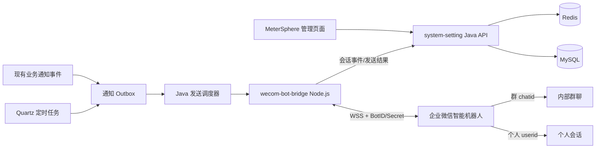
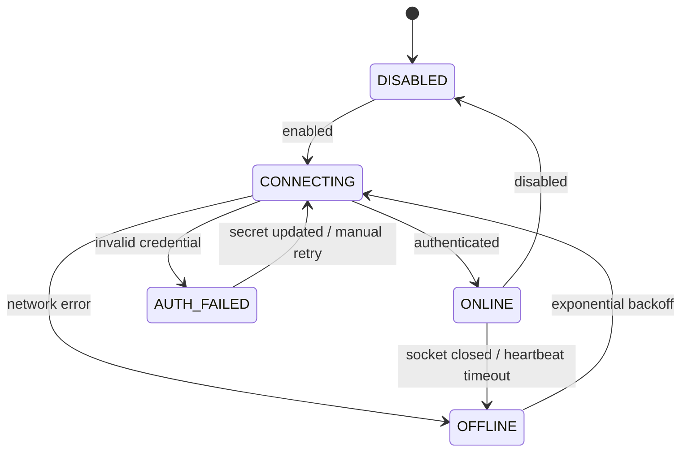

# MeterSphere 企业微信智能机器人长连接改造方案

> 文档状态：待评审  
> 编制日期：2026-08-14  
> 目标版本：待产品排期  
> 适用范围：MeterSphere 3.7.x 当前代码库

## 1. 背景与结论

目标是在 MeterSphere 中新增企业微信智能机器人长连接能力，实现：

1. 通过企微 `userid` 向指定成员的机器人个人会话主动发送消息；
2. 通过企微群 `chatid` 向已加入机器人的内部群主动发送消息；
3. 支持固定时间、Cron 周期和既有业务事件触发；
4. 支持固定文本与变量模板；
5. 支持发送日志、失败重试、停用、审计和权限控制；
6. 支持缺陷预计解决时间提醒、测试报告生成通知和通用自定义通知规则；
7. 后续可扩展机器人接收用户消息、查询 MeterSphere 数据，但不作为第一阶段交付范围。

当前前置条件已经满足：

| 前置条件 | 状态 | 说明 |
| --- | --- | --- |
| 已创建企微智能机器人 | 已满足 | 已使用 API 模式创建 |
| 已获得 BotID 和 Secret | 已满足 | Secret 不进入代码仓库或普通日志 |
| 已配置机器人可见成员 | 已满足 | 首期使用测试用户验证 |
| MeterSphere 容器可解析目标域名 | 已满足 | `openws.work.weixin.qq.com` 解析成功 |
| 容器可连接目标 TCP 443 | 已满足 | TLS 1.3 握手成功 |
| 证书校验 | 已满足 | `SSL certificate verify ok` |
| WebSocket Bot 认证 | 待开发验证 | 需以 BotID + Secret 建连后确认 |

`curl` 对根路径返回 `404 Not Found` 是预期结果：它证明 HTTPS 请求到达了企业微信服务器，但不代表已经完成 WebSocket 升级和机器人认证。

## 2. 现状分析

### 2.1 可复用能力

当前项目已有以下基础：

- Quartz 动态 Cron 管理：`ScheduleService`、`ScheduleManager`；
- 通知抽象与多通道发送：`NoticeSendService`、`AbstractNoticeSender`；
- 企业微信群机器人 Webhook：`WeComNoticeSender`、`WeComClient`；
- 用户企微映射：`user.wecom_userid`，且已有唯一索引；
- 缺陷预计解决时间字段：`bug.expected_resolve_time` / `expectedResolveTime` 已完成端到端基础改造；
- 企微通讯录同步，可持续维护 MeterSphere 用户与 `userid` 的关系；
- Redis/Redisson，可用于集群选主、去重与短期状态；
- Flyway、MyBatis、操作日志和系统权限体系；
- Spring WebSocket 基础设施，但当前主要用于服务端接收连接，不等于企微 Bot 客户端协议。

### 2.2 不能直接复用的部分

- 当前 `WeComClient` 走群机器人 Webhook，不能替代智能机器人长连接；
- 通讯录同步使用的 `contactSecret` 与 Bot Secret 不是同一凭证；
- 系统设置中的 `CorpID + AgentID + AppSecret` 是自建应用链路，不是 Bot 长连接凭证；
- 当前没有 BotID/Secret 配置、WebSocket 客户端、群会话表、可靠发送队列和通用定时消息模型；
- 不能仅凭群名称发送消息，必须获得企业微信回传的 `chatid`。

## 3. 总体技术方案

### 3.1 推荐架构

采用“Java 业务控制面 + Node.js 企微协议桥接面”的结构：



推荐新增独立目录：

```text
wecom-bot-bridge/
├── package.json
├── src/
│   ├── main.mjs
│   ├── config.mjs
│   ├── wecom-client.mjs
│   ├── platform-client.mjs
│   ├── health-server.mjs
│   └── logger.mjs
└── test/
```

桥接服务使用企业微信官方 `@wecom/aibot-node-sdk`，负责：

- 连接 `wss://openws.work.weixin.qq.com`；
- Bot 认证、心跳、指数退避重连；
- 主动发送 Markdown、模板卡片和媒体消息；
- 上报认证状态、断连原因和企业微信错误码；
- 接收个人/群消息事件，采集 `userid`、`chatid`、群会话活跃状态；
- 不承载 MeterSphere 业务权限和定时规则。

Java 服务负责：

- 配置与密钥引用管理；
- 用户、组织、项目权限；
- 通知规则、模板、收件人解析；
- Quartz 调度、Outbox、重试和审计；
- 管理页面和公开 REST API；
- 发送请求签名与桥接服务身份校验。

### 3.2 为什么不直接在 Java 中复刻协议

官方 SDK 已处理认证帧、请求 ID、心跳、重连、消息类型和媒体上传。Java 自行复刻会把企业微信协议变化风险长期留在主业务服务中，也增加认证失败、重复发送和连接泄漏风险。首期应优先使用官方 SDK；只有企业明确禁止部署 Node.js sidecar 时，才评估 Java 客户端替代方案，并单独进行协议兼容性验证。

### 3.3 部署模式

推荐将 `wecom-bot-bridge` 作为同一部署单元的 sidecar/独立容器运行：

```text
metersphere-backend
wecom-bot-bridge
mysql
redis
```

桥接服务只需出站访问企微 WSS，并在内网暴露健康检查及受保护的发送接口。禁止把桥接服务发送接口直接暴露到公网。

若 MeterSphere 后端为多实例，仍只运行一个逻辑 Bot 连接。建议 bridge 单副本起步；高可用阶段部署两副本并通过 Redis 租约选主，备用实例不建立 Bot 主连接。

## 4. 功能范围

### 4.1 第一阶段（MVP）

- Bot 配置：启停、BotID、Secret 引用、连接状态；
- 向单个/多个 `userid` 发送 Markdown 文本；
- 自动采集机器人所在内部群的 `chatid`；
- 向指定群发送 Markdown 文本；
- 创建、编辑、启停、删除通知规则；
- 固定文本和少量系统变量；
- Outbox、重试、幂等、发送日志；
- 测试连接、测试个人消息、测试群消息；
- 管理权限和操作审计。
- 缺陷预计解决时间临近提醒；
- 测试报告生成后向群聊推送并 @ 项目人员；
- 通知事件、对象、消息模板和时间周期的通用配置。

### 4.2 三项业务通知需求

#### 4.2.1 缺陷预计解决时间提醒

“预计解决时间”一等字段已经完成基础改造，本方案直接复用，不再重复新增字段。当前代码中的实际命名为：

```text
数据库字段：bug.expected_resolve_time BIGINT NULL
Java/前端字段：expectedResolveTime
Flyway：V3.7.2_68__bug_expected_resolve_time.sql
```

现有改造已经覆盖领域模型、MyBatis Mapper、缺陷新增/编辑 DTO、详情 DTO、前端编辑/详情及列表展示。通知改造只需在现有字段写入或变更成功后刷新提醒 Timer，并补充适合临期扫描的数据库索引；不得再新增语义重复的 `expected_resolution_time` 字段。

管理员可以按系统/组织/项目作用域配置：

| 配置项 | 示例 | 说明 |
| --- | --- | --- |
| 提前量 | 2 天、6 小时 | 从 `预计解决时间 - 提前量` 开始提醒 |
| 提醒间隔 | 12 小时、1 小时 | 提醒窗口内重复提醒周期 |
| 默认接收角色 | 处理人、创建人 | 两者去重，允许扩展关注人/项目管理员 |
| 通知目标 | 个人会话，可选群聊 | MVP 默认个人会话 |
| 停止状态 | 已关闭、已解决等 | 根据项目缺陷工作流的终态判定 |
| 到期策略 | 到期停止 | 默认超过预计解决时间不再发送 |
| 消息模板 | 可配置 | 支持缺陷标题、编号、处理人、截止时间和链接 |

默认提醒窗口定义为：

```text
[expectedResolveTime - leadTime, expectedResolveTime]
```

满足以下任一条件时立即停止后续提醒：

- 当前时间已经超过预计解决时间；
- 缺陷进入配置的终态（例如已解决、已关闭）；
- 缺陷被删除；
- 预计解决时间被清空；
- 通知规则或项目被停用。

如果预计解决时间、处理人或项目发生变化，应在同一业务事务提交后重新计算下一次提醒时间；旧的待发送记录应取消或通过资源版本号判定失效。处理人和创建人为同一用户时只发送一次。缺少 `wecom_userid` 的用户不阻塞其他接收人发送，但必须在执行日志中列出“企微账号未映射”。

为避免“每个缺陷一个 Quartz Job”带来的调度器膨胀，采用统一分钟级扫描器 + 持久化 Timer：

1. 缺陷新增/更新后创建或刷新 `wecom_notification_timer`；
2. 扫描器每分钟认领 `next_fire_at <= now` 的 Timer；
3. 重新读取缺陷，二次判断时间、状态、接收人和规则版本；
4. 生成个人目标 Outbox；
5. 计算 `next_fire_at += interval`，但不得超过预计解决时间；
6. 到期或满足停止条件后标记 `COMPLETED/CANCELLED`。

现有字段迁移尚未创建临期扫描组合索引，通知功能建议追加独立迁移：

```sql
CREATE INDEX idx_bug_project_expected_resolution
    ON bug(project_id, expected_resolve_time, deleted);
```

后续工作仅包括：确认筛选、导入导出和历史记录是否需要展示该字段；在缺陷保存事务提交后触发 `BugExpectedResolutionChanged` 事件；通知模块据此创建、刷新或取消 Timer。

#### 4.2.2 测试报告生成通知

当测试计划报告生成并成功提交数据库事务后，发布内部事件 `TEST_REPORT_GENERATED`。事件至少携带：

```text
eventId、reportId、testPlanId、projectId、reportName、generatorUserId、generatedAt
```

事件处理器读取项目级通知规则，生成“一群一条”的 Outbox。不得在报告生成事务中同步调用企业微信，以免企微网络异常导致报告生成失败。

配置项：

| 配置项 | 默认值 | 说明 |
| --- | --- | --- |
| 是否启用 | 关闭 | 管理员显式开启后生效 |
| 通知群聊 | 无 | 从已发现且启用的群聊中多选 |
| @人员 | 项目全部有效成员 | 可改为指定成员、项目角色或用户组 |
| 消息模板 | 系统默认模板 | 包含项目、计划、报告名称、生成者、结果摘要和报告链接 |
| 触发来源 | 手动与自动生成 | 可分别启停 |
| 发送失败重试 | 开启 | 使用统一 Outbox 策略 |

默认“项目所有成员”的精确定义：拥有当前项目有效角色关系、用户未禁用/删除且 `wecom_userid` 非空的成员。每次生成报告时动态查询，不把成员快照长期固化在规则中。

群消息中 @人员时：

- 使用企业微信智能机器人 SDK 当前支持的成员提及格式；具体 payload/Markdown 语法必须在 PoC 阶段以官方 SDK 实测固化；
- 同一 userid 去重；
- 不在目标群内的用户可能无法形成有效 @，应记录企微回执，但不阻塞群消息正文投递；
- 人员过多或消息超过企微限制时，按 SDK 限制分批或降级为“项目成员请关注”，并在日志标记降级；
- 不应为每个项目成员单独发送个人消息，除非规则同时显式选择了“个人会话”。

当前测试计划报告的手工和自动生成入口分别为 `TestPlanReportController.genReportByManual` 与 `genReportByAuto`，最终写入集中在 `TestPlanReportService`。事件应在 Service 层报告创建成功且事务提交后发布，不能只在 Controller 上加注解，以覆盖后台自动生成和未来其他调用入口。

#### 4.2.3 通用自定义通知

提供统一通知规则模型，允许有权限的管理员自行配置：

- **通知类型/触发器**：缺陷临期、测试报告生成、固定时间、Cron 周期，以及未来注册的业务事件；
- **通知对象**：指定用户、动态业务角色（创建人/处理人）、项目成员、项目角色、用户组、已发现群聊；
- **通知时间**：事件发生后立即、事件前偏移、事件后偏移、固定时间、Cron、重复间隔、有效期；
- **通知内容**：系统模板或自定义模板，变量使用白名单；
- **通知方式**：个人、群聊或二者；
- **停止条件**：到期、资源终态、执行次数上限、规则停用或有效期结束。

首期注册的通知类型：

```text
BUG_EXPECTED_RESOLUTION_DUE
TEST_REPORT_GENERATED
CUSTOM_CRON
```

不允许前端提交任意 Java 类名、SQL、SpEL 或脚本。通知类型由后端 `NotificationTriggerProvider` 白名单注册，每种类型声明可用对象、变量、时间策略和校验规则。这样能够实现可配置扩展，同时避免任意代码执行与越权查询。

### 4.3 第二阶段

- 模板卡片、图片、文件；
- 复用既有业务通知模板；
- 按项目角色、用户组、部门动态解析收件人；
- 失败告警和监控指标；
- 群会话管理员备注、归档和批量管理。

### 4.4 暂不纳入

- 外部群、客户群或个人微信联系人；
- 冒充普通员工发送一对一聊天；
- 机器人自然语言查询 MeterSphere 的 API/MCP 插件；
- 任意用户自定义脚本；
- 跨企业 userid/chatid 投递。

## 5. 数据模型设计

建议在下一版本 Flyway 迁移目录中新增 DDL；实际版本号以合并时项目版本为准，不提前占用迁移编号。

### 5.1 `wecom_bot_config`

每个企业机器人一条配置。首期可限定系统级单实例，模型保留 `organization_id` 以支持未来多组织。

| 字段 | 类型 | 说明 |
| --- | --- | --- |
| `id` | varchar(50) | 主键 |
| `organization_id` | varchar(50) | 可空；系统级配置为空 |
| `name` | varchar(100) | 配置显示名 |
| `bot_id` | varchar(128) | BotID，唯一 |
| `secret_ref` | varchar(255) | 密钥引用，不优先存明文 |
| `secret_ciphertext` | text | 可选，加密存储方案启用时使用 |
| `enabled` | tinyint | 是否启用 |
| `status` | varchar(32) | DISABLED/CONNECTING/ONLINE/OFFLINE/AUTH_FAILED |
| `last_connected_at` | bigint | 最近认证成功时间 |
| `last_heartbeat_at` | bigint | 最近心跳时间 |
| `last_error_code` | varchar(64) | 最近错误码 |
| `last_error_message` | varchar(500) | 脱敏后的错误信息 |
| `create_time/update_time` | bigint | 审计字段 |
| `create_user/update_user` | varchar(50) | 审计字段 |

约束：`uk_wecom_bot_id(bot_id)`。

### 5.2 `wecom_bot_chat`

保存机器人实际见过的会话，不允许管理员手工猜测 `chatid`。

| 字段 | 类型 | 说明 |
| --- | --- | --- |
| `id` | varchar(50) | 主键 |
| `bot_config_id` | varchar(50) | Bot 配置 ID |
| `chat_id` | varchar(255) | 企业微信会话标识 |
| `chat_type` | varchar(16) | SINGLE/GROUP |
| `display_name` | varchar(255) | 管理员备注名；不作为发送依据 |
| `source_userid` | varchar(100) | 最近触发事件的成员 |
| `active` | tinyint | 是否可选 |
| `first_seen_at/last_seen_at` | bigint | 首次/最近事件时间 |
| `metadata` | json/text | 非敏感扩展信息 |

约束：`uk_bot_chat(bot_config_id, chat_id)`。

个人消息发送时优先直接使用用户表中的 `wecom_userid`，无需预建 SINGLE 会话记录；该表主要服务于群聊发现。

### 5.3 `wecom_notification_rule`

统一承载事件型、临期型和周期型规则，避免分别建立三套配置。

| 字段 | 类型 | 说明 |
| --- | --- | --- |
| `id` | varchar(50) | 主键 |
| `name` | varchar(255) | 任务名称 |
| `scope_type/scope_id` | varchar(32/50) | SYSTEM/ORGANIZATION/PROJECT |
| `bot_config_id` | varchar(50) | 使用哪个机器人 |
| `notification_type` | varchar(64) | BUG_EXPECTED_RESOLUTION_DUE/TEST_REPORT_GENERATED/CUSTOM_CRON |
| `trigger_type` | varchar(32) | DEADLINE/EVENT/CRON |
| `trigger_config` | json/text | 提前量、间隔、事件来源、Cron 等类型化配置 |
| `cron` | varchar(100) | Cron 类型使用，其他类型为空 |
| `timezone` | varchar(64) | 默认系统时区，建议显式保存 |
| `enabled` | tinyint | 是否启用 |
| `message_type` | varchar(32) | MVP 为 MARKDOWN |
| `template` | text | 消息模板 |
| `recipient_spec` | json/text | 收件人规则 |
| `delivery_mode` | varchar(32) | PERSONAL/GROUP/BOTH |
| `stop_config` | json/text | 终态、截止时间、最大次数等停止条件 |
| `misfire_policy` | varchar(32) | DO_NOTHING/FIRE_ONCE |
| `start_at/end_at` | bigint | 可选有效期 |
| `next_fire_time/last_fire_time` | bigint | 展示与审计 |
| `create_time/update_time` | bigint | 审计字段 |
| `create_user/update_user` | varchar(50) | 审计字段 |

`recipient_spec` 示例：

```json
{
  "users": ["ms-user-id-1"],
  "groups": ["wecom-chat-id-1"],
  "businessRoles": ["BUG_HANDLER", "BUG_CREATOR"],
  "projectMemberMode": "ALL",
  "projectRoles": [],
  "userGroups": [],
  "departments": []
}
```

数据库保存 MeterSphere 用户 ID；执行时再读取最新的 `wecom_userid`。这样用户重新同步、禁用或离职后不会继续使用过期的静态 userid。

触发配置示例：

```json
{
  "leadTime": 2,
  "leadUnit": "DAY",
  "repeatInterval": 12,
  "repeatUnit": "HOUR",
  "deadlineBehavior": "STOP_AT_DEADLINE",
  "terminalStatuses": ["RESOLVED", "CLOSED"]
}
```

### 5.4 `wecom_notification_timer`

用于资源临期型通知，不为每条缺陷创建 Quartz Job。

| 字段 | 类型 | 说明 |
| --- | --- | --- |
| `id` | varchar(50) | 主键 |
| `rule_id` | varchar(50) | 通知规则 |
| `resource_type/resource_id` | varchar(32/50) | BUG 等 |
| `resource_version` | bigint | 可使用资源 update_time，识别旧 Timer |
| `deadline_at` | bigint | 本轮截止时间快照 |
| `next_fire_at` | bigint | 下一次提醒时间 |
| `fire_count` | int | 已提醒次数 |
| `status` | varchar(32) | WAITING/PROCESSING/COMPLETED/CANCELLED |
| `lease_until` | bigint | 扫描器处理租约 |
| `create_time/update_time` | bigint | 时间字段 |

约束：`uk_rule_resource(rule_id, resource_type, resource_id)`；索引：`idx_timer_due(status, next_fire_at)`。

### 5.5 `wecom_notification_outbox`

持久化每次实际投递，解决异步发送过程中的进程重启和重复执行问题。

| 字段 | 类型 | 说明 |
| --- | --- | --- |
| `id` | varchar(50) | 消息 ID |
| `rule_id` | varchar(50) | 来源规则，可空 |
| `resource_type/resource_id` | varchar(32/50) | 业务资源，可空 |
| `event_type/event_id` | varchar | 业务事件及唯一 ID，可空 |
| `trigger_key` | varchar(255) | 业务触发唯一键 |
| `target_type` | varchar(16) | USER/GROUP |
| `target_id` | varchar(255) | userid/chatid；日志展示时脱敏 |
| `message_type` | varchar(32) | MARKDOWN 等 |
| `payload` | text | 渲染后的消息或安全引用 |
| `status` | varchar(32) | PENDING/SENDING/SUCCESS/RETRY/FAILED/CANCELLED |
| `attempts/max_attempts` | int | 重试计数 |
| `next_retry_at` | bigint | 下次重试时间 |
| `request_id` | varchar(100) | 与 bridge/企微请求关联 |
| `error_code/error_message` | varchar | 错误信息 |
| `create_time/update_time/sent_at` | bigint | 时间字段 |

约束：`uk_trigger_target(trigger_key, target_type, target_id)`，保证同一触发批次对同一目标只落一条消息。报告事件的 `trigger_key` 建议为 `TEST_REPORT_GENERATED:{reportId}:{ruleId}`；缺陷提醒建议包含 `bugId + ruleId + scheduledFireTime`，既避免重复又允许下一间隔再次发送。

## 6. 密钥和安全方案

### 6.1 推荐优先级

1. **生产推荐**：Kubernetes Secret、Docker Secret 或部署平台密钥管理，通过文件/环境变量注入；数据库只保存 `secret_ref`；
2. **兼容方案**：Secret 在数据库中使用独立主密钥进行 AES-GCM 加密，主密钥只通过部署环境注入；
3. **禁止方案**：Secret 明文入库、写入 `application.properties`、前端回显、操作日志记录、异常堆栈打印。

建议环境变量：

```text
MS_WECOM_BOT_ID
MS_WECOM_BOT_SECRET
MS_WECOM_BRIDGE_TOKEN
MS_WECOM_BRIDGE_CALLBACK_TOKEN
```

`BotID` 不是密码，但日志仍只记录必要前后缀。`Secret` API 返回统一掩码，例如 `******abcd`；前端提交掩码表示“不修改”。

### 6.2 Bridge 接口保护

- Java → bridge：内网 HTTPS/mTLS 优先；MVP 至少使用短期 HMAC 或高熵 Bearer Token；
- bridge → Java：独立 callback token，并校验时间戳、nonce、签名，防重放；
- 请求体包含 `requestId`，所有发送接口幂等；
- 禁止记录 Secret、完整消息敏感数据和完整 userid；
- 管理接口沿用 MeterSphere 登录、权限和 CSRF 机制。

## 7. Bridge 服务设计

### 7.1 内部接口

建议 bridge 暴露以下内网接口：

| 方法 | 路径 | 用途 |
| --- | --- | --- |
| GET | `/health/live` | 进程存活 |
| GET | `/health/ready` | Bot 已认证且可发送 |
| GET | `/v1/status` | 连接状态和最近错误 |
| POST | `/v1/messages/send` | 主动发送，按 requestId 幂等 |
| POST | `/v1/reconnect` | 受控重连，仅管理流程调用 |

发送请求示例：

```json
{
  "requestId": "outbox-id",
  "target": {
    "type": "USER",
    "id": "wecom-userid"
  },
  "message": {
    "type": "markdown",
    "content": "您有一项待处理测试任务"
  }
}
```

返回结果必须区分：

- 已受理；
- 已成功；
- 可重试失败（网络、连接中断、临时限流）；
- 不可重试失败（无效 userid/chatid、权限范围不足、消息格式错误、认证失败）。

### 7.2 连接状态机



要求：

- 认证成功前不消费待发送消息；
- 重连退避建议 1、2、4、8、16、30 秒，最大 30 秒并加入抖动；
- 认证失败不无限高频重试；
- Secret 更新时先停止旧连接，再以新 Secret 建连；
- 进程收到 SIGTERM 时停止拉取消息，等待在途请求完成后断开。

### 7.3 会话发现

bridge 收到群消息或进入会话事件后，上报：

```json
{
  "eventId": "企微消息或事件唯一ID",
  "botId": "masked-bot-id",
  "chatType": "GROUP",
  "chatId": "group-chat-id",
  "fromUserid": "userid",
  "occurredAt": 1786710000000
}
```

Java 侧按 `eventId` 去重并 upsert `wecom_bot_chat`。管理员可给群设置显示备注，但不能修改真实 `chat_id`。

## 8. Java 后端改造

建议新增包：

```text
backend/services/system-setting/src/main/java/io/metersphere/system/wecombot/
├── controller/
├── dto/
├── service/
├── schedule/
├── repository/
├── client/
├── security/
└── constants/
```

### 8.1 核心类建议

- `WecomBotConfigController/Service`：配置、启停、测试、状态；
- `WecomBotChatController/Service`：群会话查询、备注和停用；
- `WecomNotificationRuleController/Service`：事件、临期、Cron 通知规则 CRUD；
- `WecomNotificationCronJob`：Cron 触发入口，只生成 Outbox，不直接调用网络；
- `WecomNotificationTimerScanner`：分钟级扫描缺陷等资源的到期 Timer；
- `BugExpectedResolutionTimerService`：缺陷变更后刷新/取消提醒 Timer；
- `TestReportGeneratedEventHandler`：事务提交后消费报告生成事件并创建 Outbox；
- `WecomNotificationOutboxService`：批量创建、认领、状态流转；
- `WecomNotificationDispatcher`：发送、重试和错误分类；
- `WecomBotBridgeClient`：调用 bridge，配置超时和熔断；
- `WecomBotEventController`：接收 bridge 状态和会话事件；
- `WecomRecipientResolver`：把 MeterSphere 用户/角色/部门解析为 userid/chatid；
- `WecomMessageTemplateService`：模板变量白名单和渲染。

### 8.2 API 设计

管理 API 建议：

```text
GET    /wecom-bot/config
POST   /wecom-bot/config
POST   /wecom-bot/config/test-connection
POST   /wecom-bot/config/enable
POST   /wecom-bot/config/disable
GET    /wecom-bot/status

GET    /wecom-bot/chats
POST   /wecom-bot/chats/{id}/rename
POST   /wecom-bot/chats/{id}/enable
POST   /wecom-bot/chats/{id}/disable

POST   /wecom-bot/messages/test-user
POST   /wecom-bot/messages/test-group
GET    /wecom-bot/messages/logs
POST   /wecom-bot/messages/{id}/retry

GET    /wecom-bot/notification-rules
POST   /wecom-bot/notification-rules
PUT    /wecom-bot/notification-rules/{id}
DELETE /wecom-bot/notification-rules/{id}
POST   /wecom-bot/notification-rules/{id}/enable
POST   /wecom-bot/notification-rules/{id}/disable
POST   /wecom-bot/notification-rules/{id}/run-once
POST   /wecom-bot/notification-rules/{id}/preview
```

Bridge 回调 API 必须与普通登录 API 分区：

```text
POST /internal/wecom-bot/events/status
POST /internal/wecom-bot/events/chat
POST /internal/wecom-bot/events/delivery
```

这些路径只允许内网访问并使用机器身份鉴权，不允许加入匿名公网白名单。

### 8.3 触发与定时策略

- 复用现有 `ScheduleManager` 创建 Quartz Job；
- JobDataMap 只保存 `ruleId`，不放模板、Secret 或收件人明细；
- Job 执行时重新加载规则和用户状态；
- 禁用、删除或项目删除时同步移除 Quartz Job；
- 默认 misfire 策略为 `DO_NOTHING`，避免服务恢复后集中补发历史提醒；
- “只执行一次”通过同一 Outbox 流程，不绕开发送日志；
- 时区显式保存并展示，默认 `Asia/Shanghai`，不能只依赖容器时区。
- `EVENT` 类型不创建 Quartz Job，由事务提交后的领域事件触发；
- `DEADLINE` 类型只保留一个系统级分钟扫描 Job，具体资源依赖 Timer 表；
- 报告生成事件必须使用 `reportId + ruleId` 幂等，重复回调不能重复通知；
- 缺陷更新必须使用最新 `update_time` 校验 Timer，避免旧时间提醒。

### 8.4 可靠发送

推荐采用数据库 Outbox，而非 Quartz Job 直接请求 bridge：

1. Quartz/业务事件在事务中创建 Outbox；
2. Dispatcher 使用 `SELECT ... FOR UPDATE SKIP LOCKED` 或等效状态抢占批次；
3. 设置 `SENDING` 租约，进程崩溃后可回收超时消息；
4. bridge 使用 `requestId=outbox.id` 幂等；
5. 成功标记 `SUCCESS`；
6. 临时错误按指数退避重试；
7. 永久错误直接 `FAILED` 并记录可读原因。

建议默认重试：1 分钟、5 分钟、15 分钟，共 3 次。认证失败时暂停整个通道消费，不逐条耗尽重试次数。

### 8.5 收件人校验

个人目标必须同时满足：

- MeterSphere 用户存在且未删除/禁用；
- `wecom_userid` 非空；
- 用户处于通知规则作用域内；
- 管理员具有管理该作用域通知的权限；
- 机器人企微侧可见范围包含用户（最终以企微发送结果为准）。

群目标必须同时满足：

- `chatid` 由 bridge 事件采集，不接受前端自由文本；
- 群记录 `active=true`；
- 机器人近期收到过该群事件或测试发送成功；
- 管理员拥有对应 Bot 配置和通知规则的权限。

## 9. 前端改造

建议在“系统设置 → 消息通知”下增加“企微智能机器人”配置，并与现有“企微扫码登录”“企微通讯录同步”“企微群机器人 Webhook”明确区分。

### 9.1 配置页

字段：

- 机器人名称；
- BotID；
- Secret（密码框、永不回显）；
- 启用开关；
- 连接状态；
- 最近认证时间、最近心跳和最近错误；
- “测试连接”“发送个人测试消息”按钮。

### 9.2 群会话页

- 会话备注；
- chatid 脱敏展示；
- 首次/最近发现时间；
- 可用状态；
- 测试发送；
- 操作提示：“请先把机器人加入内部群，并在群内 @机器人 发送消息”。

### 9.3 定时通知页

- 名称、作用域、Cron、时区和启停；
- 接收用户多选、已发现群聊多选；
- 消息模板编辑与预览；
- 下次执行时间；
- 立即执行；
- 最近执行结果和日志入口。

前端不得接收或展示原始 Bot Secret；保存后的 Secret 字段只显示统一掩码状态“已配置”。

## 10. 模板设计

MVP 只开放白名单变量，禁止任意表达式执行：

```text
${currentTime}
${ruleName}
${projectName}
${receiverName}
${resourceName}
${resourceUrl}
${bugNum}
${bugTitle}
${bugHandlerNames}
${bugCreatorName}
${expectedResolveTime}
${remainingTime}
${reportName}
${testPlanName}
${reportGeneratorName}
${reportSummary}
${reportUrl}
```

模板渲染要求：

- 缺失变量使用空串或在预览时明确报错，策略需统一；
- 限制最终消息字节长度；
- URL 只允许系统基础 URL 或明确白名单域名；
- 日志默认不保存完整敏感正文，可保存摘要与哈希；
- 针对 userid 分别渲染 `${receiverName}` 时，必须拆分个人消息，不能错误复用第一位用户内容。

## 11. 集群与高可用

### 11.1 Bot 连接唯一性

同一个 Bot 不应由多个实例同时建立主连接。建议：

- MVP：bridge 部署 `replicas=1`；
- HA：Redis 锁键 `ms:wecom-bot:leader:{botIdHash}`；
- 锁必须有租约和续期；失去租约立即停止发送并断开连接；
- 不使用 Bot Secret 构造 Redis key。

### 11.2 Dispatcher 并发

- Java 多实例可并发消费 Outbox，但必须数据库原子抢占；
- 同一目标可按 target hash 串行，降低乱序风险；
- 对企微限流响应做全局退避；
- bridge 与 Java 均以 `requestId` 去重，形成双层幂等。

## 12. 可观测性

建议指标：

```text
wecom_bot_connected{bot}
wecom_bot_reconnect_total{reason}
wecom_bot_auth_failure_total
wecom_bot_message_total{target_type,status}
wecom_bot_message_latency_seconds
wecom_bot_outbox_pending
wecom_bot_outbox_oldest_seconds
wecom_bot_chat_discovered_total{chat_type}
```

结构化日志必须包含：`requestId`、`outboxId`、目标类型、脱敏目标、状态和错误码；禁止包含 Secret 和完整授权头。

告警建议：

- 连续离线超过 5 分钟；
- 认证失败立即告警；
- Outbox 最老消息超过 10 分钟；
- 失败率 15 分钟窗口超过阈值；
- bridge 与 Java 时间偏差过大。

## 13. 错误分类

| 类别 | 例子 | 处理 |
| --- | --- | --- |
| 网络临时错误 | 连接中断、超时 | 重连并重试 |
| 限流 | 企微频率限制 | 尊重服务端提示并退避 |
| 认证错误 | BotID/Secret 无效 | 暂停通道，管理员更新凭证 |
| 目标无效 | userid/chatid 不存在 | 永久失败，提示校验目标 |
| 权限错误 | 用户不在可见范围、机器人已移出群 | 永久失败并停用目标建议 |
| 内容错误 | 超长、不支持的消息格式 | 永久失败，前置校验 |
| 内部错误 | DB/bridge 异常 | 保留 Outbox，恢复后重试 |

错误信息写入日志前必须脱敏；同一错误不要在应用日志中无限刷屏。

## 14. 测试方案

### 14.1 单元测试

- Secret 掩码、不回显和更新语义；
- 收件人解析、禁用用户、空 userid；
- Cron 校验、时区和 misfire；
- 缺陷提醒窗口边界、间隔、终态、字段变更和接收人去重；
- 报告生成事件事务提交、项目成员动态解析和事件幂等；
- 模板变量、长度和 URL 白名单；
- Outbox 幂等、抢占、超时回收、重试分类；
- bridge 签名、防重放和 requestId 幂等；
- WebSocket 状态机、心跳超时、重连退避。

### 14.2 集成测试

- Java 使用 mock bridge 验证成功、超时、429、认证失败；
- bridge 使用 mock WebSocket 服务验证认证和消息帧；
- MySQL + Redis + Quartz 多实例并发验证只生成一次投递；
- Flyway 升级与回滚兼容性验证；
- 后端重启、bridge 重启和网络抖动恢复验证。

### 14.3 企微沙箱/测试机器人验收

1. bridge 日志出现认证成功；
2. 管理页面显示 ONLINE 与最近心跳；
3. 向测试 userid 发送个人 Markdown 成功；
4. 用户不在可见范围时展示明确失败原因；
5. 机器人加入测试群，群内 @ 后平台发现 chatid；
6. 向测试群主动发送成功；
7. 机器人移出群后，发送失败并标记目标异常；
8. 创建每 5 分钟测试 Cron，验证无重复消息；
9. 重启 Java/bridge，未发送 Outbox 能恢复；
10. Secret 轮换后旧连接停止、新连接认证成功。
11. 缺陷设置预计解决时间后，从配置的提前量开始按间隔通知处理人和创建人；
12. 缺陷关闭、删除、清空/修改预计解决时间后，旧提醒立即停止或重算；
13. 到达预计解决时间后不再产生新的提醒；
14. 手动和自动生成测试报告后，只向配置群各发送一次，并默认 @ 当前项目有效成员；
15. 修改报告通知人员后，下一份报告使用最新成员规则。

## 15. 发布与回滚

### 15.1 灰度发布

1. 合入数据库表和关闭状态的后端代码；
2. 部署 bridge，但默认不启用 Bot；
3. 仅对管理员开放配置权限；
4. 配置测试 Bot，限制两个测试用户和一个测试群；
5. 完成人工发送验证；
6. 开启一个低频 Cron；
7. 观察 24～48 小时后逐步扩大可见范围；
8. 再接入业务事件通知。

### 15.2 回滚

- 先关闭通知规则，停止生成新 Outbox；
- 等待在途消息完成或将未发送消息标记 CANCELLED；
- 禁用 Bot 配置并停止 bridge；
- Java 功能开关关闭后可回滚应用版本；
- 数据表保留，不在紧急回滚中删除，避免丢失审计记录；
- Secret 发生泄露时在企微后台立即轮换，并更新部署 Secret。

## 16. 实施阶段与工作量拆分

以下为工程拆分，不作为最终工期承诺：

### 阶段 A：技术验证

- 使用官方 SDK 以测试 Bot 建连；
- 验证认证、个人主动消息；
- 验证群事件获得 chatid 与群主动消息；
- 固化错误码和消息格式样例。

交付物：PoC、协议样例、风险结论。

### 阶段 B：Bridge 产品化

- 配置加载、健康检查、认证、心跳、重连；
- 发送接口、幂等、回调签名；
- Dockerfile、启动脚本、日志和单元测试。

交付物：可部署 bridge 镜像。

### 阶段 C：Java 后端

- Flyway/MyBatis 数据模型；
- 配置、会话、任务、日志 API；
- Quartz + Timer + 领域事件 + Outbox + Dispatcher；
- 权限、审计、Secret 管理；
- 自动化测试。

### 阶段 D：前端

- Bot 配置与状态；
- 群会话管理；
- 定时通知 CRUD、模板预览和日志。

### 阶段 E：联调与灰度

- 容器网络和 DNS；
- 测试用户/群验收；
- 故障演练、限流、重启恢复；
- 运维手册与监控告警。

## 17. 验收标准

必须同时满足：

- Bot 长连接连续稳定运行，断线可自动恢复；
- Secret 不在前端、普通日志、数据库明文和 Git 中出现；
- 可以向指定有效 userid 发送个人消息；
- 可以自动发现并向有效 chatid 发送群消息；
- 定时任务按指定时区执行，单次触发不重复投递；
- 服务重启后待发送任务不丢失；
- 无效用户、权限不足、认证失败和网络失败可区分；
- 管理员可查询发送记录并对可重试消息人工重试；
- 多实例部署不会创建重复 Outbox 或重复发送；
- 关闭功能开关后立即停止新增发送；
- 缺陷临期提醒按提前量和间隔执行，处理人/创建人去重，资源终态或到期后停止；
- 报告生成通知在事务成功后触发，失败回滚不通知；
- 报告群消息可按配置群发送并默认解析、提及当前项目所有有效成员；
- 管理员可配置通知类型、对象、触发时间/周期、模板和停止条件，且不能借此执行任意脚本或越权选择对象。

## 18. 开发前仍需确认的决策

以下决策不阻塞技术 PoC，但应在进入产品化开发前评审：

1. 首期是系统级单机器人，还是每组织可配置一个机器人；
2. Secret 采用部署 Secret 引用，还是数据库密文管理；
3. bridge 以独立容器还是 sidecar 方式交付；
4. MVP 是否只支持 Markdown；
5. 三项通知能力的上线顺序：通用规则框架、缺陷临期、报告生成，或一次性交付；
6. 群聊是否只允许管理员手工启用已发现会话；
7. 消息正文在日志中保留摘要还是完整内容；
8. 默认 misfire 是否采用 `DO_NOTHING`；
9. 数据保留周期和失败日志清理策略。
10. 缺陷超过预计解决时间后是否需要继续“逾期提醒”；本文默认到期停止，如需逾期提醒应增加逾期周期和最长持续时间，禁止无限发送。

## 19. 推荐默认决策

为降低第一版复杂度，建议默认采用：

- 系统级单机器人；
- Kubernetes/Docker Secret 或环境变量注入；
- 独立 bridge 容器，官方 Node.js SDK；
- Markdown 单一消息类型；
- 第一版同时纳入 `BUG_EXPECTED_RESOLUTION_DUE`、`TEST_REPORT_GENERATED`、`CUSTOM_CRON` 三种通知类型；
- 缺陷提醒默认在到达预计解决时间后停止，资源提前终态也立即停止；
- 报告通知默认选择项目全部有效成员，但项目管理员必须显式选择目标群并启用规则；
- 群聊必须先被发现，再由管理员启用；
- 日志保存消息摘要与哈希，不保存完整正文；
- misfire 使用 `DO_NOTHING`；
- 成功日志保留 90 天，失败/审计日志保留 180 天，具体按企业合规策略调整。

按此默认方案，能够以最小风险先打通“MeterSphere → 智能机器人 → 个人/内部群”的可靠主动通知链路，并为后续业务事件通知和机器人 API/MCP 插件预留清晰扩展边界。
