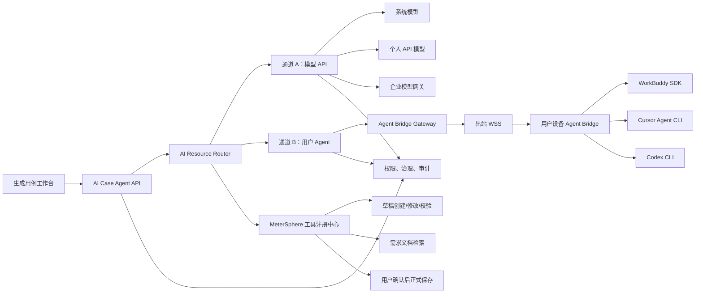
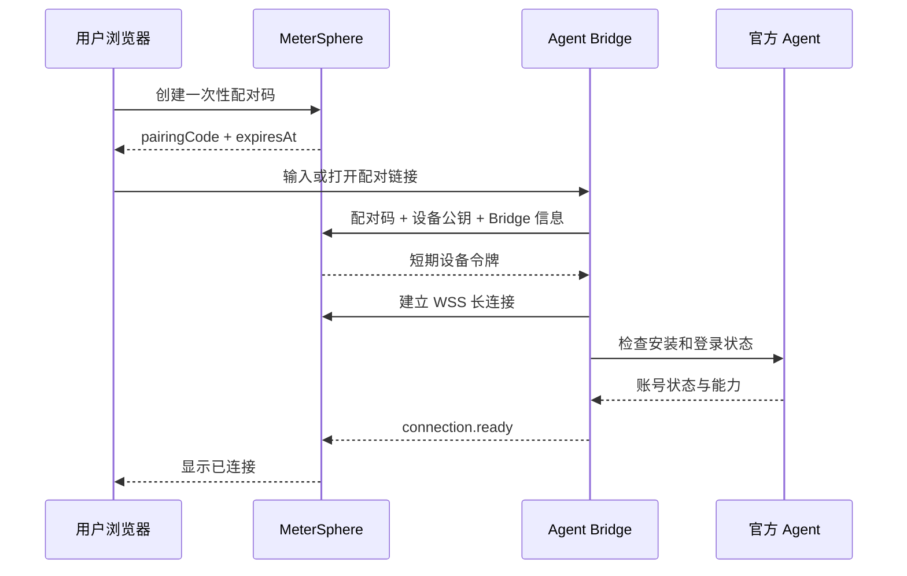

# AI 用户自有 Agent 双通道改造方案

## 1. 文档信息

| 项目 | 内容 |
| --- | --- |
| 文档目标 | 在保留现有模型 API 调用的前提下，为【生成用例】增加用户自有 Agent 授权与调用通道 |
| 适用范围 | MeterSphere【生成用例】、个人设置、AI Provider、AI Agent Gateway、权限与治理 |
| 目标用户 | 已购买 WorkBuddy、Cursor、ChatGPT/Codex 等 Agent 产品的个人用户 |
| 优先级 | P0/P1 |
| 编写日期 | 2026-08-08 |
| 文档性质 | 对 `docs/task/ai_case_agent_20260806/AI用例生成Agent改造方案.md` 的增量改造方案 |

## 2. 背景与真实需求

平台现有设计以“模型 API”为核心：系统管理员或用户配置供应商、API Base URL、API Key 和基础模型，平台服务器直接调用模型 API。该模式必须保留，用于系统统一采购模型、用户自带 API Key、企业模型网关和无人值守任务。

新增需求是：用户已经购买 WorkBuddy、Cursor、ChatGPT/Codex 等 Agent 产品，希望通过本人授权，在 MeterSphere【生成用例】页面中继续使用本人 Agent 的能力和额度，而不是再次购买一套平台模型 API。

因此产品形态需要从“只选择模型”扩展为“选择 AI 资源”，同时支持两种通道：

1. **模型 API 通道**：平台服务器直接调用系统模型或个人 API 模型。
2. **用户 Agent 通道**：平台通过用户授权的官方 SDK、CLI 或 Agent Gateway 调用用户自己的 Agent。

本方案不把会员订阅等同于通用模型 API。只有供应商公开支持的 SDK、CLI、API 或 OAuth 能力才允许接入，禁止通过抓取 Cookie、复制网页登录令牌、模拟客户端私有协议等方式复用会员。

## 3. 改造目标

### 3.1 核心目标

1. 保留现有 `ai_model_source`、`AiProviderAdapter`、模型列表、项目白名单、Token 统计和默认模型回退能力。
2. 用户可在个人中心连接和管理自己的 WorkBuddy、Cursor、Codex Agent。
3. 【生成用例】统一展示“平台/个人模型”和“我的 Agent”，用户可自由选择。
4. 用户 Agent 凭据默认保留在用户设备，不上传平台服务器。
5. 用户 Agent 通过本地 Agent Bridge 与平台建立出站 WSS 长连接，支持流式响应、取消、恢复和心跳。
6. 平台继续负责项目权限、文档范围、用例草稿、正式保存、审计和高影响操作确认。
7. Agent 输出与模型输出使用同一套 Schema 校验、草稿隔离和人工确认机制。
8. 任一新增 Agent 通道故障不得影响原有模型 API 通道。

### 3.2 非目标

- 不承诺普通 ChatGPT 会员可以转换为 OpenAI API 额度。
- 不在平台保存 WorkBuddy、Cursor、ChatGPT 的账号密码或网页登录 Cookie。
- 不逆向第三方私有接口。
- 不允许外部 Agent 绕过 MeterSphere 服务层直接访问数据库。
- 不允许外部 Agent 未经用户确认直接保存正式功能用例。
- 首期不建设通用 Agent 市场。
- 首期不允许用户 Agent 任意访问本机文件和执行任意命令。

## 4. 产品与授权边界

### 4.1 WorkBuddy

按腾讯 WorkBuddy/CodeBuddy 产品设计。官方 Agent SDK 支持登录授权、多轮会话、流式消息、中断、模型切换和 MCP，适合作为首个正式接入的用户 Agent。

支持方式：

- 首选：本地 Agent Bridge 调用 WorkBuddy Agent SDK，复用用户设备上的官方登录状态。
- 备选：用户提供 WorkBuddy/CodeBuddy 官方 API Key。
- 企业：使用官方 OAuth Client Credentials 或企业 Gateway。

上线前必须用实际购买账号确认 SDK/CLI 调用是否计入现有套餐以及商业使用条款。

### 4.2 Cursor

Cursor Agent CLI 支持浏览器登录、User API Key、Headless 和流式 JSON 输出，可以通过本地 Bridge 接入。

限制：

- Cursor 主要面向代码仓库和编程任务，不作为通用用例生成默认 Agent。
- Cursor Background Agents API 面向仓库任务且可能按使用量计费，不能假设包含在普通会员额度中。
- 平台不复刻 Cursor CLI 的登录协议；只能启动官方 CLI 登录或使用官方 User API Key。

### 4.3 ChatGPT/Codex

普通 ChatGPT 订阅与 OpenAI API 独立计费，不能把 ChatGPT Plus/Pro 会员直接配置成 OpenAI 模型 API。

允许的接入方式：

- 通用模型调用：用户提供 OpenAI Platform API Key，继续走原模型 API 通道。
- Agent 调用：用户在本机使用官方 Codex CLI 登录 ChatGPT，由本地 Bridge 调用已登录的 Codex CLI。

Codex 接入必须标识为“Codex Agent”，不能在 UI 中伪装为普通 GPT 模型。平台不得获取或导出 Codex 本地登录凭据。

### 4.4 支持矩阵

| 资源 | API 通道 | Agent 通道 | 服务端直接调用 | 本地 Bridge | 首期优先级 |
| --- | --- | --- | --- | --- | --- |
| 系统模型 | 支持 | 不适用 | 支持 | 不需要 | 保留 P0 |
| 个人 API 模型 | 支持 | 不适用 | 支持 | 不需要 | 保留 P0 |
| WorkBuddy | 可选 API Key | 支持 | 企业授权时可选 | 推荐 | P1 第一优先 |
| Cursor Agent | 不作为模型 API | 支持 | Background API 单独评估 | 推荐 | P1 第二优先 |
| OpenAI API | 支持 | 不适用 | 支持 | 不需要 | 保留 P0 |
| OpenAI Codex | 不作为普通模型 API | 支持 | 不使用会员令牌直调 | 推荐 | P1 第二优先 |

## 5. 总体架构



### 5.1 双通道共同边界

两个通道只负责产生消息、工具调用意图和结构化结果。以下能力始终由 MeterSphere 后端执行：

- 当前用户、组织、项目和会话权限校验。
- 来源文档读取与检索范围控制。
- 草稿创建、更新、删除和字段校验。
- 重复用例检测。
- 正式用例保存和人工确认。
- 项目并发、频率、文件容量与审计。

### 5.2 路由原则

- 会话明确绑定一个 AI 资源，不根据名称猜测通道。
- API 模型和用户 Agent 使用不同资源类型、不同适配接口。
- 用户切换资源只影响后续消息，历史消息保留实际资源信息。
- 不允许从用户 Agent 静默回退到平台付费模型，也不允许从平台模型静默切换到用户 Agent。
- 跨计费主体的回退必须由用户明确开启并确认。

## 6. 核心领域模型

### 6.1 统一 AI 资源

新增统一展示 DTO，不立即合并现有数据库表：

```java
public class AiSelectableResourceDTO {
    private String id;
    private String resourceType;     // MODEL_API / USER_AGENT
    private String provider;         // OPENAI / DEEPSEEK / WORKBUDDY / CURSOR / CODEX
    private String name;
    private String connectionStatus; // CONNECTED / OFFLINE / AUTH_EXPIRED / DISABLED
    private boolean personal;
    private boolean supportsStream;
    private boolean supportsTools;
    private boolean supportsFiles;
    private boolean supportsCancel;
    private boolean available;
    private String unavailableReason;
}
```

保留现有：

- `GET /functional/case/ai/agent/models`
- `ai_model_source`
- `model_source_id`

新增统一入口：

```http
GET /functional/case/ai/agent/resources?projectId={projectId}
```

旧前端和旧客户端继续调用 `/models`；新工作台改用 `/resources`。

### 6.2 用户 Agent 连接表

新增 `ai_user_agent_connection`：

| 字段 | 说明 |
| --- | --- |
| id | 连接 ID |
| user_id | 连接所有者，个人会员必须绑定本人 |
| provider | WORKBUDDY/CURSOR/CODEX |
| connection_mode | LOCAL_BRIDGE/API_KEY/OAUTH/REMOTE_GATEWAY |
| display_name | 页面显示名称 |
| external_account_id | 供应商账号标识，脱敏存储 |
| credential_reference | 密钥库引用；本地模式为空 |
| status | PENDING/CONNECTED/OFFLINE/AUTH_EXPIRED/REVOKED/DISABLED |
| capabilities | 能力 JSON |
| device_id | 本地模式绑定设备 |
| expires_at | 授权到期时间，可为空 |
| last_health_time | 最近健康检查时间 |
| create_time/update_time | 创建和更新时间 |

唯一约束建议：

```text
(user_id, provider, display_name)
```

### 6.3 Agent 设备表

新增 `ai_agent_device`：

| 字段 | 说明 |
| --- | --- |
| id | 设备 ID |
| user_id | 设备所有者 |
| device_name | 用户可识别名称 |
| public_key | 设备公钥 |
| certificate_fingerprint | 设备证书指纹 |
| status | PAIRING/ONLINE/OFFLINE/REVOKED |
| bridge_version | Bridge 版本 |
| os_type | WINDOWS/MACOS/LINUX |
| last_heartbeat_time | 最近心跳 |
| create_time/update_time | 时间 |

平台只保存设备公钥和短期会话信息，不保存本机 Agent 登录 Token。

### 6.4 外部会话绑定

新增 `ai_agent_session_binding`：

| 字段 | 说明 |
| --- | --- |
| conversation_id | MeterSphere 会话 ID |
| connection_id | 用户 Agent 连接 ID |
| external_session_id | 外部 Agent 会话 ID |
| provider | Agent Provider |
| device_id | 实际执行设备 |
| last_sequence | 最近同步事件序号 |
| create_time/update_time | 时间 |

### 6.5 现有会话表兼容改造

`ai_case_conversation` 增加：

```text
resource_type       MODEL_API / USER_AGENT
resource_id         模型源 ID 或 Agent 连接 ID
model_source_id     保留并允许为空
agent_connection_id 新增并允许为空
```

校验规则：

- `MODEL_API` 必须有 `model_source_id`，不得有 `agent_connection_id`。
- `USER_AGENT` 必须有 `agent_connection_id`，`model_source_id` 为空。
- 迁移历史数据时全部设置为 `MODEL_API`。

## 7. Agent Bridge 设计

### 7.1 运行方式

Agent Bridge 是安装在用户电脑上的轻量进程，职责仅限：

- 与 MeterSphere 完成设备配对。
- 检查官方 Agent SDK/CLI 是否安装和登录。
- 启动、复用、取消 Agent 会话。
- 将供应商输出转换为统一事件。
- 将平台批准的工具结果传回 Agent。
- 上报健康状态和非敏感能力信息。

Bridge 不保存 MeterSphere 用户密码，不开放公网监听端口，必须主动建立出站 WSS。

### 7.2 配对流程



安全要求：

- 配对码有效期不超过 5 分钟，只能消费一次。
- 配对请求必须绑定当前登录用户。
- Bridge 生成设备密钥对，私钥不得离开设备。
- 设备令牌短期有效并支持轮换。
- 撤销设备后立即断开 WSS 并拒绝重连。
- WSS 消息包含 `requestId`、`timestamp`、`nonce` 和签名，防止重放。

### 7.3 Bridge 与平台协议

建议统一消息信封：

```json
{
  "protocolVersion": "1.0",
  "type": "execution.start",
  "requestId": "request-id",
  "sequence": 1,
  "timestamp": 1786156800000,
  "payload": {}
}
```

平台下行：

```text
connection.probe
execution.start
execution.cancel
tool.result
session.close
credential.recheck
```

Bridge 上行：

```text
connection.ready
connection.heartbeat
execution.accepted
message.start
content.delta
tool.call
artifact.created
usage.reported
execution.completed
execution.failed
execution.cancelled
```

所有事件必须有单调递增序号。平台持久化事件后再通过现有 SSE 返回浏览器，浏览器断线恢复仍以 MeterSphere 事件表为事实来源。

### 7.4 多节点部署

- WSS 节点将 `deviceId -> gatewayNodeId` 写入 Redis，设置短 TTL 并随心跳续期。
- Case Agent 服务通过 Redis Stream 或内部消息总线向设备所在节点投递任务。
- 节点重启后 Bridge 自动重连，未完成执行进入 `INTERRUPTED`，由用户选择恢复或重试。
- 不依赖负载均衡永久粘性会话。

## 8. Agent Connector 抽象

现有 `AiProviderAdapter` 继续只负责模型 API。新增独立接口：

```java
public interface UserAgentConnector {
    boolean supports(String provider, String connectionMode);

    AgentAuthorization beginAuthorization(AgentAuthorizationRequest request);

    AgentConnectionStatus connectionStatus(String connectionId, String userId);

    AgentCapabilities capabilities(String connectionId, String userId);

    Flux<AgentStreamEvent> chatStream(UserAgentChatRequest request);

    void cancel(String requestId, String userId);

    void refresh(String connectionId, String userId);

    void revoke(String connectionId, String userId);
}
```

首批实现：

```text
WorkBuddyLocalAgentConnector
CursorLocalAgentConnector
CodexLocalAgentConnector
RemoteUserAgentConnector（后续）
```

不要让 `AiProviderAdapter` 同时处理模型 API 和 CLI/SDK Agent，否则能力发现、会话生命周期、用量和取消语义会继续混杂。

## 9. 调用流程

### 9.1 模型 API 通道

保持当前流程：

```text
Case Agent Orchestrator
-> AiProviderAdapter
-> AiChatBaseService / Provider SDK
-> 统一流式事件
-> 草稿工具与 Schema 校验
```

不得因新增 Agent 通道修改既有 API Key 格式、模型配置入口或 `/models` 返回结构。

### 9.2 用户 Agent 通道

```text
Case Agent Orchestrator
-> 校验 Agent 连接属于当前用户且在线
-> 创建执行记录
-> Agent Bridge Gateway 投递 execution.start
-> Bridge 调用官方 SDK/CLI
-> Bridge 返回流式事件
-> 平台校验工具调用
-> 平台执行草稿/文档工具
-> 工具结果发回 Bridge
-> Agent 完成最终答复
-> 平台持久化消息和执行结果
```

### 9.3 工具调用边界

用户 Agent 默认只获得以下 MeterSphere 工具：

```text
search_source_documents
get_selected_source_content
list_case_drafts
create_case_drafts
update_case_drafts
validate_case_drafts
find_similar_cases
```

`save_formal_cases` 不直接暴露给外部 Agent。正式保存只能由浏览器中的用户确认按钮调用现有保存接口。

本地文件、Shell、浏览器和桌面控制工具默认禁用。后续如果开放，必须逐工具授权并显示影响范围。

## 10. 接口改造

### 10.1 个人 Agent 连接

```http
GET    /ai/user-agent/connections
POST   /ai/user-agent/connections
GET    /ai/user-agent/connections/{id}
POST   /ai/user-agent/connections/{id}/authorize
POST   /ai/user-agent/connections/{id}/refresh
POST   /ai/user-agent/connections/{id}/revoke
DELETE /ai/user-agent/connections/{id}
GET    /ai/user-agent/connections/{id}/capabilities
```

### 10.2 设备与配对

```http
POST   /ai/agent-bridge/pairing
POST   /ai/agent-bridge/pairing/consume
GET    /ai/agent-bridge/devices
POST   /ai/agent-bridge/devices/{id}/revoke
GET    /ai/agent-bridge/download
WS     /ai/agent-bridge/ws
```

### 10.3 生成用例

保留：

```http
GET  /functional/case/ai/agent/models
POST /functional/case/ai/agent/chat
POST /functional/case/ai/agent/chat/cancel
POST /functional/case/ai/agent/chat/retry
```

新增：

```http
GET  /functional/case/ai/agent/resources
POST /functional/case/ai/agent/conversation/resource
```

`/chat` 请求兼容改造：

```json
{
  "projectId": "project-id",
  "conversationId": "conversation-id",
  "resourceType": "USER_AGENT",
  "resourceId": "agent-connection-id",
  "prompt": "根据登录需求生成测试用例",
  "sourceDocumentIds": []
}
```

兼容规则：旧客户端只传 `modelSourceId` 时，后端自动解释为 `MODEL_API`。

## 11. 前端改造

### 11.1 个人中心

新增“我的 AI Agent”页签：

- WorkBuddy、Cursor、Codex 连接卡片。
- “安装 Bridge”“配对设备”“开始授权”引导。
- 显示 Agent 账号、连接设备、在线状态、能力和最近心跳。
- 支持重新授权、断开、撤销设备和删除连接。
- API Key 模型仍保留在原“模型设置”，不与 Agent 登录混放。

### 11.2 生成用例页面

将“模型”改为“AI 资源”，下拉分组：

```text
平台模型
  DeepSeek Chat
  OpenAI GPT

我的 API 模型
  私有 OpenAI Compatible

我的 Agent
  WorkBuddy · 在线
  Codex · 在线
  Cursor Agent · 离线
```

交互规则：

- 离线或授权过期资源可见但不可选，并提供修复入口。
- 选择用户 Agent 时显示“本次内容将发送到本人授权的外部 Agent”。
- Agent 设备断开时保留输入内容，允许重新连接或手动切换资源。
- 资源切换必须二次确认是否新建外部会话；不得把另一个 Provider 的隐藏状态直接迁移。
- 页面仍使用现有 SSE，不要求浏览器直接连接用户设备。

## 12. 权限与项目治理

### 12.1 权限

复用：

```text
FUNCTIONAL_CASE_AI:READ
FUNCTIONAL_CASE_AI:GENERATE
FUNCTIONAL_CASE_AI:UPLOAD
FUNCTIONAL_CASE_AI:SAVE
FUNCTIONAL_CASE_AI:CONFIG
```

新增个人连接权限：

```text
SYSTEM_PERSONAL_AI_AGENT:READ
SYSTEM_PERSONAL_AI_AGENT:CONNECT
SYSTEM_PERSONAL_AI_AGENT:REVOKE
```

个人连接只能由本人管理。项目管理员可禁止某类 Agent，但不能读取成员的外部凭据或会话正文。

### 12.2 项目策略

`ai_project_governance` 增加：

```text
allowed_resource_types       MODEL_API / USER_AGENT
allowed_agent_providers      WORKBUDDY / CURSOR / CODEX
allow_personal_agent         boolean
allow_local_agent_tools      boolean，默认 false
max_agent_concurrent_tasks   默认 1
max_agent_execution_minutes  单次最长执行时间
```

原 `allowed_model_ids` 继续只约束模型 API，不混入 Agent 连接 ID。

### 12.3 配额

- 模型 API 通道继续使用项目 Token 配额和 Provider 用量统计。
- Agent 通道优先记录供应商返回的真实用量；无法获取时记录估算值并标记 `estimated=true`。
- 用户会员 Agent 的供应商额度由供应商最终裁决，平台不得展示为“平台剩余 Token”。
- Agent 通道额外限制并发数、单次执行时长、消息频率和每日执行次数。

## 13. 安全要求

1. 禁止保存第三方账号密码、Cookie、浏览器 LocalStorage Token。
2. 本地 Agent 登录必须由官方 SDK/CLI 发起。
3. API Key/OAuth Token 使用密钥库或现有加密能力，API 响应只返回掩码。
4. Bridge 私钥、官方 Agent Token 和本机凭据不得上传平台。
5. 配对码一次性、短有效期并绑定用户。
6. 所有连接、设备、会话和执行均校验 `user_id + project_id`。
7. Agent 返回的工具名和参数必须经过服务端白名单及 JSON Schema 校验。
8. 上传文档视为不可信内容，防止 Prompt Injection 扩大工具权限。
9. 外部 Agent 错误、stderr 和工具结果落库前脱敏。
10. 取消执行后禁止继续接受该请求的工具调用。
11. Bridge 自动升级包必须签名并校验来源。
12. 默认不向外部 Agent发送数据库 ID、用户 ID、凭据和无关项目数据。

## 14. 审计与可观测性

至少记录：

- Agent 连接创建、授权开始、授权成功、刷新、撤销和删除。
- 设备配对、上线、下线、版本变化和撤销。
- 会话选择和切换 AI 资源。
- 每次执行的资源类型、Provider、连接 ID、设备 ID和执行结果。
- 工具名称、资源 ID、耗时和结果，不记录敏感参数正文。
- 用户明确确认的跨通道回退。
- Provider/Bridge 错误分类和脱敏错误码。

关键指标：

```text
agent_bridge_online_devices
agent_bridge_connection_duration_seconds
agent_execution_first_event_seconds
agent_execution_duration_seconds
agent_execution_success_total
agent_execution_failure_total
agent_execution_cancel_total
agent_tool_call_total
agent_auth_expired_total
ai_api_channel_requests_total
ai_agent_channel_requests_total
```

## 15. 错误码

| 错误码 | 说明 |
| --- | --- |
| AI_RESOURCE_NOT_ALLOWED | 项目不允许该 AI 资源 |
| AGENT_CONNECTION_NOT_FOUND | Agent 连接不存在 |
| AGENT_CONNECTION_FORBIDDEN | 连接不属于当前用户 |
| AGENT_OFFLINE | 用户设备或 Agent 离线 |
| AGENT_AUTH_REQUIRED | 尚未完成官方授权 |
| AGENT_AUTH_EXPIRED | 授权过期，需要重新登录 |
| AGENT_BRIDGE_VERSION_UNSUPPORTED | Bridge 版本不兼容 |
| AGENT_CAPABILITY_UNSUPPORTED | Agent 不支持当前能力 |
| AGENT_TOOL_NOT_ALLOWED | 工具不在平台白名单 |
| AGENT_EXECUTION_TIMEOUT | Agent 执行超时 |
| AGENT_PROVIDER_QUOTA_EXCEEDED | 用户在供应商侧额度不足 |
| AGENT_PROTOCOL_ERROR | Bridge/Connector 协议错误 |
| CROSS_CHANNEL_FALLBACK_CONFIRM_REQUIRED | 跨计费主体回退需要确认 |

## 16. 与当前实现的关系和差距

### 16.1 可直接复用

- `AiCaseAgentConversationController` 的会话、SSE、取消、重试和事件恢复。
- `AiCaseAgentOrchestrator` 的工具编排与草稿闭环。
- `AiProviderAdapter` 和 `AiChatBaseService` 的模型 API 通道。
- `AiGovernanceService` 的项目并发、Token、文件和审计基础。
- `AiOAuthService` 的 PKCE、Token 加密、刷新和撤销基础能力。
- `AiAgentGatewayService` 的远程 MCP/CUSTOM_HTTP、作用域校验与 SSRF 防护。
- 现有来源文档、草稿、正式用例保存和权限校验。

### 16.2 必须新增或改造

| 当前实现 | 差距 | 改造 |
| --- | --- | --- |
| `/models` 只返回 `ai_model_source` | 不能展示用户 Agent | 新增统一 `/resources` |
| 会话只绑定 `model_source_id` | 无法绑定 Agent 连接 | 增加资源类型与 Agent 连接字段 |
| `AiProviderAdapter` 只适配模型 API | 不能承载 CLI/SDK 生命周期 | 新增 `UserAgentConnector` |
| Agent Gateway 只支持远程 MCP/HTTP 单次调用 | 没有本地设备配对、长连接和流式会话 | 新增 Agent Bridge Gateway |
| OAuth 只有通用后端接口 | 没有供应商模板、个人连接 UI 和真实账号联调 | 增加 Provider 配置和个人授权流程 |
| Agent Integration 前端主要是 MCP 接入说明 | 不能管理外部 Agent | 新增“我的 AI Agent”页面 |
| Token 治理假设模型 API | Agent 可能不返回真实 Token | 增加 Agent 次数/时长治理和估算标识 |
| 默认回退是模型 ID | 不适用于跨通道 | 增加显式回退策略与用户确认 |

当前代码中出现 `cursor`、`codex`、`workbuddy` 名称只代表安全占位和网关类型识别，不代表已经完成这些产品的真实授权和调用适配。

## 17. 数据库迁移与兼容

建议新增迁移：

```text
V3.7.2_33__ai_user_agent_connection.sql
V3.7.2_34__ai_agent_bridge_device.sql
V3.7.2_35__ai_case_conversation_resource.sql
V3.7.2_36__ai_user_agent_permissions.sql
```

迁移要求：

- 只增表、增列，不删除或重命名现有字段。
- 历史会话全部回填 `resource_type=MODEL_API`。
- 原模型列表和聊天请求继续兼容至少一个版本周期。
- 新增功能使用 Feature Flag：`MS_AI_USER_AGENT_ENABLED`。
- 可以按 Provider 分别控制：WorkBuddy、Cursor、Codex。
- 回滚时关闭 Feature Flag，不删除用户连接记录；WSS Gateway停止接受新任务。

## 18. 实施任务拆分

### task001 - P0 - 双通道路由与向后兼容

- 新增统一 AI 资源 DTO 和 `/resources`。
- 会话增加 `resourceType/resourceId`。
- 抽象模型 API 路由与用户 Agent 路由。
- 保证原 `/models`、原模型聊天和草稿流程全部回归通过。

验收：关闭 Agent Feature Flag 时，系统行为与改造前一致。

### task002 - P0 - 用户 Agent 连接、设备和权限模型

- 新增连接表、设备表和会话绑定表。
- 增加本人连接的数据隔离。
- 增加个人 Agent 权限。
- 增加连接状态机和审计。

验收：用户 A 无法查看、使用、刷新或撤销用户 B 的连接和设备。

### task003 - P0 - Agent Bridge 配对与 WSS Gateway

- 设计协议版本和消息信封。
- 实现一次性配对、设备密钥、短期令牌、心跳和撤销。
- 实现 WSS 任务投递、流式事件、取消、超时和断线处理。
- 实现 Redis 多节点路由。
- 提供 Mock Bridge 用于自动化测试。

验收：Bridge 重连不会导致事件重复写入；撤销设备后立即失去执行能力。

### task004 - P0 - 用户 Agent 编排与工具安全

- 新增 `UserAgentConnector`。
- 将 Bridge 事件接入现有 Case Agent 执行事件。
- 实现工具白名单、参数 Schema 和草稿工具闭环。
- 禁止外部 Agent 调用正式保存工具。
- 实现 Agent 通道取消、重试和恢复。

验收：非法工具、越权资源和取消后的工具调用均被服务端拒绝。

### task005 - P1 - WorkBuddy 正式适配

- Bridge 集成官方 WorkBuddy/CodeBuddy Agent SDK。
- 实现登录授权、状态检测、流式、多轮会话、模型选择和取消。
- 对接外部 Session ID。
- 使用真实购买账号完成套餐、额度和条款验证。

验收：从平台连接 WorkBuddy，连续对话生成草稿并确认保存正式用例。

### task006 - P1 - Codex 适配

- 检测 Codex CLI 安装和版本。
- 通过官方 CLI完成 ChatGPT 登录，不读取本地凭据。
- 解析非交互/结构化输出并映射统一事件。
- 默认使用受限工作目录和最小工具权限。

验收：用户 Codex 登录失效时返回 `AGENT_AUTH_EXPIRED`，不自动切换 OpenAI API。

### task007 - P1 - Cursor Agent 适配

- 检测 Cursor Agent CLI 安装和版本。
- 支持官方浏览器登录和 User API Key。
- 支持 Headless、`stream-json`、会话恢复和取消。
- 明确 Cursor Background API 的独立计费提示。

验收：Cursor 离线或不支持当前任务时给出明确提示，不影响其他资源。

### task008 - P1 - 前端个人 Agent 管理

- 新增“我的 AI Agent”。
- 实现 Bridge 下载、配对、授权、状态、刷新、断开和设备撤销。
- 增加敏感数据与第三方发送范围提示。

验收：所有状态均有可理解的下一步操作，前端不展示任何完整凭据。

### task009 - P1 - 生成用例统一 AI 资源选择

- 模型下拉升级为分组 AI 资源选择器。
- 展示能力、在线状态、个人/系统标识和不可用原因。
- 资源切换、离线恢复和跨通道回退确认。
- 保持 SSE、草稿区和正式保存交互一致。

验收：同一会话可显式切换资源，历史消息保留真实资源来源。

### task010 - P1 - 治理、审计和运营

- 增加项目 Agent Provider 策略、Agent 并发和时长限制。
- 区分 API Token 用量与用户 Agent 用量。
- 增加指标、告警和审计检索。
- 增加 Provider 条款与能力版本记录。

验收：平台能分别统计两个通道，不将用户会员用量计为平台 API 成本。

### task011 - P0/P1 - 自动化与真实端到端验收

- 模型 API 通道全量回归。
- Mock Bridge 协议、重连、重复事件、取消和超时测试。
- 不同用户、项目、权限和设备越权测试。
- WorkBuddy、Codex、Cursor 各至少一次真实授权和流式调用。
- 从上传需求到 Agent 聊天、草稿、人工确认、正式保存的浏览器 E2E。

验收：没有真实 Provider/Agent 证据的适配器不得标记为已完成。

## 19. 测试矩阵

| 类型 | 必测内容 |
| --- | --- |
| 单元测试 | 资源路由、状态机、能力过滤、错误映射、事件去重 |
| 协议测试 | 配对、签名、心跳、序号、重连、取消、版本不兼容 |
| 权限测试 | 跨用户连接、跨项目会话、设备冒用、工具越权 |
| 安全测试 | 重放、伪造设备、Token 泄漏、Prompt Injection、恶意工具参数 |
| 集成测试 | Redis 多节点、SSE 恢复、WSS 断线、审计、治理 |
| Provider 测试 | WorkBuddy/Cursor/Codex 登录过期、额度不足、CLI 不存在、版本过低 |
| 回归测试 | 现有系统模型、个人 API 模型、模型回退、Token 配额、草稿保存 |
| E2E | 连接 Agent、选择资源、聊天、生成草稿、编辑、确认保存、重新进入恢复 |

## 20. 上线策略

### 阶段 A：基础设施与兼容

- 发布数据库增量迁移。
- 默认关闭 `MS_AI_USER_AGENT_ENABLED`。
- 完成双通道路由、Mock Bridge 和 API 通道回归。

### 阶段 B：WorkBuddy 灰度

- 仅对内部测试用户开放 WorkBuddy。
- 限制每用户一个设备、一个并发任务。
- 收集授权成功率、首包时间、断线率和草稿成功率。

### 阶段 C：Codex/Cursor 实验能力

- 分别使用独立 Feature Flag。
- 页面明确标注实验性和适用场景。
- 未完成真实账号与条款验证前不得全量开放。

### 阶段 D：正式开放

- 完成安全评审、隐私说明、供应商条款确认和运维手册。
- 完成 Bridge 签名发布、自动更新和版本淘汰策略。
- 完成生产告警和紧急全局禁用开关。

## 21. 上线门槛

1. 原模型 API 通道全部自动化与真实模型联调通过。
2. 用户 Agent 凭据没有上传或明文落库。
3. 跨用户、跨项目、设备冒用和工具越权测试全部通过。
4. WSS 断线、Bridge 重启、平台节点重启均有明确恢复行为。
5. Agent 输出必须经过现有 Schema、草稿和正式保存确认链路。
6. WorkBuddy 至少完成一轮真实账号端到端验收。
7. Codex/Cursor 未完成真实验收时保持关闭或实验标识。
8. 用户能够随时撤销连接和设备，撤销立即生效。
9. 审计日志不包含密钥、Cookie、刷新令牌、完整文档正文或 CLI stderr 敏感内容。
10. 文档、任务状态和实际代码不得把“协议占位”描述为“真实 Agent 已接入”。

## 22. 最终决策

本次改造采用双通道：

- **通道 A：保留原模型 API 调用**，继续支持系统模型、个人 API Key、项目白名单、Token 治理和模型回退。
- **通道 B：新增用户自有 Agent**，个人会员默认通过本地 Agent Bridge 调用官方 SDK/CLI，企业连接可复用 OAuth 或远程 Agent Gateway。

首个正式适配器选择 WorkBuddy；Codex 和 Cursor 在完成真实授权、条款及额度验证后分阶段开放。平台统一负责权限、上下文、草稿、工具安全和正式保存，不把外部 Agent 视为可信执行主体。

## 23. 官方能力依据

- WorkBuddy Agent SDK：<https://www.workbuddy.ai/docs/cli/sdk-python>
- WorkBuddy/CodeBuddy 身份与访问管理：<https://www.workbuddy.ai/docs/cli/iam>
- Cursor CLI Authentication：<https://docs.cursor.com/en/cli/reference/authentication>
- Cursor Background Agents API：<https://docs.cursor.com/background-agent/api/overview>
- OpenAI：ChatGPT 订阅与 API 分开计费：<https://help.openai.com/en/articles/8156019-is-api-usage-included-in-chatgpt-subscriptions-even-if-i-have-a-paid-chatgpt-account>
- OpenAI：使用 ChatGPT 套餐访问 Codex：<https://help.openai.com/en/articles/11369540-using-codex-with-your-chatgpt-plan>
