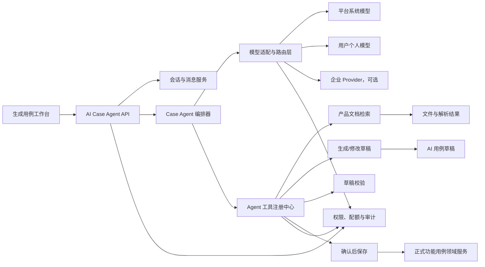

# AI 用例生成 Agent 改造方案

## 1. 文档信息

| 项目 | 内容 |
| --- | --- |
| 文档目标 | 指导 MeterSphere【生成用例】模块从一次性 AI 生成能力改造为可选模型、可持续聊天、可操作用例草稿的 AI Agent |
| 目标版本 | 待产品与研发评审后确定 |
| 优先级 | P0 |
| 文档状态 | 待评审 |
| 编写日期 | 2026-08-06 |

## 2. 背景与真实需求

平台需要在【生成用例】模块中接入 AI。用户进入页面后，可以从自己有权使用且项目允许的模型中自由选择模型，通过连续聊天描述需求、补充约束或上传产品方案，由 AI 理解上下文并生成、修改、校验功能用例草稿。

该能力的产品形态应接近一个面向测试用例场景的 Agent，而不是一次性“输入 Prompt、返回一批 JSON”的生成器。

真实目标可以概括为：

> 在【生成用例】模块中提供一个受权限、配额和人工确认约束的 AI 用例 Agent。Agent 能连续聊天、读取用户选择的资料、生成和修改用例草稿；未经用户确认，不得创建正式功能用例。

## 3. 改造目标

### 3.1 核心目标

1. 用户可以新建、恢复、切换和删除 AI 用例会话。
2. 用户可以在项目允许范围内自由选择模型，并在会话过程中切换模型。
3. AI 回复以 SSE 流式展示，支持停止、失败重试和断线恢复。
4. AI 可以结合用户上传并选中的产品方案进行对话和用例生成。
5. AI 可以通过受控工具创建、修改、校验和查询用例草稿。
6. 草稿与正式功能用例严格隔离，只有用户明确确认后才能保存到正式用例库。
7. 模型、会话、文件、草稿和工具调用均受到项目权限、用户隔离、并发、Token 配额和审计控制。

### 3.2 首期非目标

以下能力不作为首期上线的前置条件：

- 多 Agent 协作与自主规划。
- AI 自动执行生成的测试用例。
- AI 未经确认直接写入正式用例库。
- 通用企业 Agent 市场。
- 完整 MCP Server 管理平台。
- 所有 Provider 的 OAuth 授权管理。
- 必须引入向量数据库；首期可先使用结构化章节和全文检索。

OAuth、MCP、企业 Agent Gateway 可以作为后续模型接入或企业扩展能力，不应阻塞首期聊天与草稿闭环。

## 4. 用户角色与典型场景

### 4.1 用户角色

| 角色 | 能力 |
| --- | --- |
| 项目成员 | 查看本人会话和草稿，使用被授权模型聊天，生成和修改草稿 |
| 用例维护者 | 在项目成员能力基础上，将校验通过的草稿保存为正式用例 |
| 项目管理员 | 配置项目可用模型、默认模型、并发限制、Token 配额和文件容量 |
| 系统管理员 | 配置系统模型、Provider 凭据和平台级安全策略 |

### 4.2 典型对话

```text
用户：根据登录需求生成测试用例。

Agent：需求中没有明确连续密码错误后的处理规则，是否需要覆盖账号锁定？

用户：需要，连续错误 5 次锁定 30 分钟。

Agent：已根据补充规则生成 12 条草稿，覆盖正常登录、错误密码、账号锁定、
解锁和并发登录。是否需要增加第三方登录场景？

用户：暂时不用，把锁定相关用例调整为 P0。

Agent：已修改 4 条草稿。当前 12 条草稿均已通过字段校验，其中 2 条与项目中
已有用例名称相近，请确认是否仍然保存。
```

## 5. 总体架构



### 5.1 设计原则

- 模型负责理解用户意图、补充提问和决定调用哪个工具。
- 平台工具负责执行文件检索、草稿写入、字段校验和正式保存。
- 模型输出永远视为不可信输入，必须经过 Schema 和业务校验。
- Agent 只能访问当前用户、当前项目、当前会话被授权的数据。
- 正式保存属于高影响操作，必须由用户显式确认。
- 会话和消息以后端数据库为事实来源，浏览器本地存储只保存当前会话 ID 等非敏感偏好。

## 6. 页面与交互改造

保留现有三栏工作台方向，并将其调整为以下结构。

### 6.1 左侧：上下文与会话

- 新建会话。
- 历史会话列表，支持分页、重命名和删除。
- 产品方案上传、解析状态、重试和删除。
- 当前会话已选产品方案。
- 文件列表必须支持分页，不能只加载前 20 条。

### 6.2 中间：Agent 聊天区

- 顶部显示当前模型，可随时切换。
- 展示用户消息、AI 消息、工具调用状态和错误状态。
- AI 内容按 Token 或文本片段流式展示。
- 支持发送、停止、重新生成、复制回复。
- 支持展示“正在读取产品方案”“正在生成草稿”“正在校验草稿”等工具状态。
- 断线重连后，从后端恢复消息和当前执行状态。

### 6.3 右侧：用例草稿区

- 展示当前会话产生的草稿。
- 支持状态筛选、分页、批量选择、删除和重新生成。
- 草稿编辑控件尽量复用手工创建功能用例的字段组件。
- 展示校验错误、重复警告和来源引用。
- 自动保存按草稿独立防抖，离开页面前必须 flush 未完成保存。
- 批量保存前展示成功项、警告项和失败项预览。

## 7. 模型选择与 Provider 设计

### 7.1 可选模型计算规则

用户实际可选择的模型应满足：

```text
用户可访问模型
∩ 项目模型白名单
∩ 当前组织允许模型
∩ 支持聊天能力的模型
```

模型白名单为空时的语义必须由产品明确。建议：

- 新项目默认继承组织或系统管理员配置的默认集合。
- 不建议将空白名单解释为平台所有模型均可用。

### 7.2 模型能力声明

模型列表应返回：

```json
{
  "id": "model-source-id",
  "name": "GPT-5",
  "provider": "OPENAI",
  "supportsStream": true,
  "supportsTools": true,
  "supportsVision": true,
  "contextWindow": 128000,
  "personal": false
}
```

### 7.3 Provider 统一接口

```java
public interface AiProviderAdapter {
    boolean supports(String providerType);

    ProviderCapabilities capabilities(String modelSourceId);

    Flux<AgentStreamEvent> chatStream(AgentChatRequest request);

    void cancel(String requestId);
}
```

`AgentChatRequest` 至少包含：

- requestId
- projectId
- organizationId
- conversationId
- modelSourceId
- systemPrompt
- messages
- tools
- maxOutputTokens
- temperature

Provider 层统一负责：

- 鉴权和凭据读取。
- 请求格式转换。
- 流式事件标准化。
- 明确的连接、首包和总调用超时。
- 仅在安全条件下重试。
- 限流。
- Token 用量采集。
- 错误码标准化和敏感信息脱敏。
- 项目配置回退模型；未配置时不得暗中切换其他模型。

## 8. 会话和消息数据模型

### 8.1 ai_case_conversation

| 字段 | 说明 |
| --- | --- |
| id | 会话 ID |
| project_id | 项目 ID |
| organization_id | 组织 ID |
| user_id | 会话所有者 |
| title | 会话标题 |
| model_source_id | 当前选中模型 |
| status | ACTIVE/ARCHIVED/DELETED |
| selected_document_ids | 已选来源文档 ID，可拆分关系表 |
| system_prompt_version | 系统 Prompt 版本 |
| last_message_time | 最后消息时间 |
| create_time/update_time | 创建和更新时间 |

索引建议：

- `(project_id, user_id, update_time)`
- `(project_id, user_id, status)`

### 8.2 ai_case_message

| 字段 | 说明 |
| --- | --- |
| id | 消息 ID |
| conversation_id | 会话 ID |
| project_id/user_id | 冗余隔离字段 |
| role | SYSTEM/USER/ASSISTANT/TOOL |
| content | 消息正文 |
| status | STREAMING/COMPLETED/FAILED/CANCELED |
| model_source_id | 实际调用模型 |
| request_id | 本轮调用 ID |
| tool_name/tool_call_id | 工具信息 |
| tool_arguments/tool_result | 脱敏后的工具参数和结果 |
| input_tokens/output_tokens | Token 用量 |
| error_code | 标准错误码 |
| create_time/update_time | 创建和更新时间 |

索引建议：

- `(conversation_id, create_time)`
- `(project_id, user_id, request_id)`

### 8.3 现有表复用

- `functional_case_ai_generation`：保留为每一轮 Agent 执行记录，可增加 `request_id`、`message_id` 和 `execution_type`。
- `functional_case_ai_draft`：继续作为草稿事实表，增加或确认 `conversation_id`、`source_references`、`version`。
- `ai_source_document`：继续存储上传文件、解析结果和状态。
- `ai_provider_usage`：继续记录模型调用用量，增加 `conversation_id`、`request_id` 便于追踪。

## 9. Agent 编排设计

### 9.1 Agent 循环

```text
1. 校验当前用户、项目、会话和模型权限。
2. 保存用户消息。
3. 构建系统 Prompt、历史消息和文档上下文。
4. 调用模型并向前端发送流式事件。
5. 如果模型返回工具调用，校验工具白名单和参数。
6. 执行工具，将结果保存为 TOOL 消息。
7. 将工具结果继续发送给模型。
8. 模型输出最终答复或继续调用工具。
9. 达到完成、取消、超时或最大轮数后结束执行。
10. 保存最终状态、Token 用量和审计记录。
```

### 9.2 执行限制

- 单轮最大工具调用轮数：建议 8 次。
- 单次最大草稿数：默认 20，项目最大值不超过 100。
- 单次文档检索片段：建议不超过 10 个。
- 单次执行总超时：由项目或系统配置，建议默认 180 秒。
- 同一会话同一时刻只允许一个运行中的请求。
- 同一项目并发请求受到项目并发限制。
- 取消请求必须实际取消 Provider 流和后续工具执行。

### 9.3 上下文管理

- 首期使用最近消息窗口加历史摘要，避免无限追加全部消息。
- 超过上下文限制时，将较早对话压缩为可审计的摘要消息。
- 产品文档不直接整篇拼入 Prompt，应根据本轮问题检索相关章节。
- 来源片段必须携带 documentId、sectionId 和摘要，便于生成来源引用。

## 10. Agent 工具定义

### 10.1 search_source_documents

根据本轮问题检索当前会话选中的产品方案。

输入：

```json
{
  "query": "登录失败和账号锁定规则",
  "documentIds": ["doc-1"],
  "topK": 8
}
```

输出必须包含来源信息，且服务端校验 documentId 是否属于当前项目和用户。

### 10.2 create_case_drafts

根据结构化参数创建草稿，不得创建正式用例。

服务端处理顺序：

1. 严格 JSON Schema 校验，禁止未知字段。
2. 校验用例数量。
3. 校验等级、编辑模式、步骤和自定义字段。
4. 校验来源引用真实性。
5. 计算重复指纹。
6. 在事务中创建草稿。
7. 返回成功项、警告项和失败项。

### 10.3 update_case_drafts

支持根据 ID 批量调整等级、模块、标签、步骤或其他允许字段。

- 必须校验草稿属于当前用户和项目。
- 必须携带 version，使用乐观锁更新。
- 只允许更新字段白名单。
- 不允许模型修改 projectId、userId、formalCaseId、createUser 等控制字段。

### 10.4 validate_case_drafts

校验：

- 名称、等级、编辑模式和步骤格式。
- STEP 模式步骤不能为空，步骤与预期结果结构有效。
- 模板自定义字段类型和必填规则。
- 来源引用有效性。
- 与当前草稿和正式用例的重复情况。

重复应默认作为警告，不自动阻止保存；强制阻止规则由产品配置。

### 10.5 save_case_drafts

这是高影响工具，必须设置 `requiresUserConfirmation=true`。

推荐流程：

1. Agent 只能提出“建议保存”。
2. 前端展示保存预览和警告。
3. 用户点击确认。
4. 前端调用独立批量保存接口。
5. 每条草稿使用独立事务，保证部分成功语义。
6. 返回正式用例 ID 和失败原因。

## 11. API 设计

### 11.1 会话接口

```http
POST   /functional/case/ai/agent/conversation/create
POST   /functional/case/ai/agent/conversation/page
GET    /functional/case/ai/agent/conversation/{id}
GET    /functional/case/ai/agent/conversation/{id}/messages
POST   /functional/case/ai/agent/conversation/rename
POST   /functional/case/ai/agent/conversation/delete
```

### 11.2 模型接口

```http
GET /functional/case/ai/agent/models?projectId={projectId}
POST /functional/case/ai/agent/conversation/model
```

### 11.3 聊天接口

```http
POST /functional/case/ai/agent/chat
POST /functional/case/ai/agent/chat/cancel
POST /functional/case/ai/agent/chat/retry
GET  /functional/case/ai/agent/execution/{requestId}
```

`/chat` 使用 `text/event-stream` 返回流式事件。

### 11.4 草稿与文件接口

现有草稿、来源文档上传、分页、删除、重试和批量保存接口可以复用，但需要统一补齐会话归属、权限和 Agent 工具调用入口。

## 12. SSE 事件协议

建议统一以下事件：

| 事件 | 说明 |
| --- | --- |
| execution-start | 本轮 Agent 执行开始 |
| message-start | AI 消息创建 |
| content-delta | AI 文本增量 |
| reasoning-status | 面向用户的简短状态，不输出内部推理过程 |
| tool-call | 即将调用工具 |
| tool-result | 工具调用完成或失败 |
| drafts-changed | 草稿新增或更新 |
| usage | Token 用量与实际模型 |
| warning | 可恢复警告，例如发生模型回退 |
| error | 标准错误 |
| message-completed | AI 消息完成 |
| execution-completed | 本轮执行结束 |

示例：

```text
event: content-delta
data: {"requestId":"r1","messageId":"m1","content":"我将先分析登录需求。"}

event: tool-call
data: {"requestId":"r1","toolCallId":"t1","tool":"search_source_documents"}

event: drafts-changed
data: {"requestId":"r1","createdIds":["d1","d2"],"updatedIds":[]}

event: usage
data: {"modelSourceId":"model-1","inputTokens":1200,"outputTokens":430}
```

SSE 断线恢复要求：

- 事件携带单调递增序号。
- 客户端使用 `Last-Event-ID` 或显式 `afterSequence` 重连。
- 服务端从持久化事件或消息状态恢复，而不是仅依赖单节点内存 emitter。

## 13. 文件解析与上下文检索

### 13.1 支持范围

- TXT、Markdown。
- PDF。
- DOC/DOCX。
- XLS/XLSX。
- PPT/PPTX。
- PNG/JPG/JPEG，经 OCR 提取文字。

### 13.2 处理链路

```text
上传校验
→ 病毒扫描
→ 文件存储
→ 异步解析
→ 章节识别
→ 文本切片
→ 摘要与索引
→ 可用于会话检索
```

### 13.3 资源保护

- 使用有界线程池和有界队列。
- 明确解析超时、最大重试次数和退避策略。
- 限制单文件大小、会话文件数和项目总容量。
- 不支持压缩文件时直接拒绝；支持时必须限制解压层级、文件数和展开后总大小。
- 删除数据库记录时应异步清理对应原文件和解析结果，失败进入补偿任务。

## 14. 权限、安全、配额与审计

### 14.1 权限点

- `FUNCTIONAL_CASE_AI:READ`
- `FUNCTIONAL_CASE_AI:GENERATE`
- `FUNCTIONAL_CASE_AI:UPLOAD`
- `FUNCTIONAL_CASE_AI:SAVE`
- `FUNCTIONAL_CASE_AI:CONFIG`

每个接口和每个工具都必须进行服务端权限校验，不能只依赖页面按钮隐藏。

### 14.2 数据隔离

所有读取和更新至少绑定：

```text
project_id + user_id
```

项目管理员能否查看项目成员的 AI 会话应由产品单独决定，首期建议默认不可查看消息正文。

### 14.3 内容安全

- 将上传文档标记为不可信上下文，禁止其覆盖系统指令。
- 检测常见 Prompt Injection 指令并记录安全事件。
- 对凭据、Token、Cookie、身份证、手机号等敏感内容进行检测和脱敏。
- 工具参数使用严格 Schema，拒绝未知字段。
- 不向模型暴露项目 ID、用户 ID、凭据、数据库结构等非必要信息。
- Provider 错误、工具结果和审计详情在落库前脱敏。

### 14.4 治理

- 项目模型白名单。
- 项目最大并发 Agent 执行数。
- 用户和项目级速率限制。
- 项目月度 Token 配额。
- 单轮最大输出 Token。
- 单次生成草稿数量。
- 会话文件数量、单文件大小和项目文件总容量。

所有聊天入口、重试入口和内部工具触发的模型调用必须纳入同一治理统计，不能只覆盖某一个 Controller。

### 14.5 审计事件

至少记录：

- 会话创建、删除和模型切换。
- 用户发起、停止和重试 Agent 执行。
- 模型实际调用、回退、Token 用量和错误码。
- 文件上传、解析、下载、删除和重试。
- 工具名称、执行结果和资源 ID；敏感参数不落审计。
- 草稿创建、修改、删除、校验和重新生成。
- 用户确认保存和正式用例 ID。
- 项目治理配置修改。

## 15. 错误处理

统一错误码建议：

| 错误码 | 说明 |
| --- | --- |
| MODEL_NOT_ALLOWED | 模型不在项目白名单 |
| MODEL_PERMISSION_DENIED | 用户无模型权限 |
| PROVIDER_RATE_LIMITED | Provider 或平台限流 |
| TOKEN_QUOTA_EXCEEDED | Token 配额不足 |
| CONCURRENCY_LIMIT_EXCEEDED | 项目并发达到上限 |
| CONTEXT_TOO_LARGE | 会话或文档上下文过大 |
| PROVIDER_TIMEOUT | 模型调用超时 |
| PROVIDER_STREAM_INTERRUPTED | 流式响应中断 |
| TOOL_ARGUMENT_INVALID | 工具参数不合法 |
| TOOL_EXECUTION_FAILED | 工具执行失败 |
| DRAFT_VERSION_CONFLICT | 草稿乐观锁冲突 |
| USER_CONFIRMATION_REQUIRED | 操作需要用户确认 |
| EXECUTION_CANCELED | 用户取消执行 |

重试原则：

- 仅连接失败、429、部分 5xx 等临时错误允许自动重试。
- 已经向用户输出内容后，不自动从头重试，避免重复回答和重复调用工具。
- 创建草稿等写操作使用幂等 requestId/toolCallId，避免重试产生重复数据。
- 格式修复后仍不符合 Schema 时必须终止本次工具调用，不得带告警继续写入草稿。

## 16. 对现有实现的改造点

### 16.1 可以复用

- `frontend/src/views/case-management/caseGenerate/index.vue` 的三栏页面基础。
- `functional_case_ai_generation`、`functional_case_ai_draft`、`ai_source_document` 表。
- 来源文件上传、解析和草稿 CRUD 接口。
- `AiChatBaseService` 和现有模型配置能力。
- `AiProviderAdapter`、项目治理和用量记录的现有骨架。
- `FunctionalCaseService.addFunctionalCase()` 正式用例领域入口。

### 16.2 必须调整

1. 将一次性 `/generation/structured` 调用升级为持久化聊天和 Agent 编排。
2. 新增会话与消息表，移除以 localStorage 保存完整聊天记录的方式。
3. 模型列表改为项目、用户和能力共同过滤后的专用接口。
4. AI 生成页面接入聊天 SSE，而不是等待整批结果返回。
5. 文档上下文改为按问题检索相关章节，不再只截取固定长度摘要。
6. JSON Schema 改为严格字段白名单，修复失败不得创建草稿。
7. AI 输出增加自定义字段，并按项目模板校验。
8. 草稿自动保存改为每个草稿独立任务，并在页面离开前提交。
9. 批量保存改为逐条独立事务，确保部分成功。
10. 停止生成实际中断 Provider 流和工具执行。
11. SSE 状态改为可恢复，不依赖单节点内存事件。
12. 所有聊天、模型调用和工具调用纳入统一权限、配额和审计。

## 17. 兼容与迁移策略

- 保留现有草稿和来源文档数据，不进行破坏性迁移。
- 旧的结构化生成接口在过渡期内部转换为“单轮 Agent 请求”，但不再作为前端主入口。
- 历史 localStorage 对话不自动上传到服务端，避免跨用户导入和敏感信息风险；升级后只清理或忽略旧 key。
- 现有草稿没有 conversationId 时，归入“历史生成记录”虚拟会话或保持独立查询。
- 新增表和字段使用独立 Flyway 迁移，并提供回滚说明。

## 18. 实施阶段

### Phase 1：聊天闭环，P0

- 会话和消息数据模型。
- 项目可用模型接口和模型切换。
- 聊天 SSE、停止、重试和历史恢复。
- Agent 基础编排器。
- `create_case_drafts` 和 `validate_case_drafts` 工具。
- 用户确认后保存正式用例。
- 基础权限、Token 统计和操作审计。

交付结果：用户可以选择模型，通过连续聊天生成草稿并确认保存。

### Phase 2：资料与编辑能力，P1

- PDF、Office、OCR 真实环境验收。
- 文档章节检索工具。
- `update_case_drafts` 工具。
- 草稿表单与手工创建字段对齐。
- 重复检测、来源引用和项目模板自定义字段。
- 可恢复 SSE 和有界解析任务队列。

交付结果：Agent 能可靠读取产品方案并通过聊天修改草稿。

### Phase 3：企业扩展，P2

- 多 Provider 独立适配策略。
- OAuth 模型授权管理。
- 企业 Agent Gateway。
- 确有需要时接入完整 MCP 生命周期和能力发现。
- 更精细的组织、项目、用户额度和成本报表。

交付结果：满足企业私有模型和外部 Agent 平台接入需求。

## 19. 验收标准

### 19.1 产品与页面

- 【生成用例】页面可以新建和恢复后端会话。
- 用户只能看到有权使用且项目允许的聊天模型。
- 切换模型后，新消息使用新模型，历史消息仍保留实际模型信息。
- AI 回复可流式显示，支持停止和失败重试。
- 离开并重新进入页面后，可从后端恢复会话、消息和草稿。
- 浏览器切换用户后，不能看到上一用户的对话内容。

### 19.2 Agent 与草稿

- Agent 可以在多轮对话中补充提问并保持上下文。
- Agent 可以创建、修改和校验草稿。
- Schema 非法、工具参数非法或业务校验失败时，不得创建残缺草稿。
- STEP 用例必须包含有效步骤。
- 自定义字段符合项目模板定义。
- 来源引用可以定位到当前用户有权访问的文档章节。
- 未经用户确认，正式功能用例表不得新增记录。
- 批量保存某条失败时，其他成功项仍正常提交。
- 正式用例标记 `ai_create=true` 并能在【用例】页面查询。

### 19.3 权限与治理

- 不同项目和用户之间的会话、消息、文件、草稿和凭据不能越权访问。
- 无生成权限用户不能发送消息或调用 Agent 工具。
- 无保存权限用户不能将草稿保存为正式用例。
- 模型白名单、并发、Token 和文件容量限制覆盖全部入口。
- 取消后 Provider 流停止，后续工具不再执行。
- 审计记录不包含 Token、密钥、Cookie 或完整敏感文档内容。

### 19.4 测试要求

- 会话、消息、模型过滤和工具编排单元测试。
- JSON Schema、字段白名单和自定义字段测试。
- 草稿乐观锁、幂等和批量保存事务测试。
- 不同项目、不同用户和不同权限账号的越权测试。
- SSE 正常完成、断流、重连、取消和重试测试。
- Token、并发、速率和文件容量边界测试。
- PDF、DOCX、XLSX、PPTX 和图片 OCR 样例测试。
- 真实数据库、Redis、文件服务和 Mock Provider 的集成测试。
- 浏览器端从新建会话、选择模型、聊天、生成草稿到确认保存的端到端测试。

## 20. 上线门槛

满足以下条件后，才可以将首期标记为完成：

1. Phase 1 所有验收项通过。
2. P0 自动化测试通过，无阻断级权限和数据隔离问题。
3. 至少完成一次真实数据库、Redis、文件服务和模型流式调用联调。
4. 完成生成草稿、人工确认、正式保存和【用例】页面查询的浏览器端闭环。
5. 失败、超时、断流、取消和配额不足均有明确且可恢复的用户提示。
6. 任务文档、验收矩阵和实际代码状态一致，不保留相互矛盾的旧结论。

## 21. 待评审决策

以下问题需要产品、架构和安全共同确认：

1. 项目模型白名单为空时，是继承默认集合还是允许所有模型。
2. 项目管理员是否可以查看项目成员的会话正文。
3. 单次默认生成数量、项目最大生成数量和最大工具轮数。
4. 重复用例是仅告警，还是允许项目配置为阻止保存。
5. 首期文档检索使用数据库全文检索还是引入向量检索。
6. 系统是否允许模型自动修改草稿，还是每次修改都需要前端确认。
7. 会话和消息的数据保留周期及用户删除后的物理清理策略。
8. Token 配额按项目、用户还是组织结算，是否需要成本展示。
