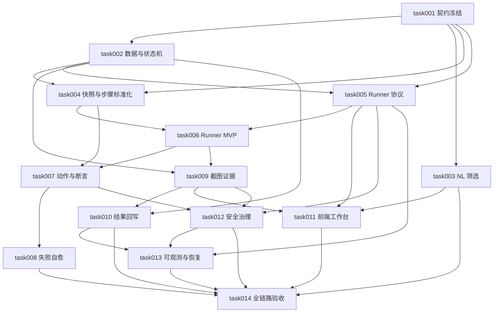

# task000 - AI Web UI 自动化测试执行任务总览

> 来源方案：`docs/summary/MeterSphere_AI_WebUI自动化测试执行改造方案.md`
> 任务目录：`docs/task/ai_webui_execution_20260806`
> 拆分日期：2026-08-06
> 当前状态：实施中（task001 已完成；task002～task013 已完成第一阶段代码主体；数据库、真实平台/MinIO 联调和 task014 灰度验收待完成）

## 1. 总体目标

在 MeterSphere 现有 `agent-integration`、功能用例、测试计划、AI Provider、附件和结果回写能力上，建设第一阶段 AI Web UI 自动化测试闭环：

```text
手工选择 / 自然语言筛选 → 范围确认与快照 → Runner 调度
→ 浏览器执行与断言 → 有限失败自愈 → 截图留证
→ 计划内/计划外结果回写 → 对账与审计
```

第一阶段仅覆盖 Web UI 功能测试，不包含接口、性能、移动端原生应用和任意桌面应用测试，也不允许 AI 自动修改原始用例。

## 2. 实施任务

| Task | 优先级 | 名称 | 主要交付物 | 依赖 |
| --- | --- | --- | --- | --- |
| task001 | P0 | 基线盘点与执行契约冻结（已完成） | ADR、状态/错误/事件/动作契约 | 无 |
| task002 | P0 | 数据模型迁移与状态机（主体完成，待迁移实跑） | task/case 扩展、step/healing/runner/lease 表 | task001 |
| task003 | P0 | 自然语言筛选 DSL 与范围确认（核心已实现） | NL 解析、确定性查询、候选预览 | task001 |
| task004 | P0 | 用例快照与步骤标准化（核心已实现） | 用例版本快照、动作/断言 Schema、可执行性预检 | task001、task002 |
| task005 | P0 | Runner 协议、注册、租约与调度（代码主体完成） | 内部协议、任务令牌、心跳、命令通道 | task001、task002 |
| task006 | P0 | Playwright Browser Runner MVP（代码主体完成） | Chromium、Context 隔离、登录暂停、事件上报 | task004、task005 |
| task007 | P0 | Web 动作与断言执行引擎（代码主体完成） | 动作白名单、定位器、确定性断言、超时控制 | task004、task006 |
| task008 | P0 | 失败分类与有限自愈引擎（有限自愈主体完成） | Healing Engine、自愈预算、风险约束、轨迹 | task007 |
| task009 | P0 | 截图证据、脱敏、附件关联与清理（代码主体完成） | 截图采集、MinIO、关联、预览、保留策略 | task002、task006 |
| task010 | P0 | 结果回写、幂等、部分成功与对账（代码主体完成） | 步骤/用例回写、重试、对账任务 | task002、task009 |
| task011 | P0 | 用例列表入口与自动化执行工作台（代码主体完成） | 选例弹窗、NL 预览、任务详情、人工操作 | task003、task005、task009 |
| task012 | P0 | 权限、凭据、域名与高风险治理（第一阶段边界完成） | 权限复核、白名单、短期令牌、脱敏、审批 | task005、task007、task009 |
| task013 | P1 | 可观测性、恢复、配额与运维（基础能力完成） | 指标、告警、断线恢复、限流、Runbook | task005、task010、task012 |
| task014 | P0 | 全链路测试、灰度上线与交付验收（待环境验收） | 契约/E2E/安全测试、灰度、回滚、验收报告 | task003～task013 |

## 3. 依赖关系



关键路径：`task001 → task002/task004/task005 → task006 → task007 → task008 → task014`。

## 4. 里程碑建议

| 里程碑 | 覆盖任务 | 交付标准 |
| --- | --- | --- |
| M0：契约与数据底座 | task001～task004 | 范围可解析、可确认、可固化，步骤可预检 |
| M1：浏览器可执行 | task005～task007 | Chromium Runner 可完成标准 Web 动作与断言 |
| M2：证据、自愈、回写闭环 | task008～task010 | 自愈受控、截图可追踪、结果幂等回写 |
| M3：产品化与安全 | task011～task013 | 页面可用、权限安全合格、可观测可恢复 |
| M4：灰度交付 | task014 | 20 条标准用例连续 10 轮通过验收门槛 |

## 5. 并行建议

- task002、task003 可在 task001 契约冻结后并行。
- task004、task005 可在 task002 的字段和状态命名稳定后并行。
- task008、task009、task011 可在 Runner MVP 和事件协议稳定后并行。
- task012 应从协议设计期介入，不应留到上线前补做。

## 6. 统一完成定义

每个任务只有同时满足以下条件才允许标记完成：

- 代码、迁移或页面已经实现，并符合仓库分层约束。
- 新增接口和事件具备明确 Schema、错误码、权限和幂等语义。
- 单元/契约/集成测试按任务要求通过。
- 兼容性、异常路径、安全和回滚方式已有验证记录。
- 文档与实际代码一致，不以 Mock 或占位实现宣称生产可用。

## 7. 第一阶段最终验收门槛

- 支持手工选择和自然语言筛选，并在执行前固化最终用例范围。
- Chromium Runner 能执行规定动作与断言，无法执行时诚实进入人工确认或失败状态。
- 页面轻微变化允许有限自愈，任何自愈均可审计且不得改变原始预期。
- 失败步骤必有截图和错误摘要，敏感信息不进入模型、普通日志或未脱敏证据。
- 计划内/计划外结果回写准确、幂等、可重试、可对账。
- 高风险动作和结果未知的提交动作不会被自动重放。
- 20 条标准用例连续执行 10 轮，无越权或误操作；确定性步骤成功率不低于 95%，回写与证据关联准确率 100%。
