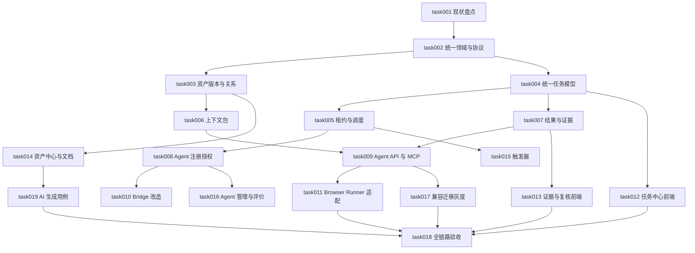

# task000 - 测试资产管理与 Agent 任务委派改造任务总览

> 来源方案：`docs/summary/MeterSphere-测试资产管理与Agent任务委派-平台改造方案-2026-08-12.md`  
> 任务目录：`docs/task/test_asset_agent_delegation_20260812`  
> 拆分日期：2026-08-12  
> 当前状态：核心代码改造已落地并通过编译、定向单测与前端构建；完整 P0/P1/P2 方案仍处于部分完成，详见 `implementation-status-20260812.md`

## 1. 总体目标

将 MeterSphere 演进为测试资产可信管理中心和 Agent 测试任务协作平台，形成：

```text
业务文档 → 测试资产 → 测试计划 → 统一任务 → Agent/执行器
        → 步骤结果 → 测试证据 → 缺陷/报告 → 质量评价
```

本任务集不表示相关功能已经实现。任务只有完成代码、迁移、自动化测试、页面验证和验收证据后才能标记完成。

## 2. 实施原则

- 先统一领域模型和协议，再增加页面或执行入口。
- 复用现有 `ai_execution_*`、`metersphere-mcp`、`agent-bridge` 和 `ai-browser-runner`，禁止平行建设。
- MCP 保持薄封装，任务状态、权限、租约和结果规则位于 MeterSphere 后端。
- 测试计划定义范围，测试任务代表一次执行，两者必须解耦。
- 任务运行状态与测试业务结论分开保存。
- 只有执行完成、证据落库、结果回写和汇总对账成功，任务才能成功。
- 数据迁移优先新增与兼容，首期不删除历史执行数据和旧入口。

## 3. 工作包与依赖



## 4. 任务清单

| 任务 | 名称 | 优先级 | 建议阶段 | 状态 |
|---|---|---:|---|---|
| task001 | 现有模型、接口、页面和数据盘点 | P0 | 阶段 0 | 已完成 |
| task002 | 统一术语、领域边界、状态与协议基线 | P0 | 阶段 0 | 部分完成 |
| task003 | 测试资产版本与关系模型 | P0 | 阶段 1 | 部分完成 |
| task004 | 统一测试任务模型与状态机 | P0 | 阶段 1 | 部分完成 |
| task005 | 任务租约、心跳、幂等、取消与回收 | P0 | 阶段 1 | 部分完成 |
| task006 | 任务上下文包与版本快照 | P0 | 阶段 1 | 部分完成 |
| task007 | 统一结果、失败分类与步骤级证据 | P0 | 阶段 1 | 部分完成 |
| task008 | Agent 注册、能力声明与最小权限 | P0 | 阶段 1 | 部分完成 |
| task009 | Agent API、事件协议与 MCP 工具收敛 | P0 | 阶段 1 | 部分完成 |
| task010 | Agent Bridge 任务通道与进程隔离 | P0 | 阶段 1 | 部分完成 |
| task011 | Browser Runner 统一任务协议适配 | P0 | 阶段 1 | 部分完成 |
| task012 | 统一任务中心与执行详情页面 | P0 | 阶段 1 | 部分完成 |
| task013 | 测试证据与人工复核中心 | P0/P1 | 阶段 1/2 | 部分完成 |
| task014 | 测试资产中心与业务文档接入 | P1 | 阶段 2 | 部分完成 |
| task015 | 定时、Webhook、CI 与资产变更触发器 | P1 | 阶段 2 | 部分完成 |
| task016 | Agent 管理中心与执行评价 | P1/P2 | 阶段 2/3 | 部分完成 |
| task017 | 旧模型兼容、数据迁移、灰度与回滚 | P0/P1 | 全阶段 | 部分完成 |
| task018 | 全链路测试、验收与发布门禁 | P0/P1/P2 | 全阶段 | 部分完成 |
| task019 | AI 生成用例与变更建议闭环 | P1 | 阶段 2 | 部分完成 |

## 5. P0 试点边界

- 单个试点项目。
- 功能用例及一个测试计划。
- 单一测试环境。
- 一种 Browser Agent。
- 单任务不超过 20 条用例。
- 支持人工创建和一次定时触发。
- 支持领取、心跳、取消、掉线回收、人工登录、步骤结果、截图证据和结果复核。
- 不包含生产写操作、任意脚本执行、多 Agent 自主协作和自动修改正式用例。
- AI 生成用例不纳入 P0 执行闭环，安排在 P1 资产治理阶段实施。

## 6. P0 发布门槛

- 闭环成功率不低于 95%。
- 证据完整率 100%。
- 重复请求不产生重复任务、结果或附件关系。
- Agent 异常退出后任务能按租约回收。
- 无越权、跨项目访问和敏感信息泄露。
- 旧人工执行入口和历史报告保持可用。

## 7. 公共完成定义

每个任务至少满足：

- 代码符合现有模块分层和命名规范。
- 数据库变更包含 Flyway 迁移与回滚说明。
- API 包含权限、幂等、错误码和 OpenAPI 定义。
- 核心领域逻辑具备单元或集成测试。
- 前端具备权限、空态、错误态和刷新恢复验证。
- 文档、配置样例和运维说明同步更新。
- 未完成事项不得以“基本完成”替代明确记录。
