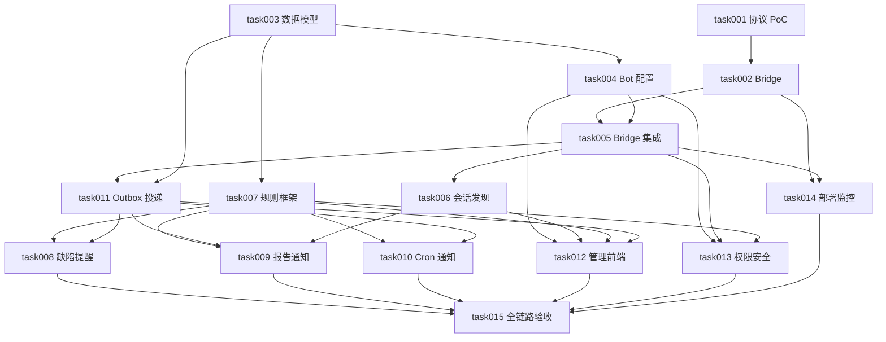

# task000 - 企业微信智能机器人通知改造任务总览

> 文档类型：任务索引 / 里程碑规划  
> 关联方案：[MeterSphere 企业微信智能机器人长连接改造方案](../../wecom-ai-bot-integration-plan.md)  
> 拆分日期：2026-08-14  
> 当前状态：代码实现完成，待真实企微联调与灰度验收  
> 任务目录：`docs/task/wecom_ai_bot_notification_20260814`

> 2026-08-14 闭环复审：已补齐停用硬闸、持久化幂等、动态收件人、个人测试用户选择、流程终态选择、日志详情、报告摘要/链接、Cron 回写及生产部署接线；本地 Java 联编、定向单测、Bridge 单测和前端类型检查通过。真实企微与目标容器环境验收仍按 task015 执行。

## 1. 总体目标

建设 MeterSphere → 企业微信智能机器人主动通知链路，首期交付：

- 指定企微 `userid` 的个人会话通知；
- 指定企微内部群 `chatid` 的群通知；
- 缺陷预计解决时间提前提醒，通知处理人和创建人；
- 测试报告生成后向配置群推送并 @ 项目人员；
- 通知类型、对象、模板、时间和周期的通用配置；
- 密钥安全、可靠投递、幂等、重试、日志、权限和监控。

## 2. 已完成前置项

- [x] 已创建 API 长连接模式企微智能机器人；
- [x] 已取得 BotID 和 Secret；
- [x] 已配置机器人可见成员；
- [x] MeterSphere 容器可解析并通过 TLS 访问 `openws.work.weixin.qq.com:443`；
- [x] 缺陷预计解决时间字段已完成基础改造：数据库 `bug.expected_resolve_time`，Java/前端 `expectedResolveTime`。

本任务集不得重复新增 `expected_resolution_time` 或其他同义字段。

## 3. 任务清单

| 任务 | 优先级 | 名称 | 主要交付 | 状态 |
| --- | --- | --- | --- | --- |
| [task001](task001-P0-官方SDK协议PoC.md) | P0 | 官方 SDK 协议 PoC | 认证、个人发送、群 chatid、群发送、@ 实测 | 待真实企微验收 |
| [task002](task002-P0-WeCom-Bot-Bridge服务.md) | P0 | Bridge 服务 | 官方 SDK、健康检查、重连、发送接口 | 代码完成，待联调 |
| [task003](task003-P0-通知数据模型与迁移.md) | P0 | 数据模型与迁移 | config/chat/rule/timer/outbox 表与索引 | 代码完成，待部署验证 |
| [task004](task004-P0-Bot配置与密钥安全.md) | P0 | Bot 配置与密钥安全 | 配置 API、Secret 引用/密文、启停和测试 | 代码完成，待环境验收 |
| [task005](task005-P0-Bridge鉴权状态与回调.md) | P0 | Bridge 集成 | 双向鉴权、状态、回调、防重放 | 代码完成，待联调 |
| [task006](task006-P0-群会话发现与目标管理.md) | P0 | 会话发现 | chatid 采集、启停、备注、测试发送 | 代码完成，待真实群验收 |
| [task007](task007-P0-通知规则框架与Provider.md) | P0 | 通知规则框架 | 类型白名单、对象解析、模板和规则 API | 代码完成，待联调 |
| [task008](task008-P0-缺陷预计解决时间提醒.md) | P0 | 缺陷临期提醒 | Timer、扫描器、处理人/创建人通知 | 代码完成，待全链路验收 |
| [task009](task009-P0-测试报告生成群通知.md) | P0 | 报告通知 | 提交后事件、群通知、@ 项目成员 | 代码完成，待全链路验收 |
| [task010](task010-P1-通用Cron周期通知.md) | P1 | 通用周期通知 | CUSTOM_CRON、时区、立即执行 | 代码完成，待环境验收 |
| [task011](task011-P0-Outbox可靠投递与重试.md) | P0 | 可靠投递 | Outbox、幂等、租约、错误分类、重试 | 代码完成，待故障演练 |
| [task012](task012-P1-通知管理前端.md) | P1 | 管理前端 | Bot、群、规则、日志页面 | 前后端闭环，待浏览器验收 |
| [task013](task013-P0-权限审计与安全加固.md) | P0 | 权限与安全 | 权限树、审计、脱敏、越权防护 | 代码完成，待安全验收 |
| [task014](task014-P1-部署监控与运维手册.md) | P1 | 运维能力 | 镜像、部署、指标、告警、Secret 轮换 | 交付完成，待部署演练 |
| [task015](task015-P0-全链路测试灰度与验收.md) | P0 | 验收发布 | 自动化、真实企微验收、灰度和回滚 | 自动化通过，待灰度验收 |

## 4. 依赖关系

## 5. 推荐实施批次

### 批次 A：连接基线

`task001 → task002`，并行推进 `task003 → task004`。

退出条件：测试 Bot 认证成功，能够通过受控入口向测试用户发送消息。

### 批次 B：平台骨架

`task005 + task006 + task007 + task011 + task013`。

退出条件：配置、目标、规则、Outbox、Bridge、安全链路闭环。

### 批次 C：三类业务通知

并行推进 `task008 + task009 + task010`。

退出条件：缺陷临期、报告生成、通用 Cron 均经过同一可靠投递链路。

### 批次 D：产品化交付

`task012 + task014 → task015`。

退出条件：页面、部署、监控、自动化和真实企微灰度全部通过。

## 6. 全局开发约束

- Secret 不得提交 Git、明文入库、前端回显或进入普通日志；
- 业务事务不直接调用企业微信，统一先写 Outbox；
- 同一 Bot 只允许一个逻辑主连接；
- 群 `chatid` 必须来自企微事件，不允许管理员自由填写；
- 个人对象保存 MeterSphere 用户 ID，执行时动态读取最新 `wecom_userid`；
- 不允许配置任意 Java 类、SQL、SpEL 或脚本；
- 报告通知只能在报告事务成功提交后产生；
- 缺陷提醒默认到达预计解决时间停止，终态、删除、清空时间也立即停止；
- 所有任务默认“未开始”，只有代码、测试和验收项全部满足后才可标记完成。

## 7. 里程碑验收

### M1：连接可用

- [ ] Bot 认证成功且状态可观测；
- [ ] 个人主动消息成功；
- [ ] 群 chatid 可发现且群消息成功；
- [ ] 断线可恢复，认证失败不刷屏。

### M2：业务闭环

- [ ] 缺陷提醒按提前量和间隔发送且按条件停止；
- [ ] 报告生成后群通知一次且默认 @ 有效项目成员；
- [ ] CUSTOM_CRON 可配置对象、模板、时区和周期；
- [ ] 重启、超时和重复事件不会丢消息或重复投递。

### M3：可运营

- [ ] 管理页面、权限、审计、日志完整；
- [ ] 指标、告警、Secret 轮换和回滚手册可用；
- [ ] 测试机器人灰度 24～48 小时无阻断问题。
