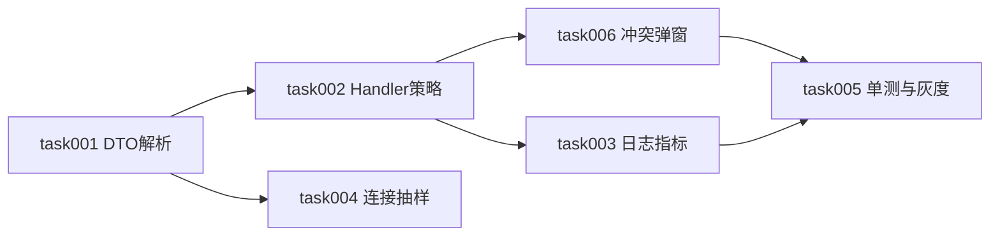

# task000 - 实施总览与依赖关系

> **文档类型**：任务索引 / 里程碑规划  
> **适用项目**：MeterSphere 企微同步字段补齐  
> **编写日期**：2026-07-29  
> **关联方案**：[MeterSphere-企微同步字段补齐-实现方案-2026-07-29.md](../../summary/MeterSphere-企微同步字段补齐-实现方案-2026-07-29.md)（**v1.2**）  
> **标注**：【AI生成】产品决策已确认：企微覆盖本地；跨用户邮箱冲突弹窗三选一  

---

## 1. 总体目标

在**不重做同步引擎**的前提下，补齐企微成员联系字段落库质量，并闭环邮箱冲突人工处理：

**DTO 解析 → Handler 字段策略与冲突登记 → 冲突弹窗三选一 → 单测/灰度 → 可选日志与连接抽样**

### 1.1 核心原则（勿偏离）

```text
真实优先：email → biz_mail → 占位（仅创建兜底）
空值不覆盖：mobile / position / 无真实邮箱时不写空
同用户：企微覆盖本地邮箱（已确认）
跨用户冲突：不自动抢邮箱 → 入队 → 弹窗【跳过 / 覆盖 / 新建】
定时同步只入队不弹窗；手动同步结束后弹窗
超长邮箱禁止截断；单用户 failed 不中断全量
```

### 1.2 非目标

通讯录增量回调、`user.email` 可空改造、性别建表、详情明文、SSO/`WeComClient` Webhook 改动、账号自动合并。

---

## 2. 阶段划分

| 阶段 | 任务文档 | 主题 | 预估 | 建议灰度 |
|------|----------|------|------|----------|
| **核心** | [task001](task001-P0-DTO与Client解析.md) | DTO + Jackson + Client 单测 | 0.5d | 可先合 |
| **核心** | [task002](task002-P0-UserSyncHandler字段策略.md) | 邮箱/主部门/空值/冲突登记/计数 | 1～1.5d | **主修复** |
| **核心** | [task006](task006-P0-邮箱冲突人工三选一.md) | 冲突表 + API + 弹窗 | 1～1.5d | **冲突闭环** |
| **收口** | [task005](task005-P0-单测与灰度全量验收.md) | 单测 + 灰度全量 + SQL 抽查 | 0.5～1d | 依赖 001+002+006 |
| **体验** | [task003](task003-P1-同步日志与缺失指标.md) | SyncResult / 日志 / 面板 | 0.5d | 核心后 |
| **体验** | [task004](task004-P1-连接测试字段抽样.md) | 测试连接抽样提示 | 0.5d | 可后置 |

**合计**：约 **4～5.5** 人日（不含企微后台权限开通）。

**建议顺序**：`001 → 002 → 006 → 005` → `003` → `004`。

---

## 3. 依赖关系



---

## 4. 已确认产品决策

| 决策项 | 结论 |
|--------|------|
| 本地手工邮箱 vs 企微不一致（同用户） | **企微覆盖**，无开关 |
| 跨用户邮箱唯一冲突 | **弹窗人工处理**：跳过 / 覆盖 / 新建（见方案 §5.8） |
| 超长邮箱 | 单用户 failed，不截断 |
| 定时同步遇冲突 | 只入队，不弹窗；事后在入口处理 |

---

## 5. 里程碑验收

### M1 - 可修复主数据 + 冲突可解（task001–002–006 + 005）

- [x] `biz_mail` / `main_department` 解析正确  
- [x] 仅有 `biz_mail`：新建写入真实邮箱；存量占位可升级  
- [x] 同用户邮箱被企微覆盖  
- [x] 跨用户冲突入队；弹窗三选一行为正确（覆盖有二次确认）——单测+UI 已齐；灰度实机待验  
- [x] 空 mobile 不覆盖；主部门优先正确  
- [ ] 灰度全量后占位用户趋近于「企微确无邮箱」集合  

### M2 - 可运维（task003–004）

- [x] 同步日志可见缺失手机 / 占位邮箱 / 待处理冲突数  
- [x]（可选）连接测试提前暴露权限问题  

---

## 6. 进度快照（2026-07-29）

| 任务 | 状态 |
|------|------|
| task001 | ✅ 完成 |
| task002 | ✅ 代码完成（待人工审核） |
| task006 | ✅ 代码完成（覆盖路径待人工审核） |
| task005 | ✅ 单测完成；⏳ 灰度全量待实机 |
| task003 | ✅ 完成 |
| task004 | ✅ 完成 |

## 6. 参考

| 文档 / 代码 | 说明 |
|-------------|------|
| 方案 v1.2 | 字段映射、冲突三选一正文 |
| [task007 同步引擎](../community_rebuild/task007-P2-组织架构同步引擎.md) | 既有引擎边界 |
| `UserSyncHandler.java` | 本期主改文件 |
